# AI 对话系统

<cite>
**本文档引用的文件**
- [ChatPage.js](file://src/pages/ChatPage.js)
- [App.js](file://src/App.js)
- [App.css](file://src/App.css)
- [Icons.js](file://src/components/Icons.js)
- [MockInterviewService.js](file://src/services/MockInterviewService.js)
- [HomePage.js](file://src/pages/HomePage.js)
- [AuthPage.js](file://src/pages/AuthPage.js)
- [package.json](file://package.json)
- [README.md](file://README.md)
</cite>

## 目录
1. [项目概述](#项目概述)
2. [项目结构](#项目结构)
3. [核心组件架构](#核心组件架构)
4. [对话系统架构](#对话系统架构)
5. [流式输出处理机制](#流式输出处理机制)
6. [SSE 通信协议实现](#sse-通信协议实现)
7. [消息状态管理](#消息状态管理)
8. [界面设计与交互流程](#界面设计与交互流程)
9. [Markdown 渲染功能](#markdown-渲染功能)
10. [模拟面试系统](#模拟面试系统)
11. [性能优化策略](#性能优化策略)
12. [故障排除指南](#故障排除指南)
13. [结论](#结论)

## 项目概述

漫旅 ManLv 是一款面向保研生的 AI 驱动一站式行程伴旅助手。该系统集成了真实的 AI 对话功能、行程管理、邮件智能感知、情景学习引擎和 AI 模拟面试等多个核心功能模块。

### 核心功能特性

- **真实 AI 对话**：接入 Qwen 大模型（DashScope），支持流式输出，回复逐字实时显示
- **工具调用可视化**：AI 调用工具时展示「🔍 正在查询...」思考过程
- **Markdown 渲染**：支持标题、加粗、列表、表格等富文本格式
- **多轮对话支持**：支持上下文保持和历史对话管理
- **模拟面试系统**：集成豆包大模型 API，提供专业的保研面试训练

## 项目结构

```mermaid
graph TB
subgraph "前端应用结构"
A[src/] --> B[components/]
A --> C[pages/]
A --> D[services/]
A --> E[App.js]
A --> F[App.css]
B --> B1[Icons.js]
C --> C1[ChatPage.js]
C --> C2[HomePage.js]
C --> C3[AuthPage.js]
C --> C4[其他页面组件]
D --> D1[MockInterviewService.js]
end
subgraph "外部依赖"
F --> G[react-markdown]
F --> H[remark-gfm]
F --> I[@icon-park/react]
end
```

**图表来源**
- [package.json:1-41](file://package.json#L1-L41)
- [App.js:1-177](file://src/App.js#L1-L177)

**章节来源**
- [package.json:1-41](file://package.json#L1-L41)
- [README.md:146-170](file://README.md#L146-L170)

## 核心组件架构

### 应用入口组件

应用程序采用 React Router 进行页面路由管理，主要页面包括认证页面、主页、聊天页面、行程管理等。

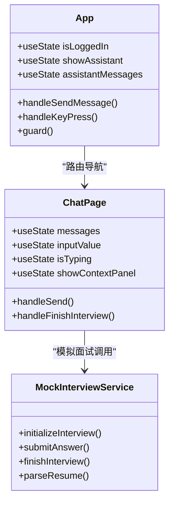

**图表来源**
- [App.js:14-177](file://src/App.js#L14-L177)
- [ChatPage.js:9-482](file://src/pages/ChatPage.js#L9-L482)
- [MockInterviewService.js:7-519](file://src/services/MockInterviewService.js#L7-L519)

### 组件关系图

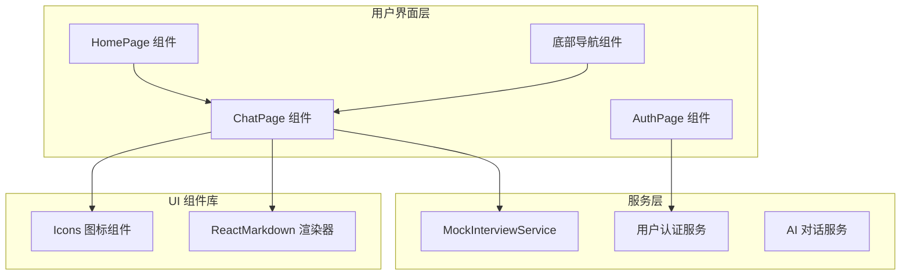

**图表来源**
- [ChatPage.js:1-482](file://src/pages/ChatPage.js#L1-L482)
- [HomePage.js:1-263](file://src/pages/HomePage.js#L1-L263)
- [AuthPage.js:1-732](file://src/pages/AuthPage.js#L1-L732)

**章节来源**
- [App.js:14-177](file://src/App.js#L14-L177)
- [ChatPage.js:1-482](file://src/pages/ChatPage.js#L1-L482)

## 对话系统架构

### 整体架构设计

漫旅 AI 对话系统采用前后端分离架构，前端负责用户界面和交互逻辑，后端提供 AI 对话服务和数据存储。

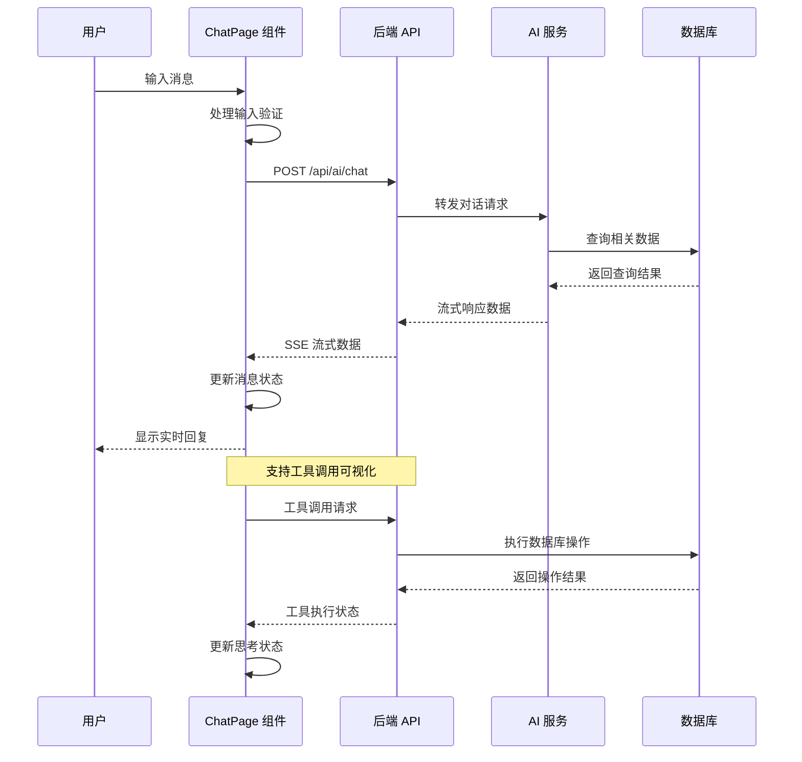

**图表来源**
- [ChatPage.js:133-285](file://src/pages/ChatPage.js#L133-L285)
- [README.md:186-195](file://README.md#L186-L195)

### 数据流架构

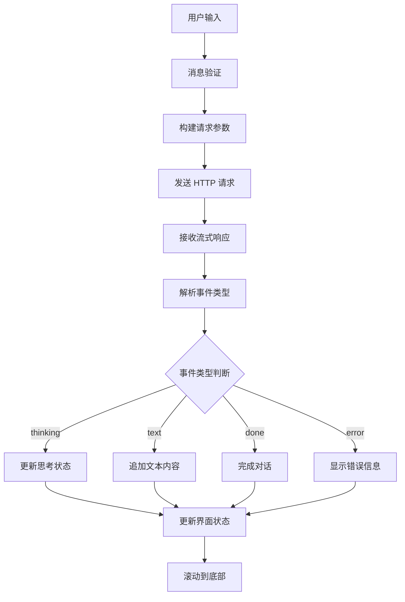

**图表来源**
- [ChatPage.js:210-271](file://src/pages/ChatPage.js#L210-L271)

**章节来源**
- [ChatPage.js:133-285](file://src/pages/ChatPage.js#L133-L285)
- [README.md:186-195](file://README.md#L186-L195)

## 流式输出处理机制

### SSE 流式传输实现

系统采用 Server-Sent Events (SSE) 协议实现流式输出，支持实时数据传输和断线重连。

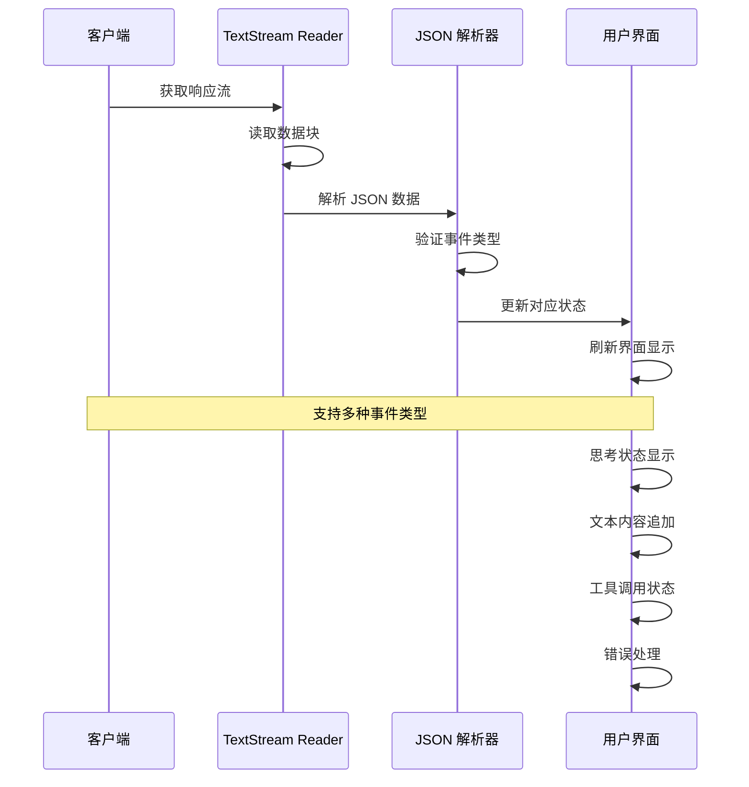

**图表来源**
- [ChatPage.js:210-271](file://src/pages/ChatPage.js#L210-L271)

### 流式处理算法

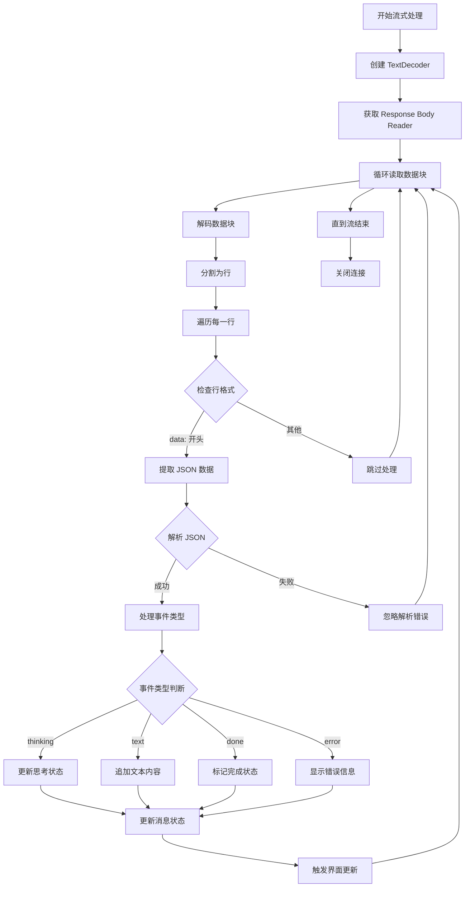

**图表来源**
- [ChatPage.js:210-271](file://src/pages/ChatPage.js#L210-L271)

**章节来源**
- [ChatPage.js:210-271](file://src/pages/ChatPage.js#L210-L271)

## SSE 通信协议实现

### 协议规范

系统遵循 SSE 协议规范，使用 `text/event-stream` 媒体类型进行实时数据传输。

| 事件类型 | 数据格式 | 用途描述 |
|---------|---------|---------|
| `thinking` | `{ "type": "thinking", "tool": "工具名称" }` | 显示 AI 思考过程 |
| `text` | `{ "type": "text", "content": "文本内容" }` | 流式文本输出 |
| `done` | `{ "type": "done", "usedTools": [] }` | 对话完成标识 |
| `error` | `{ "type": "error", "message": "错误信息" }` | 错误状态通知 |

### 事件处理流程

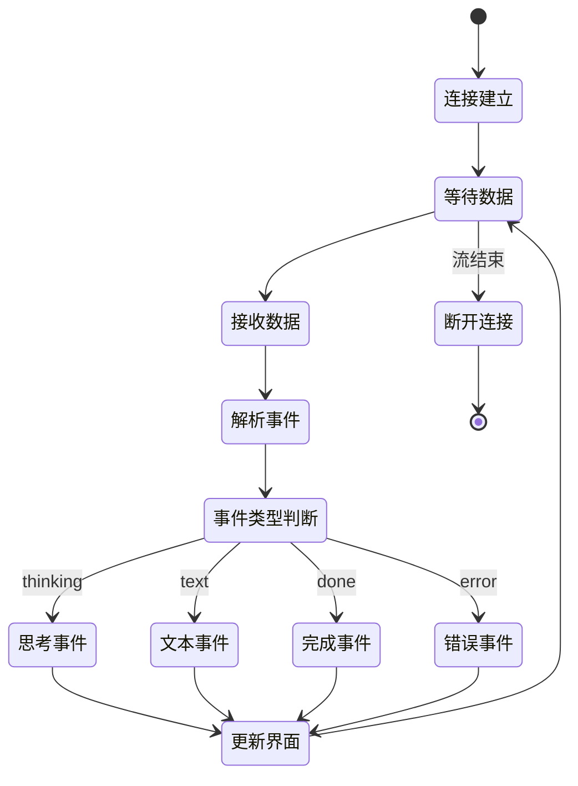

**图表来源**
- [ChatPage.js:220-266](file://src/pages/ChatPage.js#L220-L266)

**章节来源**
- [README.md:186-195](file://README.md#L186-L195)
- [ChatPage.js:220-266](file://src/pages/ChatPage.js#L220-L266)

## 消息状态管理

### 状态结构设计

系统采用 React Hooks 进行状态管理，每个消息对象包含以下关键属性：

```mermaid
erDiagram
MESSAGE {
string id
string role
string content
string thinking
array usedTools
string time
boolean isInterview
array suggestions
}
USER_MESSAGE {
string role = "user"
string content
string time
}
AI_MESSAGE {
string role = "ai"
string content
string thinking
array usedTools
string time
boolean isInterview
array suggestions
}
MESSAGE ||--|| USER_MESSAGE : "继承"
MESSAGE ||--|| AI_MESSAGE : "继承"
```

**图表来源**
- [ChatPage.js:20-39](file://src/pages/ChatPage.js#L20-L39)

### 状态更新机制

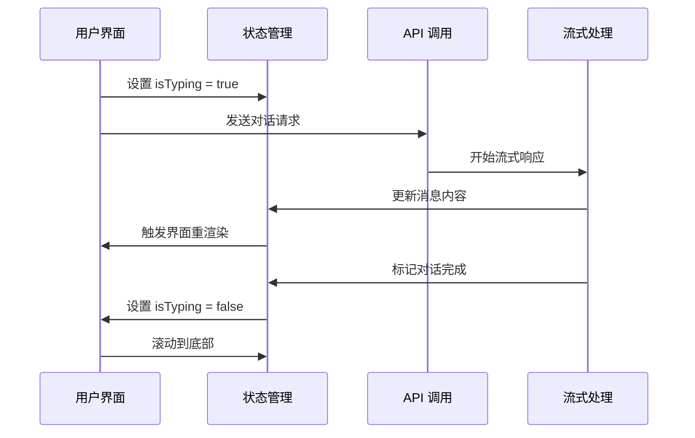

**图表来源**
- [ChatPage.js:133-285](file://src/pages/ChatPage.js#L133-L285)

**章节来源**
- [ChatPage.js:20-39](file://src/pages/ChatPage.js#L20-L39)
- [ChatPage.js:133-285](file://src/pages/ChatPage.js#L133-L285)

## 界面设计与交互流程

### 响应式布局设计

系统采用移动端优先的设计理念，支持不同屏幕尺寸的自适应布局。

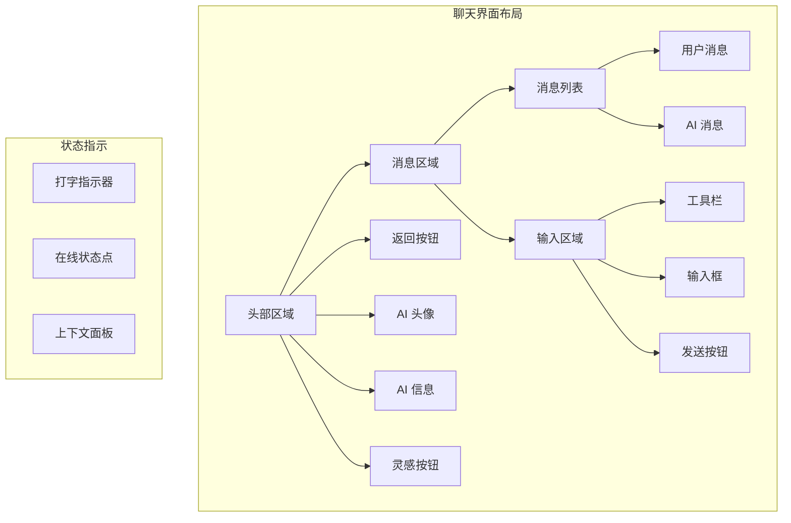

**图表来源**
- [App.css:1813-2399](file://src/App.css#L1813-L2399)

### 交互流程设计

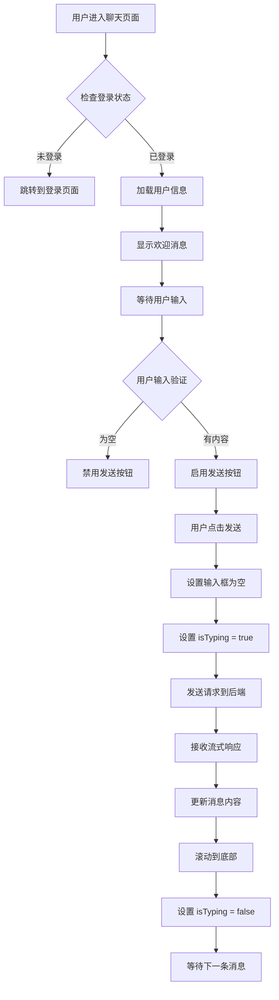

**图表来源**
- [ChatPage.js:133-285](file://src/pages/ChatPage.js#L133-L285)

**章节来源**
- [App.css:1813-2399](file://src/App.css#L1813-L2399)
- [ChatPage.js:133-285](file://src/pages/ChatPage.js#L133-L285)

## Markdown 渲染功能

### 渲染器配置

系统使用 `react-markdown` 和 `remark-gfm` 插件实现 Markdown 渲染功能，支持 GitHub 风格的 Markdown 语法。

```mermaid
graph LR
A[原始 Markdown 文本] --> B[ReactMarkdown 组件]
B --> C[remark-gfm 插件]
C --> D[HTML 元素树]
D --> E[React JSX 元素]
E --> F[最终渲染输出]
subgraph "支持的 Markdown 语法"
G[标题 # H1]
H[加粗 **bold**]
I[斜体 *italic*]
J[列表 - 无序]
K[数字列表 1. 有序]
L[代码 `code`]
M[代码块
```javascript``]
        N[链接 [text](url)]
        O[表格 |header|]
    end
    
    B --> G
    B --> H
    B --> I
    B --> J
    B --> K
    B --> L
    B --> M
    B --> N
    B --> O
```

**图表来源**
- [ChatPage.js:6-7](file://src/pages/ChatPage.js#L6-L7)

### 渲染效果

系统支持以下 Markdown 渲染效果：

- **标题层级**：支持 H1-H6 标题
- **文本格式**：加粗、斜体、删除线
- **列表格式**：有序列表、无序列表
- **代码显示**：行内代码、代码块
- **链接处理**：外链自动识别
- **表格渲染**：GitHub 风格表格

**章节来源**
- [ChatPage.js:6-7](file://src/pages/ChatPage.js#L6-L7)
- [ChatPage.js:384-387](file://src/pages/ChatPage.js#L384-L387)

## 模拟面试系统

### 面试流程设计

系统集成了豆包大模型 API，提供专业的保研模拟面试体验。

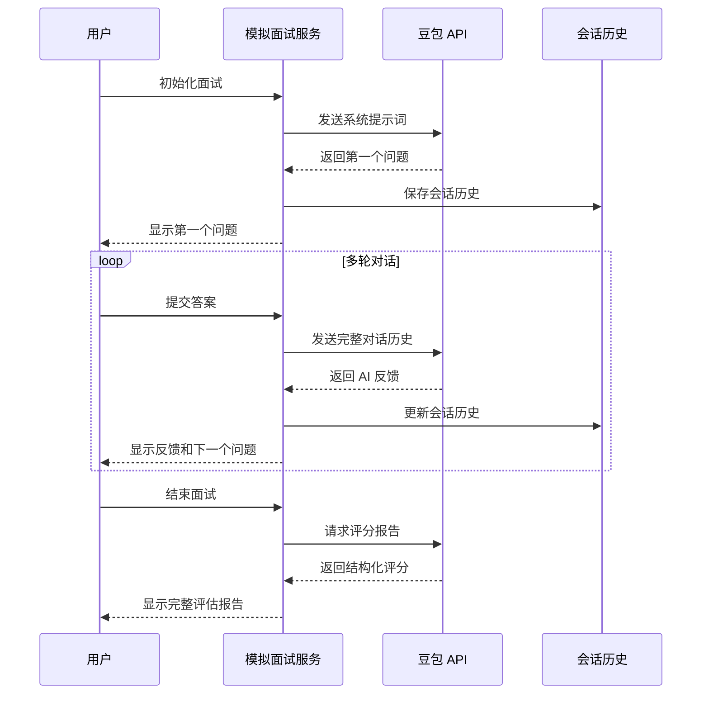

**图表来源**
- [MockInterviewService.js:24-182](file://src/services/MockInterviewService.js#L24-L182)
- [MockInterviewService.js:190-247](file://src/services/MockInterviewService.js#L190-L247)
- [MockInterviewService.js:254-358](file://src/services/MockInterviewService.js#L254-L358)

### 面试配置管理

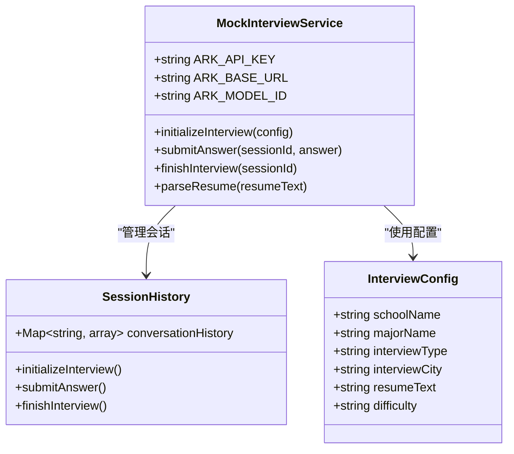

**图表来源**
- [MockInterviewService.js:24-182](file://src/services/MockInterviewService.js#L24-L182)
- [MockInterviewService.js:190-247](file://src/services/MockInterviewService.js#L190-L247)

**章节来源**
- [MockInterviewService.js:24-182](file://src/services/MockInterviewService.js#L24-L182)
- [MockInterviewService.js:190-247](file://src/services/MockInterviewService.js#L190-L247)
- [MockInterviewService.js:254-358](file://src/services/MockInterviewService.js#L254-L358)

## 性能优化策略

### 流式处理优化

系统采用流式处理机制，通过以下方式优化性能：

1. **增量渲染**：实时更新消息内容，避免全量重渲染
2. **内存管理**：及时清理已完成的流式数据
3. **防抖处理**：避免频繁的状态更新导致的性能问题

### 界面渲染优化

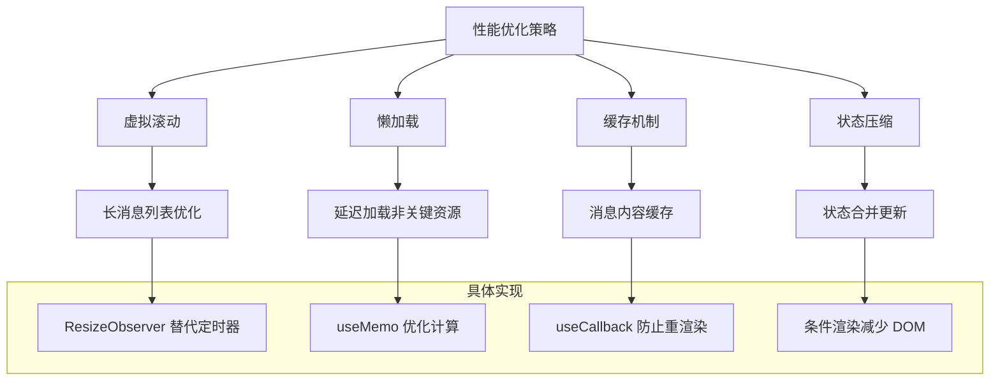

### 内存管理策略

系统实现了完善的内存管理机制：

- **会话历史清理**：面试结束后自动清理会话数据
- **流式数据释放**：及时释放已完成的流式数据
- **事件监听器清理**：组件卸载时清理所有事件监听器

**章节来源**
- [ChatPage.js:62-102](file://src/pages/ChatPage.js#L62-L102)
- [ChatPage.js:287-329](file://src/pages/ChatPage.js#L287-L329)

## 故障排除指南

### 常见问题诊断

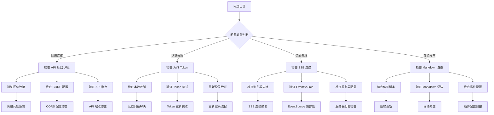

### 错误处理机制

系统实现了多层次的错误处理机制：

1. **网络错误处理**：捕获网络异常并显示友好提示
2. **API 错误处理**：处理后端 API 返回的错误状态
3. **流式处理错误**：处理 SSE 连接中断和数据解析错误
4. **渲染错误处理**：处理 Markdown 渲染异常

**章节来源**
- [ChatPage.js:272-284](file://src/pages/ChatPage.js#L272-L284)
- [MockInterviewService.js:176-182](file://src/services/MockInterviewService.js#L176-L182)

## 结论

漫旅 ManLv 的 AI 对话系统展现了现代 Web 应用的先进架构设计。通过采用 React Hooks、SSE 流式传输、Markdown 渲染等技术，系统实现了流畅的用户体验和强大的功能特性。

### 系统优势

1. **实时交互体验**：SSE 流式传输确保了毫秒级的响应速度
2. **丰富的渲染能力**：完整的 Markdown 支持提供了专业的文档展示
3. **智能状态管理**：React Hooks 实现了高效的状态同步
4. **完善的错误处理**：多层次的错误处理机制提升了系统稳定性
5. **优秀的性能表现**：流式处理和内存管理优化确保了良好的性能

### 技术亮点

- **SSE 协议应用**：实现了真正的实时双向通信
- **流式渲染优化**：支持大规模数据的高效渲染
- **多轮对话支持**：通过会话历史管理实现上下文保持
- **响应式设计**：适配各种移动设备的屏幕尺寸
- **模块化架构**：清晰的组件分离便于维护和扩展

该系统为保研生提供了一个功能完备、体验优秀的智能助手平台，展现了现代前端技术在复杂应用场景中的强大能力。