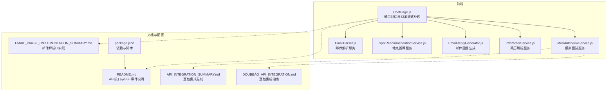
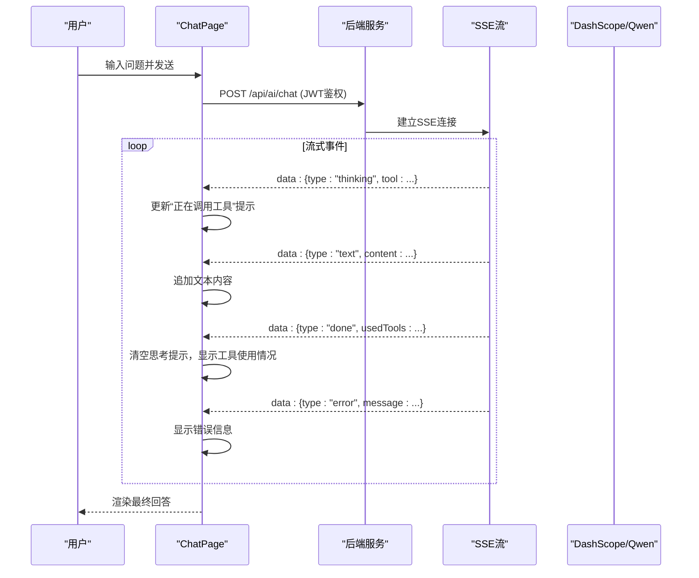
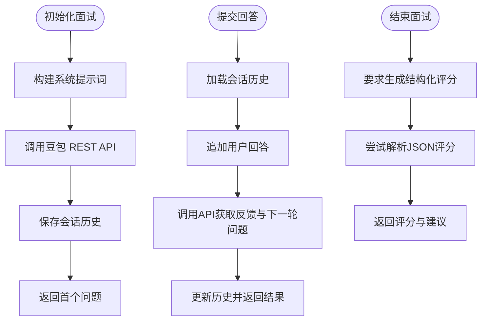
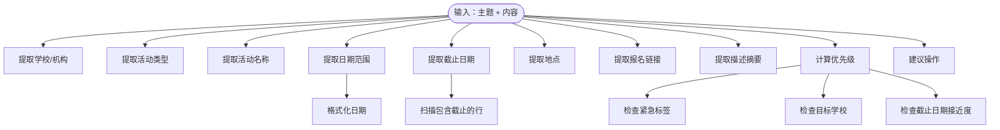
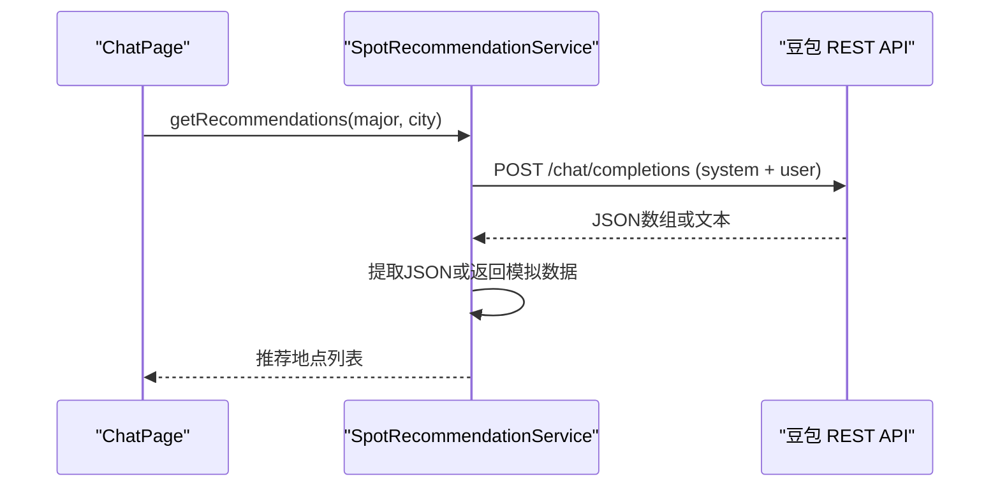
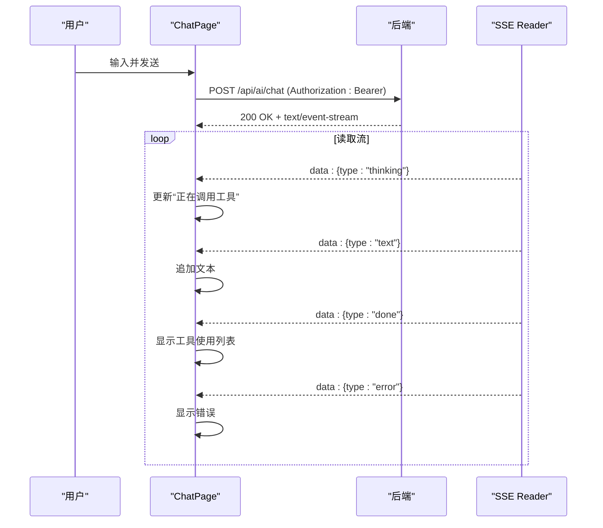
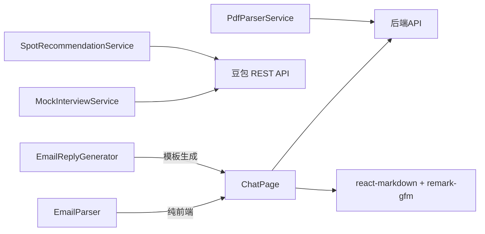

# AI 服务集成

<cite>
**本文引用的文件**
- [MockInterviewService.js](file://src/services/MockInterviewService.js)
- [EmailParser.js](file://src/services/EmailParser.js)
- [SpotRecommendationService.js](file://src/services/SpotRecommendationService.js)
- [ChatPage.js](file://src/pages/ChatPage.js)
- [EmailReplyGenerator.js](file://src/services/EmailReplyGenerator.js)
- [PdfParserService.js](file://src/services/PdfParserService.js)
- [README.md](file://README.md)
- [API_INTEGRATION_SUMMARY.md](file://API_INTEGRATION_SUMMARY.md)
- [DOUBBAO_API_INTEGRATION.md](file://DOUBBAO_API_INTEGRATION.md)
- [EMAIL_PARSE_IMPLEMENTATION_SUMMARY.md](file://EMAIL_PARSE_IMPLEMENTATION_SUMMARY.md)
- [package.json](file://package.json)
</cite>

## 目录
1. [简介](#简介)
2. [项目结构](#项目结构)
3. [核心组件](#核心组件)
4. [架构总览](#架构总览)
5. [详细组件分析](#详细组件分析)
6. [依赖关系分析](#依赖关系分析)
7. [性能考量](#性能考量)
8. [故障排除指南](#故障排除指南)
9. [结论](#结论)
10. [附录](#附录)

## 简介
本文件面向 AI 开发者，系统梳理漫旅 ManLv 中的 AI 服务集成方案，重点覆盖：
- DashScope Qwen 大模型（通过火山方舟 v3 API）的集成路径与调用方式
- 流式输出（SSE）协议在通用 AI 对话中的实现与事件类型处理
- 工具调用机制（思维过程、文本输出、完成、错误事件）
- 三种 AI 服务的技术实现：MockInterviewService（模拟面试）、EmailParser（邮件解析）、SpotRecommendationService（地点推荐）
- 最佳实践、性能优化建议与故障排除指南

## 项目结构
ManLv 前端采用 React + React Router，AI 服务以服务层封装，通用对话通过后端 SSE 流式接口提供。核心目录与文件如下：
- 服务层：MockInterviewService、EmailParser、SpotRecommendationService、EmailReplyGenerator、PdfParserService
- 页面层：ChatPage（通用 AI 对话与流式处理）、InboxPage（邮件解析 UI 卡片）
- 文档：README、API 集成与豆包集成文档、邮件解析实现总结
- 依赖：React、react-markdown、remark-gfm、openai（用于兼容豆包 API）

图表来源
- [ChatPage.js:1-482](file://src/pages/ChatPage.js#L1-L482)
- [MockInterviewService.js:1-519](file://src/services/MockInterviewService.js#L1-L519)
- [EmailParser.js:1-227](file://src/services/EmailParser.js#L1-L227)
- [SpotRecommendationService.js:1-86](file://src/services/SpotRecommendationService.js#L1-L86)
- [EmailReplyGenerator.js:1-212](file://src/services/EmailReplyGenerator.js#L1-L212)
- [PdfParserService.js:1-97](file://src/services/PdfParserService.js#L1-L97)
- [README.md:174-206](file://README.md#L174-L206)
- [API_INTEGRATION_SUMMARY.md:1-378](file://API_INTEGRATION_SUMMARY.md#L1-L378)
- [DOUBBAO_API_INTEGRATION.md:1-291](file://DOUBBAO_API_INTEGRATION.md#L1-L291)
- [EMAIL_PARSE_IMPLEMENTATION_SUMMARY.md:1-395](file://EMAIL_PARSE_IMPLEMENTATION_SUMMARY.md#L1-L395)
- [package.json:1-41](file://package.json#L1-L41)

章节来源
- [README.md:146-171](file://README.md#L146-L171)
- [package.json:1-41](file://package.json#L1-L41)

## 核心组件
- MockInterviewService：集成豆包大模型 API，提供模拟面试的初始化、回答提交、结束评分与简历解析能力，内置会话历史与降级机制。
- EmailParser：纯前端邮件解析服务，提取学校、活动类型、日期、截止日、地点、链接、描述、优先级与建议操作。
- SpotRecommendationService：基于用户专业与城市，调用豆包 API 生成个性化学习/备考地点推荐，失败时返回模拟数据。
- ChatPage：通用 AI 对话页面，负责发起后端 SSE 流式对话，解析 thinking/text/done/error 事件，渲染 Markdown 并展示工具调用状态。
- EmailReplyGenerator：根据解析结果与日程冲突，生成确认/拒绝/延期/咨询四类邮件回复模板。
- PdfParserService：调用后端 /api/parse-resume 接口解析 PDF/图片简历，返回文本与结构化信息。

章节来源
- [MockInterviewService.js:1-519](file://src/services/MockInterviewService.js#L1-L519)
- [EmailParser.js:1-227](file://src/services/EmailParser.js#L1-L227)
- [SpotRecommendationService.js:1-86](file://src/services/SpotRecommendationService.js#L1-L86)
- [ChatPage.js:133-285](file://src/pages/ChatPage.js#L133-L285)
- [EmailReplyGenerator.js:1-212](file://src/services/EmailReplyGenerator.js#L1-L212)
- [PdfParserService.js:1-97](file://src/services/PdfParserService.js#L1-L97)

## 架构总览
ManLv 的 AI 集成分为两类：
- 通用对话（SSE 流式）：前端通过 POST /api/ai/chat 获取 text/event-stream，按事件类型渲染“思考中”“文本输出”“完成”“错误”。
- 专用 AI 服务（REST）：MockInterviewService、SpotRecommendationService 直接调用豆包 REST API（火山方舟 v3），MockInterviewService 还包含会话历史与降级策略。

图表来源
- [ChatPage.js:199-271](file://src/pages/ChatPage.js#L199-L271)
- [README.md:186-195](file://README.md#L186-L195)

章节来源
- [ChatPage.js:133-285](file://src/pages/ChatPage.js#L133-L285)
- [README.md:174-206](file://README.md#L174-L206)

## 详细组件分析

### MockInterviewService（模拟面试）
- 集成方式：通过火山方舟 v3 REST API（兼容 OpenAI 协议）调用豆包模型，使用会话历史 Map 维护上下文，失败时自动降级为模拟数据。
- 关键流程：
  - 初始化：构建系统提示词（含学校、专业、简历、面试类型等），调用 API 生成首个问题并保存会话。
  - 回答提交：追加用户回答至历史，携带完整历史调用 API 获取反馈与下一个问题。
  - 结束面试：要求模型输出结构化评分 JSON，解析失败则回退模拟评分。
  - 简历解析：调用 API 提取简历关键信息（教育背景、工作经验、技能、获奖等）。
- 事件与错误处理：捕获网络异常与 API 错误，记录日志并返回模拟数据，保证用户体验连续性。
- 会话管理：内存 Map 保存历史，结束时清理；支持本地存储历史记录接口（当前返回本地数据）。

图表来源
- [MockInterviewService.js:24-182](file://src/services/MockInterviewService.js#L24-L182)
- [MockInterviewService.js:190-247](file://src/services/MockInterviewService.js#L190-L247)
- [MockInterviewService.js:254-358](file://src/services/MockInterviewService.js#L254-L358)
- [MockInterviewService.js:397-440](file://src/services/MockInterviewService.js#L397-L440)

章节来源
- [MockInterviewService.js:1-519](file://src/services/MockInterviewService.js#L1-L519)
- [API_INTEGRATION_SUMMARY.md:101-128](file://API_INTEGRATION_SUMMARY.md#L101-L128)
- [DOUBBAO_API_INTEGRATION.md:102-110](file://DOUBBAO_API_INTEGRATION.md#L102-L110)

### EmailParser（邮件解析）
- 纯前端解析器，不依赖后端 AI，通过关键词与正则提取结构化信息：
  - 学校/机构：基于常见高校名称集合匹配。
  - 活动类型：夏令营、面试、推免、讲座等。
  - 活动名称：从主题中抽取。
  - 日期范围：支持 MM月DD日~MM月DD日、YYYY年MM月DD日等格式。
  - 截止日期：扫描包含“截止/截至”的行。
  - 地点、链接、描述：分别提取并限制长度。
  - 优先级：综合紧急标签、目标学校、截止日期接近度计算。
  - 建议操作：根据活动类型给出行动建议。
- 优点：无需网络请求，响应迅速；缺点：准确性依赖关键词与正则规则。

图表来源
- [EmailParser.js:12-224](file://src/services/EmailParser.js#L12-L224)

章节来源
- [EmailParser.js:1-227](file://src/services/EmailParser.js#L1-L227)

### SpotRecommendationService（地点推荐）
- 通过豆包 REST API 生成个性化学习/备考地点推荐，要求模型返回 JSON 数组，失败时返回模拟数据。
- 系统提示词包含“专业相关性、场景适用性、输出格式”等约束，确保输出结构化且可消费。

图表来源
- [SpotRecommendationService.js:18-66](file://src/services/SpotRecommendationService.js#L18-L66)

章节来源
- [SpotRecommendationService.js:1-86](file://src/services/SpotRecommendationService.js#L1-L86)

### ChatPage（通用 AI 对话与 SSE）
- 发起后端 /api/ai/chat，接收 text/event-stream，逐行解析 data: 前缀，按事件类型更新 UI：
  - thinking：显示“正在调用工具”提示（映射工具名）。
  - text：追加流式文本内容。
  - done：清空思考提示，显示工具使用列表。
  - error：显示错误信息。
- Markdown 渲染：使用 react-markdown + remark-gfm，支持标题、加粗、列表、表格等。
- 鉴权：携带 JWT Bearer Token；登录失效时提示重新登录。

图表来源
- [ChatPage.js:199-271](file://src/pages/ChatPage.js#L199-L271)
- [README.md:186-195](file://README.md#L186-L195)

章节来源
- [ChatPage.js:133-285](file://src/pages/ChatPage.js#L133-L285)
- [README.md:174-206](file://README.md#L174-L206)

### EmailReplyGenerator（邮件回复生成）
- 基于解析结果与用户日程冲突，生成四种模板：
  - 确认参加（confirm）
  - 委婉拒绝（decline）
  - 时间冲突协商（postpone）
  - 咨询问题（ask）
- 提供建议回复类型与验证逻辑，确保主题、正文、占位符完整性。

章节来源
- [EmailReplyGenerator.js:1-212](file://src/services/EmailReplyGenerator.js#L1-L212)

### PdfParserService（简历解析）
- 调用后端 /api/parse-resume，上传文件并返回解析结果（文本、结构化、扫描版标记、消息）。
- 支持 PDF 与图片格式，提供文件类型判断与大小格式化。

章节来源
- [PdfParserService.js:1-97](file://src/services/PdfParserService.js#L1-L97)

## 依赖关系分析
- 依赖关系：
  - ChatPage 依赖后端 SSE 接口与 JWT 鉴权。
  - MockInterviewService 依赖豆包 REST API（火山方舟 v3）。
  - SpotRecommendationService 依赖豆包 REST API。
  - EmailParser、EmailReplyGenerator、PdfParserService 为纯前端或后端接口调用。
- 第三方依赖：
  - openai：用于兼容豆包 API（在集成文档中提及，但当前 MockInterviewService 仍使用 fetch REST 方式）。
  - react-markdown + remark-gfm：用于 Markdown 渲染。
  - @icon-park/react：图标库。
  - pdfjs-dist：PDF 预览（与简历解析配合使用）。

图表来源
- [ChatPage.js:199-271](file://src/pages/ChatPage.js#L199-L271)
- [MockInterviewService.js:10-11](file://src/services/MockInterviewService.js#L10-L11)
- [SpotRecommendationService.js:8-10](file://src/services/SpotRecommendationService.js#L8-L10)
- [package.json:5-16](file://package.json#L5-L16)

章节来源
- [package.json:1-41](file://package.json#L1-L41)

## 性能考量
- SSE 流式渲染：
  - 使用 TextDecoder + reader.read() 逐块解码，按行解析事件，避免阻塞主线程。
  - 仅在收到 data: 行时解析 JSON，减少解析开销。
- 会话历史与内存：
  - MockInterviewService 使用 Map 维护会话历史，注意在结束时清理，避免内存泄漏。
- API 调用成本：
  - 豆包 API 调用成本较低（单次面试约 0.002-0.003 元），适合高频使用场景。
- 前端依赖体积：
  - openai 依赖带来约 29.45 kB 增量，建议在生产环境通过后端代理隐藏密钥并移除浏览器直接调用标志。

章节来源
- [ChatPage.js:210-271](file://src/pages/ChatPage.js#L210-L271)
- [API_INTEGRATION_SUMMARY.md:321-339](file://API_INTEGRATION_SUMMARY.md#L321-L339)
- [DOUBBAO_API_INTEGRATION.md:191-196](file://DOUBBAO_API_INTEGRATION.md#L191-L196)

## 故障排除指南
- SSE 流式对话：
  - 确认后端 /api/ai/chat 返回 200 与正确的 Content-Type（text/event-stream）。
  - 检查浏览器控制台是否存在 CORS、鉴权失败或网络中断。
  - 若事件解析异常，确认每行以 data: 开头，且 JSON 可被解析。
- 豆包 API 调用：
  - 检查 API Key 是否有效、网络是否可达、模型接入点 ID 是否正确。
  - 开发环境允许浏览器直接调用（dangerouslyAllowBrowser: true），生产环境务必通过后端代理。
- MockInterviewService：
  - 若 API 失败，系统自动降级为模拟数据；可在控制台查看降级日志。
  - 确保会话 ID 正确传递，避免“会话不存在”错误。
- EmailParser：
  - 关键词与正则可能遗漏边界情况，建议持续优化规则库与正则表达式。
- PdfParserService：
  - 确认后端 /api/parse-resume 可用，文件类型与大小符合要求。

章节来源
- [ChatPage.js:272-284](file://src/pages/ChatPage.js#L272-L284)
- [DOUBBAO_API_INTEGRATION.md:197-242](file://DOUBBAO_API_INTEGRATION.md#L197-L242)
- [API_INTEGRATION_SUMMARY.md:212-229](file://API_INTEGRATION_SUMMARY.md#L212-L229)
- [MockInterviewService.js:176-182](file://src/services/MockInterviewService.js#L176-L182)

## 结论
ManLv 的 AI 服务集成以“SSE 流式对话 + REST 专用服务”双通道实现：
- 通用对话通过后端 SSE 提供沉浸式体验，事件类型清晰，工具调用可视化。
- 专用服务（模拟面试、地点推荐）通过 REST 直连豆包 API，具备会话历史与降级机制，保障稳定性。
- 前端依赖简洁，性能开销可控；建议在生产环境通过后端代理隐藏密钥并加强安全与监控。

## 附录
- API 接口与事件类型参考：见 README 的“AI 对话接口（SSE）”与“AI 内置工具”章节。
- 豆包集成参考：见 API 集成总结与豆包集成指南文档。
- 邮件解析 UI 实现：见邮件解析实现总结文档。

章节来源
- [README.md:174-206](file://README.md#L174-L206)
- [API_INTEGRATION_SUMMARY.md:1-378](file://API_INTEGRATION_SUMMARY.md#L1-L378)
- [DOUBBAO_API_INTEGRATION.md:1-291](file://DOUBBAO_API_INTEGRATION.md#L1-L291)
- [EMAIL_PARSE_IMPLEMENTATION_SUMMARY.md:1-395](file://EMAIL_PARSE_IMPLEMENTATION_SUMMARY.md#L1-L395)