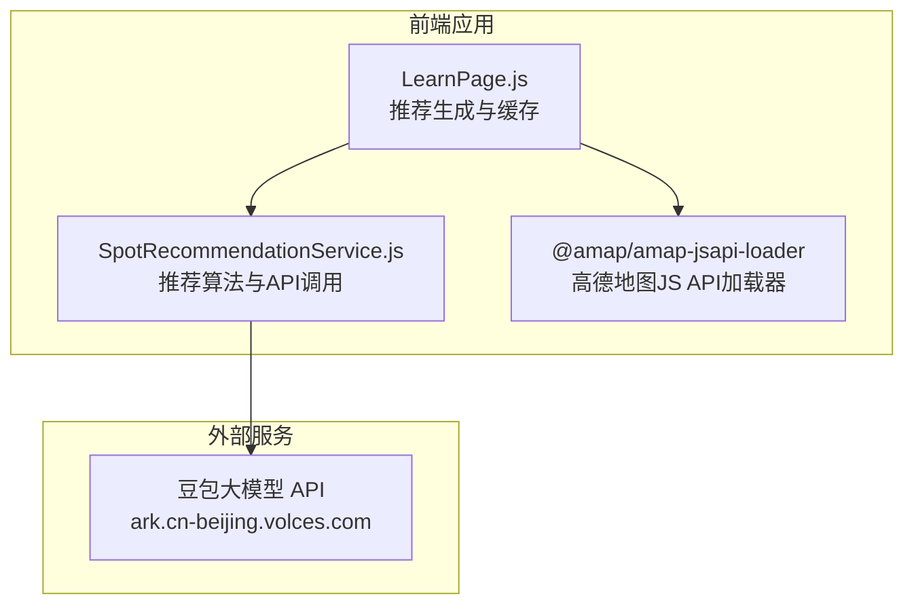
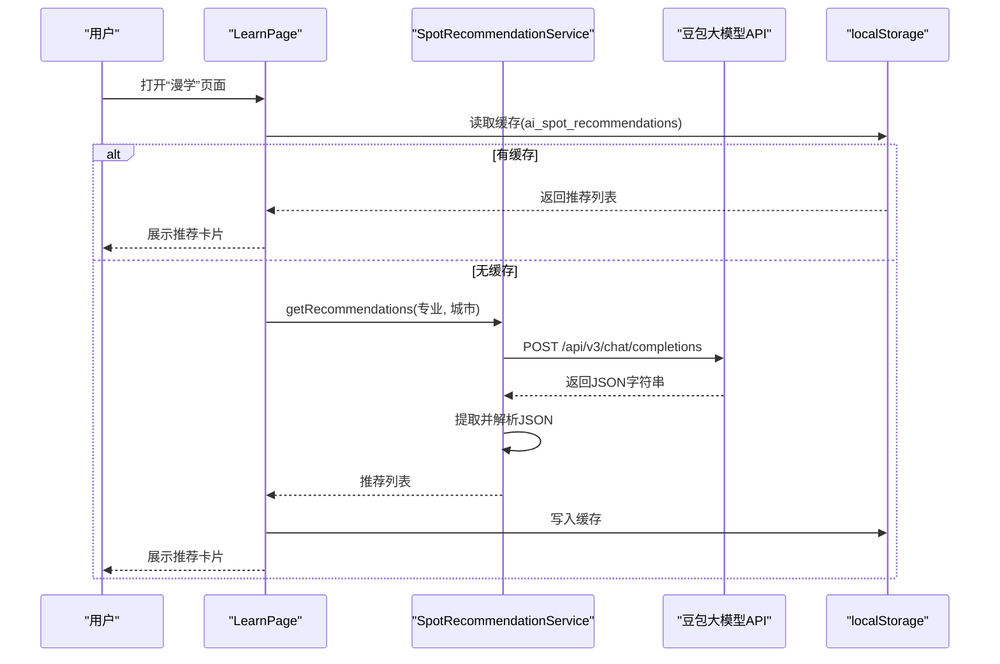
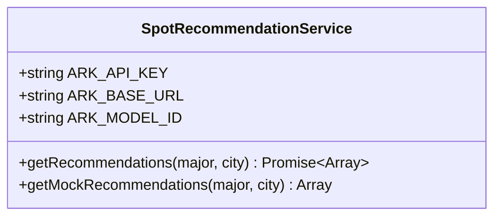
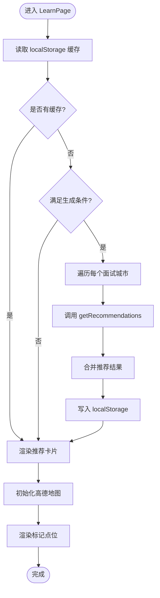
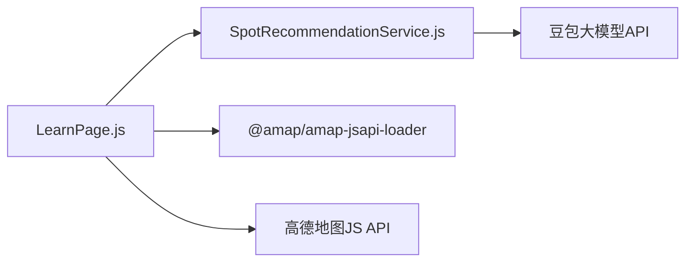

# 地点推荐服务

<cite>
**本文档引用的文件**
- [SpotRecommendationService.js](file://src/services/SpotRecommendationService.js)
- [LearnPage.js](file://src/pages/LearnPage.js)
- [README.md](file://README.md)
- [package.json](file://package.json)
- [MockInterviewService.js](file://src/services/MockInterviewService.js)
- [QUICK_START.md](file://QUICK_START.md)
</cite>

## 目录
1. [简介](#简介)
2. [项目结构](#项目结构)
3. [核心组件](#核心组件)
4. [架构总览](#架构总览)
5. [详细组件分析](#详细组件分析)
6. [依赖关系分析](#依赖关系分析)
7. [性能考虑](#性能考虑)
8. [故障排查指南](#故障排查指南)
9. [结论](#结论)
10. [附录](#附录)

## 简介
本文件面向“地点推荐服务”的技术文档，聚焦于 SpotRecommendationService 类的推荐算法实现与集成方案，涵盖以下主题：
- 推荐引擎工作原理与数据来源
- 地理位置匹配与用户偏好分析
- 豆包大模型 API 集成与系统提示词设计
- 推荐准确性优化、缓存策略与离线处理能力
- 高德地图 API 集成方案与路线规划能力
- 配置参数说明、性能调优建议与集成指南

## 项目结构
本项目采用前端单页应用架构，地点推荐服务位于前端服务层，与页面组件协同完成推荐生成与展示。核心文件如下：
- 服务层：SpotRecommendationService.js（推荐算法与 API 调用）
- 页面层：LearnPage.js（推荐生成触发、缓存读写、高德地图集成）
- 依赖声明：package.json（高德地图 JS API 加载器）
- 文档与说明：README.md、QUICK_START.md（API 集成与使用说明）

图表来源
- [LearnPage.js:116-139](file://src/pages/LearnPage.js#L116-L139)
- [SpotRecommendationService.js:18-66](file://src/services/SpotRecommendationService.js#L18-L66)
- [package.json:6](file://package.json#L6)

章节来源
- [README.md:146-170](file://README.md#L146-L170)
- [package.json:1-41](file://package.json#L1-L41)

## 核心组件
- SpotRecommendationService：封装推荐算法与 API 调用，负责基于用户专业与城市生成地点推荐，并提供兜底模拟数据。
- LearnPage：负责触发推荐生成、读取本地缓存、渲染推荐卡片，并集成高德地图进行地点可视化。

章节来源
- [SpotRecommendationService.js:6-85](file://src/services/SpotRecommendationService.js#L6-L85)
- [LearnPage.js:73-139](file://src/pages/LearnPage.js#L73-L139)

## 架构总览
推荐服务的整体流程如下：
- 用户进入“漫学”页面，系统根据用户专业与面试城市生成推荐。
- 若无缓存，触发 SpotRecommendationService 调用豆包大模型 API，解析返回的 JSON 并渲染。
- 推荐结果写入 localStorage，实现离线可用与快速加载。
- 页面同时集成高德地图，用于地点可视化与路线规划。

图表来源
- [LearnPage.js:73-139](file://src/pages/LearnPage.js#L73-L139)
- [SpotRecommendationService.js:18-66](file://src/services/SpotRecommendationService.js#L18-L66)

## 详细组件分析

### SpotRecommendationService 类分析
- 职责：基于用户专业与目标城市，调用豆包大模型 API 生成个性化地点推荐；若 API 失败则返回兜底模拟数据。
- 关键实现：
  - 系统提示词构建：明确推荐规则（专业相关性、场景适用性）、输出格式约束与 JSON 结构。
  - API 调用：POST /api/v3/chat/completions，携带 Authorization、model、messages、max_tokens、temperature 等参数。
  - 结果解析：从返回内容中提取 JSON 片段并解析，若失败则回退到 getMockRecommendations。
  - 兜底数据：针对特定专业（如建筑学）提供固定推荐，其他专业返回通用模板。

图表来源
- [SpotRecommendationService.js:6-85](file://src/services/SpotRecommendationService.js#L6-L85)

章节来源
- [SpotRecommendationService.js:18-66](file://src/services/SpotRecommendationService.js#L18-L66)
- [SpotRecommendationService.js:71-82](file://src/services/SpotRecommendationService.js#L71-L82)

### LearnPage 页面分析
- 推荐生成流程：
  - 首次加载：从 localStorage 读取缓存；若为空且满足条件则触发生成。
  - 生成逻辑：遍历所有面试城市，逐一调用 getRecommendations，合并结果并写入缓存。
  - UI 展示：渲染推荐卡片，提供“更新推荐”按钮。
- 高德地图集成：
  - 使用 @amap/amap-jsapi-loader 加载高德地图 JS API。
  - 初始化地图实例，设置视图模式、缩放级别与样式。
  - 根据面试城市坐标渲染标记点位，支持 3D 视图与标签标注。
  - 提供加载状态管理与错误提示，支持重试机制。

图表来源
- [LearnPage.js:73-139](file://src/pages/LearnPage.js#L73-L139)
- [LearnPage.js:141-200](file://src/pages/LearnPage.js#L141-L200)

章节来源
- [LearnPage.js:73-139](file://src/pages/LearnPage.js#L73-L139)
- [LearnPage.js:141-200](file://src/pages/LearnPage.js#L141-L200)

### 推荐算法与评分体系
- 地理位置匹配：通过城市坐标映射表（cityCoords）确定中心点，用于地图渲染与后续路线规划的基础。
- 用户偏好分析：系统提示词中明确“专业相关性”与“场景适用性”，引导模型优先推荐与专业强相关且适合备考/放松/专业考察的地点。
- 距离计算公式：当前实现未直接计算地理距离，而是以城市为中心进行地点推荐与地图渲染。若需引入距离排序，可在返回结果中增加距离字段并在前端进行排序。
- 评分权重系统：当前未实现显式的评分权重；可在返回结构中扩展“distance_score”、“relevance_score”等字段，并在前端按权重加权计算最终得分。

章节来源
- [LearnPage.js:28-38](file://src/pages/LearnPage.js#L28-L38)

### 数据源整合与实时更新机制
- 数据源：
  - 用户信息与面试列表：通过后端 API 获取，用于确定用户专业与目标城市。
  - 地图数据：高德地图 JS API 提供地图与标记点位渲染。
  - 推荐数据：来自豆包大模型 API，返回 JSON 格式的地点列表。
- 实时更新：
  - 首次加载读取缓存，避免重复请求。
  - 当用户专业或面试城市变化时，触发重新生成并更新缓存。
  - 提供“更新推荐”按钮，便于手动刷新。

章节来源
- [LearnPage.js:82-107](file://src/pages/LearnPage.js#L82-L107)
- [LearnPage.js:116-139](file://src/pages/LearnPage.js#L116-L139)

### 高德地图 API 集成方案
- 加载器：使用 @amap/amap-jsapi-loader 动态加载高德地图 JS API，支持指定版本与插件。
- 初始化：设置地图容器、视图模式（3D）、缩放级别、中心点与样式。
- 标记点位：根据城市坐标渲染标记，支持偏移与标签。
- 错误处理：提供加载超时与失败提示，支持重试。
- 路线规划：当前实现未直接调用路线规划 API；可在现有地图基础上扩展路径绘制与导航能力。

章节来源
- [LearnPage.js:162-200](file://src/pages/LearnPage.js#L162-L200)
- [package.json:6](file://package.json#L6)

### 推荐准确性优化
- 系统提示词优化：细化“专业相关性”与“场景适用性”的规则，增加示例与边界条件。
- 输出格式约束：严格限定 JSON 结构，减少解析失败概率。
- 兜底策略：针对特定专业提供高质量模拟数据，提升用户体验。
- 多轮迭代：根据用户反馈持续调整提示词与评分权重。

章节来源
- [SpotRecommendationService.js:20-31](file://src/services/SpotRecommendationService.js#L20-L31)
- [SpotRecommendationService.js:71-82](file://src/services/SpotRecommendationService.js#L71-L82)

### 缓存策略与离线处理
- 缓存位置：localStorage（ai_spot_recommendations）。
- 读取时机：页面首次加载时读取缓存，若为空则触发生成。
- 写入时机：生成完成后写入缓存，支持离线查看。
- 离线能力：即使网络异常，仍可展示缓存中的推荐结果。

章节来源
- [LearnPage.js:75-79](file://src/pages/LearnPage.js#L75-L79)
- [LearnPage.js:130-132](file://src/pages/LearnPage.js#L130-L132)

### 配置参数说明
- 豆包 API 配置（SpotRecommendationService）：
  - ARK_API_KEY：API 认证密钥
  - ARK_BASE_URL：API 基础地址
  - ARK_MODEL_ID：模型接入点 ID
- 高德地图配置（LearnPage）：
  - AMAP_KEY：高德地图 API Key
  - AMAP_SECURITY_CODE：安全密钥（可选）
  - 插件：AMap.Marker、AMap.LabelMarker
- 环境变量（MockInterviewService）：
  - REACT_APP_ARK_API_KEY：用于模拟面试服务的 API Key（与推荐服务相同）

章节来源
- [SpotRecommendationService.js:8-10](file://src/services/SpotRecommendationService.js#L8-L10)
- [LearnPage.js:11-19](file://src/pages/LearnPage.js#L11-L19)
- [MockInterviewService.js:9-11](file://src/services/MockInterviewService.js#L9-L11)

## 依赖关系分析
- 组件耦合：
  - LearnPage 依赖 SpotRecommendationService 与 @amap/amap-jsapi-loader。
  - SpotRecommendationService 依赖外部豆包 API。
- 外部依赖：
  - @amap/amap-jsapi-loader：高德地图 JS API 加载器
  - openai：用于模拟面试服务（与推荐服务同属前端服务层）

图表来源
- [LearnPage.js:6-7](file://src/pages/LearnPage.js#L6-L7)
- [SpotRecommendationService.js:8-10](file://src/services/SpotRecommendationService.js#L8-L10)
- [package.json:6](file://package.json#L6)

章节来源
- [package.json:5-15](file://package.json#L5-L15)

## 性能考虑
- API 调用频率控制：避免频繁触发生成，建议在用户操作稳定后再发起请求。
- 缓存命中率：充分利用 localStorage 缓存，减少重复网络请求。
- 地图初始化优化：延迟初始化与超时控制，避免阻塞页面渲染。
- 响应式 UI：使用骨架屏与进度条提升用户体验。

## 故障排查指南
- 推荐生成失败：
  - 检查网络连接与 API 状态
  - 查看 Console 日志与网络面板
  - 确认系统提示词与输出格式是否符合预期
- 地图加载失败：
  - 检查 AMAP_KEY 是否正确配置
  - 确认高德后台 Key 的平台限制（需 Web 端 JS API）
  - 使用“重试”按钮重新加载
- 缓存异常：
  - 清理 localStorage 中的 ai_spot_recommendations
  - 重新触发生成流程

章节来源
- [LearnPage.js:376-393](file://src/pages/LearnPage.js#L376-L393)
- [SpotRecommendationService.js:62-65](file://src/services/SpotRecommendationService.js#L62-L65)

## 结论
SpotRecommendationService 通过系统提示词与豆包大模型 API 实现了面向保研场景的个性化地点推荐，配合 LearnPage 的缓存与高德地图集成，提供了良好的用户体验。建议后续在以下方面持续优化：
- 引入距离与相关性评分权重，提升推荐准确性
- 扩展高德地图路线规划能力，提供导航与路径绘制
- 增强错误处理与降级策略，提升系统鲁棒性

## 附录
- 快速开始与 API 集成参考：参阅 QUICK_START.md
- 项目技术栈与依赖：参阅 README.md 与 package.json

章节来源
- [QUICK_START.md:1-141](file://QUICK_START.md#L1-L141)
- [README.md:65-76](file://README.md#L65-L76)