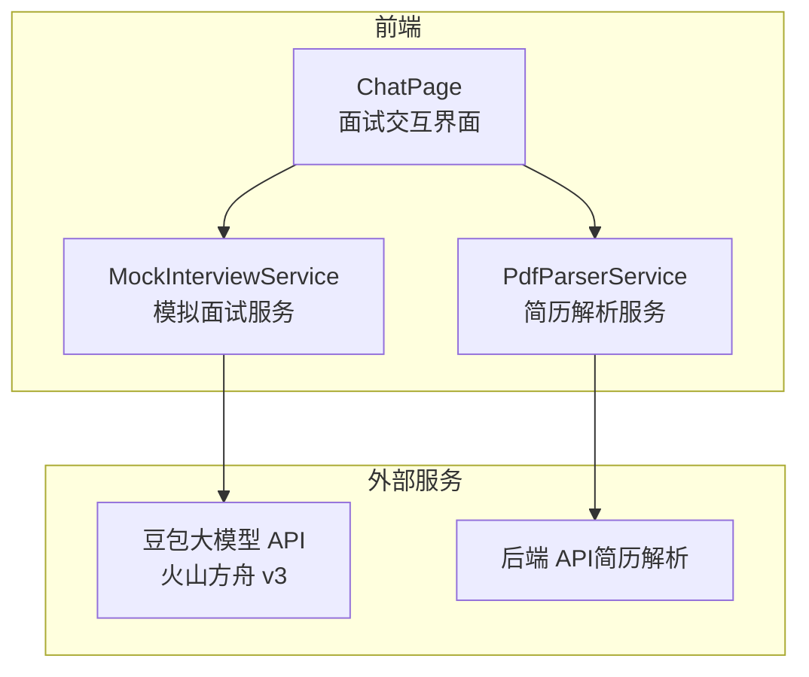
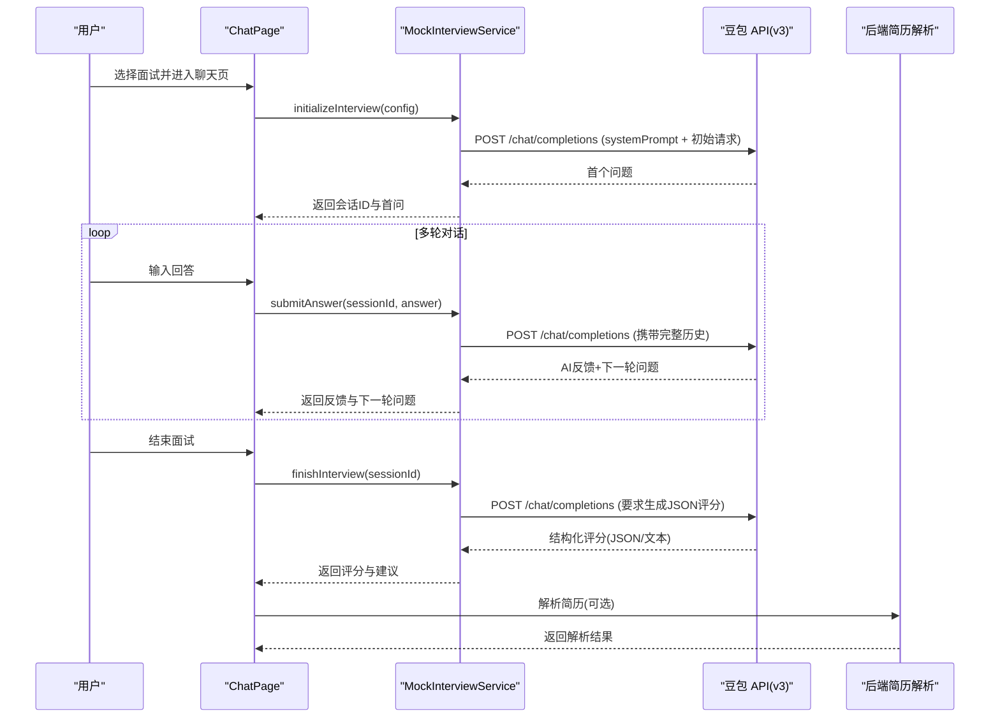
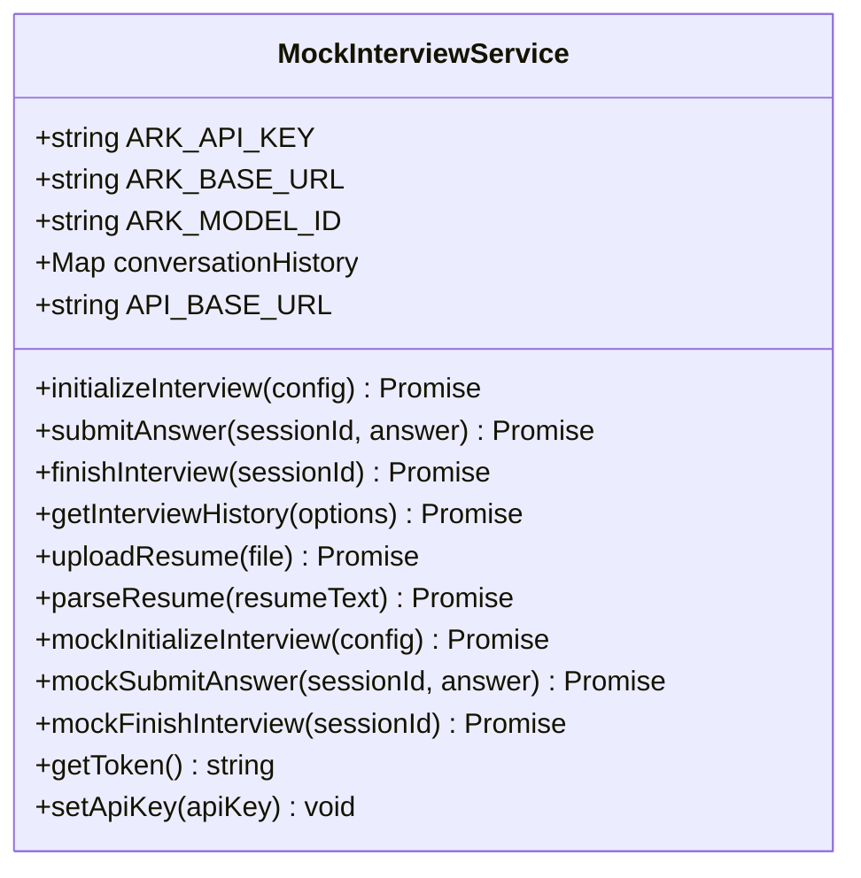
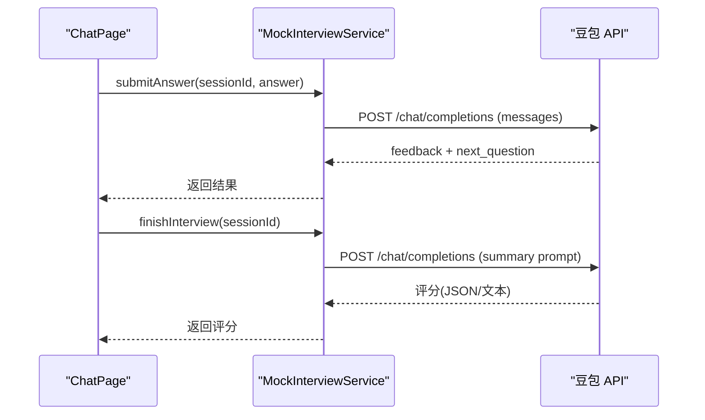
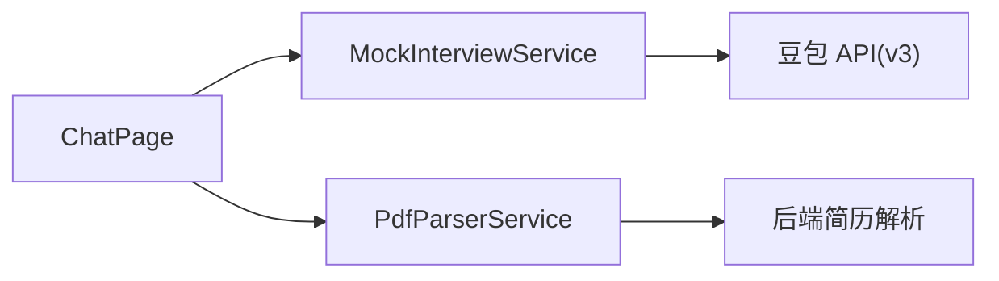

# 模拟面试服务

<cite>
**本文引用的文件**
- [MockInterviewService.js](file://src/services/MockInterviewService.js)
- [ChatPage.js](file://src/pages/ChatPage.js)
- [PdfParserService.js](file://src/services/PdfParserService.js)
- [README.md](file://README.md)
- [API_INTEGRATION_SUMMARY.md](file://API_INTEGRATION_SUMMARY.md)
- [QUICK_START.md](file://QUICK_START.md)
</cite>

## 目录
1. [简介](#简介)
2. [项目结构](#项目结构)
3. [核心组件](#核心组件)
4. [架构总览](#架构总览)
5. [详细组件分析](#详细组件分析)
6. [依赖关系分析](#依赖关系分析)
7. [性能考量](#性能考量)
8. [故障排除指南](#故障排除指南)
9. [结论](#结论)
10. [附录](#附录)

## 简介
本文件面向“模拟面试服务”的技术实现，围绕 MockInterviewService 类展开，系统性阐述其与豆包大模型 API（火山方舟）的集成方案、REST API 调用方式、会话管理机制，以及面试初始化、回答提交、面试结束评分三大核心方法的实现细节。同时覆盖系统提示词构建策略、对话历史管理、错误处理与降级机制、简历解析能力、面试配置参数、评分算法实现、API 调用示例、配置选项说明、性能优化建议与故障排除指南。

## 项目结构
- 前端采用 React 技术栈，模拟面试服务位于 src/services/MockInterviewService.js，负责与豆包 API 交互、会话管理与评分生成。
- ChatPage.js 作为面试交互入口，负责触发 MockInterviewService 的初始化、提交回答与结束面试流程，并渲染结果。
- PdfParserService.js 提供简历解析能力，通过后端 API 解析 PDF/图片简历，返回结构化信息。
- README.md 提供产品概述、功能列表与技术栈说明。
- API_INTEGRATION_SUMMARY.md 与 QUICK_START.md 提供豆包 API 集成的技术细节、快速开始与常见问题排查。

图表来源
- [MockInterviewService.js:1-519](file://src/services/MockInterviewService.js#L1-L519)
- [ChatPage.js:1-482](file://src/pages/ChatPage.js#L1-L482)
- [PdfParserService.js:1-97](file://src/services/PdfParserService.js#L1-L97)

章节来源
- [README.md:1-243](file://README.md#L1-L243)
- [API_INTEGRATION_SUMMARY.md:1-378](file://API_INTEGRATION_SUMMARY.md#L1-L378)
- [QUICK_START.md:1-255](file://QUICK_START.md#L1-L255)

## 核心组件
- MockInterviewService：封装豆包 API 调用、会话历史管理、面试生命周期控制、降级机制与辅助能力（简历解析、历史记录、认证令牌等）。
- ChatPage：面试交互 UI，负责调用 MockInterviewService 并渲染结果。
- PdfParserService：简历解析服务，调用后端 API 解析 PDF/图片简历。

章节来源
- [MockInterviewService.js:7-519](file://src/services/MockInterviewService.js#L7-L519)
- [ChatPage.js:1-482](file://src/pages/ChatPage.js#L1-L482)
- [PdfParserService.js:1-97](file://src/services/PdfParserService.js#L1-L97)

## 架构总览
MockInterviewService 通过 REST API 直接调用豆包大模型（火山方舟 v3），使用 Map 维护会话历史，提供初始化、回答提交、结束评分三大流程，并在 API 失败时自动降级为模拟数据。简历解析通过后端 API 完成，前端通过 PdfParserService 发起请求。

图表来源
- [MockInterviewService.js:24-358](file://src/services/MockInterviewService.js#L24-L358)
- [ChatPage.js:133-329](file://src/pages/ChatPage.js#L133-L329)
- [PdfParserService.js:15-39](file://src/services/PdfParserService.js#L15-L39)

## 详细组件分析

### MockInterviewService 类
- 静态配置
  - 豆包 API Key、基础 URL、模型 ID 通过环境变量注入，便于本地与生产环境切换。
  - 会话历史使用 Map 存储，键为 sessionId，值为完整消息数组（含 system、user、assistant）。
  - 前端 API 基础 URL 用于后端服务对接（如简历解析）。
- 核心方法
  - initializeInterview(config)
    - 构建系统提示词，包含学生信息、简历内容、面试流程、提问深度、复盘规范与底线约束。
    - 调用豆包 REST API 获取首个问题，保存会话历史，返回会话标识与首问。
    - 异常时降级为模拟数据。
  - submitAnswer(sessionId, answer)
    - 读取会话历史，追加用户回答，调用豆包 API 获取 AI 反馈与下一轮问题，更新会话历史。
    - 异常时降级为模拟数据。
  - finishInterview(sessionId)
    - 读取会话历史，附加“生成结构化评分”的指令，调用豆包 API 获取评分文本。
    - 尝试解析 JSON 格式评分，若失败则回退为自由文本；清理会话历史并返回评分对象。
    - 异常时降级为模拟数据。
  - 辅助能力
    - getInterviewHistory：读取本地存储的历史记录。
    - uploadResume：返回文件元信息（注：简历内容由豆包 API 直接处理，无需单独上传）。
    - parseResume(resumeText)：调用豆包 API 解析简历文本，提取结构化信息。
    - mockInitializeInterview/mockSubmitAnswer/mockFinishInterview：本地降级模拟数据。
    - getToken/setApiKey：认证令牌与 API Key 管理（注：豆包 API 使用 ARK_API_KEY，此处为占位）。

图表来源
- [MockInterviewService.js:7-519](file://src/services/MockInterviewService.js#L7-L519)

章节来源
- [MockInterviewService.js:24-358](file://src/services/MockInterviewService.js#L24-L358)
- [MockInterviewService.js:397-440](file://src/services/MockInterviewService.js#L397-L440)
- [MockInterviewService.js:446-500](file://src/services/MockInterviewService.js#L446-L500)

### ChatPage 面试交互流程
- 进入面试模式时，从路由 state 获取面试配置（学校、专业、会话ID等），初始化消息列表。
- submitAnswer：调用 MockInterviewService.submitAnswer，将 AI 反馈与下一轮问题渲染到界面。
- finishInterview：调用 MockInterviewService.finishInterview，生成结构化评分卡片并渲染。
- 错误处理：捕获异常并提示“面试系统暂时不可用”。

图表来源
- [ChatPage.js:133-329](file://src/pages/ChatPage.js#L133-L329)
- [MockInterviewService.js:190-247](file://src/services/MockInterviewService.js#L190-L247)
- [MockInterviewService.js:254-358](file://src/services/MockInterviewService.js#L254-L358)

章节来源
- [ChatPage.js:133-329](file://src/pages/ChatPage.js#L133-L329)

### 简历解析与上传
- PdfParserService.parseResume(file, token)：通过后端 API 解析 PDF/图片简历，返回文本与结构化信息。
- MockInterviewService.uploadResume(file)：返回文件元信息（注：简历内容由豆包 API 直接处理，无需单独上传）。
- MockInterviewService.parseResume(resumeText)：调用豆包 API 解析简历文本，提取结构化字段。

章节来源
- [PdfParserService.js:15-39](file://src/services/PdfParserService.js#L15-L39)
- [MockInterviewService.js:379-440](file://src/services/MockInterviewService.js#L379-L440)

## 依赖关系分析
- MockInterviewService 依赖
  - 豆包 API（火山方舟 v3）：REST API 调用，使用 Authorization Bearer 方式携带 ARK_API_KEY。
  - 浏览器 fetch：用于 REST API 调用与错误处理。
  - 本地 Map：会话历史存储。
  - 本地 localStorage：面试历史记录与认证令牌（占位，实际使用 ARK_API_KEY）。
- ChatPage 依赖
  - MockInterviewService：调用初始化、提交回答、结束面试。
  - PdfParserService：可选的简历解析。
- PdfParserService 依赖
  - 后端 API：解析 PDF/图片简历。

图表来源
- [ChatPage.js:1-482](file://src/pages/ChatPage.js#L1-L482)
- [MockInterviewService.js:1-519](file://src/services/MockInterviewService.js#L1-L519)
- [PdfParserService.js:1-97](file://src/services/PdfParserService.js#L1-L97)

章节来源
- [ChatPage.js:1-482](file://src/pages/ChatPage.js#L1-L482)
- [MockInterviewService.js:1-519](file://src/services/MockInterviewService.js#L1-L519)
- [PdfParserService.js:1-97](file://src/services/PdfParserService.js#L1-L97)

## 性能考量
- API 调用延迟
  - 首次调用约 1-2 秒，后续调用约 2-3 秒，属于正常范围。
  - 单次完整面试（3 轮对话）耗时约 11-13 秒，总 token 约 1200。
- 降级机制
  - API 失败时自动降级为模拟数据，保证 UI 可用性与用户体验。
- 会话历史
  - 使用 Map 存储，避免频繁序列化/反序列化；结束面试后清理历史，释放内存。
- 建议
  - 优化系统提示词长度与复杂度，减少 token 使用。
  - 控制单次回答长度，避免超长文本导致响应时间延长。
  - 在生产环境建议引入后端代理，隐藏前端 API Key 并增加限流与缓存。

[本节为通用性能建议，不直接分析特定文件]

## 故障排除指南
- API 调用失败
  - 检查网络连接与豆包官网可用性。
  - 查看浏览器 Network 标签中 ark.cn-beijing.volces.com 的请求状态。
  - 确认 REACT_APP_ARK_API_KEY 是否正确配置且未被提交到版本控制。
- 响应缓慢
  - 首次调用与网络波动可能导致延迟；若超过 5 秒，检查网络与简历文本长度。
- 回答为空或报错
  - 打开浏览器 DevTools 查看 Console 错误信息；检查是否禁用跨域请求。
- 自动降级
  - API 暂不可用、配额限制或网络错误会触发降级；刷新页面可再次尝试。
- 环境变量
  - 如需切换 API Key，编辑 .env.local 并重启开发服务器。

章节来源
- [QUICK_START.md:125-160](file://QUICK_START.md#L125-L160)
- [API_INTEGRATION_SUMMARY.md:212-229](file://API_INTEGRATION_SUMMARY.md#L212-L229)

## 结论
MockInterviewService 通过 REST API 直接集成豆包大模型（火山方舟 v3），实现了完整的模拟面试生命周期：初始化、多轮对话与结束评分，并具备完善的会话管理与降级机制。配合 ChatPage 的交互与 PdfParserService 的简历解析能力，形成从“简历解析 → 面试启动 → 多轮问答 → 评分反馈”的闭环。建议在生产环境引入后端代理与限流策略，持续优化系统提示词与响应时间，以提升稳定性与用户体验。

[本节为总结性内容，不直接分析特定文件]

## 附录

### 面试初始化流程（initializeInterview）
- 输入参数：config（包含 schoolName、majorName、interviewType、difficulty、resumeText、interviewCity 等）
- 输出：session_id、status、first_question、面试类型、难度、学校、专业、预估时长
- 关键点：
  - 构建系统提示词，严格限定面试方向、流程、提问深度与底线。
  - 调用豆包 API 获取首个问题并保存会话历史。
  - 异常时降级为模拟数据。

章节来源
- [MockInterviewService.js:24-182](file://src/services/MockInterviewService.js#L24-L182)

### 回答提交处理（submitAnswer）
- 输入：sessionId、answer
- 输出：feedback、score、next_question、status
- 关键点：
  - 读取并扩展会话历史，调用豆包 API 获取反馈与下一轮问题。
  - 更新会话历史，异常时降级为模拟数据。

章节来源
- [MockInterviewService.js:190-247](file://src/services/MockInterviewService.js#L190-L247)

### 面试结束评分（finishInterview）
- 输入：sessionId
- 输出：total_score、breakdown、strengths、weaknesses、suggestions、feedback、equivalent_level
- 关键点：
  - 附加“生成结构化评分”的指令，尝试解析 JSON 格式评分，失败则回退为自由文本。
  - 清理会话历史并返回评分对象，异常时降级为模拟数据。

章节来源
- [MockInterviewService.js:254-358](file://src/services/MockInterviewService.js#L254-L358)

### 系统提示词构建策略
- 目标：面向保研面试，强调“专业、结构化、有深度、面向保研”，避免闲聊与偏离主题。
- 结构：学生信息、简历内容、标准流程、提问深度、复盘规范、每轮对话格式、底线约束。
- 作用：确保 AI 回答与问题符合保研场景，提升面试质量与一致性。

章节来源
- [MockInterviewService.js:28-115](file://src/services/MockInterviewService.js#L28-L115)

### 对话历史管理
- 会话历史以 Map 存储，键为 sessionId，值为 messages 数组。
- 每次提交回答都会追加 user 与 assistant 消息，确保上下文连续性。
- 结束面试后清理历史，避免内存泄漏。

章节来源
- [MockInterviewService.js:13-14](file://src/services/MockInterviewService.js#L13-L14)
- [MockInterviewService.js:193-231](file://src/services/MockInterviewService.js#L193-L231)
- [MockInterviewService.js:349](file://src/services/MockInterviewService.js#L349)

### 错误处理与降级机制
- initializeInterview/submitAnswer/finishInterview 均包含 try/catch。
- API 失败时自动调用 mockInitializeInterview/mockSubmitAnswer/mockFinishInterview 返回模拟数据。
- UI 层捕获异常并提示“面试系统暂时不可用”。

章节来源
- [MockInterviewService.js:176-181](file://src/services/MockInterviewService.js#L176-L181)
- [MockInterviewService.js:241-246](file://src/services/MockInterviewService.js#L241-L246)
- [MockInterviewService.js:352-357](file://src/services/MockInterviewService.js#L352-L357)
- [ChatPage.js:153-167](file://src/pages/ChatPage.js#L153-L167)
- [ChatPage.js:315-329](file://src/pages/ChatPage.js#L315-L329)

### 简历解析功能
- PdfParserService.parseResume(file, token)：调用后端 API 解析 PDF/图片简历，返回文本与结构化信息。
- MockInterviewService.parseResume(resumeText)：调用豆包 API 解析简历文本，提取结构化字段。
- MockInterviewService.uploadResume(file)：返回文件元信息（注：简历内容由豆包 API 直接处理）。

章节来源
- [PdfParserService.js:15-39](file://src/services/PdfParserService.js#L15-L39)
- [MockInterviewService.js:397-440](file://src/services/MockInterviewService.js#L397-L440)
- [MockInterviewService.js:379-392](file://src/services/MockInterviewService.js#L379-L392)

### 面试配置参数
- initializeInterview(config) 接收：
  - schoolName、majorName、interviewType（camp/预推免）、difficulty（如 medium）、resumeText、interviewCity。
- 返回：
  - session_id、status、first_question、interview_type、difficulty、school_name、major_name、estimated_duration。

章节来源
- [MockInterviewService.js:24-175](file://src/services/MockInterviewService.js#L24-L175)

### 评分算法实现
- finishInterview 通过附加“生成结构化评分”的指令，要求豆包 API 输出 JSON 格式评分。
- 若解析失败，回退为自由文本；最终返回 total_score、breakdown、strengths、weaknesses、suggestions、feedback、equivalent_level。
- 评分维度：知识掌握、表达能力、学习热情、准备程度。

章节来源
- [MockInterviewService.js:264-351](file://src/services/MockInterviewService.js#L264-L351)

### API 调用示例
- 初始化面试
  - 调用路径：MockInterviewService.initializeInterview(config)
  - 参数：config（包含学校、专业、面试类型、难度、简历文本等）
  - 返回：会话ID与首问
- 提交回答
  - 调用路径：MockInterviewService.submitAnswer(sessionId, answer)
  - 返回：反馈、下一轮问题与评分（模拟）
- 结束面试
  - 调用路径：MockInterviewService.finishInterview(sessionId)
  - 返回：结构化评分与建议
- 简历解析
  - 调用路径：PdfParserService.parseResume(file, token) 或 MockInterviewService.parseResume(resumeText)

章节来源
- [MockInterviewService.js:24-358](file://src/services/MockInterviewService.js#L24-L358)
- [PdfParserService.js:15-39](file://src/services/PdfParserService.js#L15-L39)

### 配置选项说明
- 环境变量
  - REACT_APP_ARK_API_KEY：豆包 API Key（默认值已在代码中提供）
  - REACT_APP_API_URL：豆包 API 基础 URL（默认值已在代码中提供）
  - REACT_APP_API_BASE_URL：后端 API 基础 URL（用于简历解析等）
- 代码中的静态配置
  - ARK_API_KEY、ARK_BASE_URL、ARK_MODEL_ID、API_BASE_URL

章节来源
- [MockInterviewService.js:8-17](file://src/services/MockInterviewService.js#L8-L17)
- [QUICK_START.md:109-122](file://QUICK_START.md#L109-L122)
- [API_INTEGRATION_SUMMARY.md:81-97](file://API_INTEGRATION_SUMMARY.md#L81-L97)

### 性能优化建议
- 优化系统提示词长度与复杂度，减少 token 使用。
- 控制单次回答长度，避免超长文本导致响应时间延长。
- 在生产环境引入后端代理，隐藏前端 API Key 并增加限流与缓存。
- 对会话历史进行定期清理，避免长时间会话占用内存。

[本节为通用优化建议，不直接分析特定文件]