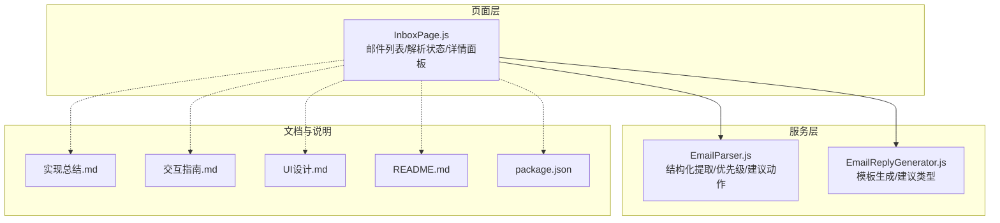
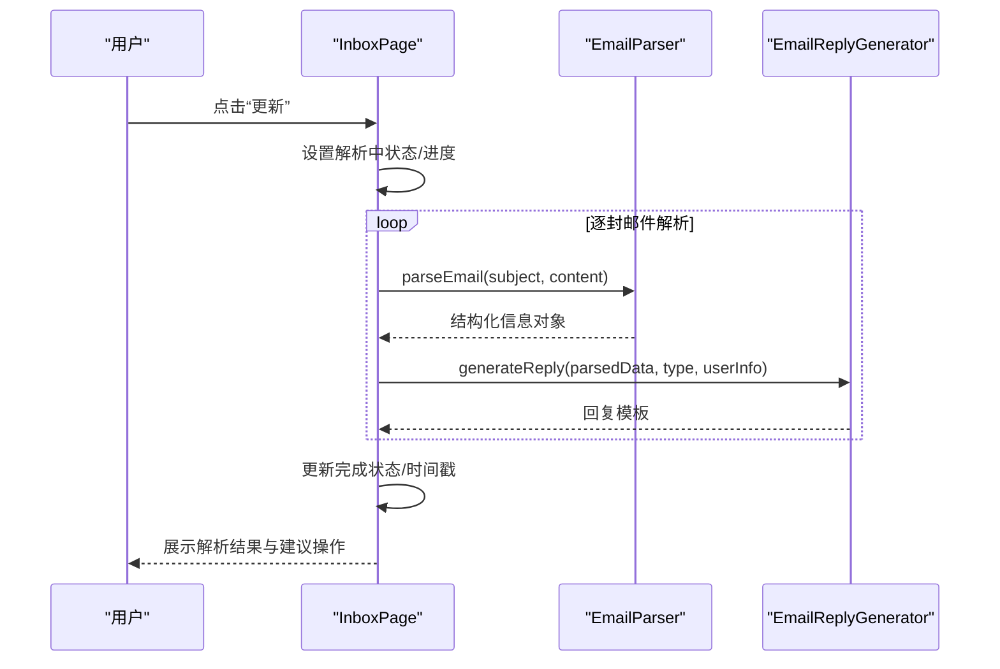
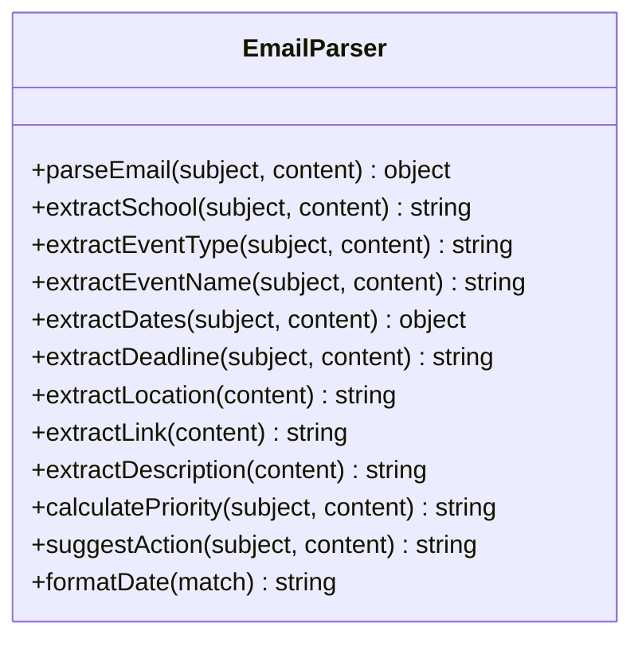
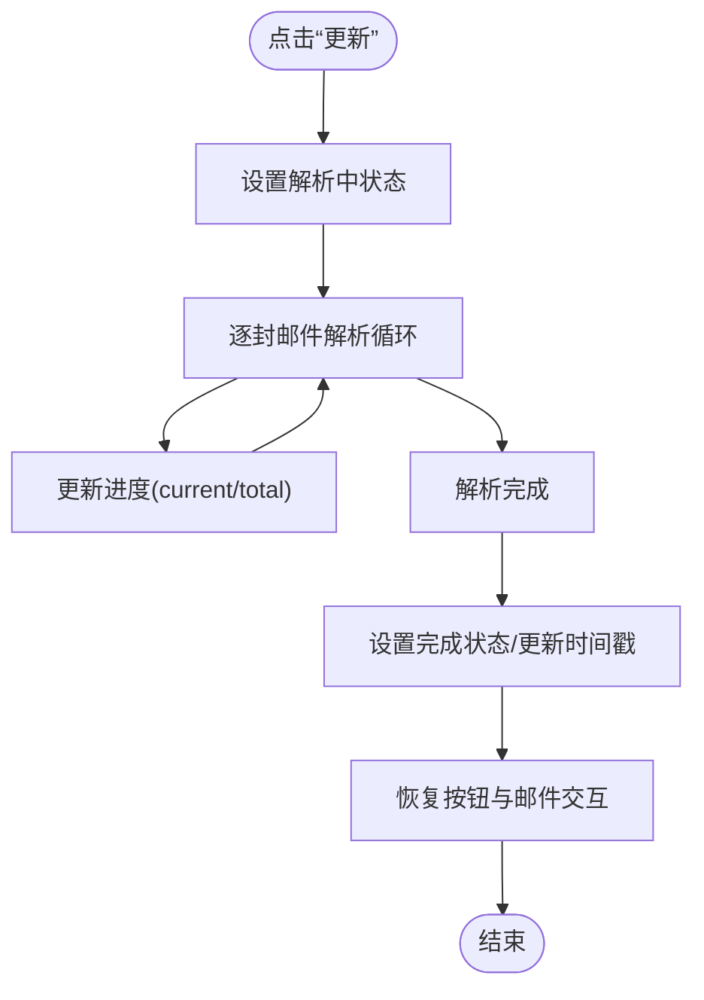
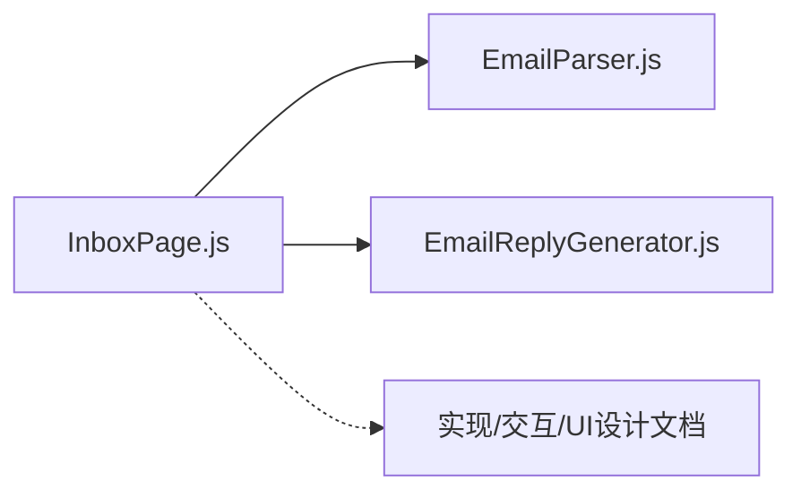

# 邮件解析服务

<cite>
**本文引用的文件**
- [EmailParser.js](file://src/services/EmailParser.js)
- [InboxPage.js](file://src/pages/InboxPage.js)
- [EmailReplyGenerator.js](file://src/services/EmailReplyGenerator.js)
- [README.md](file://README.md)
- [EMAIL_PARSE_IMPLEMENTATION_SUMMARY.md](file://EMAIL_PARSE_IMPLEMENTATION_SUMMARY.md)
- [EMAIL_PARSE_INTERACTION_GUIDE.md](file://EMAIL_PARSE_INTERACTION_GUIDE.md)
- [EMAIL_PARSE_UI_DESIGN.md](file://EMAIL_PARSE_UI_DESIGN.md)
- [package.json](file://package.json)
</cite>

## 目录
1. [简介](#简介)
2. [项目结构](#项目结构)
3. [核心组件](#核心组件)
4. [架构总览](#架构总览)
5. [详细组件分析](#详细组件分析)
6. [依赖关系分析](#依赖关系分析)
7. [性能考量](#性能考量)
8. [故障排查指南](#故障排查指南)
9. [结论](#结论)
10. [附录](#附录)

## 简介
本文件为“邮件解析服务”的技术文档，围绕 EmailParser 类的设计架构与实现原理进行深入剖析，涵盖邮件结构化提取算法、关键信息识别机制、优先级计算逻辑、内容解析流程、数据清洗与标准化处理、异常情况处理策略、模板匹配与自动分类机制、批量处理能力、解析精度优化、性能监控与错误日志记录等技术细节，并提供解析示例、配置参数说明、最佳实践指南与常见问题解决方案。

## 项目结构
本项目采用前端单页应用（React 18）结构，邮件解析服务位于服务层，UI 交互位于页面层，二者通过组件通信协作。核心文件分布如下：
- 服务层：EmailParser.js（解析算法）、EmailReplyGenerator.js（回复模板）
- 页面层：InboxPage.js（邮件列表、解析状态卡片、详情面板）
- 文档：EMAIL_PARSE_IMPLEMENTATION_SUMMARY.md、EMAIL_PARSE_INTERACTION_GUIDE.md、EMAIL_PARSE_UI_DESIGN.md
- 项目说明：README.md、package.json

图表来源
- [InboxPage.js:1-479](file://src/pages/InboxPage.js#L1-L479)
- [EmailParser.js:1-227](file://src/services/EmailParser.js#L1-L227)
- [EmailReplyGenerator.js:1-212](file://src/services/EmailReplyGenerator.js#L1-L212)
- [EMAIL_PARSE_IMPLEMENTATION_SUMMARY.md:1-395](file://EMAIL_PARSE_IMPLEMENTATION_SUMMARY.md#L1-L395)
- [EMAIL_PARSE_INTERACTION_GUIDE.md:1-419](file://EMAIL_PARSE_INTERACTION_GUIDE.md#L1-L419)
- [EMAIL_PARSE_UI_DESIGN.md:1-289](file://EMAIL_PARSE_UI_DESIGN.md#L1-L289)
- [README.md:1-243](file://README.md#L1-L243)
- [package.json:1-41](file://package.json#L1-L41)

章节来源
- [README.md:1-243](file://README.md#L1-L243)
- [package.json:1-41](file://package.json#L1-L41)

## 核心组件
- EmailParser：负责从邮件主题与正文提取结构化信息，包括学校、活动类型、活动名称、日期范围、报名截止、地点、报名链接、摘要、优先级、建议操作等。
- InboxPage：承载邮件列表与解析状态卡片，负责触发解析、展示解析进度与完成状态、呈现解析结果与生成回复。
- EmailReplyGenerator：基于解析结果与用户日程，生成不同类型的邮件回复模板，并给出建议回复类型与校验逻辑。

章节来源
- [EmailParser.js:1-227](file://src/services/EmailParser.js#L1-L227)
- [InboxPage.js:1-479](file://src/pages/InboxPage.js#L1-L479)
- [EmailReplyGenerator.js:1-212](file://src/services/EmailReplyGenerator.js#L1-L212)

## 架构总览
邮件解析服务采用“页面层-服务层”分层架构：
- 页面层负责用户交互与状态管理，调用解析服务并渲染结果。
- 服务层封装解析算法与模板生成，提供纯函数式接口，便于测试与复用。
- 文档与设计文件确保实现一致性与可维护性。

图表来源
- [InboxPage.js:82-140](file://src/pages/InboxPage.js#L82-L140)
- [EmailParser.js:12-25](file://src/services/EmailParser.js#L12-L25)
- [EmailReplyGenerator.js:13-23](file://src/services/EmailReplyGenerator.js#L13-L23)

## 详细组件分析

### EmailParser 类设计与实现
EmailParser 采用静态方法封装，提供统一入口 parseEmail，内部通过一系列提取器函数完成结构化信息抽取，并在末尾计算优先级与建议操作。

图表来源
- [EmailParser.js:5-227](file://src/services/EmailParser.js#L5-L227)

#### 解析流程与关键算法
- 结构化入口：parseEmail 将各提取器的结果聚合为统一对象，便于 UI 展示与后续处理。
- 学校识别：通过关键词集合在主题与正文内匹配，命中即返回对应学校，否则返回“未知院校”。
- 活动类型识别：基于关键词映射表，组合主题与正文进行匹配，支持 camp、interview、promotion、seminar、other 等类型。
- 活动名称提取：优先从主题中的特定括号符号中提取，其次按分隔符拆分取首段。
- 日期范围提取：使用正则匹配多种日期格式，提取首个与最后一个日期作为起止日期。
- 报名截止提取：扫描正文行，匹配截止相关关键词并提取日期。
- 地点提取：匹配地点相关关键词所在行，去除关键词后截断长度。
- 报名链接提取：使用 URL 正则匹配，优先返回包含 form/survey/signin 的链接。
- 摘要提取：取前若干行并限制长度。
- 优先级计算：综合“紧急标签”“目标学校”“截止日期接近”等因素，返回 urgent/high/normal。
- 建议操作：根据活动类型返回相应建议文案。
- 日期格式化：对匹配结果进行格式化输出。

章节来源
- [EmailParser.js:12-227](file://src/services/EmailParser.js#L12-L227)

#### 关键信息识别机制
- 关键词匹配：通过预设关键词集合与正则表达式实现高召回与高精度的识别。
- 上下文融合：将主题与正文合并用于类型识别，提升准确性。
- 优先级策略：结合“紧急标签”“目标学校”“截止日期”等多维特征，形成可解释的优先级体系。

章节来源
- [EmailParser.js:28-190](file://src/services/EmailParser.js#L28-L190)

#### 优先级计算逻辑
- 紧急标签优先：若主题包含“紧急/立即”，直接标记为 urgent。
- 目标学校权重：命中重点高校时提升至 high。
- 截止日期权重：若存在截止日期且接近，优先级不低于 urgent。
- 默认 normal：在无紧急与高优触发时返回普通优先级。

章节来源
- [EmailParser.js:166-190](file://src/services/EmailParser.js#L166-L190)

#### 数据清洗与标准化处理
- 文本清理：去除多余空白、截断长度、统一日期格式。
- 结果归一：日期统一为 MM月DD日，地点截断至合理长度，摘要限制字符数。
- 标准化输出：优先返回结构化对象，便于 UI 与后续服务消费。

章节来源
- [EmailParser.js:83-161](file://src/services/EmailParser.js#L83-L161)

#### 异常情况处理策略
- 未命中学校：返回“未知院校”，避免空值传播。
- 未提取到日期/截止/地点/链接：返回 null 或默认值，UI 层做条件渲染。
- 优先级缺失：默认 normal，保证流程稳定。
- 建议操作缺失：返回通用提示，引导用户进一步阅读。

章节来源
- [EmailParser.js:30-43](file://src/services/EmailParser.js#L30-L43)
- [EmailParser.js:83-114](file://src/services/EmailParser.js#L83-L114)
- [EmailParser.js:195-207](file://src/services/EmailParser.js#L195-L207)

#### 邮件模板匹配与自动分类
- 模板匹配：通过关键词集合与正则表达式实现模板级匹配，覆盖夏令营、面试、推免、讲座等场景。
- 自动分类：结合主题与正文关键词，自动标注 eventType，便于 UI 分类与后续处理。

章节来源
- [EmailParser.js:48-66](file://src/services/EmailParser.js#L48-L66)

#### 批量处理能力
- 逐封解析：InboxPage 提供模拟批量解析流程，逐封邮件更新进度，最终汇总完成状态。
- 并发策略：当前实现为串行逐封，便于 UI 进度反馈；可扩展为并发以提升吞吐量。

章节来源
- [InboxPage.js:127-140](file://src/pages/InboxPage.js#L127-L140)
- [EMAIL_PARSE_IMPLEMENTATION_SUMMARY.md:27-36](file://EMAIL_PARSE_IMPLEMENTATION_SUMMARY.md#L27-L36)

### InboxPage 页面与解析状态卡片
InboxPage 负责：
- 状态管理：isParsingEmails、parseProgress、lastParseTime 等。
- 触发解析：handleRefreshEmails 模拟逐封解析，更新进度。
- 展示解析结果：解析完成后在详情面板展示结构化信息与建议操作。
- 禁用交互：解析中禁用按钮与邮件卡片，避免误操作。

图表来源
- [InboxPage.js:127-140](file://src/pages/InboxPage.js#L127-L140)
- [EMAIL_PARSE_UI_DESIGN.md:129-154](file://EMAIL_PARSE_UI_DESIGN.md#L129-L154)

章节来源
- [InboxPage.js:61-140](file://src/pages/InboxPage.js#L61-L140)
- [EMAIL_PARSE_UI_DESIGN.md:174-216](file://EMAIL_PARSE_UI_DESIGN.md#L174-L216)

### EmailReplyGenerator 模板生成与建议
- 模板类型：确认参加、委婉拒绝、时间协商、咨询问题。
- 建议类型：基于解析结果与用户日程冲突判断，优先高优先级与紧急类型。
- 校验逻辑：检查主题、正文长度与占位符，确保回复质量。

章节来源
- [EmailReplyGenerator.js:13-23](file://src/services/EmailReplyGenerator.js#L13-L23)
- [EmailReplyGenerator.js:148-183](file://src/services/EmailReplyGenerator.js#L148-L183)
- [EmailReplyGenerator.js:188-208](file://src/services/EmailReplyGenerator.js#L188-L208)

## 依赖关系分析
- EmailParser 仅依赖字符串处理与正则表达式，无外部依赖，便于单元测试与迁移。
- InboxPage 依赖 EmailParser 与 EmailReplyGenerator，负责状态管理与 UI 渲染。
- 文档与设计文件为实现提供约束与一致性保障。

图表来源
- [InboxPage.js:4-5](file://src/pages/InboxPage.js#L4-L5)
- [EmailParser.js:1-3](file://src/services/EmailParser.js#L1-L3)
- [EmailReplyGenerator.js:1-3](file://src/services/EmailReplyGenerator.js#L1-L3)

章节来源
- [InboxPage.js:1-7](file://src/pages/InboxPage.js#L1-L7)
- [EmailParser.js:1-3](file://src/services/EmailParser.js#L1-L3)
- [EmailReplyGenerator.js:1-3](file://src/services/EmailReplyGenerator.js#L1-L3)

## 性能考量
- 解析性能：逐封解析的总时延约为 N×600ms（N 为邮件数量），UI 进度反馈良好。
- CSS 动画：使用 @keyframes 与 will-change 优化，保证 60fps 流畅度。
- 状态切换：解析中禁用交互，解析完成恢复，避免重复请求与状态混乱。
- 可扩展性：当前为串行解析，可扩展为并发解析以提升吞吐量；同时保留进度反馈。

章节来源
- [EMAIL_PARSE_IMPLEMENTATION_SUMMARY.md:130-137](file://EMAIL_PARSE_IMPLEMENTATION_SUMMARY.md#L130-L137)
- [EMAIL_PARSE_INTERACTION_GUIDE.md:327-336](file://EMAIL_PARSE_INTERACTION_GUIDE.md#L327-L336)

## 故障排查指南
- 进度条不显示：检查 parseProgress 状态与 isParsingEmails 状态是否同步。
- 动画卡顿：降低其他页面动画或升级浏览器；确认 CSS 动画未被禁用。
- 按钮无响应：清除缓存后重载页面；检查 isParsingEmails 状态是否正确。
- 时间戳错误：检查系统时间设置；确认 lastParseTime 更新逻辑。
- 邮件卡片不禁用：确认解析中状态逻辑与 UI 禁用样式生效。

章节来源
- [EMAIL_PARSE_IMPLEMENTATION_SUMMARY.md:356-365](file://EMAIL_PARSE_IMPLEMENTATION_SUMMARY.md#L356-L365)
- [EMAIL_PARSE_INTERACTION_GUIDE.md:372-394](file://EMAIL_PARSE_INTERACTION_GUIDE.md#L372-L394)

## 结论
EmailParser 以简洁稳定的静态方法封装实现了邮件结构化提取，结合 InboxPage 的状态管理与 UI 卡片，提供了良好的用户体验与可扩展性。通过关键词匹配、正则提取与优先级策略，系统能够在保研场景下高效识别关键信息并给出建议操作。未来可在并发解析、错误恢复、历史记录与 AI 学习反馈等方面持续演进。

## 附录

### 邮件解析示例
- 输入：主题与正文（示例见页面中的 emailSamples）
- 输出：结构化对象（学校、活动类型、活动名称、日期范围、报名截止、地点、报名链接、摘要、优先级、建议操作）

章节来源
- [InboxPage.js:7-52](file://src/pages/InboxPage.js#L7-L52)
- [EmailParser.js:12-25](file://src/services/EmailParser.js#L12-L25)

### 配置参数说明
- 环境变量（后端侧，非前端解析服务）：DATABASE_URL、JWT_SECRET、AI_BASE_URL、AI_API_KEY、AI_MODEL、AI_MAX_STEPS、PORT
- 前端依赖：React 18、react-router-dom、react-markdown、remark-gfm、@icon-park/react、openai、pdfjs-dist、@amap/amap-jsapi-loader

章节来源
- [README.md:117-134](file://README.md#L117-L134)
- [package.json:5-16](file://package.json#L5-L16)

### 最佳实践指南
- 关键词维护：定期更新学校与活动类型关键词，提升识别准确率。
- 正则健壮性：对日期与链接正则进行边界测试，避免误匹配。
- UI 一致性：遵循 UI 设计文档的颜色、动画与交互规范。
- 错误处理：在解析失败时提供重试与提示，保持用户可控。
- 性能优化：在保证进度反馈的前提下，逐步引入并发解析与缓存策略。

章节来源
- [EMAIL_PARSE_UI_DESIGN.md:174-216](file://EMAIL_PARSE_UI_DESIGN.md#L174-L216)
- [EMAIL_PARSE_IMPLEMENTATION_SUMMARY.md:271-287](file://EMAIL_PARSE_IMPLEMENTATION_SUMMARY.md#L271-L287)