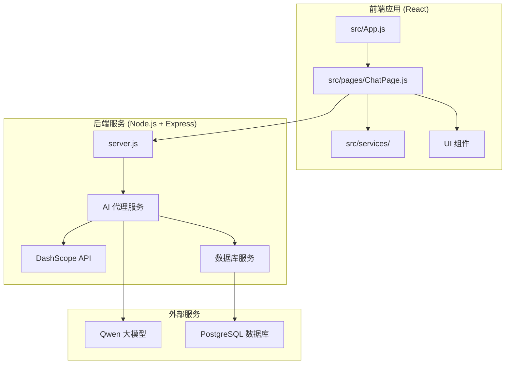
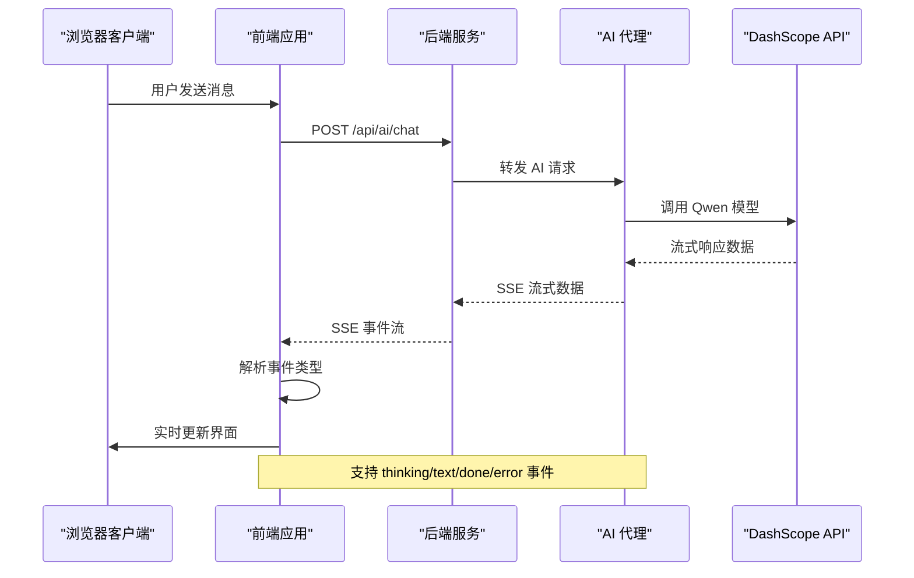
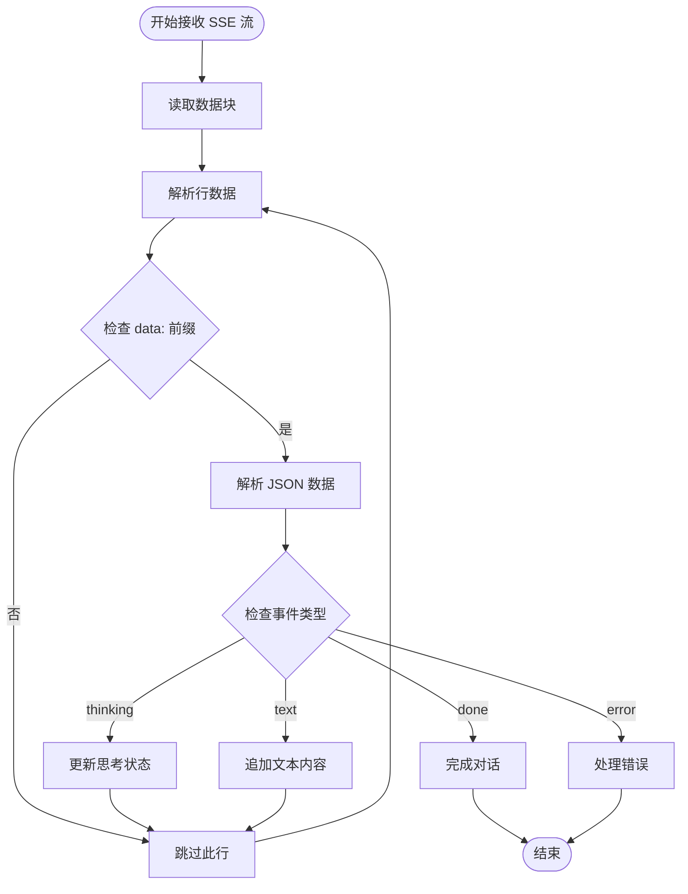
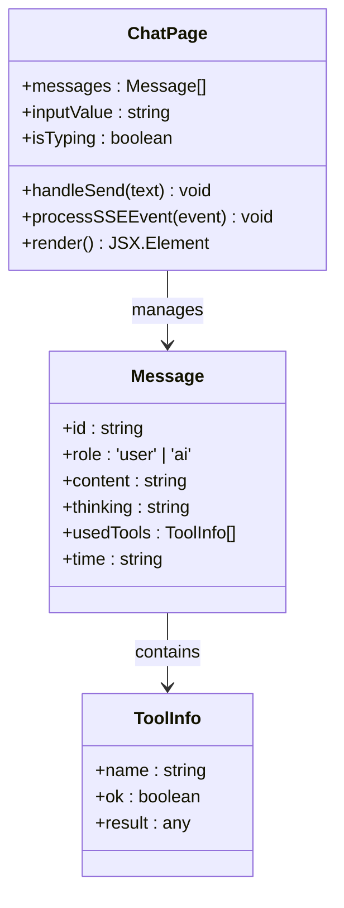
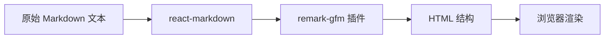
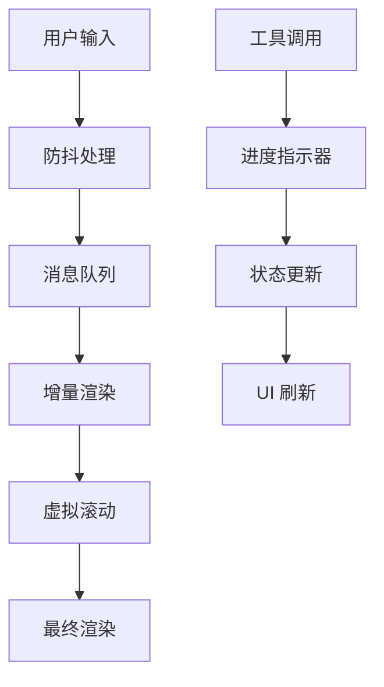
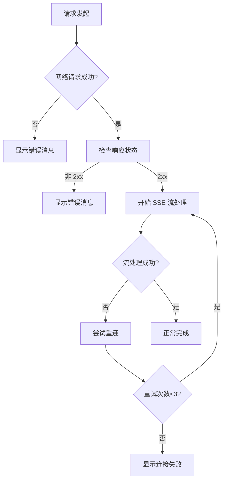

# AI 对话 API

<cite>
**本文档引用的文件**
- [README.md](file://README.md)
- [package.json](file://package.json)
- [src/App.js](file://src/App.js)
- [src/pages/ChatPage.js](file://src/pages/ChatPage.js)
</cite>

## 目录
1. [简介](#简介)
2. [项目结构](#项目结构)
3. [核心组件](#核心组件)
4. [架构总览](#架构总览)
5. [详细组件分析](#详细组件分析)
6. [依赖关系分析](#依赖关系分析)
7. [性能考虑](#性能考虑)
8. [故障排除指南](#故障排除指南)
9. [结论](#结论)

## 简介

漫旅（ManLv）是一款面向保研生的 AI 驱动一站式行程伴旅助手。本项目专注于 AI 对话功能，通过流式输出协议为用户提供实时的智能对话体验。

**核心特性：**
- 真实 AI 对话：接入 Qwen 大模型（DashScope），支持流式输出，回复逐字实时显示
- 工具调用可视化：AI 调用工具时展示「🔍 正在查询...」思考过程
- Markdown 渲染：支持标题、加粗、列表、表格等富文本格式
- 模拟面试：专项模拟面试，实时 AI 提问与反馈

## 项目结构

基于现有代码库，项目采用前后端分离架构：



**图表来源**
- [src/App.js:1-177](file://src/App.js#L1-L177)
- [src/pages/ChatPage.js:1-482](file://src/pages/ChatPage.js#L1-L482)

**章节来源**
- [README.md:146-171](file://README.md#L146-L171)
- [package.json:1-41](file://package.json#L1-L41)

## 核心组件

### AI 对话页面组件

ChatPage.js 实现了完整的 AI 对话功能，包括：

- **消息管理**：用户消息和 AI 回复的状态管理
- **流式处理**：Server-Sent Events (SSE) 的实时流式处理
- **Markdown 渲染**：使用 react-markdown 和 remark-gfm 插件
- **工具调用显示**：实时展示 AI 的思考过程

### 应用外壳组件

App.js 提供了全局的应用布局和状态管理：

- **浮动助手**：可最小化的 AI 助手窗口
- **路由管理**：基于 React Router 的页面导航
- **状态同步**：用户登录状态和消息同步

**章节来源**
- [src/pages/ChatPage.js:1-482](file://src/pages/ChatPage.js#L1-L482)
- [src/App.js:1-177](file://src/App.js#L1-L177)

## 架构总览

AI 对话系统的整体架构如下：



**图表来源**
- [src/pages/ChatPage.js:199-271](file://src/pages/ChatPage.js#L199-L271)
- [README.md:186-195](file://README.md#L186-L195)

## 详细组件分析

### SSE 流式输出协议

系统实现了标准的 Server-Sent Events 协议，支持四种事件类型：

#### 事件类型定义

| 事件类型 | 数据结构 | 用途 | 示例 |
|---------|---------|------|------|
| `thinking` | `{ type: "thinking", tool: string }` | 显示 AI 思考过程 | `{"type":"thinking","tool":"analyze_schedule_conflicts"}` |
| `text` | `{ type: "text", content: string }` | 流式文本输出 | `{"type":"text","content":"正在分析..."}` |
| `done` | `{ type: "done", usedTools: ToolInfo[] }` | 对话完成标记 | `{"type":"done","usedTools":[...]}` |
| `error` | `{ type: "error", message: string }` | 错误处理 | `{"type":"error","message":"网络超时"}` |

#### 客户端处理流程



**图表来源**
- [src/pages/ChatPage.js:213-271](file://src/pages/ChatPage.js#L213-L271)

#### 事件处理实现

前端使用现代浏览器的 ReadableStream API 来处理 SSE 流：



**图表来源**
- [src/pages/ChatPage.js:185-285](file://src/pages/ChatPage.js#L185-L285)

**章节来源**
- [src/pages/ChatPage.js:199-285](file://src/pages/ChatPage.js#L199-L285)
- [README.md:186-195](file://README.md#L186-L195)

### Markdown 渲染系统

系统集成了强大的 Markdown 渲染功能：

#### 支持的 Markdown 特性

- **标题**：`# H1`, `## H2`, `### H3`
- **加粗**：`**粗体文本**`
- **斜体**：`*斜体文本*`
- **列表**：有序和无序列表
- **表格**：标准表格语法
- **代码**：行内代码和代码块

#### 渲染实现



**图表来源**
- [src/pages/ChatPage.js:384-386](file://src/pages/ChatPage.js#L384-L386)

**章节来源**
- [src/pages/ChatPage.js:384-386](file://src/pages/ChatPage.js#L384-L386)

### 工具调用系统

AI 可以调用多种内置工具来增强对话能力：

| 工具名称 | 功能描述 | 使用场景 |
|---------|---------|---------|
| `get_user_profile` | 获取用户基础资料 | 个性化回复 |
| `list_interviews` | 查询面试安排列表 | 行程分析 |
| `create_interview` | 创建新面试记录 | 新增行程 |
| `analyze_schedule_conflicts` | 分析行程冲突 | 冲突解决 |
| `get_weather` | 查询天气信息 | 出行建议 |

**章节来源**
- [README.md:197-205](file://README.md#L197-L205)
- [src/pages/ChatPage.js:227-242](file://src/pages/ChatPage.js#L227-L242)

## 依赖关系分析

### 前端依赖

项目使用现代化的前端技术栈：

```mermaid
graph TB
subgraph "核心框架"
A[React 18] --> B[React Router DOM 6]
end
subgraph "Markdown 处理"
C[react-markdown] --> D[remark-gfm]
end
subgraph "第三方库"
E[@icon-park/react] --> F[图标组件]
G[pdfjs-dist] --> H[PDF 处理]
end
subgraph "AI 集成"
I[openai] --> J[OpenAI 兼容]
end
```

**图表来源**
- [package.json:5-16](file://package.json#L5-L16)

### 环境配置

系统支持多种运行环境：

| 环境变量 | 默认值 | 用途 |
|---------|--------|------|
| `REACT_APP_API_BASE_URL` | `http://localhost:3001` | API 服务器地址 |
| `NODE_ENV` | `development` | 运行环境 |
| `PORT` | `3000` | 开发服务器端口 |

**章节来源**
- [package.json:17-22](file://package.json#L17-L22)
- [README.md:117-134](file://README.md#L117-L134)

## 性能考虑

### 流式传输优化

1. **增量渲染**：使用流式处理避免大文本一次性渲染
2. **内存管理**：及时清理已完成的消息和工具调用状态
3. **防抖处理**：输入框自动调整高度，减少重排

### 前端性能优化



### 最佳实践建议

1. **合理使用缓存**：对常用查询结果进行缓存
2. **错误边界处理**：实现完善的错误捕获和恢复机制
3. **连接管理**：实现自动重连和心跳检测
4. **资源优化**：压缩图片和静态资源

## 故障排除指南

### 常见问题及解决方案

#### SSE 连接问题

**症状**：无法接收流式响应
**原因**：CORS 配置或网络问题
**解决方案**：
1. 检查 API 服务器的 CORS 配置
2. 确认网络连接正常
3. 查看浏览器开发者工具中的网络面板

#### 事件解析错误

**症状**：控制台出现 JSON 解析错误
**原因**：服务器返回格式不正确
**解决方案**：
1. 验证服务器端事件格式
2. 添加适当的错误处理逻辑
3. 实现事件重试机制

#### Markdown 渲染问题

**症状**：Markdown 格式显示异常
**原因**：插件配置或内容格式问题
**解决方案**：
1. 检查 remark-gfm 插件版本
2. 验证 Markdown 内容格式
3. 实现内容过滤和转义

**章节来源**
- [src/pages/ChatPage.js:267-285](file://src/pages/ChatPage.js#L267-L285)

### 错误恢复机制

系统实现了多层次的错误处理：



## 结论

漫旅 AI 对话系统提供了完整的流式对话体验，通过 SSE 协议实现了实时的 AI 交互。系统具有良好的扩展性，支持多种工具调用和丰富的 Markdown 渲染功能。

**主要优势：**
- 实时流式输出，用户体验优秀
- 完整的错误处理和恢复机制
- 强大的 Markdown 渲染能力
- 模块化的架构设计

**未来发展：**
- 增强对话上下文管理
- 优化工具调用性能
- 扩展 AI 模型支持
- 加强安全性和权限控制