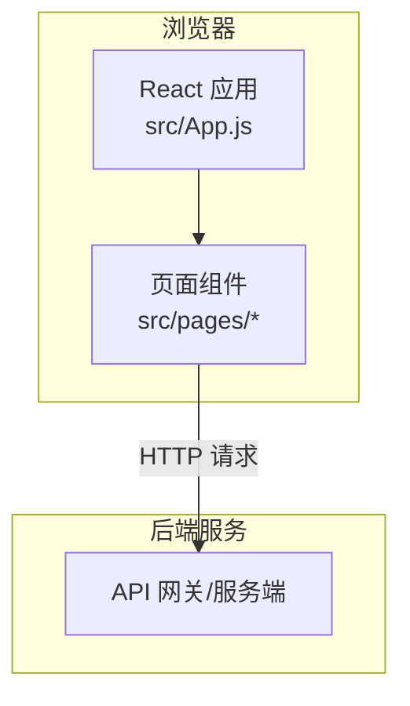
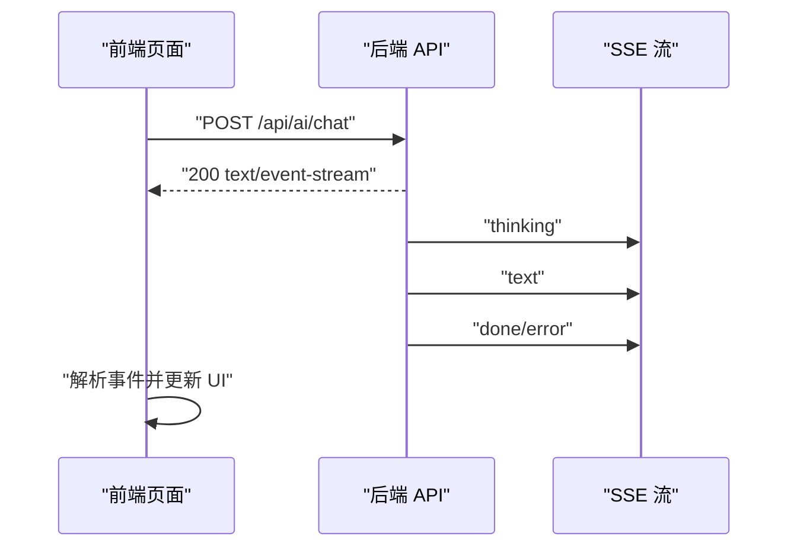
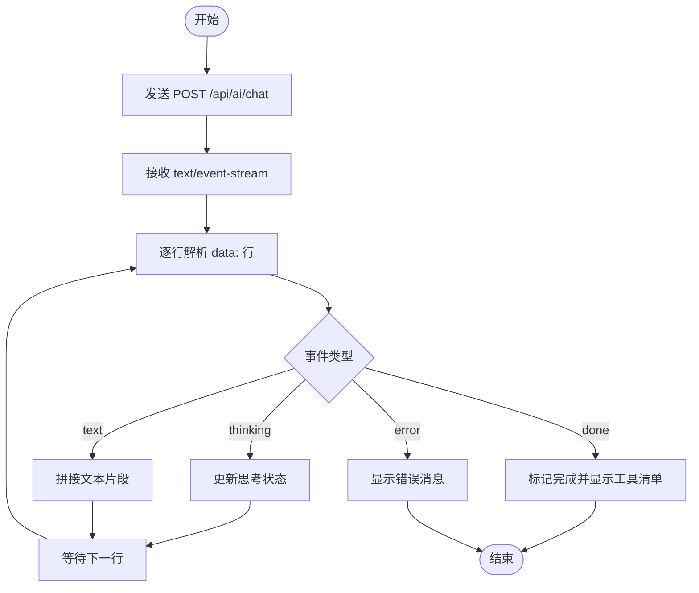
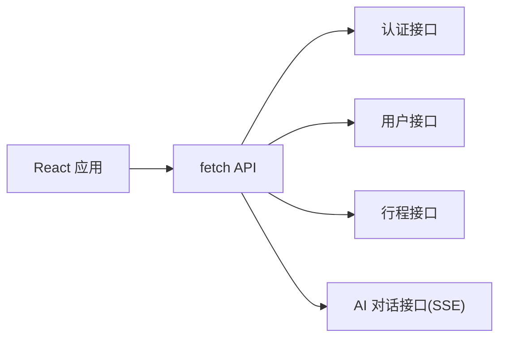

# API 接口文档

<cite>
**本文档引用的文件**
- [README.md](file://README.md)
- [package.json](file://package.json)
- [src/App.js](file://src/App.js)
- [src/pages/AuthPage.js](file://src/pages/AuthPage.js)
- [src/pages/ChatPage.js](file://src/pages/ChatPage.js)
- [src/pages/HomePage.js](file://src/pages/HomePage.js)
- [src/pages/ProfilePage.js](file://src/pages/ProfilePage.js)
- [src/pages/SchedulePage.js](file://src/pages/SchedulePage.js)
</cite>

## 目录
1. [简介](#简介)
2. [项目结构](#项目结构)
3. [核心组件](#核心组件)
4. [架构总览](#架构总览)
5. [详细组件分析](#详细组件分析)
6. [依赖分析](#依赖分析)
7. [性能考虑](#性能考虑)
8. [故障排除指南](#故障排除指南)
9. [结论](#结论)
10. [附录](#附录)

## 简介
本项目为“漫旅 ManLv”的前端部分，提供保研生的 AI 智能助手、行程管理、情景学习等功能。本文档聚焦于前端通过 HTTP 调用后端 API 的接口行为，涵盖认证、用户信息、行程管理以及 AI 对话（SSE 流式输出）等接口的调用方式与协议细节，帮助客户端开发者准确集成。

## 项目结构
前端采用 React + React Router 架构，页面通过 fetch 发起 API 请求，统一通过本地存储的令牌进行鉴权。后端服务默认监听本地端口，前端通过环境变量或硬编码地址访问后端。

图表来源
- [src/App.js:1-177](file://src/App.js#L1-L177)
- [src/pages/AuthPage.js:1-732](file://src/pages/AuthPage.js#L1-L732)
- [src/pages/ChatPage.js:1-482](file://src/pages/ChatPage.js#L1-L482)
- [src/pages/SchedulePage.js:1-423](file://src/pages/SchedulePage.js#L1-L423)

章节来源
- [src/App.js:1-177](file://src/App.js#L1-L177)
- [package.json:1-41](file://package.json#L1-L41)

## 核心组件
- 认证页面：负责注册、登录、忘记密码等流程，调用后端认证接口并保存令牌。
- 聊天页面：发起 AI 对话请求，消费 SSE 流式输出，渲染思考过程与最终结果。
- 行程页面：管理面试安排，调用后端行程接口并支持生成与应用 AI 规划方案。
- 个人中心：获取与更新用户信息，支持修改姓名、邮箱、密码、专业方向等。
- 首页：展示用户信息、快捷入口与 AI 提示。

章节来源
- [src/pages/AuthPage.js:86-211](file://src/pages/AuthPage.js#L86-L211)
- [src/pages/ChatPage.js:133-285](file://src/pages/ChatPage.js#L133-L285)
- [src/pages/SchedulePage.js:29-139](file://src/pages/SchedulePage.js#L29-L139)
- [src/pages/ProfilePage.js:42-102](file://src/pages/ProfilePage.js#L42-L102)
- [src/pages/HomePage.js:21-36](file://src/pages/HomePage.js#L21-L36)

## 架构总览
前端通过 fetch 发送 HTTP 请求到后端，使用 Bearer Token 进行鉴权。AI 对话采用 Server-Sent Events（SSE）以流式方式返回事件，前端逐行解析 data: 行并根据事件类型更新 UI。

图表来源
- [src/pages/ChatPage.js:199-271](file://src/pages/ChatPage.js#L199-L271)
- [README.md:186-195](file://README.md#L186-L195)

章节来源
- [src/pages/ChatPage.js:199-271](file://src/pages/ChatPage.js#L199-L271)
- [README.md:186-195](file://README.md#L186-L195)

## 详细组件分析

### 认证 API
- 注册
  - 方法与路径：POST /api/auth/register
  - 请求头：Content-Type: application/json
  - 请求体字段：email, password, name
  - 成功响应：token, user
  - 失败响应：error
- 登录
  - 方法与路径：POST /api/auth/login
  - 请求头：Content-Type: application/json
  - 请求体字段：email, password
  - 成功响应：token, user
  - 失败响应：error
- 忘记密码（预留）
  - 方法与路径：POST /api/auth/reset-password
  - 请求头：Content-Type: application/json
  - 请求体字段：email, code, newPassword
  - 成功响应：无特定字段
  - 失败响应：error

章节来源
- [src/pages/AuthPage.js:96-121](file://src/pages/AuthPage.js#L96-L121)
- [src/pages/AuthPage.js:147-170](file://src/pages/AuthPage.js#L147-L170)
- [src/pages/AuthPage.js:172-211](file://src/pages/AuthPage.js#L172-L211)
- [README.md:174-184](file://README.md#L174-L184)

### 用户信息 API
- 获取用户信息
  - 方法与路径：GET /api/user
  - 请求头：Authorization: Bearer <token>
  - 成功响应：用户对象
  - 失败响应：无特定字段
- 更新用户资料
  - 方法与路径：PUT /api/user
  - 请求头：Content-Type: application/json, Authorization: Bearer <token>
  - 请求体字段：name, email, password, major（任选其一）
  - 成功响应：user
  - 失败响应：error

章节来源
- [src/pages/HomePage.js:21-36](file://src/pages/HomePage.js#L21-L36)
- [src/pages/ProfilePage.js:71-102](file://src/pages/ProfilePage.js#L71-L102)

### 行程管理 API
- 获取面试列表
  - 方法与路径：GET /api/interviews
  - 请求头：Authorization: Bearer <token>
  - 成功响应：面试数组
  - 失败响应：无特定字段
- 新增面试安排
  - 方法与路径：POST /api/interviews
  - 请求头：Content-Type: application/json, Authorization: Bearer <token>
  - 请求体字段：school, major, city, type, date
  - 成功响应：无特定字段
  - 失败响应：error
- 删除面试安排
  - 方法与路径：DELETE /api/interviews/{id}
  - 请求头：Authorization: Bearer <token>
  - 成功响应：无特定字段
  - 失败响应：无特定字段
- 生成行程规划（预留）
  - 方法与路径：POST /api/trips/generate
  - 请求头：Authorization: Bearer <token>
  - 成功响应：规划方案数组
  - 失败响应：无特定字段
- 应用行程规划（预留）
  - 方法与路径：POST /api/trips/save
  - 请求头：Content-Type: application/json, Authorization: Bearer <token>
  - 请求体字段：规划方案对象
  - 成功响应：无特定字段
  - 失败响应：无特定字段

章节来源
- [src/pages/SchedulePage.js:29-94](file://src/pages/SchedulePage.js#L29-L94)
- [src/pages/SchedulePage.js:96-139](file://src/pages/SchedulePage.js#L96-L139)
- [README.md:174-184](file://README.md#L174-L184)

### AI 对话 API（SSE）
- 端点：POST /api/ai/chat
- 请求头：Content-Type: application/json, Authorization: Bearer <token>
- 请求体字段：message
- 响应：text/event-stream，事件类型如下：
  - thinking：表示工具调用中，字段包含 tool
  - text：流式文本片段，字段包含 content
  - done：对话结束，字段包含 usedTools
  - error：错误，字段包含 message
- 前端解析逻辑：逐行读取 data: 开头的行，解析 JSON 并更新 UI

图表来源
- [src/pages/ChatPage.js:199-271](file://src/pages/ChatPage.js#L199-L271)
- [README.md:186-195](file://README.md#L186-L195)

章节来源
- [src/pages/ChatPage.js:133-285](file://src/pages/ChatPage.js#L133-L285)
- [README.md:186-195](file://README.md#L186-L195)

## 依赖分析
- 前端依赖：React、react-router-dom、react-markdown、remark-gfm、@icon-park/react 等。
- 前端与后端通信：通过 fetch 使用 JSON 与 SSE 协议。
- 鉴权：localStorage 中存储 token，请求头携带 Authorization: Bearer <token>。

图表来源
- [package.json:5-16](file://package.json#L5-L16)
- [src/pages/AuthPage.js:96-170](file://src/pages/AuthPage.js#L96-L170)
- [src/pages/ChatPage.js:199-271](file://src/pages/ChatPage.js#L199-L271)
- [src/pages/SchedulePage.js:29-139](file://src/pages/SchedulePage.js#L29-L139)
- [src/pages/ProfilePage.js:42-102](file://src/pages/ProfilePage.js#L42-L102)

章节来源
- [package.json:1-41](file://package.json#L1-L41)

## 性能考虑
- SSE 流式渲染：前端逐行解析事件，避免一次性加载大量数据，提升交互流畅性。
- 令牌缓存：前端在本地存储 token，减少重复登录带来的往返开销。
- 请求合并：在聊天界面中，同一轮对话仅发送一次请求，避免重复触发。

## 故障排除指南
- 登录失败：检查请求体字段 email 与 password 是否正确，后端返回 error 字段描述原因。
- 未授权访问：确认 Authorization 头是否包含有效的 Bearer token。
- SSE 解析异常：确保服务端返回的事件行以 data: 开头，JSON 格式正确。
- 网络错误：前端捕获异常并提示“网络错误，请稍后重试”。

章节来源
- [src/pages/AuthPage.js:104-121](file://src/pages/AuthPage.js#L104-L121)
- [src/pages/ChatPage.js:272-285](file://src/pages/ChatPage.js#L272-L285)
- [src/pages/SchedulePage.js:74-77](file://src/pages/SchedulePage.js#L74-L77)

## 结论
本文档梳理了前端侧对后端 API 的调用方式与协议细节，明确了认证、用户信息、行程管理与 AI 对话（SSE）的关键交互流程。建议在生产环境中补充后端鉴权中间件、速率限制与错误日志记录，以提升安全性与可观测性。

## 附录
- 环境变量：前端通过 REACT_APP_API_BASE_URL 或硬编码地址访问后端，默认本地 3001 端口。
- 速率限制与版本管理：当前前端未实现速率限制与 API 版本控制，建议在后端引入限流与版本前缀（如 /api/v1）。

章节来源
- [src/pages/ChatPage.js:12](file://src/pages/ChatPage.js#L12)
- [README.md:117-142](file://README.md#L117-L142)