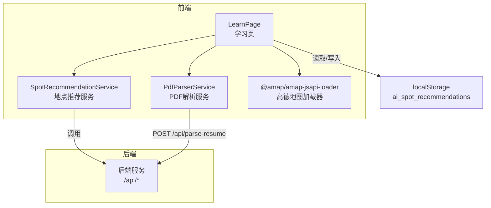
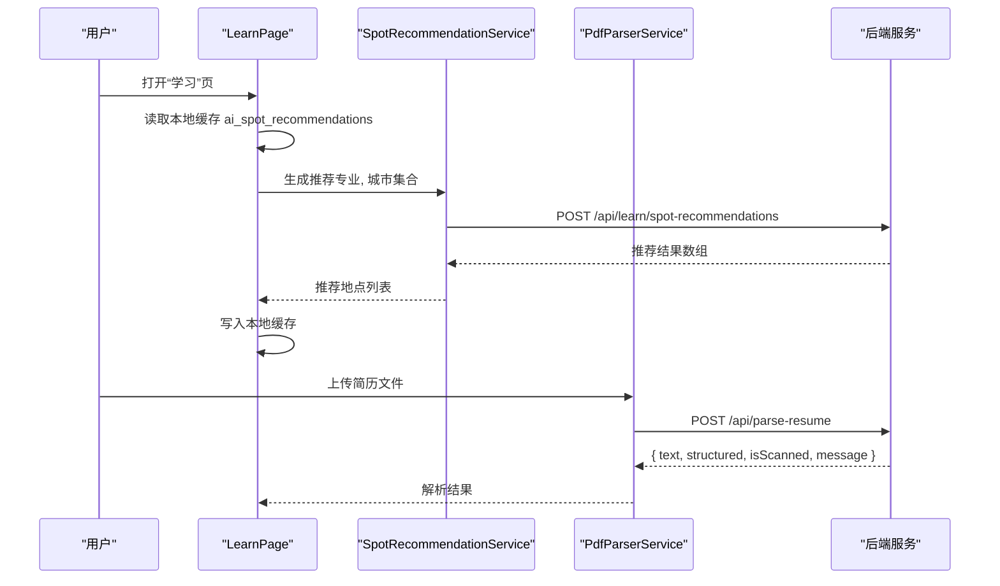
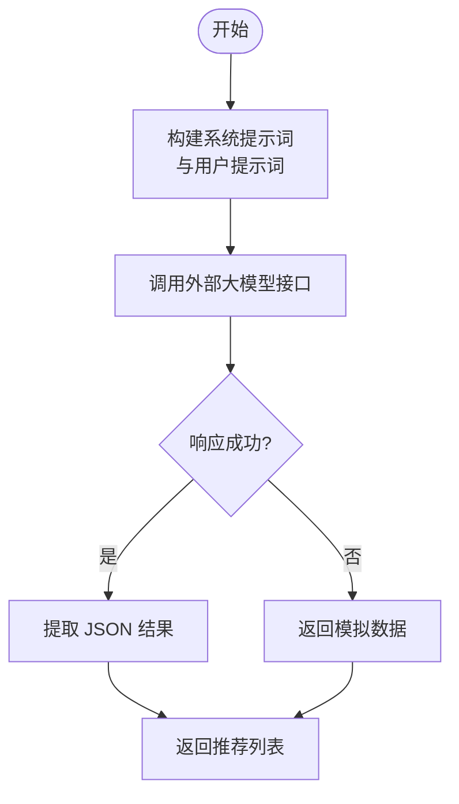
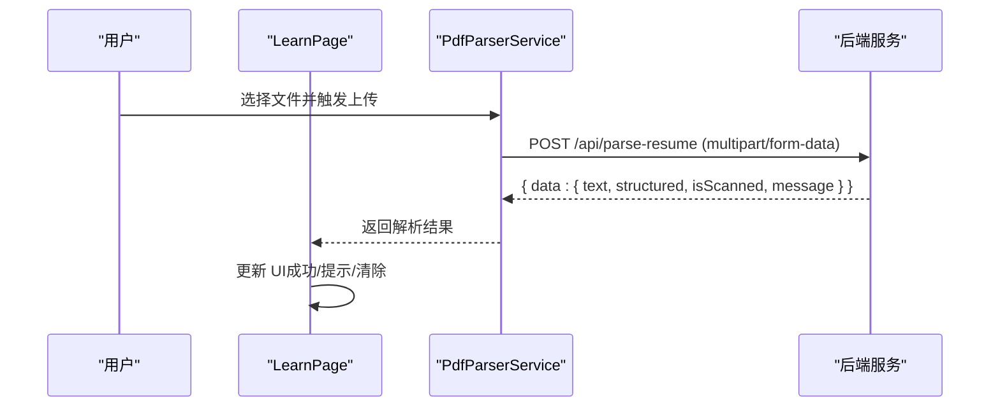
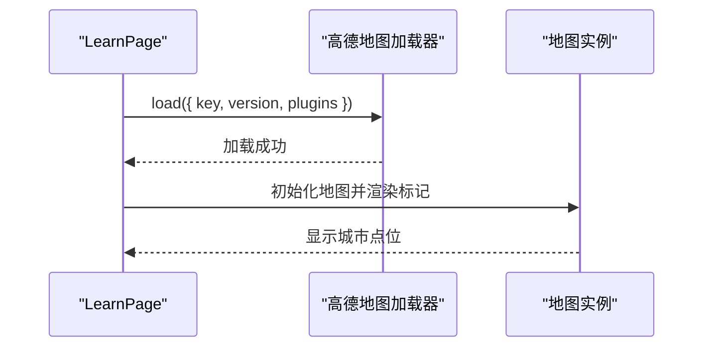
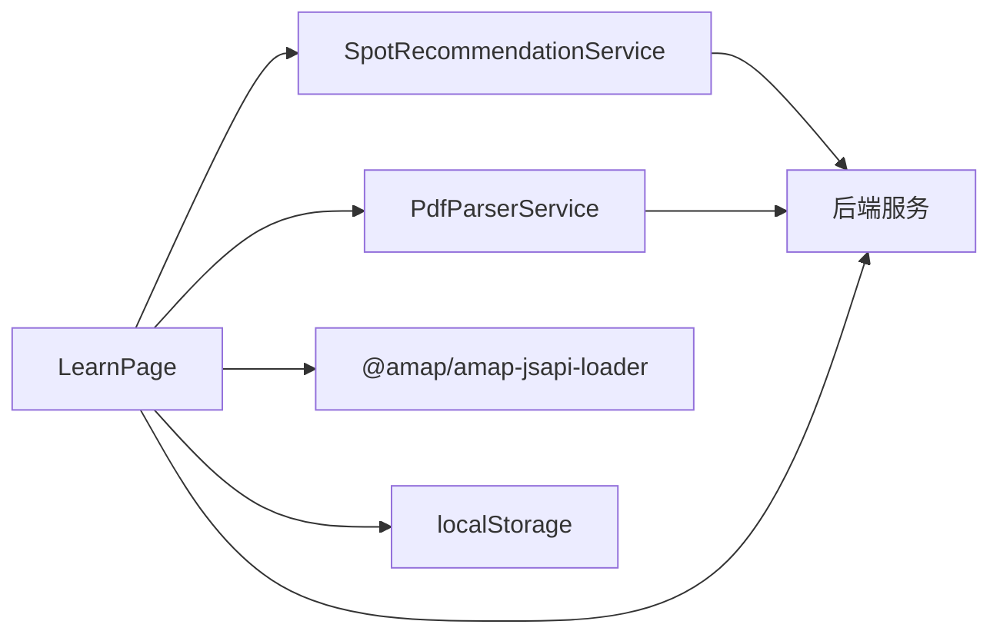

# 学习功能 API

<cite>
**本文引用的文件**
- [LearnPage.js](file://src/pages/LearnPage.js)
- [SpotRecommendationService.js](file://src/services/SpotRecommendationService.js)
- [PdfParserService.js](file://src/services/PdfParserService.js)
- [README.md](file://README.md)
- [App.js](file://src/App.js)
</cite>

## 目录
1. [简介](#简介)
2. [项目结构](#项目结构)
3. [核心组件](#核心组件)
4. [架构总览](#架构总览)
5. [详细组件分析](#详细组件分析)
6. [依赖关系分析](#依赖关系分析)
7. [性能考虑](#性能考虑)
8. [故障排查指南](#故障排查指南)
9. [结论](#结论)
10. [附录](#附录)

## 简介
本文件聚焦“学习功能”相关的 API 与前端集成，覆盖以下能力：
- 地点推荐：基于用户专业与目标城市，通过大模型生成个性化学习地点建议
- PDF 解析：上传简历（PDF/图片）并解析文本内容
- 城市导览：基于面试城市在地图上展示位置点位

文档同时说明：
- 推荐算法参数、筛选条件与排序规则
- PDF 解析的文件格式、参数与返回结构
- 高德地图 API 的集成方式、密钥管理与配额限制
- 性能优化、缓存策略与离线处理思路
- 个性化推荐实现指南

## 项目结构
前端采用 React + 高德地图 JS API，学习功能位于 LearnPage，配套服务封装在独立模块中。

图表来源
- [LearnPage.js:1-651](file://src/pages/LearnPage.js#L1-L651)
- [SpotRecommendationService.js:1-86](file://src/services/SpotRecommendationService.js#L1-L86)
- [PdfParserService.js:1-97](file://src/services/PdfParserService.js#L1-L97)

章节来源
- [LearnPage.js:1-651](file://src/pages/LearnPage.js#L1-L651)
- [SpotRecommendationService.js:1-86](file://src/services/SpotRecommendationService.js#L1-L86)
- [PdfParserService.js:1-97](file://src/services/PdfParserService.js#L1-L97)

## 核心组件
- 地点推荐服务：封装了调用外部大模型生成推荐的逻辑，包含兜底模拟数据与错误恢复
- PDF 解析服务：封装了简历上传与解析流程，包含格式校验与错误处理
- 学习页：负责 UI 展示、地图初始化、数据联动与缓存读写

章节来源
- [SpotRecommendationService.js:1-86](file://src/services/SpotRecommendationService.js#L1-L86)
- [PdfParserService.js:1-97](file://src/services/PdfParserService.js#L1-L97)
- [LearnPage.js:1-651](file://src/pages/LearnPage.js#L1-L651)

## 架构总览
学习功能的调用链路如下：

图表来源
- [LearnPage.js:116-139](file://src/pages/LearnPage.js#L116-L139)
- [SpotRecommendationService.js:18-66](file://src/services/SpotRecommendationService.js#L18-L66)
- [PdfParserService.js:15-39](file://src/services/PdfParserService.js#L15-L39)

## 详细组件分析

### 地点推荐（GET /api/learn/spot-recommendations）
- 目标：为用户提供“专业 × 城市”的个性化学习地点建议
- 前端调用：当前前端直接调用外部大模型接口，未暴露标准后端路由
- 推荐算法参数（来自前端调用）：
  - 模型：固定模型 ID
  - 系统提示词：包含“专业相关性”“场景适用性”“输出格式”等规则
  - 用户提示词：请求生成 N 个地点
  - 控制参数：max_tokens、temperature
- 地理位置筛选条件：
  - 输入：城市名称字符串
  - 输出：带 city 字段的地点对象数组
- 推荐结果排序规则：
  - 前端未实现显式排序；按大模型输出顺序返回
- 错误处理与兜底：
  - 失败时返回模拟数据（按专业分类）

图表来源
- [SpotRecommendationService.js:18-66](file://src/services/SpotRecommendationService.js#L18-L66)

章节来源
- [SpotRecommendationService.js:1-86](file://src/services/SpotRecommendationService.js#L1-L86)
- [LearnPage.js:116-139](file://src/pages/LearnPage.js#L116-L139)

### PDF 解析（POST /api/parse-resume）
- 目标：解析简历（PDF/图片），返回可读文本与结构化信息
- 前端调用：
  - 上传文件（FormData），携带 Authorization: Bearer token
  - 支持格式：application/pdf、image/jpeg、image/png、image/jpg
- 返回结构（来自前端解析逻辑）：
  - text：提取的纯文本
  - structured：结构化信息（若可用）
  - isScanned：是否扫描版（需人工粘贴）
  - message：提示信息
- 错误处理：
  - 非 2xx 响应抛出错误，包含 error 字段
  - 前端统一 toast 提示

图表来源
- [PdfParserService.js:15-39](file://src/services/PdfParserService.js#L15-L39)
- [LearnPage.js:225-275](file://src/pages/LearnPage.js#L225-L275)

章节来源
- [PdfParserService.js:1-97](file://src/services/PdfParserService.js#L1-L97)
- [LearnPage.js:225-275](file://src/pages/LearnPage.js#L225-L275)

### 城市导览（地图展示）
- 目标：在地图上展示用户的面试城市点位
- 集成方式：
  - 使用高德地图 JS API 加载器，按需引入 Marker、LabelMarker 插件
  - 通过城市坐标映射表定位
- 配置项：
  - Key 与安全密钥在前端页面内配置
  - 若未配置，显示“Key 尚未配置”提示
- 错误处理：
  - 加载超时或失败时显示错误提示与重试按钮

图表来源
- [LearnPage.js:162-223](file://src/pages/LearnPage.js#L162-L223)

章节来源
- [LearnPage.js:1-651](file://src/pages/LearnPage.js#L1-L651)

## 依赖关系分析
- LearnPage 依赖：
  - SpotRecommendationService：生成地点推荐
  - PdfParserService：解析简历
  - 高德地图加载器：地图渲染
  - 本地存储：缓存推荐结果
- 后端依赖：
  - 通过 /api/parse-resume 提供 PDF 解析能力
  - 通过 /api/user、/api/interviews 提供用户与面试数据（用于驱动推荐）

图表来源
- [LearnPage.js:1-651](file://src/pages/LearnPage.js#L1-L651)
- [SpotRecommendationService.js:1-86](file://src/services/SpotRecommendationService.js#L1-L86)
- [PdfParserService.js:1-97](file://src/services/PdfParserService.js#L1-L97)

章节来源
- [LearnPage.js:1-651](file://src/pages/LearnPage.js#L1-L651)
- [README.md:174-206](file://README.md#L174-L206)

## 性能考虑
- 推荐缓存
  - 首次生成后写入 localStorage，后续直接读取，减少重复请求
  - 建议设置过期策略（如 24 小时）并在用户操作时刷新
- 并发控制
  - 生成推荐时避免重复触发（前端已使用状态标志）
  - 建议对城市去重后再请求，避免重复调用
- 地图加载
  - 设置超时机制（已实现），失败时允许重试
  - 按需初始化，切换标签页时销毁实例，释放内存
- PDF 解析
  - 前端进行格式校验，避免无效请求
  - 大文件建议分片或服务端异步处理，前端轮询结果

## 故障排查指南
- 地图无法加载
  - 检查前端 Key 与安全密钥是否正确配置
  - 确认高德后台已开通 Web 端 JS API 平台限制
  - 查看网络与浏览器控制台错误
- 推荐为空
  - 确认用户专业与面试城市是否已设置
  - 检查本地缓存是否存在，必要时清除后重试
  - 关注前端兜底逻辑（模拟数据）
- PDF 解析失败
  - 确认文件格式是否受支持
  - 检查 Authorization 是否正确传递
  - 查看后端返回的错误字段与提示信息

章节来源
- [LearnPage.js:162-223](file://src/pages/LearnPage.js#L162-L223)
- [LearnPage.js:225-275](file://src/pages/LearnPage.js#L225-L275)
- [SpotRecommendationService.js:62-66](file://src/services/SpotRecommendationService.js#L62-L66)

## 结论
学习功能通过“地点推荐 + PDF 解析 + 城市导览”的组合，为保研面试场景提供情境化学习支持。当前前端已实现推荐缓存、地图加载与错误提示，建议在后端完善标准 API（如 /api/learn/spot-recommendations）以统一接口契约，并补充配额与限流策略，提升稳定性与可观测性。

## 附录

### API 规范（建议）
- 地点推荐（建议后端接口）
  - 方法：GET
  - 路径：/api/learn/spot-recommendations
  - 查询参数：
    - major：用户专业（必填）
    - city：目标城市（必填）
  - 响应：推荐地点数组（含 name、type、desc、tag、city）
  - 示例响应：见“地点推荐”章节
- PDF 解析
  - 方法：POST
  - 路径：/api/parse-resume
  - 表单字段：
    - file：简历文件（PDF/图片）
  - 头部：
    - Authorization: Bearer <token>
  - 响应：{ text, structured, isScanned, message }

章节来源
- [SpotRecommendationService.js:18-66](file://src/services/SpotRecommendationService.js#L18-L66)
- [PdfParserService.js:15-39](file://src/services/PdfParserService.js#L15-L39)

### 高德地图 API 集成与密钥管理
- 集成方式
  - 使用 @amap/amap-jsapi-loader 动态加载
  - 按需引入 Marker、LabelMarker 插件
- 密钥管理
  - 在前端页面内配置 Key 与安全密钥
  - 建议通过环境变量或后端代理隐藏密钥
- 配额限制
  - 需在高德后台确认 Web 端 JS API 平台限制
  - 关注请求频率与并发限制

章节来源
- [LearnPage.js:10-19](file://src/pages/LearnPage.js#L10-L19)
- [LearnPage.js:162-223](file://src/pages/LearnPage.js#L162-L223)

### 个性化推荐实现指南
- 数据输入
  - 专业：来自用户资料
  - 城市：来自面试安排（去重后）
- 推荐策略
  - 专业相关性：按专业类别匹配地点类型
  - 场景适用性：标注“备考/放松/考察”
  - 输出格式：严格 JSON 数组，便于前端解析
- 缓存与刷新
  - 首次生成后缓存至 localStorage
  - 行程变更后提供“更新推荐”按钮
- 错误恢复
  - 大模型失败时返回模拟数据，保证体验连续性

章节来源
- [SpotRecommendationService.js:18-82](file://src/services/SpotRecommendationService.js#L18-L82)
- [LearnPage.js:116-139](file://src/pages/LearnPage.js#L116-L139)