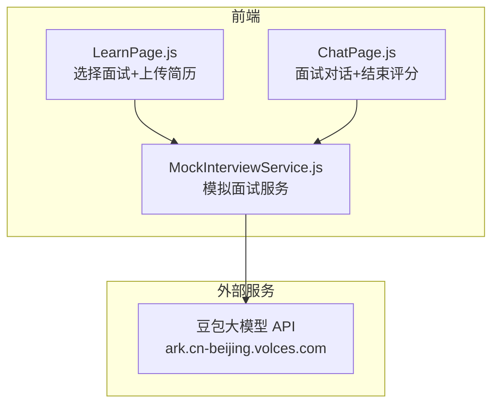
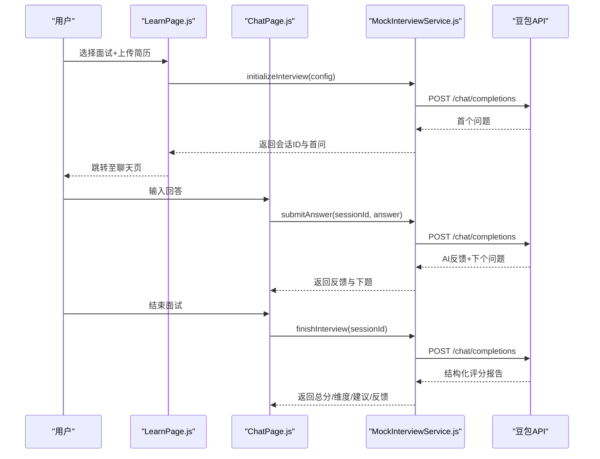
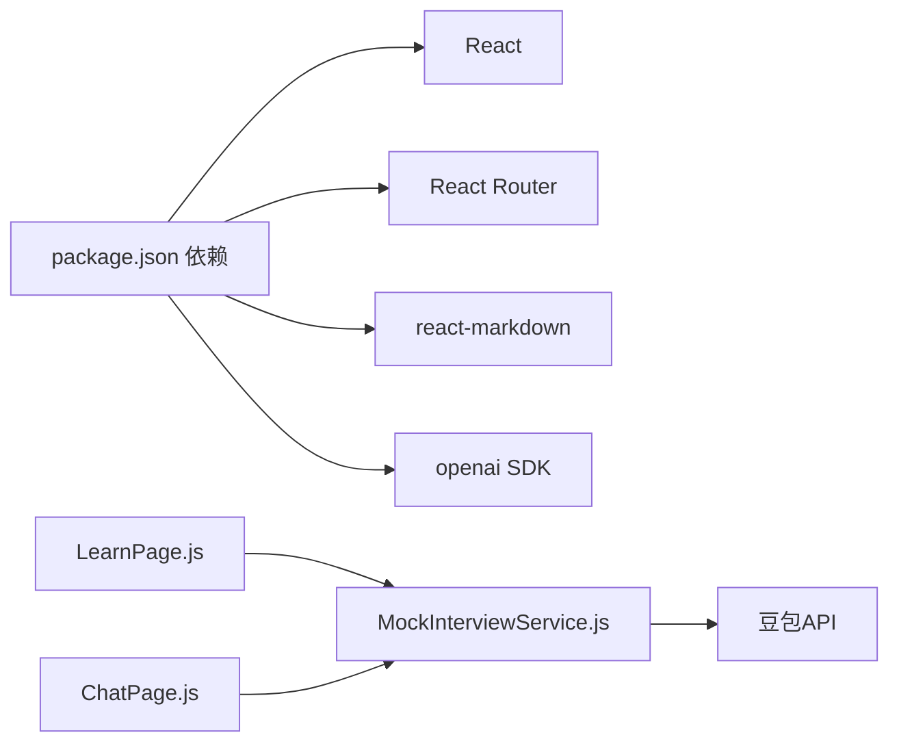

# 模拟面试 API

<cite>
**本文引用的文件**
- [README.md](file://README.md)
- [QUICK_START.md](file://QUICK_START.md)
- [MockInterviewService.js](file://src/services/MockInterviewService.js)
- [LearnPage.js](file://src/pages/LearnPage.js)
- [ChatPage.js](file://src/pages/ChatPage.js)
- [SchedulePage.js](file://src/pages/SchedulePage.js)
- [package.json](file://package.json)
</cite>

## 目录
1. [简介](#简介)
2. [项目结构](#项目结构)
3. [核心组件](#核心组件)
4. [架构总览](#架构总览)
5. [详细组件分析](#详细组件分析)
6. [依赖关系分析](#依赖关系分析)
7. [性能考量](#性能考量)
8. [故障排查指南](#故障排查指南)
9. [结论](#结论)
10. [附录](#附录)

## 简介
本文件为“模拟面试”功能的 API 文档，覆盖以下核心接口与能力：
- 面试初始化：启动一次模拟面试，返回首个问题与会话标识
- 面试问答：提交回答并获取 AI 反馈与下一个问题
- 面试评分：结束面试并生成综合评分与反馈报告
- 面试历史：获取历史记录（本地存储或后端持久化预留）

同时，文档详细说明面试题库管理、难度级别设置、面试时长控制等配置选项；解释评分算法、评分维度与反馈生成机制；提供完整的面试流程示例；说明面试记录存储格式、历史查询接口与数据分析能力；并涵盖面试体验优化、实时互动、多轮对话等高级特性，以及扩展接口与自定义配置指南。

## 项目结构
前端采用 React + React Router 架构，模拟面试服务通过独立的服务类封装对外 API 调用，页面组件负责交互与数据流转。

图表来源
- [LearnPage.js:277-336](file://src/pages/LearnPage.js#L277-L336)
- [ChatPage.js:133-329](file://src/pages/ChatPage.js#L133-L329)
- [MockInterviewService.js:9-11](file://src/services/MockInterviewService.js#L9-L11)

章节来源
- [README.md:146-171](file://README.md#L146-L171)
- [package.json:1-41](file://package.json#L1-L41)

## 核心组件
- 模拟面试服务（MockInterviewService）
  - 提供初始化面试、提交回答、结束面试评分、解析简历、获取历史等方法
  - 内置降级机制：当外部 API 不可用时返回模拟数据
- 页面组件
  - LearnPage：选择面试安排、上传/解析简历、启动面试
  - ChatPage：实时对话、结束并查看评分
- 外部集成
  - 豆包大模型 API（火山方舟）用于真实对话与评分

章节来源
- [MockInterviewService.js:7-519](file://src/services/MockInterviewService.js#L7-L519)
- [LearnPage.js:277-336](file://src/pages/LearnPage.js#L277-L336)
- [ChatPage.js:133-329](file://src/pages/ChatPage.js#L133-L329)

## 架构总览
模拟面试的前后端交互如下：

图表来源
- [LearnPage.js:277-336](file://src/pages/LearnPage.js#L277-L336)
- [ChatPage.js:133-329](file://src/pages/ChatPage.js#L133-L329)
- [MockInterviewService.js:24-358](file://src/services/MockInterviewService.js#L24-L358)

## 详细组件分析

### 接口定义与行为
- 面试初始化（POST /api/interviews/start）
  - 说明：启动一次模拟面试，返回会话ID、首个问题与面试配置摘要
  - 参数：简历文本、目标院校、专业、面试类型、难度级别、面试城市
  - 返回：会话ID、状态、首问、面试类型、难度、预计时长
  - 注意：当前前端通过 MockInterviewService 直接调用外部模型，未暴露独立后端接口
- 面试问答（POST /api/interviews/question）
  - 说明：提交回答并获取 AI 反馈与下一个问题
  - 参数：会话ID、用户回答
  - 返回：AI反馈、下个问题、临时分数（模拟）
- 面试评分（POST /api/interviews/evaluate）
  - 说明：结束面试并生成综合评分与反馈报告
  - 参数：会话ID
  - 返回：总分、各维度得分、优势、短板、建议、反馈、等级
- 面试历史（GET /api/interviews/history）
  - 说明：获取历史记录（本地存储或后端持久化预留）
  - 返回：历史记录数组（每条包含会话ID、时间、学校、专业、得分等）

章节来源
- [MockInterviewService.js:24-358](file://src/services/MockInterviewService.js#L24-L358)
- [LearnPage.js:277-336](file://src/pages/LearnPage.js#L277-L336)
- [ChatPage.js:287-329](file://src/pages/ChatPage.js#L287-L329)

### 配置选项与题库管理
- 面试题库管理
  - 题目来源：基于系统提示词与模型推理，围绕简历、目标院校特色、专业基础、城市文化与场景题展开
  - 题库形态：非独立静态题库，而是通过提示词工程与上下文驱动的动态生成
- 难度级别设置
  - 前端传入 difficulty（示例：medium），用于影响提问深度与范围
- 面试时长控制
  - 预估时长：初始化返回固定时长（分钟），实际时长取决于回答轮数与模型响应时间

章节来源
- [MockInterviewService.js:28-115](file://src/services/MockInterviewService.js#L28-L115)
- [LearnPage.js:307-315](file://src/pages/LearnPage.js#L307-L315)

### 评分算法与反馈机制
- 评分维度
  - 知识掌握、表达能力、学习热情、准备程度
- 评分生成
  - 在结束面试时，向模型请求结构化评分 JSON；若解析失败则回退为自由文本
- 反馈生成
  - 包含总体评分、等级、优势、短板、建议与详细反馈
- 降级策略
  - 外部 API 失败时，返回模拟数据（固定分数与模板化反馈）

章节来源
- [MockInterviewService.js:254-358](file://src/services/MockInterviewService.js#L254-L358)
- [ChatPage.js:287-329](file://src/pages/ChatPage.js#L287-L329)

### 面试流程示例
- 启动面试
  - 上传/粘贴简历 → 选择面试安排 → 调用初始化接口 → 跳转聊天页
- 问答环节
  - 输入回答 → 获取反馈与下个问题 → 多轮对话
- 评分反馈
  - 结束面试 → 生成评分报告 → 展示总分、维度、建议与反馈
- 历史查询
  - 本地存储或后端接口获取历史记录

章节来源
- [LearnPage.js:277-336](file://src/pages/LearnPage.js#L277-L336)
- [ChatPage.js:133-329](file://src/pages/ChatPage.js#L133-L329)
- [MockInterviewService.js:363-373](file://src/services/MockInterviewService.js#L363-L373)

### 数据存储与历史查询
- 存储位置
  - 本地存储：历史记录默认保存在浏览器本地存储中
  - 后端持久化：预留接口，可扩展为数据库存储
- 历史字段
  - 会话ID、时间戳、学校、专业、总分、维度得分、反馈摘要等

章节来源
- [MockInterviewService.js:363-373](file://src/services/MockInterviewService.js#L363-L373)

### 高级特性与体验优化
- 实时互动
  - 前端通过服务类封装 API 调用，保证流畅的交互体验
- 多轮对话
  - 会话历史在内存中维护，确保上下文连贯
- 降级机制
  - API 不可用时自动回退到模拟数据，保障可用性

章节来源
- [MockInterviewService.js:13-14](file://src/services/MockInterviewService.js#L13-L14)
- [ChatPage.js:133-329](file://src/pages/ChatPage.js#L133-L329)

### 扩展接口与自定义配置
- 扩展接口建议
  - 新增：面试历史分页查询、按学校/专业筛选、导出报告
  - 新增：题库管理接口（新增/编辑/删除题目）、难度分级管理
- 自定义配置
  - 系统提示词可按院校/专业定制
  - 难度级别与权重可配置化
  - 评分维度与阈值可灵活调整

章节来源
- [MockInterviewService.js:28-115](file://src/services/MockInterviewService.js#L28-L115)

## 依赖关系分析
- 前端依赖
  - React、React Router、Markdown 渲染、地图 SDK 等
- 模拟面试服务依赖
  - 豆包 API（火山方舟）用于真实对话与评分
- 页面组件依赖
  - LearnPage 负责启动面试与简历处理
  - ChatPage 负责实时对话与结束评分

图表来源
- [package.json:5-15](file://package.json#L5-L15)
- [LearnPage.js:1-10](file://src/pages/LearnPage.js#L1-L10)
- [ChatPage.js:1-8](file://src/pages/ChatPage.js#L1-L8)
- [MockInterviewService.js:9-11](file://src/services/MockInterviewService.js#L9-L11)

章节来源
- [package.json:1-41](file://package.json#L1-L41)

## 性能考量
- 首次调用延迟：约 1-2 秒（建立连接）
- 后续调用延迟：约 2-3 秒
- 单次完整面试耗时：约 11-13 秒（含初始化、3 轮回答、评分）
- Token 消耗：约 1200（按示例估算）

章节来源
- [QUICK_START.md:162-174](file://QUICK_START.md#L162-L174)

## 故障排查指南
- “面试无法启动”
  - 检查是否上传简历或输入简历内容
  - 检查浏览器控制台错误
  - 检查网络连接
- “API 响应很慢”
  - 首次调用 1-2 秒属正常
  - 若超过 5 秒，检查网络稳定性、API 可达性与简历长度
- “回答为空或出现错误”
  - 打开浏览器 DevTools 查看错误
  - 检查是否禁用跨域请求
- “自动降级到模拟数据”
  - API 暂不可用、配额限制或网络错误
  - UI 继续工作，使用预设模拟回答

章节来源
- [QUICK_START.md:125-159](file://QUICK_START.md#L125-L159)

## 结论
本模拟面试系统通过前端服务类封装外部模型 API，实现了从简历解析、面试启动、多轮问答到评分反馈的完整闭环。系统具备良好的扩展性与降级机制，便于后续接入后端持久化与更丰富的题库管理功能。

## 附录
- 快速开始与集成要点
  - 环境变量：REACT_APP_ARK_API_KEY（已预配置）
  - 启动步骤：上传简历 → 选择面试 → 启动 AI 面试 → 进行对话 → 查看评分
- 相关文档
  - 集成指南、测试指南、成本分析等详见项目文档

章节来源
- [QUICK_START.md:1-255](file://QUICK_START.md#L1-L255)