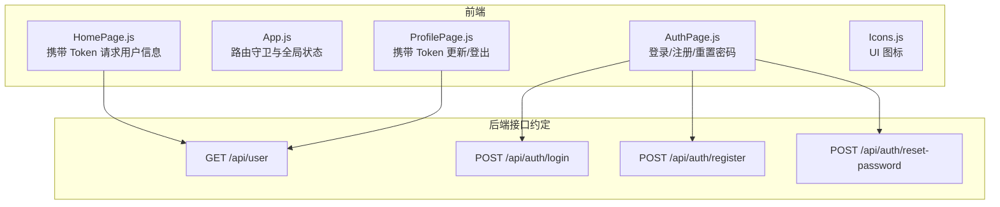
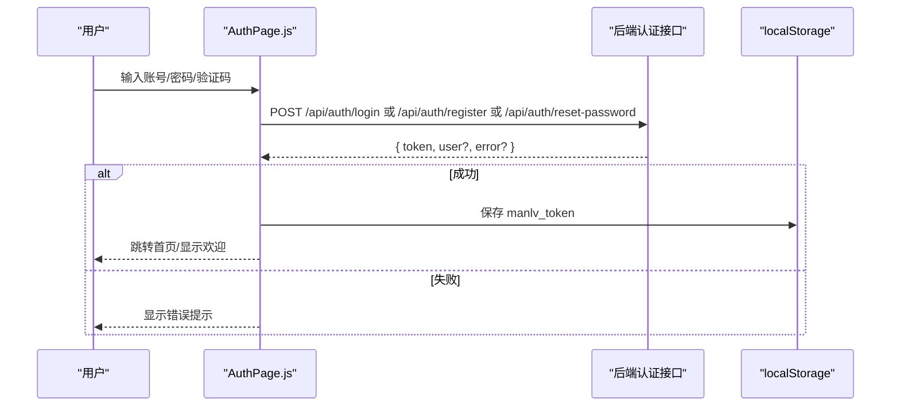
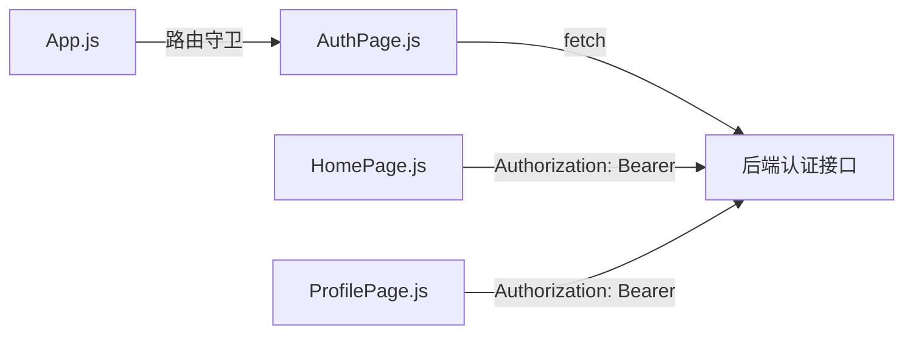

# 认证 API

<cite>
**本文引用的文件**
- [README.md](file://README.md)
- [AuthPage.js](file://src/pages/AuthPage.js)
- [App.js](file://src/App.js)
- [HomePage.js](file://src/pages/HomePage.js)
- [ProfilePage.js](file://src/pages/ProfilePage.js)
- [Icons.js](file://src/components/Icons.js)
</cite>

## 目录
1. [简介](#简介)
2. [项目结构](#项目结构)
3. [核心组件](#核心组件)
4. [架构总览](#架构总览)
5. [详细组件分析](#详细组件分析)
6. [依赖关系分析](#依赖关系分析)
7. [性能考虑](#性能考虑)
8. [故障排查指南](#故障排查指南)
9. [结论](#结论)
10. [附录](#附录)

## 简介
本文件面向前端开发者与产品使用者，系统性梳理“认证 API”的设计与使用方法。基于现有前端实现，文档覆盖登录、注册、密码重置三大核心流程，说明请求参数、响应格式、状态码含义，并重点解释 JWT 令牌的生成与验证机制（本地存储、过期与刷新策略）。同时给出完整的请求/响应示例、验证码发送机制、手机号格式验证、密码强度检查等安全措施，以及常见问题的排查与解决方案。

## 项目结构
前端采用 React 单页应用，认证相关逻辑集中在 AuthPage 组件中，用户信息获取与页面守卫在 App、HomePage、ProfilePage 中配合完成。

图表来源
- [AuthPage.js:86-211](file://src/pages/AuthPage.js#L86-L211)
- [HomePage.js:21-36](file://src/pages/HomePage.js#L21-L36)
- [ProfilePage.js:42-108](file://src/pages/ProfilePage.js#L42-L108)

章节来源
- [README.md:174-206](file://README.md#L174-L206)
- [AuthPage.js:86-211](file://src/pages/AuthPage.js#L86-L211)
- [App.js:75-91](file://src/App.js#L75-L91)
- [HomePage.js:21-36](file://src/pages/HomePage.js#L21-L36)
- [ProfilePage.js:42-108](file://src/pages/ProfilePage.js#L42-L108)

## 核心组件
- 认证页面（AuthPage）
  - 负责登录、注册、忘记密码三类表单交互
  - 发送验证码倒计时、手机号格式校验、密码强度检查
  - 调用后端认证接口并处理响应
- 应用入口（App）
  - 路由守卫：未登录跳转到认证页
  - 全局登录状态管理
- 用户信息页（HomePage）
  - 使用本地 Token 请求用户信息
- 个人中心（ProfilePage）
  - 使用本地 Token 更新资料与登出

章节来源
- [AuthPage.js:64-211](file://src/pages/AuthPage.js#L64-L211)
- [App.js:75-91](file://src/App.js#L75-L91)
- [HomePage.js:21-36](file://src/pages/HomePage.js#L21-L36)
- [ProfilePage.js:42-108](file://src/pages/ProfilePage.js#L42-L108)

## 架构总览
前端通过 fetch 调用后端认证接口，成功后将 JWT 令牌存入 localStorage。后续受保护接口均以 Authorization: Bearer 方式携带该令牌。

图表来源
- [AuthPage.js:86-211](file://src/pages/AuthPage.js#L86-L211)

## 详细组件分析

### 登录（POST /api/auth/login）
- 请求参数
  - email: 字符串，手机号或邮箱
  - password: 字符串
- 响应字段
  - token: 字符串，JWT 令牌
  - user: 对象，用户基本信息（如 name）
  - error: 字符串（失败时）
- 状态码
  - 200：成功
  - 400/422：参数无效或格式错误
  - 401：凭据无效
  - 500：服务器错误
- 前端行为
  - 校验必填项
  - 发起 POST 请求
  - 成功后将 token 写入 localStorage 并触发登录回调
  - 失败时根据 error 或默认提示反馈

章节来源
- [AuthPage.js:86-121](file://src/pages/AuthPage.js#L86-L121)

### 注册（POST /api/auth/register）
- 请求参数
  - email: 字符串，手机号
  - password: 字符串
  - name: 字符串
- 响应字段
  - token: 字符串，JWT 令牌
  - user: 对象，用户基本信息
  - error: 字符串（失败时）
- 状态码
  - 200：成功
  - 400/422：参数无效或重复
  - 500：服务器错误
- 前端行为
  - 校验手机号格式、密码一致性、用户协议勾选
  - 发送验证码（前端模拟倒计时）
  - 成功后跳转首页并触发登录回调

章节来源
- [AuthPage.js:123-170](file://src/pages/AuthPage.js#L123-L170)

### 密码重置（POST /api/auth/reset-password）
- 请求参数
  - email: 字符串，手机号
  - code: 字符串，验证码
  - newPassword: 字符串
- 响应字段
  - token: 字符串，JWT 令牌（部分实现可能返回）
  - user: 对象，用户基本信息
  - error: 字符串（失败时）
- 状态码
  - 200：成功
  - 400/422：参数无效或验证码错误
  - 500：服务器错误
- 前端行为
  - 校验手机号格式、密码一致性
  - 发送验证码（前端模拟倒计时）
  - 成功后切换回登录页

章节来源
- [AuthPage.js:172-211](file://src/pages/AuthPage.js#L172-L211)

### 用户信息（GET /api/user）
- 请求头
  - Authorization: Bearer <token>
- 响应字段
  - user: 对象，用户基本信息
  - error: 字符串（失败时）
- 状态码
  - 200：成功
  - 401：未授权（token 无效/过期）
  - 500：服务器错误
- 前端行为
  - 从 localStorage 读取 token
  - 成功后更新用户状态
  - 失败时跳转认证页

章节来源
- [HomePage.js:21-36](file://src/pages/HomePage.js#L21-L36)
- [ProfilePage.js:42-64](file://src/pages/ProfilePage.js#L42-L64)

### JWT 令牌生成与验证机制
- 生成
  - 登录/注册/重置密码成功后，后端返回 token
- 存储
  - 前端使用 localStorage 存储 key 为 manlv_token 的值
- 过期与刷新
  - 代码未体现自动刷新逻辑；建议后端设置合理过期时间，并在 401 时引导重新登录
- 使用
  - 受保护接口统一在请求头添加 Authorization: Bearer <token>

章节来源
- [AuthPage.js:111](file://src/pages/AuthPage.js#L111)
- [HomePage.js:27](file://src/pages/HomePage.js#L27)
- [ProfilePage.js:50](file://src/pages/ProfilePage.js#L50)

### 验证码发送机制
- 前端倒计时：点击“获取验证码”后进入 60 秒倒计时
- 手机号格式：11 位中国大陆手机号
- 触发时机：注册与忘记密码两种场景分别对应不同输入框 ID

章节来源
- [AuthPage.js:64-84](file://src/pages/AuthPage.js#L64-L84)
- [AuthPage.js:354-409](file://src/pages/AuthPage.js#L354-L409)
- [AuthPage.js:546-601](file://src/pages/AuthPage.js#L546-L601)

### 手机号格式验证
- 正则规则：以 1 开头，第二位 3-9，共 11 位
- 实时反馈：输入框下方显示格式正确/错误提示

章节来源
- [AuthPage.js:25-27](file://src/pages/AuthPage.js#L25-L27)
- [AuthPage.js:354-383](file://src/pages/AuthPage.js#L354-L383)
- [AuthPage.js:546-575](file://src/pages/AuthPage.js#L546-L575)

### 密码强度检查
- 强度规则：长度≥6、包含英文字母、包含数字、可选特殊字符
- 多条件规则：至少 6 位、字母+数字、大小写字母、特殊字符（可选）
- 实时反馈：条形强度条与规则清单

章节来源
- [AuthPage.js:38-62](file://src/pages/AuthPage.js#L38-L62)
- [AuthPage.js:427-480](file://src/pages/AuthPage.js#L427-L480)
- [AuthPage.js:603-655](file://src/pages/AuthPage.js#L603-L655)

### 请求/响应示例（成功与失败）

- 登录（成功）
  - 请求
    - 方法：POST
    - 路径：/api/auth/login
    - 头部：Content-Type: application/json
    - 负载：{"email":"示例@域名.com","password":"密码"}
  - 响应
    - 状态码：200
    - 负载：{"token":"<JWT>","user":{"name":"张三"}}

- 登录（失败：凭据无效）
  - 请求
    - 方法：POST
    - 路径：/api/auth/login
    - 负载：同上
  - 响应
    - 状态码：401
    - 负载：{"error":"Invalid credentials"}

- 注册（成功）
  - 请求
    - 方法：POST
    - 路径：/api/auth/register
    - 负载：{"email":"13800001111","password":"密码","name":"姓名"}
  - 响应
    - 状态码：200
    - 负载：{"token":"<JWT>","user":{"name":"姓名"}}

- 注册（失败：参数缺失）
  - 请求
    - 方法：POST
    - 路径：/api/auth/register
  - 响应
    - 状态码：422
    - 负载：{"error":"参数缺失或格式错误"}

- 密码重置（成功）
  - 请求
    - 方法：POST
    - 路径：/api/auth/reset-password
    - 负载：{"email":"13800001111","code":"123456","newPassword":"新密码"}
  - 响应
    - 状态码：200
    - 负载：{"token":"<JWT>","user":{"name":"姓名"}}

- 获取用户信息（成功）
  - 请求
    - 方法：GET
    - 路径：/api/user
    - 头部：Authorization: Bearer <JWT>
  - 响应
    - 状态码：200
    - 负载：{"user":{"name":"张三"}}

- 获取用户信息（失败：未授权）
  - 请求
    - 方法：GET
    - 路径：/api/user
    - 头部：Authorization: Bearer <失效token>
  - 响应
    - 状态码：401
    - 负载：{"error":"未授权"}

章节来源
- [AuthPage.js:86-121](file://src/pages/AuthPage.js#L86-L121)
- [AuthPage.js:123-170](file://src/pages/AuthPage.js#L123-L170)
- [AuthPage.js:172-211](file://src/pages/AuthPage.js#L172-L211)
- [HomePage.js:21-36](file://src/pages/HomePage.js#L21-L36)

## 依赖关系分析
- 认证页面依赖 fetch 发起请求
- 应用入口负责路由守卫与登录状态
- 用户信息页与个人中心依赖 localStorage 中的 token

图表来源
- [AuthPage.js:86-211](file://src/pages/AuthPage.js#L86-L211)
- [HomePage.js:21-36](file://src/pages/HomePage.js#L21-L36)
- [ProfilePage.js:42-108](file://src/pages/ProfilePage.js#L42-L108)
- [App.js:75-91](file://src/App.js#L75-L91)

章节来源
- [AuthPage.js:86-211](file://src/pages/AuthPage.js#L86-L211)
- [HomePage.js:21-36](file://src/pages/HomePage.js#L21-L36)
- [ProfilePage.js:42-108](file://src/pages/ProfilePage.js#L42-L108)
- [App.js:75-91](file://src/App.js#L75-L91)

## 性能考虑
- 前端 fetch 请求为同步串行，建议在高并发场景下引入请求队列与去重策略
- 密码强度计算为纯前端实时反馈，复杂度低，不影响性能
- localStorage 读写为 O(1)，对性能影响可忽略

## 故障排查指南
- 登录失败
  - 检查 email/password 是否为空
  - 确认后端返回的 error 字段是否为“Invalid credentials”
  - 查看浏览器网络面板与控制台错误
- 注册失败
  - 确认手机号格式、密码一致性、协议勾选
  - 检查验证码倒计时是否正常
- 获取用户信息失败
  - 检查 localStorage 中是否存在 manlv_token
  - 若 401，需重新登录获取新 token
- 退出登录
  - 删除 localStorage 中的 manlv_token 并触发登出回调

章节来源
- [AuthPage.js:86-121](file://src/pages/AuthPage.js#L86-L121)
- [AuthPage.js:123-170](file://src/pages/AuthPage.js#L123-L170)
- [AuthPage.js:172-211](file://src/pages/AuthPage.js#L172-L211)
- [HomePage.js:21-36](file://src/pages/HomePage.js#L21-L36)
- [ProfilePage.js:42-108](file://src/pages/ProfilePage.js#L42-L108)

## 结论
本认证体系以 JWT 为核心，结合前端本地存储与路由守卫，实现了基本的登录、注册与密码重置流程。建议后续完善后端过期策略与刷新机制，并在前端增加统一的错误拦截与重试策略，以提升用户体验与安全性。

## 附录
- 技术栈与认证技术
  - 前端：React、React Router
  - 后端：Node.js + Express（约定）
  - 认证：JWT、bcryptjs（后端约定）
- 常用图标组件（用于 UI 呈现）
  - 包含锁、手机、眼睛、密码等图标组件

章节来源
- [README.md:65-76](file://README.md#L65-L76)
- [Icons.js:110-135](file://src/components/Icons.js#L110-L135)