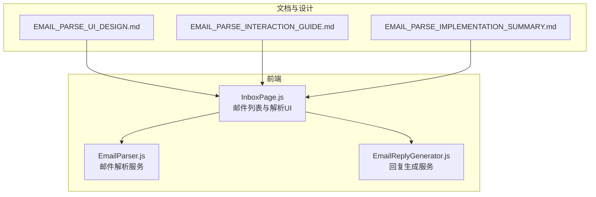
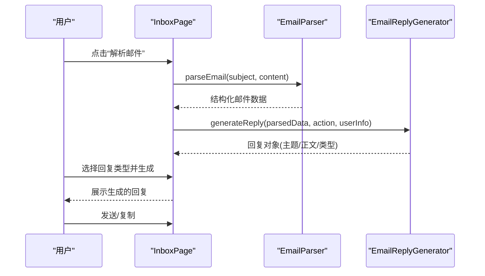
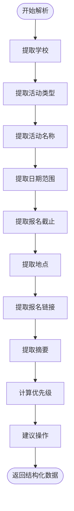
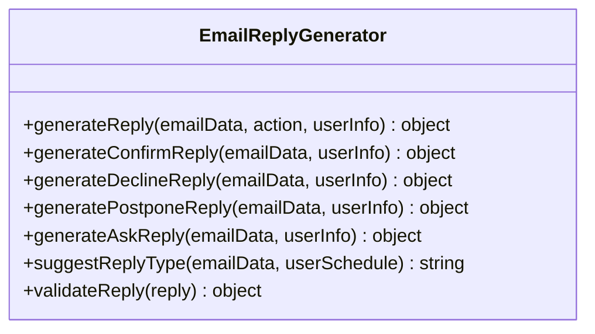
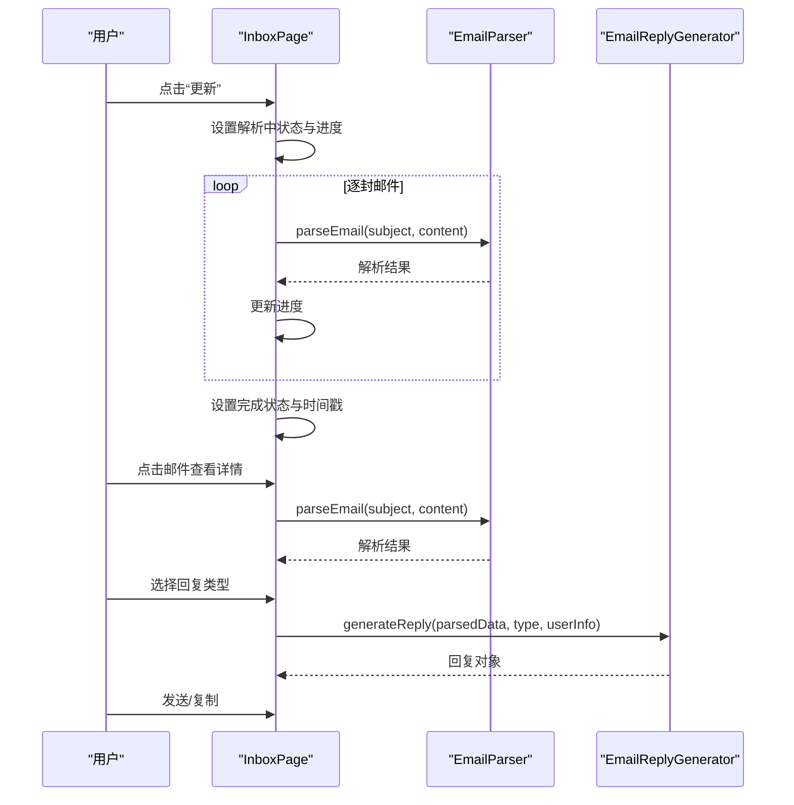
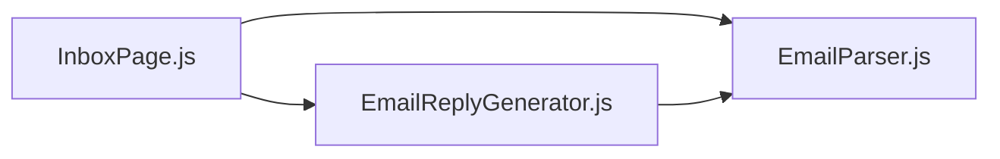

# 邮件处理 API

<cite>
**本文引用的文件**
- [README.md](file://README.md)
- [src/services/EmailParser.js](file://src/services/EmailParser.js)
- [src/services/EmailReplyGenerator.js](file://src/services/EmailReplyGenerator.js)
- [src/pages/InboxPage.js](file://src/pages/InboxPage.js)
- [EMAIL_PARSE_IMPLEMENTATION_SUMMARY.md](file://EMAIL_PARSE_IMPLEMENTATION_SUMMARY.md)
- [EMAIL_PARSE_UI_DESIGN.md](file://EMAIL_PARSE_UI_DESIGN.md)
- [EMAIL_PARSE_INTERACTION_GUIDE.md](file://EMAIL_PARSE_INTERACTION_GUIDE.md)
- [QUICK_START.md](file://QUICK_START.md)
- [package.json](file://package.json)
</cite>

## 目录
1. [简介](#简介)
2. [项目结构](#项目结构)
3. [核心组件](#核心组件)
4. [架构总览](#架构总览)
5. [详细组件分析](#详细组件分析)
6. [依赖关系分析](#依赖关系分析)
7. [性能考量](#性能考量)
8. [故障排查指南](#故障排查指南)
9. [结论](#结论)
10. [附录](#附录)

## 简介
本文件面向“邮件处理 API”的设计与实现，聚焦于前端邮件解析与回复生成能力的 API 化封装与使用说明。根据现有代码库，系统在前端实现了邮件解析状态卡片、邮件解析流程、解析结果展示以及基于解析结果的邮件回复生成与发送模拟。本文将围绕以下目标进行系统化说明：
- 邮件解析（POST /api/email/parse）：字段提取规则、关键信息识别算法、优先级计算逻辑
- 邮件回复生成（POST /api/email/reply-generate）：模板选择、个性化参数、语言风格控制
- 邮件列表获取（GET /api/email/inbox）：邮件列表、状态标注、解析进度
- 自动分类与提醒：基于优先级与活动类型的智能提醒机制
- 批量处理：逐封邮件解析的批处理流程
- 安全与合规：敏感信息过滤、格式标准化、输入验证
- 性能优化与错误恢复：前端解析动画与交互优化、错误提示与重试策略

注意：当前仓库为前端代码库，后端 API 尚未实现。本文在“接口定义”部分给出符合系统设计的 API 规范与示例，实际后端集成需在后端服务中实现对应接口。

## 项目结构
前端项目采用 React 架构，核心与邮件处理相关的模块分布如下：
- 服务层：EmailParser（解析）、EmailReplyGenerator（回复生成）
- 页面层：InboxPage（邮件列表、解析状态、回复生成与发送模拟）
- UI 设计与交互：EMAIL_PARSE_UI_DESIGN.md、EMAIL_PARSE_INTERACTION_GUIDE.md、EMAIL_PARSE_IMPLEMENTATION_SUMMARY.md
- 项目说明与 API 概览：README.md、QUICK_START.md
- 依赖与脚本：package.json

**图表来源**
- [src/pages/InboxPage.js:1-479](file://src/pages/InboxPage.js#L1-L479)
- [src/services/EmailParser.js:1-227](file://src/services/EmailParser.js#L1-L227)
- [src/services/EmailReplyGenerator.js:1-212](file://src/services/EmailReplyGenerator.js#L1-L212)
- [EMAIL_PARSE_UI_DESIGN.md:1-289](file://EMAIL_PARSE_UI_DESIGN.md#L1-L289)
- [EMAIL_PARSE_INTERACTION_GUIDE.md:1-419](file://EMAIL_PARSE_INTERACTION_GUIDE.md#L1-L419)
- [EMAIL_PARSE_IMPLEMENTATION_SUMMARY.md:1-395](file://EMAIL_PARSE_IMPLEMENTATION_SUMMARY.md#L1-L395)

**章节来源**
- [README.md:146-220](file://README.md#L146-L220)
- [package.json:1-41](file://package.json#L1-L41)

## 核心组件
- 邮件解析服务（EmailParser）
  - 提取字段：学校、活动类型、活动名称、日期范围、报名截止、地点、报名链接、摘要、优先级、建议操作
  - 关键算法：关键词匹配、正则表达式、优先级计算、日期格式化
- 邮件回复生成服务（EmailReplyGenerator）
  - 模板：确认参加、委婉拒绝、时间协商、咨询问题
  - 个性化：用户信息注入、活动信息注入
  - 语言风格：礼貌、正式、简洁
  - 校验：主题非空、正文长度、占位符检查
- 邮件列表与解析 UI（InboxPage）
  - 邮件列表展示、解析状态卡片、解析进度、原始邮件查看、回复生成与发送模拟

**章节来源**
- [src/services/EmailParser.js:12-224](file://src/services/EmailParser.js#L12-L224)
- [src/services/EmailReplyGenerator.js:13-208](file://src/services/EmailReplyGenerator.js#L13-L208)
- [src/pages/InboxPage.js:82-140](file://src/pages/InboxPage.js#L82-L140)

## 架构总览
前端通过 InboxPage 调用 EmailParser 解析邮件，得到结构化数据；随后根据解析结果调用 EmailReplyGenerator 生成不同类型的回复模板，并提供发送模拟与复制功能。UI 层通过状态管理实现解析进度与交互反馈。

**图表来源**
- [src/pages/InboxPage.js:82-104](file://src/pages/InboxPage.js#L82-L104)
- [src/services/EmailParser.js:12-25](file://src/services/EmailParser.js#L12-L25)
- [src/services/EmailReplyGenerator.js:13-23](file://src/services/EmailReplyGenerator.js#L13-L23)

## 详细组件分析

### 邮件解析服务（EmailParser）
- 字段提取规则
  - 学校：基于常见高校关键词匹配，优先主题与正文
  - 活动类型：基于关键词集合（夏令营、面试、推免、讲座等）
  - 活动名称：从主题中的引号或分隔符中提取
  - 日期范围：正则匹配“月日-月日”或“年月日”格式
  - 报名截止：扫描包含“截止/截至”关键词的行并提取日期
  - 地点：扫描包含“地点/地址”等关键词的行
  - 报名链接：优先表单/调查/登录链接，否则返回首个URL
  - 摘要：取前3行或最多200字符
- 关键信息识别算法
  - 关键词匹配：遍历关键词集合，命中即返回类型
  - 正则匹配：统一处理多种日期格式
  - 上下文拼接：主题+正文组合用于更全面的识别
- 优先级计算逻辑
  - 紧急：主题包含“紧急/立即”
  - 高：主题/正文包含顶级高校关键词
  - 截止日期接近：包含“截止/截至”关键词且日期临近时提升为紧急
- 建议操作
  - 根据活动类型返回建议动作（确认/协商/咨询）

**图表来源**
- [src/services/EmailParser.js:12-224](file://src/services/EmailParser.js#L12-L224)

**章节来源**
- [src/services/EmailParser.js:28-223](file://src/services/EmailParser.js#L28-L223)

### 邮件回复生成服务（EmailReplyGenerator）
- 模板选择
  - 确认参加：适用于夏令营、面试、推免等
  - 委婉拒绝：礼貌表达无法参加
  - 时间协商：提出时间调整或替代方案
  - 咨询问题：询问参与形式、住宿、材料、日程等
- 个性化参数
  - 用户信息：姓名、学校、专业、学号、电话、邮箱
  - 活动信息：活动名称、学校、日期
- 语言风格控制
  - 正式、礼貌、简洁，符合学术沟通场景
- 建议回复类型
  - 依据优先级与日程冲突判断推荐类型
- 校验规则
  - 主题非空
  - 正文长度≥20字符
  - 不包含未填写占位符

**图表来源**
- [src/services/EmailReplyGenerator.js:13-208](file://src/services/EmailReplyGenerator.js#L13-L208)

**章节来源**
- [src/services/EmailReplyGenerator.js:13-208](file://src/services/EmailReplyGenerator.js#L13-L208)

### 邮件列表与解析 UI（InboxPage）
- 邮件列表
  - 展示学校、主题、时间、状态（已申请/已入营/待确认/待解析）
  - 点击进入详情，展示解析结果与原始邮件
- 解析状态卡片
  - 解析中：进度条、进度点、旋转按钮、禁用邮件列表
  - 解析完成：完成图标、时间戳、可点击“更新”
- 回复生成与发送
  - 生成不同类型的回复
  - 发送模拟（1.5秒延迟）、复制到剪贴板、提示反馈

**图表来源**
- [src/pages/InboxPage.js:128-140](file://src/pages/InboxPage.js#L128-L140)
- [src/pages/InboxPage.js:82-104](file://src/pages/InboxPage.js#L82-L104)

**章节来源**
- [src/pages/InboxPage.js:61-479](file://src/pages/InboxPage.js#L61-L479)
- [EMAIL_PARSE_UI_DESIGN.md:129-154](file://EMAIL_PARSE_UI_DESIGN.md#L129-L154)
- [EMAIL_PARSE_INTERACTION_GUIDE.md:141-151](file://EMAIL_PARSE_INTERACTION_GUIDE.md#L141-L151)

## 依赖关系分析
- 组件耦合
  - InboxPage 依赖 EmailParser 与 EmailReplyGenerator
  - EmailReplyGenerator 依赖 EmailParser 的解析结果
- 外部依赖
  - React、React Router、图标库、markdown 渲染等
- 潜在风险
  - 前端解析仅用于演示，真实生产需后端 API 支撑
  - UI 动画与交互在低端设备上可能影响性能

**图表来源**
- [src/pages/InboxPage.js:1-7](file://src/pages/InboxPage.js#L1-L7)
- [src/services/EmailParser.js:1-5](file://src/services/EmailParser.js#L1-L5)
- [src/services/EmailReplyGenerator.js:1-5](file://src/services/EmailReplyGenerator.js#L1-L5)

**章节来源**
- [package.json:5-16](file://package.json#L5-L16)

## 性能考量
- 前端解析动画
  - 使用 CSS 动画与关键帧，避免频繁 DOM 更新
  - 解析过程采用定时器模拟，避免阻塞主线程
- 交互响应
  - 按钮禁用与列表禁用减少误操作
  - Toast 提示与延迟关闭避免频繁重渲染
- 批量处理
  - 逐封邮件解析，进度条与点状指示器提供清晰反馈
- 建议
  - 后端实现时采用流式处理与并发控制
  - 对长文本与附件进行分块处理与缓存

[本节为通用性能建议，不直接分析具体文件]

## 故障排查指南
- 解析失败
  - 现象：进度条不更新、按钮无响应
  - 处理：检查状态管理与定时器逻辑，确保解析循环执行
- 网络超时
  - 现象：后端 API 调用超时
  - 处理：前端显示“网络超时，请检查连接”，提供“重新尝试”按钮
- 无邮件解析
  - 现象：邮件列表为空或无新邮件
  - 处理：提示“暂无新邮件需要解析”，允许手动刷新
- 无障碍与兼容性
  - 现象：键盘导航困难、屏幕阅读器不识别
  - 处理：补充 ARIA 标签与键盘快捷键，确保颜色对比度达标

**章节来源**
- [EMAIL_PARSE_INTERACTION_GUIDE.md:372-394](file://EMAIL_PARSE_INTERACTION_GUIDE.md#L372-L394)

## 结论
本文件基于现有前端实现，梳理了邮件解析与回复生成的核心流程与设计要点。当前系统以 UI 演示为主，建议在后端实现对应 API，以支撑真实邮件解析与回复生成。通过明确的字段提取规则、模板化回复与严格的校验机制，系统能够在保研场景中提供高效、可靠的邮件处理体验。

[本节为总结性内容，不直接分析具体文件]

## 附录

### 接口定义与示例（后端待实现）
- 邮件解析（POST /api/email/parse）
  - 请求体
    - subject: string（邮件主题）
    - content: string（邮件正文）
  - 响应体
    - school: string（学校/机构名称）
    - eventType: string（活动类型：camp/interview/promotion/seminar/other）
    - eventName: string（活动名称）
    - dates: object（开始/结束日期）
    - deadline: string（报名截止）
    - location: string（地点）
    - applyLink: string（报名链接）
    - description: string（摘要）
    - priority: string（优先级：urgent/high/normal）
    - suggestedAction: string（建议操作）
  - 示例
    - 请求：包含主题与正文
    - 响应：包含上述字段的结构化数据
- 邮件回复生成（POST /api/email/reply-generate）
  - 请求体
    - emailData: object（解析后的邮件数据）
    - action: string（操作类型：confirm/decline/postpone/ask）
    - userInfo: object（用户信息：姓名、学校、专业、学号、电话、邮箱）
  - 响应体
    - subject: string（邮件主题）
    - body: string（邮件正文）
    - type: string（回复类型）
    - needsReview: boolean（是否需要人工审阅）
  - 示例
    - 请求：解析后的邮件数据 + 操作类型 + 用户信息
    - 响应：生成的回复对象
- 邮件列表获取（GET /api/email/inbox）
  - 查询参数
    - page: number（页码，默认1）
    - limit: number（每页数量，默认10）
  - 响应体
    - emails: array（邮件列表，每项包含：id、school、subject、from、time、status、statusType、parsed）
    - total: number（总数）
  - 示例
    - 响应：邮件列表与总数

[本节为接口规范说明，不直接分析具体文件]

### 字段提取规则与优先级计算（参考实现）
- 字段提取规则
  - 学校：关键词匹配
  - 活动类型：关键词集合匹配
  - 活动名称：主题引号或分隔符提取
  - 日期范围：正则匹配“月日-月日”或“年月日”
  - 报名截止：扫描包含“截止/截至”的行并提取日期
  - 地点：扫描包含“地点/地址”的行
  - 报名链接：优先表单/调查/登录链接
  - 摘要：前3行或最多200字符
- 优先级计算逻辑
  - 紧急：主题包含“紧急/立即”
  - 高：包含顶级高校关键词
  - 截止日期接近：包含“截止/截至”且日期临近时提升为紧急

**章节来源**
- [src/services/EmailParser.js:28-223](file://src/services/EmailParser.js#L28-L223)

### 模板选择与个性化参数（参考实现）
- 模板选择
  - 确认参加：适用于夏令营、面试、推免
  - 委婉拒绝：礼貌表达无法参加
  - 时间协商：提出时间调整或替代方案
  - 咨询问题：询问参与形式、住宿、材料、日程
- 个性化参数
  - 用户信息：姓名、学校、专业、学号、电话、邮箱
  - 活动信息：活动名称、学校、日期
- 语言风格
  - 正式、礼貌、简洁，符合学术沟通场景

**章节来源**
- [src/services/EmailReplyGenerator.js:13-208](file://src/services/EmailReplyGenerator.js#L13-L208)

### UI 与交互（参考实现）
- 解析状态卡片
  - 解析中：进度条、进度点、旋转按钮、禁用列表
  - 解析完成：完成图标、时间戳、可点击“更新”
- 回复生成与发送
  - 生成不同类型的回复
  - 发送模拟（1.5秒延迟）、复制到剪贴板、提示反馈

**章节来源**
- [src/pages/InboxPage.js:167-232](file://src/pages/InboxPage.js#L167-L232)
- [src/pages/InboxPage.js:370-432](file://src/pages/InboxPage.js#L370-L432)
- [EMAIL_PARSE_UI_DESIGN.md:1-289](file://EMAIL_PARSE_UI_DESIGN.md#L1-L289)
- [EMAIL_PARSE_INTERACTION_GUIDE.md:1-419](file://EMAIL_PARSE_INTERACTION_GUIDE.md#L1-L419)