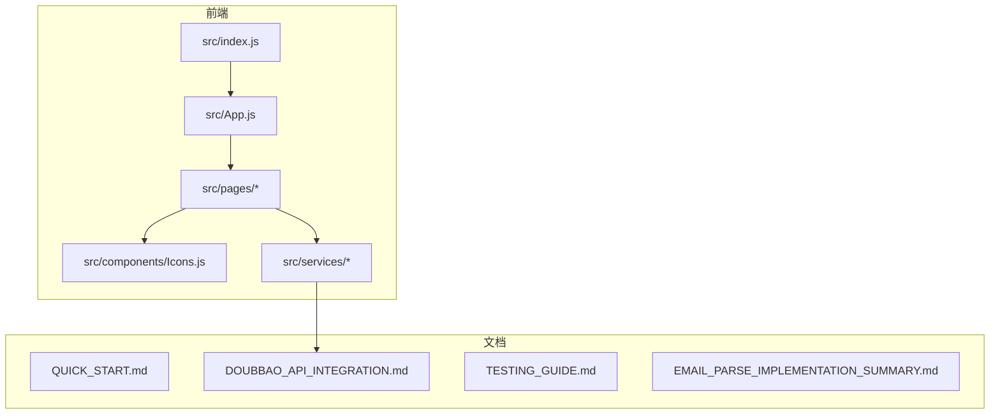
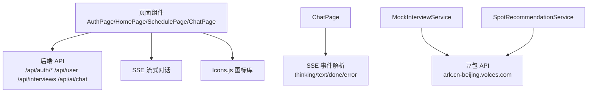
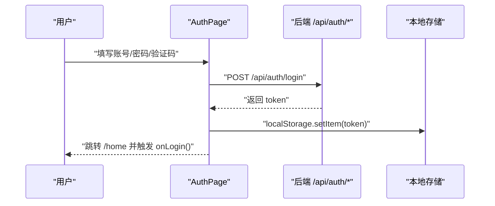
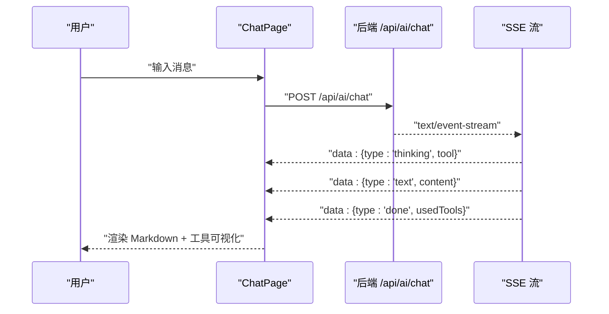
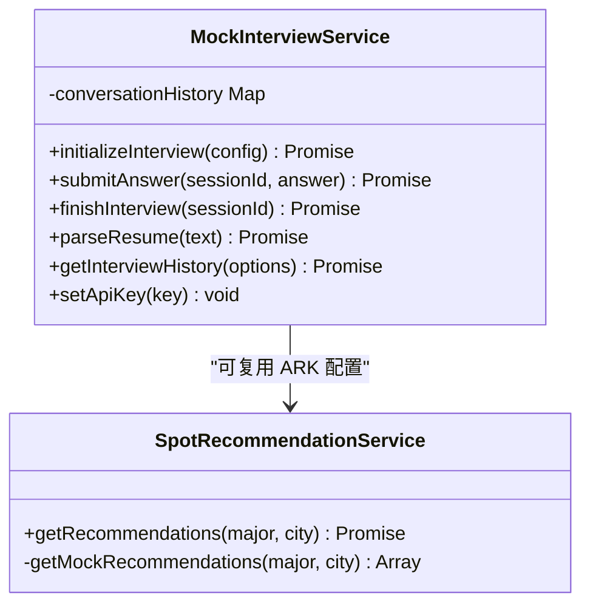
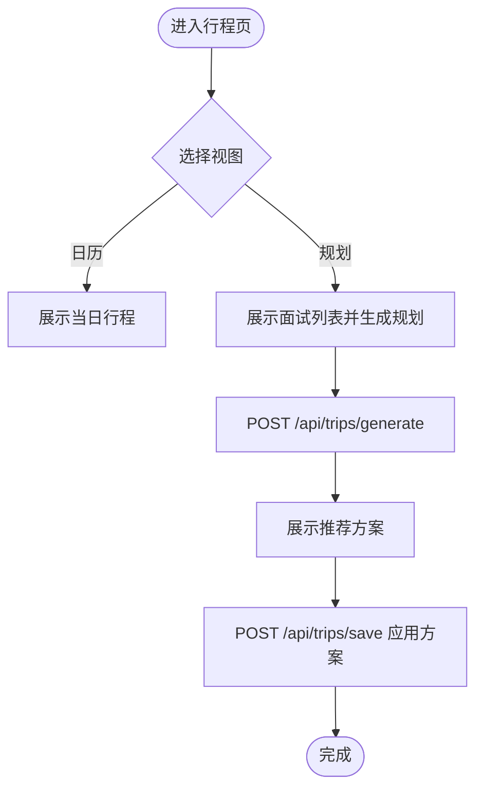
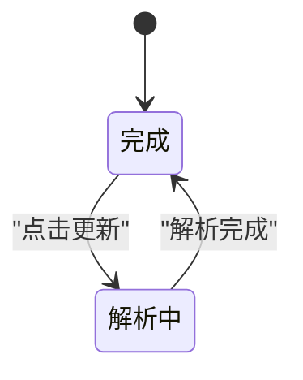
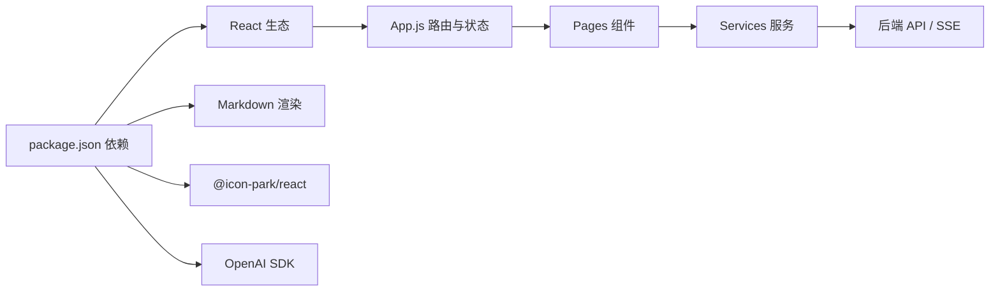

# 开发者指南

<cite>
**本文档引用的文件**
- [README.md](file://README.md)
- [QUICK_START.md](file://QUICK_START.md)
- [DOUBBAO_API_INTEGRATION.md](file://DOUBBAO_API_INTEGRATION.md)
- [TESTING_GUIDE.md](file://TESTING_GUIDE.md)
- [EMAIL_PARSE_IMPLEMENTATION_SUMMARY.md](file://EMAIL_PARSE_IMPLEMENTATION_SUMMARY.md)
- [package.json](file://package.json)
- [src/index.js](file://src/index.js)
- [src/App.js](file://src/App.js)
- [src/components/Icons.js](file://src/components/Icons.js)
- [src/pages/AuthPage.js](file://src/pages/AuthPage.js)
- [src/pages/HomePage.js](file://src/pages/HomePage.js)
- [src/pages/SchedulePage.js](file://src/pages/SchedulePage.js)
- [src/pages/ChatPage.js](file://src/pages/ChatPage.js)
- [src/services/MockInterviewService.js](file://src/services/MockInterviewService.js)
- [src/services/SpotRecommendationService.js](file://src/services/SpotRecommendationService.js)
</cite>

## 目录
1. [简介](#简介)
2. [项目结构](#项目结构)
3. [核心组件](#核心组件)
4. [架构总览](#架构总览)
5. [详细组件分析](#详细组件分析)
6. [依赖关系分析](#依赖关系分析)
7. [性能考虑](#性能考虑)
8. [调试与故障排查](#调试与故障排查)
9. [贡献指南](#贡献指南)
10. [结论](#结论)

## 简介
漫旅 ManLv 是一款面向保研生的 AI 驱动一站式行程伴旅助手，覆盖「多城市面试调度 × 专业备考 × 情绪支持」。项目采用前端 React 18 + 后端 Node.js/Express 的双端架构，集成 DashScope/OpenAI 兼容的大模型与豆包（火山方舟）API，提供 AI 对话、行程管理、邮件解析、情景学习与模拟面试等功能。

## 项目结构
项目采用按功能分层的组织方式：
- src/components：公共 UI 组件与图标
- src/pages：页面级组件（认证、首页、行程、聊天、学习、收件箱、个人中心等）
- src/services：业务服务层（模拟面试、地点推荐、邮件解析等）
- 根目录文档：快速开始、API 集成、测试指南、邮件解析实现总结等

图表来源
- [src/index.js:1-12](file://src/index.js#L1-L12)
- [src/App.js:1-177](file://src/App.js#L1-L177)
- [src/components/Icons.js:1-259](file://src/components/Icons.js#L1-L259)
- [src/pages/AuthPage.js:1-732](file://src/pages/AuthPage.js#L1-L732)
- [src/pages/HomePage.js:1-263](file://src/pages/HomePage.js#L1-L263)
- [src/pages/SchedulePage.js:1-423](file://src/pages/SchedulePage.js#L1-L423)
- [src/pages/ChatPage.js:1-482](file://src/pages/ChatPage.js#L1-L482)
- [src/services/MockInterviewService.js:1-519](file://src/services/MockInterviewService.js#L1-L519)
- [src/services/SpotRecommendationService.js:1-86](file://src/services/SpotRecommendationService.js#L1-L86)

章节来源
- [README.md:146-171](file://README.md#L146-L171)
- [package.json:1-41](file://package.json#L1-L41)

## 核心组件
- 应用入口与路由：src/index.js 负责挂载 React 根节点；src/App.js 管理全局路由、登录态与浮动 AI 助手。
- 页面组件：AuthPage（登录/注册/忘记密码）、HomePage（今日任务/倒计时/快捷操作/行程卡片）、SchedulePage（日历/智能规划/面试录入）、ChatPage（AI 对话/模拟面试）、LearnPage（情景学习/地点推荐）、InboxPage（邮件解析 UI）、ProfilePage（个人中心）。
- 服务层：MockInterviewService（豆包 API 集成，支持初始化/提交回答/结束面试与降级机制）、SpotRecommendationService（地点推荐）。
- 图标库：Icons.js 提供统一 SVG 图标，贯穿各页面。

章节来源
- [src/index.js:1-12](file://src/index.js#L1-L12)
- [src/App.js:1-177](file://src/App.js#L1-L177)
- [src/components/Icons.js:1-259](file://src/components/Icons.js#L1-L259)
- [src/pages/AuthPage.js:1-732](file://src/pages/AuthPage.js#L1-L732)
- [src/pages/HomePage.js:1-263](file://src/pages/HomePage.js#L1-L263)
- [src/pages/SchedulePage.js:1-423](file://src/pages/SchedulePage.js#L1-L423)
- [src/pages/ChatPage.js:1-482](file://src/pages/ChatPage.js#L1-L482)
- [src/services/MockInterviewService.js:1-519](file://src/services/MockInterviewService.js#L1-L519)
- [src/services/SpotRecommendationService.js:1-86](file://src/services/SpotRecommendationService.js#L1-L86)

## 架构总览
前端通过 React Router 管理页面路由，页面组件通过 fetch 调用后端 API（如认证、用户信息、面试列表、AI 对话）。AI 对话采用 SSE 流式输出，支持工具调用可视化与 Markdown 渲染。模拟面试服务集成豆包 API，具备会话历史管理与降级机制。

图表来源
- [src/pages/ChatPage.js:199-285](file://src/pages/ChatPage.js#L199-L285)
- [src/services/MockInterviewService.js:118-182](file://src/services/MockInterviewService.js#L118-L182)
- [src/services/SpotRecommendationService.js:33-66](file://src/services/SpotRecommendationService.js#L33-L66)
- [src/components/Icons.js:1-259](file://src/components/Icons.js#L1-L259)

## 详细组件分析

### 认证与登录流程
- 支持手机号/邮箱登录、注册（含验证码）、忘记密码重置、社交登录占位。
- 登录成功写入本地 token，跳转首页；注册成功自动登录。
- 表单包含密码强度校验、手机号格式校验、验证码倒计时与提示反馈。

图表来源
- [src/pages/AuthPage.js:86-121](file://src/pages/AuthPage.js#L86-L121)
- [src/pages/AuthPage.js:123-170](file://src/pages/AuthPage.js#L123-L170)
- [src/pages/AuthPage.js:172-211](file://src/pages/AuthPage.js#L172-L211)

章节来源
- [src/pages/AuthPage.js:1-732](file://src/pages/AuthPage.js#L1-L732)

### AI 对话与流式输出
- ChatPage 通过 fetch + SSE 接收后端流式事件，解析 thinking/text/done/error，实时渲染 Markdown。
- 支持上下文面板、快捷问题、工具调用可视化与错误兜底。

图表来源
- [src/pages/ChatPage.js:199-285](file://src/pages/ChatPage.js#L199-L285)

章节来源
- [src/pages/ChatPage.js:1-482](file://src/pages/ChatPage.js#L1-L482)

### 模拟面试服务（豆包 API 集成）
- MockInterviewService：初始化会话、提交回答、结束面试并生成评分；维护 conversationHistory；异常时降级为模拟数据。
- 集成豆包 API（火山方舟），使用 REST 直接调用，避免 SDK 兼容性问题。
- 支持简历解析、评分结构化输出与多轮对话上下文。

图表来源
- [src/services/MockInterviewService.js:7-519](file://src/services/MockInterviewService.js#L7-L519)
- [src/services/SpotRecommendationService.js:6-86](file://src/services/SpotRecommendationService.js#L6-L86)

章节来源
- [src/services/MockInterviewService.js:1-519](file://src/services/MockInterviewService.js#L1-L519)
- [DOUBBAO_API_INTEGRATION.md:1-291](file://DOUBBAO_API_INTEGRATION.md#L1-L291)
- [TESTING_GUIDE.md:1-307](file://TESTING_GUIDE.md#L1-L307)

### 行程管理与智能规划
- SchedulePage 支持日历视图与智能规划视图；可录入面试、删除面试、触发 AI 规划并应用方案。
- 与后端交互：GET /api/interviews、POST /api/interviews、POST /api/trips/generate、POST /api/trips/save。

图表来源
- [src/pages/SchedulePage.js:29-139](file://src/pages/SchedulePage.js#L29-L139)

章节来源
- [src/pages/SchedulePage.js:1-423](file://src/pages/SchedulePage.js#L1-L423)

### 邮件智能解析 UI
- InboxPage 增加邮件解析状态卡片，支持“解析中/完成”两种状态，带进度条、点状动画与时间戳。
- 解析过程中禁用相关交互，解析完成后恢复。

图表来源
- [EMAIL_PARSE_IMPLEMENTATION_SUMMARY.md:40-89](file://EMAIL_PARSE_IMPLEMENTATION_SUMMARY.md#L40-L89)

章节来源
- [EMAIL_PARSE_IMPLEMENTATION_SUMMARY.md:1-395](file://EMAIL_PARSE_IMPLEMENTATION_SUMMARY.md#L1-L395)

### 首页与快捷操作
- HomePage 展示问候语、倒计时、今日任务、快捷操作（行程、AI 助手、订机票、订酒店）、AI 问题卡片、今日状态（情绪打分）与行程卡片。
- 支持根据情绪状态跳转 AI 助手并预填问题。

章节来源
- [src/pages/HomePage.js:1-263](file://src/pages/HomePage.js#L1-L263)

## 依赖关系分析
- 前端依赖：React、react-router-dom、react-markdown、remark-gfm、@icon-park/react、@amap/amap-jsapi-loader、pdfjs-dist、openai。
- 构建脚本：start/build/test/eject。
- 运行时通过 fetch 调用后端 API，SSE 处理 AI 对话流。

图表来源
- [package.json:5-16](file://package.json#L5-L16)
- [package.json:17-22](file://package.json#L17-L22)
- [src/App.js:1-177](file://src/App.js#L1-L177)

章节来源
- [package.json:1-41](file://package.json#L1-L41)

## 性能考虑
- SSE 流式渲染：仅追加增量内容，避免全量重绘。
- 图标与样式：SVG 图标体积小、可缓存；CSS 动画使用 will-change 优化。
- 模拟面试：首问 1-2s，后续回答 2-3s；建议控制简历长度与问题数量。
- 降级机制：API 失败自动回退模拟数据，保证可用性。

## 调试与故障排查
- 浏览器开发者工具：Console 查看 API 日志，Network 查看请求与状态码。
- 常见问题：
  - “面试无法启动”：检查简历上传/输入、Console 错误、网络连通性。
  - “API 响应慢”：首次连接 1-2s，后续约 2-3s；超过 5s 检查网络与 API 可用性。
  - “回答为空或错误”：检查跨域、浏览器禁用与 API Key。
  - “自动降级到模拟数据”：API 不可用/配额限制/网络错误。
- 环境变量：.env.local 中 REACT_APP_ARK_API_KEY；开发环境允许浏览器直连，生产需后端代理。

章节来源
- [QUICK_START.md:125-159](file://QUICK_START.md#L125-L159)
- [TESTING_GUIDE.md:112-148](file://TESTING_GUIDE.md#L112-L148)
- [DOUBBAO_API_INTEGRATION.md:154-168](file://DOUBBAO_API_INTEGRATION.md#L154-L168)

## 贡献指南
- 提交 Issue 与 Pull Request：欢迎贡献与讨论。
- 代码规范与风格：遵循项目现有命名与结构；组件按功能拆分，服务层职责单一。
- 测试策略：单元测试（如可用）、端到端测试（模拟面试流程）、UI 交互测试（邮件解析状态）。
- 代码审查：关注安全性（API Key 管理）、可维护性（降级机制）、性能（SSE/动画）与一致性（图标/样式）。

章节来源
- [README.md:234-238](file://README.md#L234-L238)

## 结论
本指南提供了漫旅 ManLv 项目的开发规范、组件结构、架构流程、调试与性能建议、贡献流程与最佳实践。新开发者可据此快速上手，老成员可据此统一标准、提升协作效率与系统稳定性。