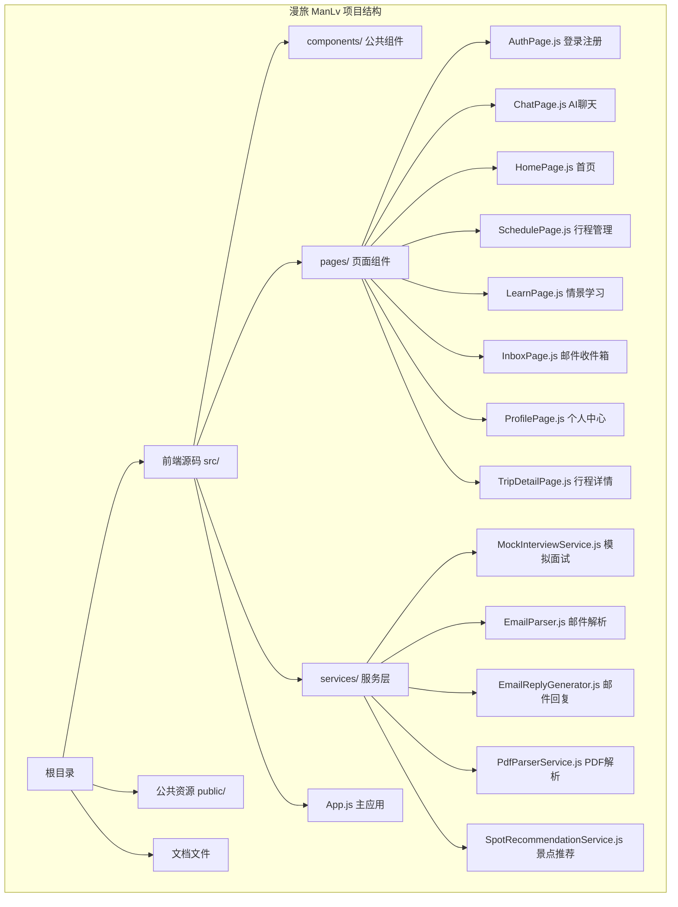
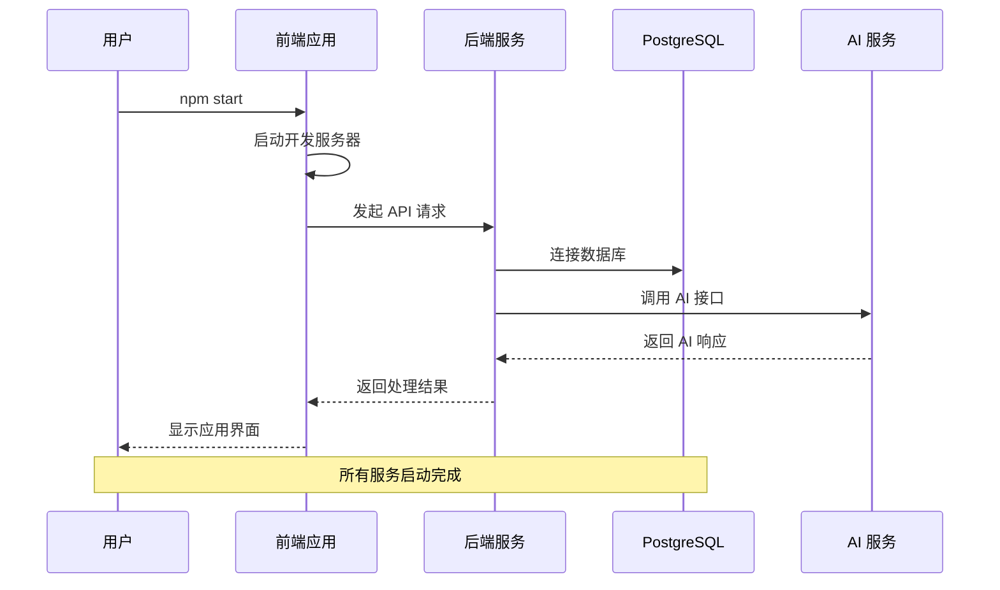
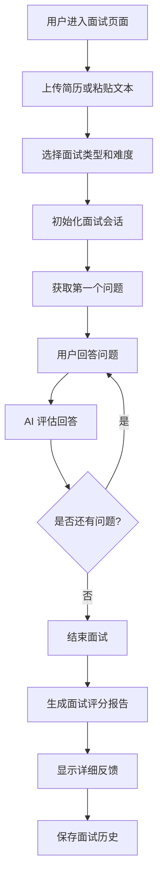
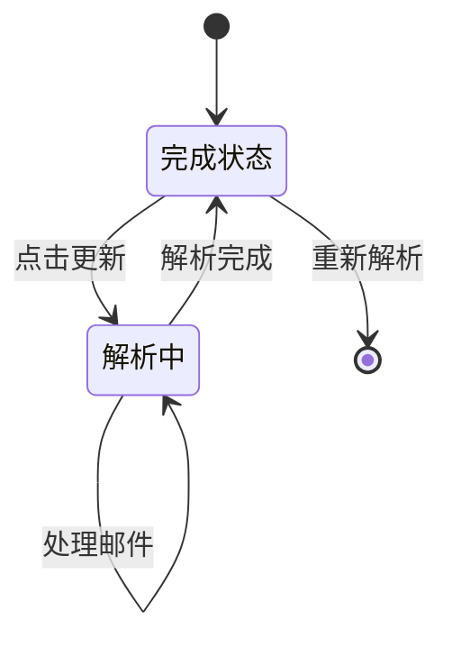

# 快速开始

<cite>
**本文引用的文件**
- [package.json](file://package.json)
- [README.md](file://README.md)
- [QUICK_START.md](file://QUICK_START.md)
- [src/App.js](file://src/App.js)
- [src/pages/ChatPage.js](file://src/pages/ChatPage.js)
- [src/services/MockInterviewService.js](file://src/services/MockInterviewService.js)
- [EMAIL_PARSE_IMPLEMENTATION_SUMMARY.md](file://EMAIL_PARSE_IMPLEMENTATION_SUMMARY.md)
</cite>

## 目录
1. [简介](#简介)
2. [环境要求](#环境要求)
3. [项目结构](#项目结构)
4. [依赖安装](#依赖安装)
5. [环境变量配置](#环境变量配置)
6. [前后端启动流程](#前后端启动流程)
7. [核心功能体验](#核心功能体验)
8. [常见问题排查](#常见问题排查)
9. [故障排除指南](#故障排除指南)
10. [总结](#总结)

## 简介

漫旅 ManLv 是一款面向保研生的 AI 驱动一站式行程伴旅助手。该项目采用前后端分离架构，前端基于 React 18 + React Router DOM 6，后端基于 Node.js + Express + Prisma ORM，数据库使用 PostgreSQL，AI 集成 Qwen 大模型（DashScope）和豆包 API。

## 环境要求

### 系统要求
- **Node.js**: ≥ 18.0.0（推荐使用 LTS 版本）
- **操作系统**: Windows 10+/macOS 10.15+/Linux
- **内存**: 至少 4GB RAM（建议 8GB+）
- **存储**: 至少 500MB 可用空间

### 技术栈要求
- **前端**: React 18, React Router DOM 6, react-markdown, remark-gfm
- **后端**: Node.js, Express, Prisma ORM
- **数据库**: PostgreSQL
- **AI 集成**: Qwen-Plus/Qwen-Max（DashScope），兼容 OpenAI 格式
- **认证**: JWT, bcryptjs
- **地图**: 高德地图 JS API
- **图标**: @icon-park/react

**章节来源**
- [README.md:81-86](file://README.md#L81-L86)
- [README.md:65-76](file://README.md#L65-L76)

## 项目结构



**图表来源**
- [README.md:146-170](file://README.md#L146-L170)
- [src/App.js:1-177](file://src/App.js#L1-L177)

**章节来源**
- [README.md:146-170](file://README.md#L146-L170)
- [src/App.js:1-177](file://src/App.js#L1-L177)

## 依赖安装

### 前端依赖安装

```bash
# 克隆前端仓库
git clone https://github.com/caoyuxuan200205-sketch/manlv-frontend.git
cd manlv-frontend

# 安装前端依赖
npm install

# 启动开发服务器
npm start
# 访问 http://localhost:3000
```

### 后端依赖安装

```bash
# 克隆后端仓库
git clone https://github.com/caoyuxuan200205-sketch/manlv-backend.git
cd manlv-backend

# 安装后端依赖
npm install

# 配置环境变量
cp .env.example .env
# 编辑 .env 文件填入配置
```

### 核心依赖说明

| 依赖包 | 版本 | 用途 |
|--------|------|------|
| react | ^18.2.0 | 前端框架 |
| react-dom | ^18.2.0 | React DOM 渲染 |
| react-router-dom | ^6.20.0 | 路由管理 |
| openai | ^6.33.0 | OpenAI SDK |
| pdfjs-dist | ^5.6.205 | PDF 解析 |
| @amap/amap-jsapi-loader | ^1.0.1 | 高德地图 |
| @icon-park/react | ^1.4.2 | 图标库 |

**章节来源**
- [package.json:5-16](file://package.json#L5-L16)
- [README.md:87-100](file://README.md#L87-L100)

## 环境变量配置

### 前端环境变量

```env
# API 基础 URL
REACT_APP_API_BASE_URL=http://localhost:3001

# 豆包 API 配置
REACT_APP_ARK_API_KEY=8422fd18-aa8a-4e85-9e2a-b8c3a6dc37a6

# 应用配置
REACT_APP_APP_NAME=ManLv
REACT_APP_VERSION=1.0.0
```

### 后端环境变量

```env
# 数据库配置
DATABASE_URL="postgresql://用户名:密码@localhost:5432/manlv"

# JWT 配置
JWT_SECRET=your_jwt_secret_here

# AI 配置（DashScope）
AI_BASE_URL=https://dashscope.aliyuncs.com/compatible-mode/v1
AI_API_KEY=sk-xxxxxxxxxxxxxxxx
AI_MODEL=qwen-plus
AI_MAX_STEPS=6

# 服务端口
PORT=3001

# 应用配置
NODE_ENV=development
```

### 环境变量说明

| 变量名 | 类型 | 必需 | 默认值 | 描述 |
|--------|------|------|--------|------|
| DATABASE_URL | String | 是 | - | PostgreSQL 数据库连接字符串 |
| JWT_SECRET | String | 是 | - | JWT 加密密钥 |
| AI_BASE_URL | String | 是 | - | AI 服务基础 URL |
| AI_API_KEY | String | 是 | - | AI 服务 API 密钥 |
| AI_MODEL | String | 否 | qwen-plus | AI 模型名称 |
| PORT | Number | 否 | 3001 | 服务监听端口 |
| REACT_APP_API_BASE_URL | String | 否 | http://localhost:3001 | API 服务地址 |

**章节来源**
- [README.md:117-134](file://README.md#L117-L134)
- [QUICK_START.md:109-122](file://QUICK_START.md#L109-L122)

## 前后端启动流程

### 完整启动流程



**图表来源**
- [README.md:79-142](file://README.md#L79-L142)

### 详细启动步骤

#### 步骤 1: 设置数据库
```bash
# 启动 PostgreSQL 服务
# 创建数据库 manlv
# 配置数据库用户权限
```

#### 步骤 2: 配置后端环境
```bash
# 进入后端目录
cd manlv-backend

# 安装依赖
npm install

# 配置 .env 文件
cp .env.example .env
# 编辑 .env 文件
```

#### 步骤 3: 初始化数据库
```bash
# 初始化数据库迁移
npx prisma migrate dev

# 启动后端服务
node src/server.js
```

#### 步骤 4: 启动前端应用
```bash
# 进入前端目录
cd manlv-frontend

# 安装依赖
npm install

# 启动开发服务器
npm start
# 访问 http://localhost:3000
```

**章节来源**
- [README.md:136-142](file://README.md#L136-L142)

## 核心功能体验

### AI 模拟面试功能



**图表来源**
- [src/services/MockInterviewService.js:24-182](file://src/services/MockInterviewService.js#L24-L182)

### 豆包 API 集成

项目集成了豆包大模型 API（火山方舟），提供真实的 AI 面试体验：

| 功能特性 | 描述 | 性能指标 |
|----------|------|----------|
| 首次调用 | 1-2 秒 | - |
| 后续调用 | 2-3 秒 | - |
| 单次完整面试 | ~11-13 秒 | - |
| 成本估算 | ~¥0.002/次 | - |

### 邮件智能解析



**图表来源**
- [EMAIL_PARSE_IMPLEMENTATION_SUMMARY.md:356-365](file://EMAIL_PARSE_IMPLEMENTATION_SUMMARY.md#L356-L365)

**章节来源**
- [QUICK_START.md:66-89](file://QUICK_START.md#L66-L89)
- [src/services/MockInterviewService.js:1-519](file://src/services/MockInterviewService.js#L1-L519)

## 常见问题排查

### 环境问题

#### Node.js 版本不兼容
```bash
# 检查 Node.js 版本
node --version

# 如果版本过低，需要升级到 18+
# 推荐使用 nvm 管理 Node.js 版本
```

#### 端口占用问题
```bash
# 检查端口占用
netstat -ano | findstr :3000
netstat -ano | findstr :3001

# 修改端口配置
# .env 文件中的 PORT=3002
```

### 数据库连接问题

#### PostgreSQL 连接失败
```bash
# 检查数据库服务状态
# Windows: net start postgresql-x64-14
# macOS: brew services start postgresql
# Linux: sudo systemctl start postgresql

# 验证连接字符串
# DATABASE_URL="postgresql://用户名:密码@localhost:5432/manlv"
```

#### 数据库迁移失败
```bash
# 检查 Prisma 版本
npx prisma -v

# 重新执行迁移
npx prisma migrate reset
npx prisma migrate dev

# 生成客户端
npx prisma generate
```

### API 调用问题

#### CORS 跨域问题
```javascript
// 在前端应用中配置代理
// package.json 中添加
{
  "proxy": "http://localhost:3001"
}
```

#### JWT 认证失败
```bash
# 检查 JWT_SECRET 配置
# 确保前后端使用相同的密钥
# 清除浏览器缓存重新登录
```

### AI 服务问题

#### 豆包 API 调用失败
```bash
# 检查 API Key 配置
# REACT_APP_ARK_API_KEY=your_key_here

# 验证网络连接
# 访问 https://ark.cn-beijing.volces.com

# 查看浏览器控制台错误
# F12 -> Network -> Console
```

#### DashScope API 配置
```env
# 确保正确的配置
AI_BASE_URL=https://dashscope.aliyuncs.com/compatible-mode/v1
AI_API_KEY=sk-xxxxxxxxxxxxxxxx
AI_MODEL=qwen-plus
```

**章节来源**
- [QUICK_START.md:125-159](file://QUICK_START.md#L125-L159)
- [README.md:120-134](file://README.md#L120-L134)

## 故障排除指南

### 开发环境调试

#### 浏览器开发者工具使用
```bash
# 打开开发者工具
# F12 或 Ctrl+Shift+I

# 查看 Console 标签
# 查看 Network 标签
# 查看 Application 标签
```

#### 常见错误诊断

| 错误类型 | 症状 | 解决方案 |
|----------|------|----------|
| 网络错误 | 404/500 错误 | 检查 API 地址和端口 |
| CORS 错误 | 跨域请求被阻止 | 配置代理或后端 CORS |
| 数据库连接 | 连接超时 | 检查数据库服务状态 |
| JWT 无效 | 401 未授权 | 检查 JWT_SECRET 配置 |
| AI 调用 | API 调用失败 | 检查 API Key 和网络 |

#### 性能优化建议

```bash
# 启用生产模式构建
npm run build

# 检查包大小
npm run analyze

# 优化图片资源
# 使用 WebP 格式
# 压缩 SVG 图标
```

### 部署注意事项

#### 生产环境配置
```env
# 设置为生产环境
NODE_ENV=production

# 配置 HTTPS
HTTPS=true

# 配置反向代理
PROXY_PASS=http://localhost:3001
```

#### 监控和日志
```bash
# 启用详细日志
DEBUG=manlv:*

# 设置日志级别
LOG_LEVEL=info

# 配置错误报告
ERROR_REPORTING=true
```

**章节来源**
- [QUICK_START.md:162-174](file://QUICK_START.md#L162-L174)
- [README.md:174-206](file://README.md#L174-L206)

## 总结

漫旅 ManLv 项目提供了完整的保研生智能伴旅解决方案。通过遵循本快速开始指南，您可以在 30 分钟内完成环境搭建并体验核心功能。

### 关键要点

1. **环境准备**: 确保 Node.js ≥ 18、PostgreSQL 数据库和 DashScope API Key
2. **依赖安装**: 分别安装前后端依赖并配置环境变量
3. **数据库初始化**: 执行 Prisma 迁移并启动数据库服务
4. **应用启动**: 同时启动前后端服务并验证功能
5. **问题排查**: 使用开发者工具和日志进行故障诊断

### 下一步建议

- 完善用户认证功能
- 集成更多 AI 工具和服务
- 优化移动端用户体验
- 添加更多数据分析功能
- 实现多语言支持

通过持续迭代和优化，漫旅 ManLv 将为保研生提供更加智能化和个性化的伴旅体验。