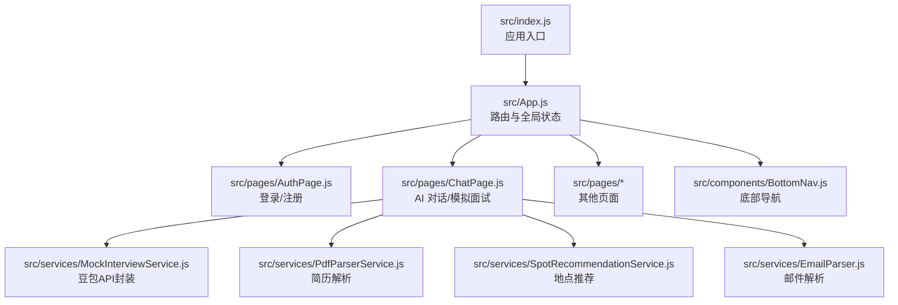
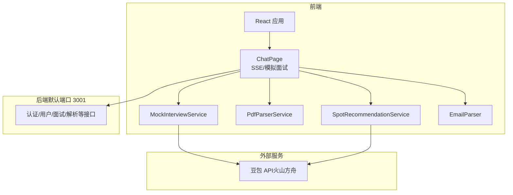
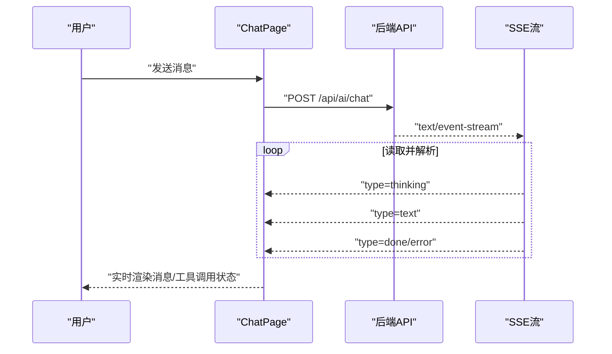
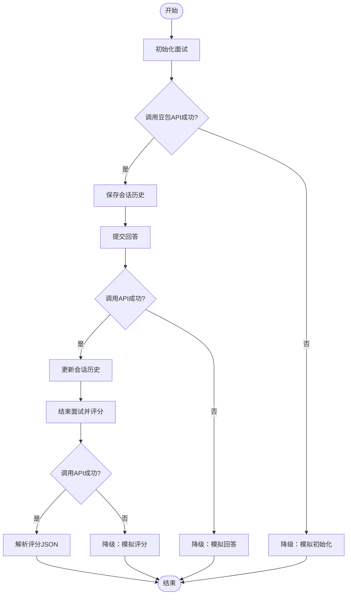
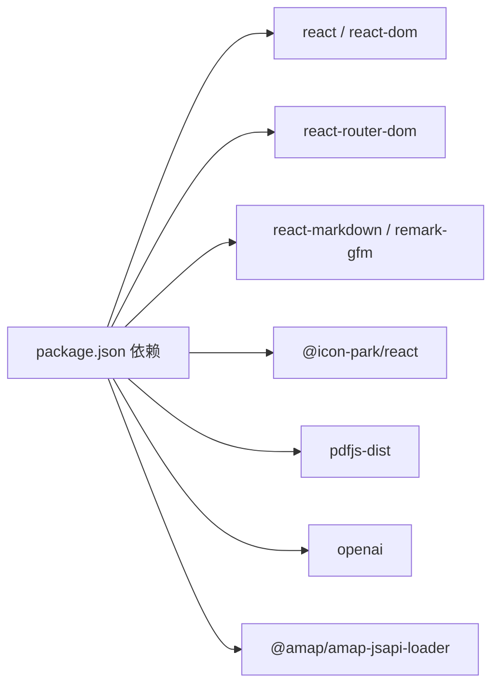

# 故障排除与常见问题

<cite>
**本文引用的文件**
- [package.json](file://package.json)
- [README.md](file://README.md)
- [QUICK_START.md](file://QUICK_START.md)
- [src/index.js](file://src/index.js)
- [src/App.js](file://src/App.js)
- [src/pages/ChatPage.js](file://src/pages/ChatPage.js)
- [src/pages/AuthPage.js](file://src/pages/AuthPage.js)
- [src/services/MockInterviewService.js](file://src/services/MockInterviewService.js)
- [src/services/SpotRecommendationService.js](file://src/services/SpotRecommendationService.js)
- [src/services/PdfParserService.js](file://src/services/PdfParserService.js)
- [src/services/EmailParser.js](file://src/services/EmailParser.js)
- [src/components/BottomNav.js](file://src/components/BottomNav.js)
- [EMAIL_PARSE_INTERACTION_GUIDE.md](file://EMAIL_PARSE_INTERACTION_GUIDE.md)
</cite>

## 目录
1. [简介](#简介)
2. [项目结构](#项目结构)
3. [核心组件](#核心组件)
4. [架构总览](#架构总览)
5. [详细组件分析](#详细组件分析)
6. [依赖关系分析](#依赖关系分析)
7. [性能考虑](#性能考虑)
8. [故障排除指南](#故障排除指南)
9. [结论](#结论)
10. [附录](#附录)

## 简介
本指南面向漫旅 ManLv 项目的开发者与运维人员，系统性梳理开发、运行、部署阶段的常见问题与解决方案，覆盖环境配置、依赖安装、API 调用、AI 服务集成、浏览器与移动端兼容、第三方服务对接、日志分析与性能排查等方面。通过标准化的调试流程与最佳实践，帮助快速定位与修复问题，降低技术支持负担。

## 项目结构
前端采用 React 18 + React Router DOM 6，页面组件位于 src/pages，通用组件位于 src/components，服务层位于 src/services。核心入口为 src/index.js 与 src/App.js，路由控制全局页面跳转与登录守卫。

图表来源
- [src/index.js:1-12](file://src/index.js#L1-L12)
- [src/App.js:1-177](file://src/App.js#L1-L177)
- [src/pages/ChatPage.js:1-482](file://src/pages/ChatPage.js#L1-L482)
- [src/pages/AuthPage.js:1-732](file://src/pages/AuthPage.js#L1-L732)
- [src/components/BottomNav.js:1-43](file://src/components/BottomNav.js#L1-L43)
- [src/services/MockInterviewService.js:1-519](file://src/services/MockInterviewService.js#L1-L519)
- [src/services/PdfParserService.js:1-97](file://src/services/PdfParserService.js#L1-L97)
- [src/services/SpotRecommendationService.js:1-86](file://src/services/SpotRecommendationService.js#L1-L86)
- [src/services/EmailParser.js:1-227](file://src/services/EmailParser.js#L1-L227)

章节来源
- [src/index.js:1-12](file://src/index.js#L1-L12)
- [src/App.js:1-177](file://src/App.js#L1-L177)
- [src/pages/ChatPage.js:1-482](file://src/pages/ChatPage.js#L1-L482)
- [src/pages/AuthPage.js:1-732](file://src/pages/AuthPage.js#L1-L732)
- [src/components/BottomNav.js:1-43](file://src/components/BottomNav.js#L1-L43)
- [src/services/MockInterviewService.js:1-519](file://src/services/MockInterviewService.js#L1-L519)
- [src/services/PdfParserService.js:1-97](file://src/services/PdfParserService.js#L1-L97)
- [src/services/SpotRecommendationService.js:1-86](file://src/services/SpotRecommendationService.js#L1-L86)
- [src/services/EmailParser.js:1-227](file://src/services/EmailParser.js#L1-L227)

## 核心组件
- 应用入口与路由：负责渲染应用壳层、路由守卫与全局聊天助手浮动窗口。
- 登录/注册页：处理账号登录、注册、忘记密码、验证码发送与社交登录。
- AI 对话页：支持通用 AI 对话（SSE 流式输出）与模拟面试（豆包 API）。
- 服务层：
  - MockInterviewService：封装豆包 API，提供初始化面试、提交回答、结束面试、解析简历等能力，并内置降级策略。
  - SpotRecommendationService：基于专业与城市生成地点推荐。
  - PdfParserService：调用后端解析简历（PDF/图片）。
  - EmailParser：解析邮件主题与正文，提取结构化信息。

章节来源
- [src/App.js:14-177](file://src/App.js#L14-L177)
- [src/pages/AuthPage.js:86-211](file://src/pages/AuthPage.js#L86-L211)
- [src/pages/ChatPage.js:12-285](file://src/pages/ChatPage.js#L12-L285)
- [src/services/MockInterviewService.js:24-358](file://src/services/MockInterviewService.js#L24-L358)
- [src/services/SpotRecommendationService.js:18-66](file://src/services/SpotRecommendationService.js#L18-L66)
- [src/services/PdfParserService.js:15-39](file://src/services/PdfParserService.js#L15-L39)
- [src/services/EmailParser.js:12-224](file://src/services/EmailParser.js#L12-L224)

## 架构总览
前端通过 fetch 调用后端 API（默认 http://localhost:3001），AI 对话采用 SSE 流式接收；模拟面试与地点推荐通过 REST 直接调用豆包 API；简历解析与邮件解析由后端服务配合前端完成。

图表来源
- [src/pages/ChatPage.js:12-285](file://src/pages/ChatPage.js#L12-L285)
- [src/services/MockInterviewService.js:16-118](file://src/services/MockInterviewService.js#L16-L118)
- [src/services/PdfParserService.js:6-26](file://src/services/PdfParserService.js#L6-L26)
- [src/services/SpotRecommendationService.js:18-48](file://src/services/SpotRecommendationService.js#L18-L48)

## 详细组件分析

### 组件 A：AI 对话页（SSE 流式输出）
- 控制流：用户输入消息后，向后端 /api/ai/chat 发送 POST，使用 fetch 的 readable stream 逐行解析 data: 行，分别处理 thinking/text/done/error 类型事件。
- 错误处理：HTTP 非 2xx 抛出异常，捕获后显示“AI 服务调用失败”；SSE 解码异常被忽略，保证对话连续性。
- 上下文面板：首次用户消息后自动隐藏，避免干扰对话。

图表来源
- [src/pages/ChatPage.js:199-285](file://src/pages/ChatPage.js#L199-L285)

章节来源
- [src/pages/ChatPage.js:12-285](file://src/pages/ChatPage.js#L12-L285)

### 组件 B：模拟面试服务（豆包 API）
- 初始化面试：构建系统提示词，调用豆包 REST API 获取首个问题，失败则降级为模拟数据。
- 提交回答：追加用户回答到会话历史，调用 API 获取 AI 反馈，失败则降级。
- 结束面试：要求生成结构化评分报告，解析 JSON，失败则降级。
- 简历解析：调用 API 提取简历关键信息，失败则返回原始文本或错误标记。
- 降级策略：统一在 catch 中记录日志并返回模拟数据，确保 UI 可用。

图表来源
- [src/services/MockInterviewService.js:24-358](file://src/services/MockInterviewService.js#L24-L358)

章节来源
- [src/services/MockInterviewService.js:1-519](file://src/services/MockInterviewService.js#L1-L519)

### 组件 C：简历解析服务（后端配合）
- 前端通过 FormData 上传文件，携带 Bearer Token 调用 /api/parse-resume。
- 支持类型：PDF、JPG、PNG；失败时抛出错误并记录日志。

章节来源
- [src/services/PdfParserService.js:15-39](file://src/services/PdfParserService.js#L15-L39)

### 组件 D：邮件解析服务
- 从主题与正文提取学校、活动类型、日期范围、截止日期、地点、链接、描述摘要、优先级与建议操作。
- 优先级计算：紧急、高、普通；结合目标高校与截止日期影响。

章节来源
- [src/services/EmailParser.js:12-224](file://src/services/EmailParser.js#L12-L224)

## 依赖关系分析
- 前端依赖：React、React Router DOM、react-markdown、remark-gfm、@icon-park/react、pdfjs-dist、openai、@amap/amap-jsapi-loader。
- 浏览器兼容：生产环境目标为“Chrome/Firefox/Safari 最近版本”，开发环境为“最近 1 个浏览器版本”。
- 环境变量：
  - 前端：REACT_APP_API_BASE_URL（后端地址）、REACT_APP_ARK_API_KEY（豆包 API Key）、REACT_APP_API_URL（内部 API 地址）。
  - 后端：DATABASE_URL、JWT_SECRET、AI_BASE_URL、AI_API_KEY、AI_MODEL、AI_MAX_STEPS、PORT。

图表来源
- [package.json:5-16](file://package.json#L5-L16)

章节来源
- [package.json:1-41](file://package.json#L1-L41)
- [README.md:117-134](file://README.md#L117-L134)

## 性能考虑
- 模拟面试端到端耗时参考：初始化问题约 1-2s，提交回答各约 2-3s，最终评分约 2-3s，总计约 11-13s；建议在 UI 层提供“加载中”与“预计耗时”提示。
- SSE 流式渲染：逐字增量更新，避免一次性渲染大量内容导致卡顿。
- 降级策略：API 不可用时返回模拟数据，保障用户体验与功能可用性。

章节来源
- [QUICK_START.md:164-174](file://QUICK_START.md#L164-L174)
- [src/pages/ChatPage.js:213-271](file://src/pages/ChatPage.js#L213-L271)

## 故障排除指南

### 一、环境配置问题
- Node.js 版本不满足要求
  - 现象：安装依赖时报错或运行报错。
  - 排查：确认 Node.js 版本 ≥ 18。
  - 参考：[README.md:81-86](file://README.md#L81-L86)
- 浏览器兼容性不佳
  - 现象：页面样式或交互异常。
  - 排查：使用开发环境目标浏览器（Chrome/Firefox/Safari 最近版本）测试；检查 browserslist 配置。
  - 参考：[package.json:28-39](file://package.json#L28-L39)
- 环境变量缺失
  - 现象：模拟面试/地点推荐/简历解析失败或返回降级数据。
  - 排查：检查 .env.local（REACT_APP_ARK_API_KEY）与前端 API 基础地址（REACT_APP_API_BASE_URL）；后端 .env（DATABASE_URL、JWT_SECRET、AI_*）。
  - 参考：[QUICK_START.md:109-122](file://QUICK_START.md#L109-L122)、[README.md:117-134](file://README.md#L117-L134)

章节来源
- [README.md:81-86](file://README.md#L81-L86)
- [package.json:28-39](file://package.json#L28-L39)
- [QUICK_START.md:109-122](file://QUICK_START.md#L109-L122)
- [README.md:117-134](file://README.md#L117-L134)

### 二、依赖安装问题
- npm install 失败
  - 现象：安装阶段报错（权限、网络、缓存）。
  - 排查：清理缓存、更换镜像源、检查代理；确保 Node 版本满足要求。
  - 参考：[README.md:89-99](file://README.md#L89-L99)
- 依赖版本冲突
  - 现象：打包或运行时报错。
  - 排查：锁定版本、删除 node_modules 与 lockfile 后重装；检查 package.json 依赖范围。
  - 参考：[package.json:5-16](file://package.json#L5-L16)

章节来源
- [README.md:89-99](file://README.md#L89-L99)
- [package.json:5-16](file://package.json#L5-L16)

### 三、API 调用错误
- 登录/注册失败
  - 现象：返回错误信息或网络异常。
  - 排查：检查后端地址（默认 http://localhost:3001）、Token 设置、后端接口状态；查看浏览器 Network 面板与 Console 错误。
  - 参考：[src/pages/AuthPage.js:98-121](file://src/pages/AuthPage.js#L98-L121)、[src/pages/AuthPage.js:149-170](file://src/pages/AuthPage.js#L149-L170)
- AI 对话不可用
  - 现象：SSE 流异常或提示“AI 服务暂时不可用”。
  - 排查：确认后端 /api/ai/chat 可用、Authorization 头有效、网络稳定；检查后端日志与限流策略。
  - 参考：[src/pages/ChatPage.js:199-209](file://src/pages/ChatPage.js#L199-L209)
- 模拟面试初始化/回答/评分失败
  - 现象：返回“面试系统暂时不可用”或降级提示。
  - 排查：检查豆包 API Key 有效性、网络连通性、请求频率限制；查看 Console 日志。
  - 参考：[src/services/MockInterviewService.js:141-182](file://src/services/MockInterviewService.js#L141-L182)、[src/services/MockInterviewService.js:219-247](file://src/services/MockInterviewService.js#L219-L247)、[src/services/MockInterviewService.js:305-358](file://src/services/MockInterviewService.js#L305-L358)
- 简历解析失败
  - 现象：返回错误或解析结果为空。
  - 排查：确认文件类型与大小、后端 /api/parse-resume 可用、Token 有效。
  - 参考：[src/services/PdfParserService.js:15-39](file://src/services/PdfParserService.js#L15-L39)

章节来源
- [src/pages/AuthPage.js:98-121](file://src/pages/AuthPage.js#L98-L121)
- [src/pages/AuthPage.js:149-170](file://src/pages/AuthPage.js#L149-L170)
- [src/pages/ChatPage.js:199-209](file://src/pages/ChatPage.js#L199-L209)
- [src/services/MockInterviewService.js:141-182](file://src/services/MockInterviewService.js#L141-L182)
- [src/services/MockInterviewService.js:219-247](file://src/services/MockInterviewService.js#L219-L247)
- [src/services/MockInterviewService.js:305-358](file://src/services/MockInterviewService.js#L305-L358)
- [src/services/PdfParserService.js:15-39](file://src/services/PdfParserService.js#L15-L39)

### 四、AI 服务集成问题
- 豆包 API Key 无效或配额不足
  - 现象：模拟面试/地点推荐频繁降级。
  - 排查：更换 REACT_APP_ARK_API_KEY、检查配额与频率限制；必要时在后端侧代理以隐藏密钥。
  - 参考：[QUICK_START.md:113-115](file://QUICK_START.md#L113-L115)、[src/services/MockInterviewService.js:8-11](file://src/services/MockInterviewService.js#L8-L11)
- 网络不稳定或超时
  - 现象：响应缓慢或中断。
  - 排查：检查网络连通性、DNS 解析、防火墙；前端增加重试与降级提示。
  - 参考：[QUICK_START.md:133-141](file://QUICK_START.md#L133-L141)
- 输出格式不符合预期
  - 现象：评分 JSON 解析失败，回退为自由文本。
  - 排查：检查系统提示词与输出约束，确保返回 JSON 结构；前端增强容错与提示。
  - 参考：[src/services/MockInterviewService.js:330-346](file://src/services/MockInterviewService.js#L330-L346)

章节来源
- [QUICK_START.md:113-115](file://QUICK_START.md#L113-L115)
- [src/services/MockInterviewService.js:8-11](file://src/services/MockInterviewService.js#L8-L11)
- [QUICK_START.md:133-141](file://QUICK_START.md#L133-L141)
- [src/services/MockInterviewService.js:330-346](file://src/services/MockInterviewService.js#L330-L346)

### 五、浏览器与移动端兼容
- 移动端输入框高度与滚动
  - 现象：键盘弹起遮挡输入框或滚动异常。
  - 排查：使用 ResizeObserver 动态调整输入区域高度；确保容器具备合适的 padding 与 overflow。
  - 参考：[src/pages/ChatPage.js:62-102](file://src/pages/ChatPage.js#L62-L102)
- 浏览器控制台与网络面板
  - 现象：接口报错或跨域问题。
  - 排查：打开 F12 → Console/Network，检查状态码、CORS、请求头 Authorization。
  - 参考：[QUICK_START.md:95-106](file://QUICK_START.md#L95-L106)

章节来源
- [src/pages/ChatPage.js:62-102](file://src/pages/ChatPage.js#L62-L102)
- [QUICK_START.md:95-106](file://QUICK_START.md#L95-L106)

### 六、第三方服务集成问题
- 高德地图 JS API
  - 现象：地图不显示或报错。
  - 排查：确认 AK 有效、域名白名单、HTTPS 环境；检查脚本加载时机。
  - 参考：[package.json:6](file://package.json#L6)
- PDF.js
  - 现象：PDF 预览异常。
  - 排查：确认 pdfjs-dist 版本与浏览器兼容性；检查 worker 路径与跨域。
  - 参考：[package.json:9](file://package.json#L9)

章节来源
- [package.json:6](file://package.json#L6)
- [package.json:9](file://package.json#L9)

### 七、日志分析与调试技巧
- 浏览器端
  - 打开开发者工具 → Console/Network，观察错误堆栈与请求详情；关注 SSE 事件类型与解析异常。
  - 参考：[src/pages/ChatPage.js:267-270](file://src/pages/ChatPage.js#L267-L270)
- 前端服务降级日志
  - 模拟面试/地点推荐在 API 失败时会打印降级日志，便于定位问题。
  - 参考：[src/services/MockInterviewService.js:177-181](file://src/services/MockInterviewService.js#L177-L181)、[src/services/SpotRecommendationService.js:62-65](file://src/services/SpotRecommendationService.js#L62-L65)
- 邮件解析交互指南
  - 包含故障场景处理建议（解析失败、网络超时、无邮件解析）。
  - 参考：[EMAIL_PARSE_INTERACTION_GUIDE.md:372-396](file://EMAIL_PARSE_INTERACTION_GUIDE.md#L372-L396)

章节来源
- [src/pages/ChatPage.js:267-270](file://src/pages/ChatPage.js#L267-L270)
- [src/services/MockInterviewService.js:177-181](file://src/services/MockInterviewService.js#L177-L181)
- [src/services/SpotRecommendationService.js:62-65](file://src/services/SpotRecommendationService.js#L62-L65)
- [EMAIL_PARSE_INTERACTION_GUIDE.md:372-396](file://EMAIL_PARSE_INTERACTION_GUIDE.md#L372-L396)

### 八、预防性措施与最佳实践
- 环境变量管理
  - 使用 .env.local 存放前端密钥；后端使用 .env；区分开发/生产环境。
  - 参考：[QUICK_START.md:109-122](file://QUICK_START.md#L109-L122)、[README.md:117-134](file://README.md#L117-L134)
- 降级与容错
  - 所有外部 API 调用均应具备降级策略，保证 UI 可用与提示友好。
  - 参考：[src/services/MockInterviewService.js:177-181](file://src/services/MockInterviewService.js#L177-L181)、[src/services/SpotRecommendationService.js:62-65](file://src/services/SpotRecommendationService.js#L62-L65)
- 性能与体验
  - SSE 流式渲染、输入框自适应高度、加载提示与预计耗时。
  - 参考：[src/pages/ChatPage.js:213-271](file://src/pages/ChatPage.js#L213-L271)、[QUICK_START.md:164-174](file://QUICK_START.md#L164-L174)
- 兼容性与无障碍
  - 使用现代浏览器目标；遵循 WCAG 对比度与键盘导航建议。
  - 参考：[package.json:28-39](file://package.json#L28-L39)、[EMAIL_PARSE_INTERACTION_GUIDE.md:339-368](file://EMAIL_PARSE_INTERACTION_GUIDE.md#L339-L368)

章节来源
- [QUICK_START.md:109-122](file://QUICK_START.md#L109-L122)
- [README.md:117-134](file://README.md#L117-L134)
- [src/services/MockInterviewService.js:177-181](file://src/services/MockInterviewService.js#L177-L181)
- [src/services/SpotRecommendationService.js:62-65](file://src/services/SpotRecommendationService.js#L62-L65)
- [src/pages/ChatPage.js:213-271](file://src/pages/ChatPage.js#L213-L271)
- [QUICK_START.md:164-174](file://QUICK_START.md#L164-L174)
- [package.json:28-39](file://package.json#L28-L39)
- [EMAIL_PARSE_INTERACTION_GUIDE.md:339-368](file://EMAIL_PARSE_INTERACTION_GUIDE.md#L339-L368)

## 结论
通过标准化的调试流程、完善的降级策略与良好的日志记录，漫旅 ManLv 在前端与外部 AI 服务集成方面具备较强的抗风险能力。建议持续完善环境变量管理、性能监控与用户体验提示，以进一步降低故障率与支持成本。

## 附录
- 快速开始与集成参考：[QUICK_START.md](file://QUICK_START.md)
- 产品技术栈与 API 概览：[README.md](file://README.md)
- 项目入口与路由：[src/index.js](file://src/index.js)、[src/App.js](file://src/App.js)
- 页面与组件清单：[src/pages/ChatPage.js](file://src/pages/ChatPage.js)、[src/pages/AuthPage.js](file://src/pages/AuthPage.js)、[src/components/BottomNav.js](file://src/components/BottomNav.js)
- 服务层清单：[src/services/MockInterviewService.js](file://src/services/MockInterviewService.js)、[src/services/PdfParserService.js](file://src/services/PdfParserService.js)、[src/services/SpotRecommendationService.js](file://src/services/SpotRecommendationService.js)、[src/services/EmailParser.js](file://src/services/EmailParser.js)