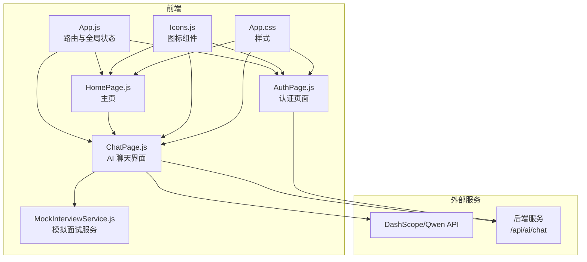
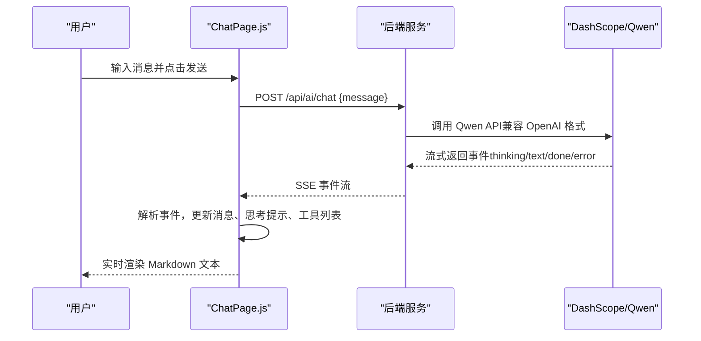
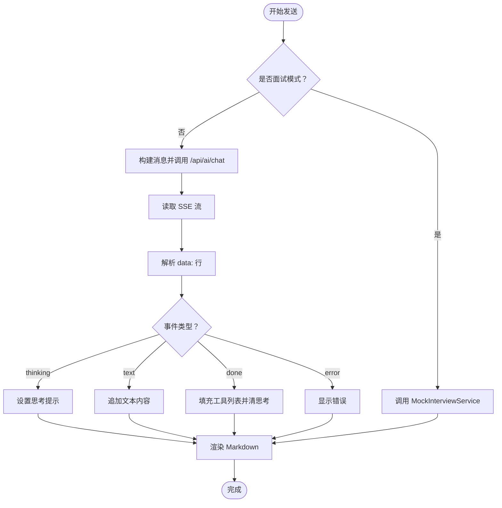
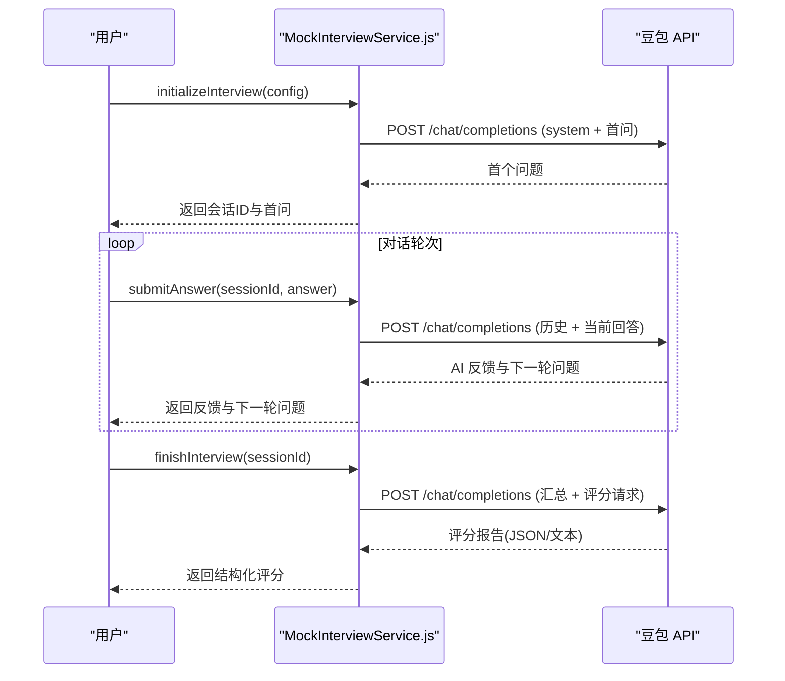
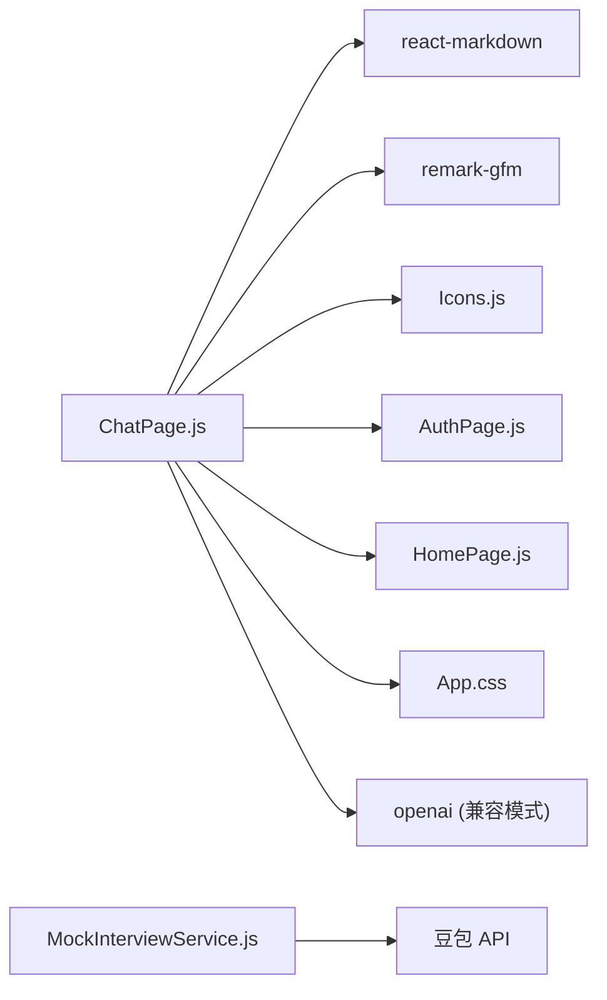

# AI 智能助手

<cite>
**本文引用的文件**
- [README.md](file://README.md)
- [package.json](file://package.json)
- [src/App.js](file://src/App.js)
- [src/App.css](file://src/App.css)
- [src/pages/ChatPage.js](file://src/pages/ChatPage.js)
- [src/pages/AuthPage.js](file://src/pages/AuthPage.js)
- [src/pages/HomePage.js](file://src/pages/HomePage.js)
- [src/services/MockInterviewService.js](file://src/services/MockInterviewService.js)
- [src/components/Icons.js](file://src/components/Icons.js)
</cite>

## 更新摘要
**变更内容**
- AI头像系统完全重构：从机器人图标替换为自定义猴子头像
- 使用静态图像资源 `/ai-avatar-monkey.png` 替代原有的图标组件
- 支持最小模式和全尺寸显示模式，适配不同界面场景
- 更新相关样式定义以支持新的头像显示方式

## 目录
1. [引言](#引言)
2. [项目结构](#项目结构)
3. [核心组件](#核心组件)
4. [架构总览](#架构总览)
5. [详细组件分析](#详细组件分析)
6. [AI头像系统重构](#ai头像系统重构)
7. [依赖关系分析](#依赖关系分析)
8. [性能考虑](#性能考虑)
9. [故障排查指南](#故障排查指南)
10. [结论](#结论)
11. [附录](#附录)

## 引言
本文件面向开发者，系统化梳理漫旅 ManLv 的 AI 智能助手实现，覆盖对话聊天功能、消息发送接收、流式输出处理、Markdown 渲染机制、工具调用集成、上下文管理与会话状态维护、与 DashScope/Qwen 大模型的集成方案、API 调用策略与错误处理、组件架构与状态管理、性能优化与用户体验优化实践。

## 项目结构
前端采用 React 18 + React Router DOM 6，核心页面包含登录/注册、首页、行程管理、学习引擎、邮件解析、个人中心与 AI 聊天。AI 聊天页面负责与后端 AI Agent 通信，支持 SSE 流式输出与 Markdown 渲染。



图表来源
- [src/App.js:1-177](file://src/App.js#L1-L177)
- [src/pages/ChatPage.js:1-482](file://src/pages/ChatPage.js#L1-L482)
- [src/pages/AuthPage.js:1-732](file://src/pages/AuthPage.js#L1-L732)
- [src/pages/HomePage.js:1-263](file://src/pages/HomePage.js#L1-L263)
- [src/services/MockInterviewService.js:1-519](file://src/services/MockInterviewService.js#L1-L519)
- [src/components/Icons.js:1-259](file://src/components/Icons.js#L1-L259)
- [src/App.css:1-800](file://src/App.css#L1-L800)

章节来源
- [README.md:146-171](file://README.md#L146-L171)
- [package.json:1-41](file://package.json#L1-L41)

## 核心组件
- 全局应用壳与浮动助手卡片：在 App.js 中定义全局登录态、浮动助手窗口、消息列表与输入框，支持最小化与展开切换。
- 聊天页面：ChatPage.js 负责渲染消息、处理发送逻辑、解析 SSE 流、渲染 Markdown、显示工具调用状态与"思考中"提示。
- 认证页面：AuthPage.js 提供登录/注册/忘记密码流程，与后端认证接口交互。
- 主页：HomePage.js 展示行程倒计时、任务清单、快捷入口与情绪签到，支持跳转到 AI 助手。
- 模拟面试服务：MockInterviewService.js 集成豆包（火山方舟）API，提供初始化面试、提交回答、结束面试与评分、简历解析等能力。
- 图标库：Icons.js 提供统一 SVG 图标组件，用于页面与聊天界面。

章节来源
- [src/App.js:14-177](file://src/App.js#L14-L177)
- [src/pages/ChatPage.js:9-482](file://src/pages/ChatPage.js#L9-L482)
- [src/pages/AuthPage.js:6-732](file://src/pages/AuthPage.js#L6-L732)
- [src/pages/HomePage.js:8-263](file://src/pages/HomePage.js#L8-L263)
- [src/services/MockInterviewService.js:7-519](file://src/services/MockInterviewService.js#L7-L519)
- [src/components/Icons.js:1-259](file://src/components/Icons.js#L1-L259)

## 架构总览
AI 聊天采用前后端分离架构：前端通过 fetch 发送 POST 到后端 /api/ai/chat，后端以 text/event-stream 形式返回事件，前端使用 ReadableStream Reader 逐块解析，按事件类型更新 UI。



图表来源
- [src/pages/ChatPage.js:185-285](file://src/pages/ChatPage.js#L185-L285)
- [README.md:174-196](file://README.md#L174-L196)

章节来源
- [README.md:33-36](file://README.md#L33-L36)
- [README.md:174-196](file://README.md#L174-L196)

## 详细组件分析

### 聊天页面（ChatPage.js）
- 状态管理
  - messages：消息数组，包含用户与 AI 消息、时间戳、思考提示、工具调用结果等字段。
  - inputValue：输入框值。
  - isTyping：输入态指示器。
  - showContextPanel：上下文面板开关（非面试模式）。
  - headerHeight/inputAreaHeight：动态计算布局，适配键盘与 ResizeObserver。
- 发送流程
  - 非面试模式：构造消息，调用后端 /api/ai/chat，使用 fetch(response.body.getReader()) 读取 SSE。
  - 面试模式：通过 MockInterviewService 直接调用豆包 API，返回反馈与下一个问题。
- SSE 解析
  - 逐块解码，按行解析 data: JSON 字符串，支持事件类型：
    - thinking：显示"正在调用工具：..."
    - text：增量拼接到当前 AI 消息 content
    - done：填充 usedTools 列表，清除思考提示
    - error：显示错误提示
- Markdown 渲染
  - 使用 react-markdown + remark-gfm 插件，支持标题、加粗、列表、表格等。
- 工具调用与上下文
  - 前端不直接执行工具，仅展示后端返回的工具名称与结果；工具调用由后端 Agent 负责。
  - 上下文面板提供"灵感"快捷问题，减少用户输入负担。
- 错误处理
  - 登录态缺失时提示重新登录；
  - 后端响应非 OK 时捕获错误并提示；
  - SSE 解析异常时忽略单行错误，保证稳定性。



图表来源
- [src/pages/ChatPage.js:133-285](file://src/pages/ChatPage.js#L133-L285)
- [src/pages/ChatPage.js:384-386](file://src/pages/ChatPage.js#L384-L386)

章节来源
- [src/pages/ChatPage.js:9-482](file://src/pages/ChatPage.js#L9-L482)
- [package.json:10-15](file://package.json#L10-L15)

### 全局应用壳与浮动助手（App.js）
- 全局状态
  - isLoggedIn：登录态控制页面路由与助手可见性。
  - assistantMessages：浮动助手默认消息与用户发送的消息队列。
  - showAssistant/isMinimized：助手窗口显隐与最小化状态。
- 交互行为
  - 支持 Enter 发送、自动滚动到底部、最小化/展开切换。
  - 默认 AI 回复为随机文案（演示用途）。

章节来源
- [src/App.js:14-177](file://src/App.js#L14-L177)

### 认证页面（AuthPage.js）
- 功能点
  - 登录/注册/忘记密码三态切换；
  - 手机号格式校验、验证码倒计时；
  - 密码强度与规则提示；
  - 社交登录占位（微信/QQ/支付宝）。
- 与后端交互
  - 登录/注册/重置密码均调用后端接口，成功后写入本地 token 并触发登录回调。

章节来源
- [src/pages/AuthPage.js:6-732](file://src/pages/AuthPage.js#L6-L732)

### 主页（HomePage.js）
- 功能点
  - 问候语、倒计时、任务清单、快捷入口、AI 助手卡片、情绪签到、行程列表。
  - 情绪签到为"焦虑/疲惫"时自动跳转到聊天页并带入预填内容。
- 与聊天联动
  - 多处快捷入口可直接跳转到聊天页并传入预填内容。

章节来源
- [src/pages/HomePage.js:8-263](file://src/pages/HomePage.js#L8-L263)

### 模拟面试服务（MockInterviewService.js）
- 目标
  - 集成豆包（火山方舟）API，提供保研面试全流程：初始化、提交回答、结束并生成评分报告。
- 关键流程
  - initializeInterview：构造系统提示词与首问，调用豆包 API 获取首个问题并缓存会话。
  - submitAnswer：追加用户回答，调用豆包 API 获取 AI 反馈与下一个问题。
  - finishInterview：汇总对话历史，要求 AI 输出结构化评分报告，解析 JSON 或回退为自由文本。
  - parseResume：解析简历文本并抽取结构化信息。
- 降级策略
  - API 失败时降级为本地模拟数据，保障开发体验。



图表来源
- [src/services/MockInterviewService.js:24-358](file://src/services/MockInterviewService.js#L24-L358)

章节来源
- [src/services/MockInterviewService.js:7-519](file://src/services/MockInterviewService.js#L7-L519)

### 图标组件（Icons.js）
- 统一 SVG 图标库，用于导航、聊天、表单与功能按钮，确保视觉一致性与可访问性。

章节来源
- [src/components/Icons.js:1-259](file://src/components/Icons.js#L1-L259)

## AI头像系统重构

### 头像系统概述
AI头像系统已完全重构，从之前的机器人图标替换为自定义猴子头像，使用静态图像资源 `/ai-avatar-monkey.png`。该系统支持两种显示模式：最小模式和全尺寸显示模式，适配不同的界面场景。

### 头像组件实现
在 ChatPage.js 中，AI头像通过以下方式实现：

```jsx
<div className={`ai-avatar ${isInterviewMode ? 'minimal' : ''}`}>
  
  <div className="ai-status-dot" />
</div>
```

以及消息气泡中的头像：

```jsx
<div className="msg-ai-meta">
  <div className="msg-avatar-mini">
    
  </div>
  <span className="msg-ai-name">{isInterviewMode ? 'Interview AI' : 'ManLv AI'}</span>
</div>
```

### 最小模式支持
当处于面试模式时，AI头像会应用 `minimal` 类名，使用更紧凑的显示样式：

```jsx
<div className={`ai-avatar ${isInterviewMode ? 'minimal' : ''}`}>
  
  <div className="ai-status-dot" />
</div>
```

### 样式定义
AI头像的样式定义分布在两个主要位置：

#### 主要头像样式（全尺寸模式）
```css
.ai-avatar {
  width: 40px;
  height: 40px;
  background: linear-gradient(135deg, var(--gold) 0%, var(--gold-light) 100%);
  border-radius: 12px;
  display: flex;
  align-items: center;
  justify-content: center;
  color: var(--ink);
  font-weight: bold;
  position: relative;
  box-shadow: 0 2px 8px var(--shadow-glow);
}

.ai-avatar-img {
  width: 36px;
  height: 36px;
  object-fit: cover;
  border-radius: 12px;
  background: transparent;
}
```

#### 最小模式样式
```css
.ai-avatar.minimal {
  background: rgba(61,56,48,0.08);
  border: 1px solid rgba(61,56,48,0.22);
  border-radius: 50%;
}

.ai-avatar.minimal .ai-avatar-img {
  width: 32px;
  height: 32px;
  object-fit: cover;
  border-radius: 10px;
}
```

### 主页AI卡片头像
在 HomePage.js 中，AI卡片同样使用相同的猴子头像：

```jsx
<div className="ai-card-avatar">
  
</div>
```

对应的样式定义：

```css
.ai-card-avatar {
  width: 48px;
  height: 48px;
  background: transparent;
  border-radius: 12px;
  display: flex;
  align-items: center;
  justify-content: center;
  flex-shrink: 0;
  color: var(--ink);
}

.ai-card-avatar-img {
  width: 44px;
  height: 44px;
  object-fit: cover;
  border-radius: 10px;
}
```

### 状态指示器
所有AI头像都配有状态指示器，使用绿色圆点表示在线状态：

```css
.ai-status-dot {
  width: 8px;
  height: 8px;
  background: #4ade80;
  border-radius: 50%;
  position: absolute;
  bottom: 2px;
  right: 2px;
  border: 2px solid var(--paper);
  animation: pulse 2s ease-in-out infinite;
}
```

### 设计优势
- **品牌一致性**：猴子头像符合漫旅的品牌形象，更加亲切和个性化
- **性能优化**：使用静态图片资源，避免运行时图标渲染开销
- **响应式设计**：支持最小模式和全尺寸模式，适配不同界面布局
- **状态可视化**：通过状态指示器直观显示AI助手的在线状态

章节来源
- [src/pages/ChatPage.js:338-341](file://src/pages/ChatPage.js#L338-L341)
- [src/pages/ChatPage.js:370-372](file://src/pages/ChatPage.js#L370-L372)
- [src/pages/HomePage.js:182-184](file://src/pages/HomePage.js#L182-L184)
- [src/App.css:1859-1883](file://src/App.css#L1859-L1883)
- [src/App.css:5285-5334](file://src/App.css#L5285-L5334)

## 依赖关系分析
- 前端依赖
  - react-markdown + remark-gfm：用于 Markdown 渲染；
  - @icon-park/react：图标库（已重构为静态图片资源）；
  - openai：兼容 DashScope OpenAI 兼容模式（README 提及）。
- 运行时环境
  - REACT_APP_API_BASE_URL：后端 API 基础地址；
  - REACT_APP_ARK_API_KEY：豆包 API Key（模拟面试）；
  - 环境变量：AI_BASE_URL、AI_API_KEY、AI_MODEL、AI_MAX_STEPS（README 提及）。



图表来源
- [package.json:10-15](file://package.json#L10-L15)
- [README.md:126-131](file://README.md#L126-L131)
- [src/pages/ChatPage.js:6-7](file://src/pages/ChatPage.js#L6-L7)

章节来源
- [package.json:1-41](file://package.json#L1-L41)
- [README.md:126-131](file://README.md#L126-L131)

## 性能考虑
- 流式渲染
  - 使用 ReadableStream Reader 逐块解码，避免一次性解析大块数据，降低主线程阻塞风险。
- 增量更新
  - text 事件仅追加内容，done 事件一次性填充工具列表，减少不必要的重渲染。
- 布局自适应
  - 使用 ResizeObserver 与 offsetHeight 动态计算输入区域与头部高度，避免布局抖动。
- 图标与样式
  - SVG 图标体积小、可缩放；CSS 使用相对单位与媒体查询，适配移动端。
- 本地降级
  - MockInterviewService 在网络异常时返回模拟数据，保障可用性。
- **头像性能优化**
  - 使用静态图片资源替代图标组件，减少运行时渲染开销
  - 支持懒加载和缓存，提升页面加载速度

## 故障排查指南
- SSE 未显示内容
  - 检查后端是否返回正确的 Content-Type 与事件格式；
  - 确认前端 reader 是否正确读取 response.body；
  - 查看控制台是否存在 JSON 解析错误（逐行解析，忽略非 data 行）。
- 工具调用未显示
  - 确认后端是否返回 thinking 与 done 事件；
  - 检查工具名称映射是否正确。
- Markdown 渲染异常
  - 确认 remark-gfm 插件已启用；
  - 检查内容是否包含不被支持的语法。
- 登录态失效
  - 检查本地 token 是否存在；
  - 认证失败时后端会返回错误，前端应提示重新登录。
- 模拟面试不可用
  - 检查 ARK_API_KEY 与模型 ID；
  - 网络异常时服务会降级为模拟数据。
- **AI头像显示问题**
  - 检查 `/ai-avatar-monkey.png` 资源路径是否正确
  - 确认图片资源是否可正常加载
  - 检查 CSS 样式类名是否正确应用
  - 验证最小模式和全尺寸模式的样式切换逻辑

章节来源
- [src/pages/ChatPage.js:185-285](file://src/pages/ChatPage.js#L185-L285)
- [src/services/MockInterviewService.js:176-182](file://src/services/MockInterviewService.js#L176-L182)

## 结论
漫旅 AI 智能助手通过前后端协作，实现了流畅的对话体验：SSE 流式输出、Markdown 渲染、工具调用可视化与上下文管理。前端以 ChatPage.js 为核心，配合认证与主页，形成完整的用户旅程；后端通过 DashScope/Qwen 提供强大推理能力。MockInterviewService 作为补充，进一步拓展了保研场景下的智能问答与面试辅助能力。

**AI头像系统重构**显著提升了用户体验和品牌一致性，通过自定义猴子头像替代传统的机器人图标，使AI助手更具亲和力和识别度。静态图片资源的使用优化了性能表现，支持多种显示模式适配不同界面需求。

整体架构清晰、扩展性强，适合持续迭代与功能扩展。

## 附录
- 环境变量参考（README）
  - AI_BASE_URL、AI_API_KEY、AI_MODEL、AI_MAX_STEPS
- API 接口参考（README）
  - POST /api/ai/chat 返回 SSE 事件：thinking、text、done、error
- **AI头像资源**
  - `/ai-avatar-monkey.png`：自定义猴子头像静态资源
  - 支持最小模式和全尺寸显示模式
  - 状态指示器：绿色在线状态圆点

章节来源
- [README.md:126-131](file://README.md#L126-L131)
- [README.md:174-196](file://README.md#L174-L196)