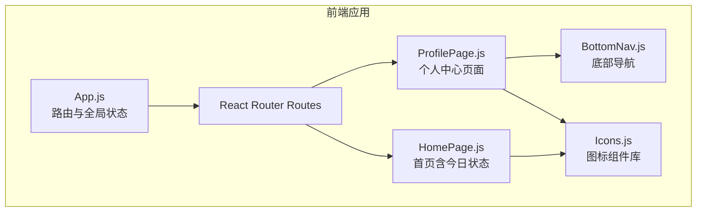
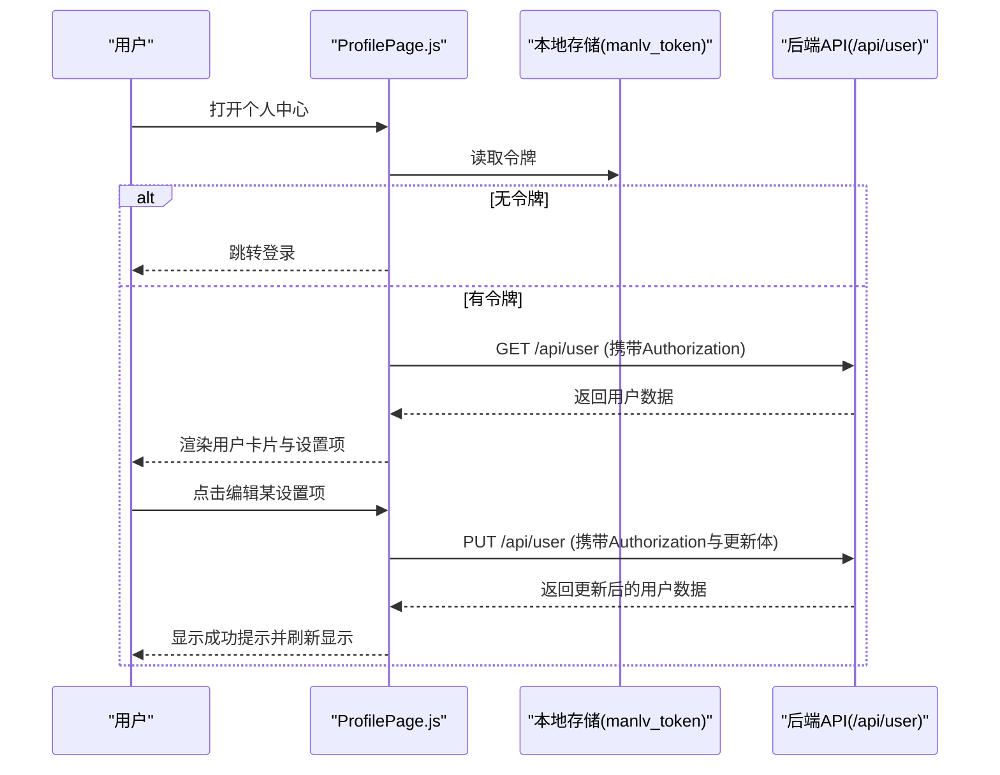
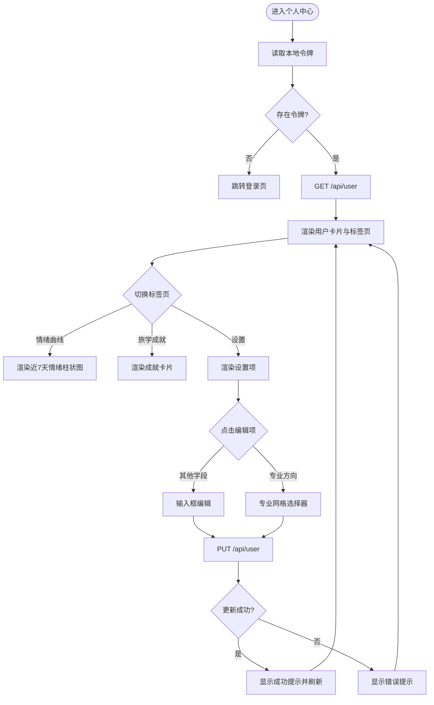
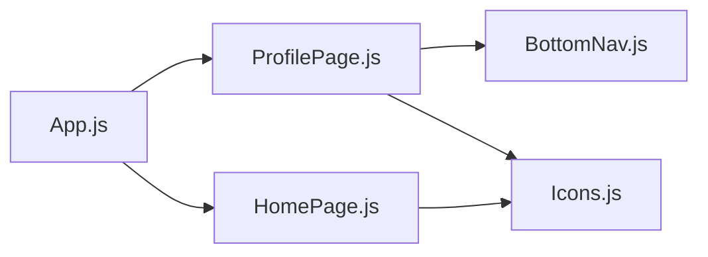
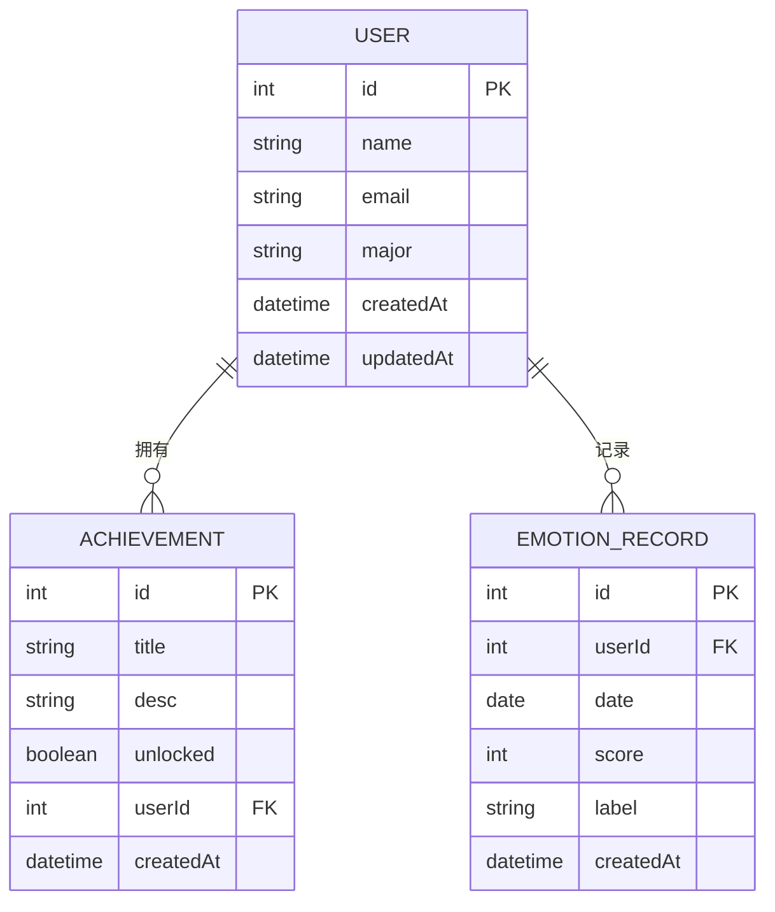

# 个人中心系统

<cite>
**本文档引用的文件**
- [README.md](file://README.md)
- [package.json](file://package.json)
- [src/App.js](file://src/App.js)
- [src/index.js](file://src/index.js)
- [src/pages/ProfilePage.js](file://src/pages/ProfilePage.js)
- [src/components/BottomNav.js](file://src/components/BottomNav.js)
- [src/components/Icons.js](file://src/components/Icons.js)
- [src/pages/HomePage.js](file://src/pages/HomePage.js)
- [src/App.css](file://src/App.css)
- [src/index.css](file://src/index.css)
</cite>

## 目录
1. [简介](#简介)
2. [项目结构](#项目结构)
3. [核心组件](#核心组件)
4. [架构总览](#架构总览)
5. [详细组件分析](#详细组件分析)
6. [依赖关系分析](#依赖关系分析)
7. [性能考量](#性能考量)
8. [故障排除指南](#故障排除指南)
9. [结论](#结论)
10. [附录](#附录)

## 简介
本文件为漫旅 ManLv 的个人中心系统提供综合技术文档。系统围绕用户资料管理、成就追踪、情绪曲线展示、设置与个性化选项展开，同时结合现有前端页面与样式，形成可直接落地的实现指南与扩展方案。文档涵盖数据模型设计、权限控制机制、安全防护措施，并提供用户体验优化与界面设计规范，帮助开发者快速完成个人中心系统的开发与迭代。

## 项目结构
前端采用 React + React Router 架构，个人中心页面位于 pages 目录下，底部导航与图标组件分别位于 components 目录。整体路由通过 App.js 统一管理，全局样式通过 index.css 与 App.css 提供。

**图表来源**
- [src/App.js:14-91](file://src/App.js#L14-L91)
- [src/pages/ProfilePage.js:1-343](file://src/pages/ProfilePage.js#L1-L343)
- [src/components/BottomNav.js:1-43](file://src/components/BottomNav.js#L1-L43)
- [src/components/Icons.js:1-259](file://src/components/Icons.js#L1-L259)
- [src/pages/HomePage.js:1-225](file://src/pages/HomePage.js#L1-L225)

**章节来源**
- [src/App.js:14-91](file://src/App.js#L14-L91)
- [src/pages/ProfilePage.js:1-343](file://src/pages/ProfilePage.js#L1-L343)
- [src/components/BottomNav.js:1-43](file://src/components/BottomNav.js#L1-L43)
- [src/components/Icons.js:1-259](file://src/components/Icons.js#L1-L259)
- [src/pages/HomePage.js:1-225](file://src/pages/HomePage.js#L1-L225)

## 核心组件
- 个人中心页面 ProfilePage：负责用户资料展示、编辑、成就与情绪曲线展示、设置项与退出登录。
- 底部导航 BottomNav：提供页面跳转与当前激活状态指示。
- 图标库 Icons：统一提供页面内使用的 SVG 图标。
- 首页 HomePage：包含“今日状态”情绪选择区域，体现情绪追踪入口。
- 全局样式：index.css 定义主题色与基础样式，App.css 提供页面级布局与组件样式。

**章节来源**
- [src/pages/ProfilePage.js:28-343](file://src/pages/ProfilePage.js#L28-L343)
- [src/components/BottomNav.js:13-43](file://src/components/BottomNav.js#L13-L43)
- [src/components/Icons.js:44-220](file://src/components/Icons.js#L44-L220)
- [src/pages/HomePage.js:8-225](file://src/pages/HomePage.js#L8-L225)
- [src/index.css:1-45](file://src/index.css#L1-L45)
- [src/App.css:1575-1642](file://src/App.css#L1575-L1642)

## 架构总览
个人中心系统从前端页面到后端 API 的交互流程如下：

**图表来源**
- [src/pages/ProfilePage.js:42-102](file://src/pages/ProfilePage.js#L42-L102)
- [README.md:174-205](file://README.md#L174-L205)

**章节来源**
- [src/pages/ProfilePage.js:42-102](file://src/pages/ProfilePage.js#L42-L102)
- [README.md:174-205](file://README.md#L174-L205)

## 详细组件分析

### 个人中心页面 ProfilePage
- 页面职责
  - 加载并展示用户基本信息（头像占位、姓名、专业、统计信息）。
  - 提供“情绪曲线”、“旅学成就”、“设置”三个标签页。
  - 支持编辑姓名、邮箱、密码、专业方向；专业方向提供网格选择器。
  - 支持退出登录。
- 数据与状态
  - 使用本地状态 activeTab 控制当前标签页。
  - 使用 user 状态保存后端返回的用户对象。
  - 使用 editingField/editValue 管理编辑态输入。
  - 使用 toast 状态提示操作结果。
- 权限与安全
  - 通过本地存储的 manlv_token 进行鉴权请求。
  - 若无令牌则重定向至登录页。
- API 交互
  - GET /api/user：获取用户信息。
  - PUT /api/user：更新用户资料（name/email/password/major）。
- UI 组件
  - 使用 Icons 中的 ProfileIcon、TrendIcon、StarIcon、SettingsIcon、ChevronRightIcon、BackIcon、CheckIcon。
  - 使用 BottomNav 作为底部导航。
- 样式要点
  - 情绪曲线采用柱状图样式，通过 CSS 动画与阴影增强视觉效果。
  - 成就卡片区分解锁/未解锁状态。
  - 设置项采用左右布局，右侧显示当前值与箭头。

**图表来源**
- [src/pages/ProfilePage.js:28-102](file://src/pages/ProfilePage.js#L28-L102)
- [src/pages/ProfilePage.js:235-343](file://src/pages/ProfilePage.js#L235-L343)
- [README.md:174-205](file://README.md#L174-L205)

**章节来源**
- [src/pages/ProfilePage.js:28-343](file://src/pages/ProfilePage.js#L28-L343)
- [src/components/Icons.js:44-220](file://src/components/Icons.js#L44-L220)
- [src/App.css:1575-1642](file://src/App.css#L1575-L1642)

### 底部导航 BottomNav
- 职责：提供五个页面的快捷跳转，高亮当前激活页面。
- 与个人中心的关系：在 ProfilePage 中被复用，保证一致的导航体验。

**章节来源**
- [src/components/BottomNav.js:13-43](file://src/components/BottomNav.js#L13-L43)

### 图标库 Icons
- 提供统一的 SVG 图标，包括 Profile、Trend、Star、Settings 等，用于页面内不同功能区的视觉标识。
- 在个人中心页面中被广泛使用，确保视觉一致性。

**章节来源**
- [src/components/Icons.js:44-220](file://src/components/Icons.js#L44-L220)

### 首页 HomePage 的情绪追踪入口
- 包含“今日状态”区域，提供情绪选项按钮，便于用户快速记录当日情绪。
- 与个人中心的情绪曲线形成前后呼应，构成完整的“每日情绪记录—周度趋势”的闭环。

**章节来源**
- [src/pages/HomePage.js:210-225](file://src/pages/HomePage.js#L210-L225)

## 依赖关系分析
- 组件依赖
  - ProfilePage 依赖 BottomNav 与 Icons。
  - App.js 统一管理路由与全局状态，控制 ProfilePage 的登录守卫。
- 外部依赖
  - React、React Router DOM、@icon-park/react 等。
  - 样式依赖：CSS 变量定义的主题色与布局系统。

**图表来源**
- [src/App.js:14-91](file://src/App.js#L14-L91)
- [src/pages/ProfilePage.js:1-5](file://src/pages/ProfilePage.js#L1-L5)
- [src/pages/HomePage.js:1-7](file://src/pages/HomePage.js#L1-L7)

**章节来源**
- [src/App.js:14-91](file://src/App.js#L14-L91)
- [src/pages/ProfilePage.js:1-5](file://src/pages/ProfilePage.js#L1-L5)
- [src/pages/HomePage.js:1-7](file://src/pages/HomePage.js#L1-L7)

## 性能考量
- 网络请求优化
  - 使用本地令牌避免重复登录，减少无效请求。
  - 在编辑保存前进行输入校验，减少无效网络请求。
- 渲染优化
  - 情绪曲线采用固定数据集，避免复杂计算。
  - 成就卡片按需渲染，减少 DOM 数量。
- 样式优化
  - 使用 CSS 变量统一主题色，降低样式切换成本。
  - 利用过渡动画提升交互流畅度，但避免过度使用导致掉帧。

[本节为通用指导，无需特定文件来源]

## 故障排除指南
- 无法进入个人中心
  - 检查本地是否存在 manlv_token；若不存在，将自动跳转登录。
  - 确认后端 /api/user 接口可用且返回 200。
- 更新资料失败
  - 检查必填字段是否为空；密码需满足基本规则。
  - 查看后端返回的错误信息，根据提示修正。
- 情绪曲线不显示
  - 确认 emotionData 数据结构正确，颜色与数值有效。
  - 检查 CSS 类名与样式是否正确加载。
- 退出登录无效
  - 确认本地令牌已被清除，onLogout 回调是否触发路由跳转。

**章节来源**
- [src/pages/ProfilePage.js:42-102](file://src/pages/ProfilePage.js#L42-L102)
- [src/pages/ProfilePage.js:166-171](file://src/pages/ProfilePage.js#L166-L171)
- [src/App.css:1575-1642](file://src/App.css#L1575-L1642)

## 结论
个人中心系统以 ProfilePage 为核心，结合底部导航与图标库，实现了用户资料管理、成就展示与设置入口。通过本地令牌与后端 API 的配合，保障了权限控制与数据安全。现有实现简洁清晰，具备良好的扩展性，可在此基础上进一步完善健康数据管理、个性化设置与更丰富的成就体系。

[本节为总结性内容，无需特定文件来源]

## 附录

### 数据模型设计（基于现有实现）
- 用户实体（简化）
  - 字段：id、name、email、major、createdAt、updatedAt
  - 关系：一对一（与行程、成就等可扩展关联）
- 成就实体（简化）
  - 字段：id、title、desc、unlocked、userId
  - 关系：属于用户
- 情绪记录（建议扩展）
  - 字段：id、userId、date、score、label、createdAt
  - 关系：属于用户

[本图为概念性数据模型示意，无需图表来源]

### 权限控制机制
- 前端
  - 通过本地存储的 manlv_token 进行鉴权请求。
  - App.js 的路由守卫确保未登录用户无法访问受保护页面。
- 后端
  - 建议使用 JWT 验证令牌有效性，校验用户状态与角色。
  - 对敏感操作（如修改密码）增加二次验证或验证码。

**章节来源**
- [src/App.js:75-81](file://src/App.js#L75-L81)
- [src/pages/ProfilePage.js:42-64](file://src/pages/ProfilePage.js#L42-L64)

### 安全防护措施
- 输入校验
  - 前端对必填字段进行非空校验与提示。
  - 密码强度校验与规则提示。
- 传输安全
  - 使用 HTTPS 与 Authorization 头传递令牌。
  - 后端对敏感字段进行脱敏处理。
- 存储安全
  - 密码应加密存储，不暴露明文。
  - 令牌过期策略与刷新机制。

**章节来源**
- [src/pages/ProfilePage.js:166-171](file://src/pages/ProfilePage.js#L166-L171)
- [README.md:117-134](file://README.md#L117-L134)

### 用户体验优化
- 交互反馈
  - 成功/失败提示使用 toast，持续时间适中。
  - 编辑保存按钮禁用态与启用态明确区分。
- 视觉设计
  - 使用统一主题色与圆角卡片，营造温暖与专业感。
  - 情绪曲线采用渐变色与阴影，增强层次感。
- 可访问性
  - 确保图标有语义化描述，键盘可操作。
  - 文字对比度符合无障碍标准。

**章节来源**
- [src/pages/ProfilePage.js:66-69](file://src/pages/ProfilePage.js#L66-L69)
- [src/App.css:1575-1642](file://src/App.css#L1575-L1642)
- [src/index.css:1-45](file://src/index.css#L1-L45)

### 界面设计规范
- 颜色体系
  - 主色调：金棕色（象征旅行与沉淀）。
  - 辅助色：暖纸色、阴影色，营造舒适阅读体验。
- 字体与排版
  - 中文字体优先，强调可读性与现代感。
- 布局与间距
  - 采用卡片式布局与留白，突出信息层级。
  - 滚动区域与底部导航留出安全距离。

**章节来源**
- [src/index.css:1-45](file://src/index.css#L1-L45)
- [src/App.css:1575-1642](file://src/App.css#L1575-L1642)

### 扩展性考虑
- 成就系统
  - 引入成就规则引擎，支持条件组合与动态解锁。
  - 增加成就徽章与等级体系。
- 情绪追踪
  - 引入每日情绪记录表单，支持多维情绪标签。
  - 周/月趋势分析与可视化。
- 健康数据管理
  - 支持步数、睡眠、饮水等数据接入与展示。
  - 与第三方健康平台对接（如 Apple Health、小米运动）。
- 个性化设置
  - 主题切换、字体大小、通知偏好、隐私设置。
  - 仪表盘自定义与快捷入口。

[本节为扩展性建议，无需特定文件来源]