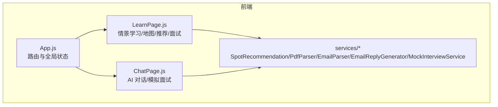
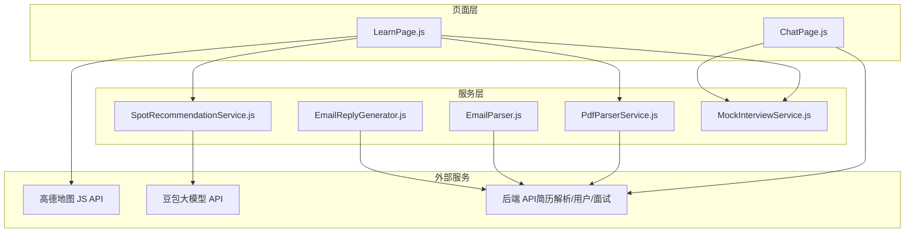
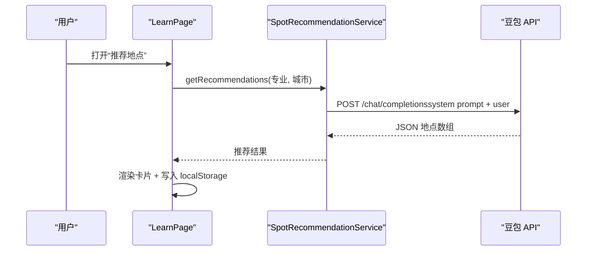
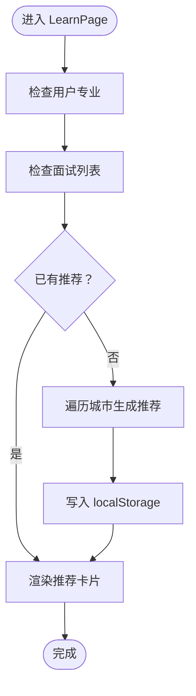
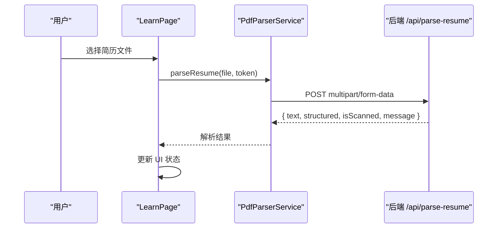
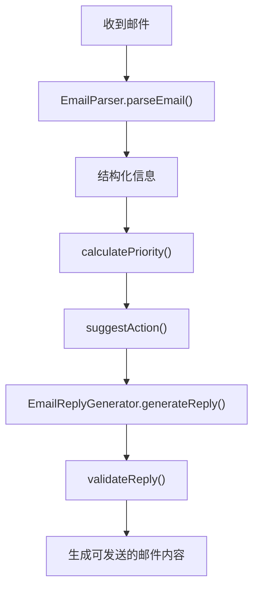
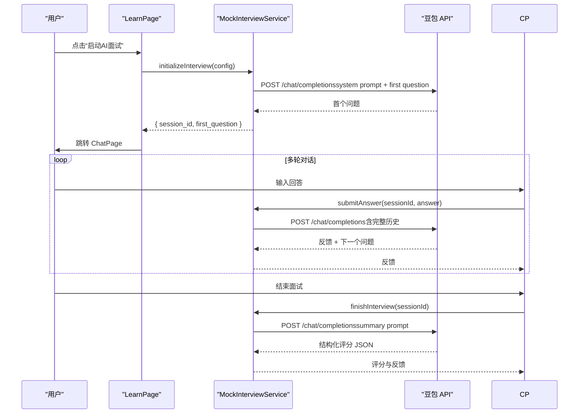
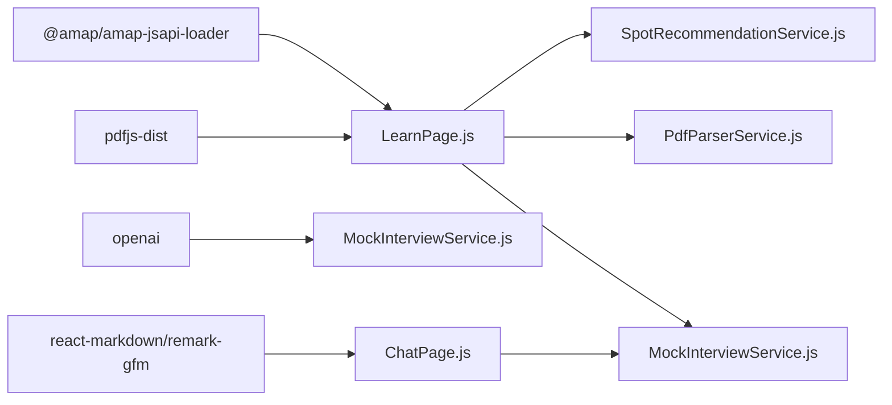

# 情景学习引擎

<cite>
**本文引用的文件**
- [README.md](file://README.md)
- [package.json](file://package.json)
- [src/App.js](file://src/App.js)
- [src/pages/LearnPage.js](file://src/pages/LearnPage.js)
- [src/pages/ChatPage.js](file://src/pages/ChatPage.js)
- [src/services/SpotRecommendationService.js](file://src/services/SpotRecommendationService.js)
- [src/services/PdfParserService.js](file://src/services/PdfParserService.js)
- [src/services/EmailParser.js](file://src/services/EmailParser.js)
- [src/services/EmailReplyGenerator.js](file://src/services/EmailReplyGenerator.js)
- [src/services/MockInterviewService.js](file://src/services/MockInterviewService.js)
- [API_INTEGRATION_SUMMARY.md](file://API_INTEGRATION_SUMMARY.md)
- [DOUBBAO_API_INTEGRATION.md](file://DOUBBAO_API_INTEGRATION.md)
- [EMAIL_PARSE_IMPLEMENTATION_SUMMARY.md](file://EMAIL_PARSE_IMPLEMENTATION_SUMMARY.md)
- [QUICK_START.md](file://QUICK_START.md)
</cite>

## 目录
1. [引言](#引言)
2. [项目结构](#项目结构)
3. [核心组件](#核心组件)
4. [架构总览](#架构总览)
5. [详细组件分析](#详细组件分析)
6. [依赖关系分析](#依赖关系分析)
7. [性能考量](#性能考量)
8. [故障排查指南](#故障排查指南)
9. [结论](#结论)
10. [附录](#附录)

## 引言
本文件为漫旅 ManLv 的“情景学习引擎”提供系统化技术文档，覆盖地点推荐算法、城市导览、学习内容推送、PDF 解析服务、高德地图集成、地理围栏与实时位置服务的实现思路与扩展方案。文档面向开发者与产品/运营人员，既提供代码级细节，也提供概念性架构与流程图，帮助快速理解与二次开发。

## 项目结构
前端采用 React 18 + React Router DOM，页面组件位于 src/pages，通用服务位于 src/services，公共组件位于 src/components。核心页面包括：AuthPage、HomePage、SchedulePage、TripDetailPage、LearnPage（情景学习）、InboxPage（邮件解析）、ProfilePage、ChatPage（AI 对话/模拟面试）。服务层包含地点推荐、简历解析、邮件解析与回复生成、模拟面试等模块。

图表来源
- [src/App.js:1-177](file://src/App.js#L1-L177)
- [src/pages/LearnPage.js:1-651](file://src/pages/LearnPage.js#L1-L651)
- [src/pages/ChatPage.js:1-482](file://src/pages/ChatPage.js#L1-L482)

章节来源
- [README.md:146-171](file://README.md#L146-L171)
- [package.json:1-41](file://package.json#L1-L41)

## 核心组件
- 地点推荐服务：基于用户专业与城市，调用豆包大模型生成个性化学习地点，支持兜底模拟数据。
- 城市导览与地图：集成高德地图 JS API，渲染面试城市标记，支持点击交互与视图适配。
- 学习内容推送：通过 AI 生成“城市×专业”矩阵下的推荐地点卡片，支持手动刷新与本地缓存。
- PDF 解析服务：封装简历上传与解析调用，支持格式校验与解析状态提示。
- 邮件解析与回复：提取邮件结构化信息并生成标准化回复模板，支持优先级与建议操作。
- 模拟面试服务：集成豆包 API，维护会话历史，提供初始化、回答、评分与降级机制。
- AI 对话与流式输出：SSE 流式接收 AI 输出，支持工具调用可视化与错误处理。

章节来源
- [src/services/SpotRecommendationService.js:1-86](file://src/services/SpotRecommendationService.js#L1-L86)
- [src/pages/LearnPage.js:27-38](file://src/pages/LearnPage.js#L27-L38)
- [src/pages/LearnPage.js:162-223](file://src/pages/LearnPage.js#L162-L223)
- [src/services/PdfParserService.js:1-97](file://src/services/PdfParserService.js#L1-L97)
- [src/services/EmailParser.js:1-227](file://src/services/EmailParser.js#L1-L227)
- [src/services/EmailReplyGenerator.js:1-212](file://src/services/EmailReplyGenerator.js#L1-L212)
- [src/services/MockInterviewService.js:1-519](file://src/services/MockInterviewService.js#L1-L519)
- [src/pages/ChatPage.js:199-285](file://src/pages/ChatPage.js#L199-L285)

## 架构总览
情景学习引擎由“页面层-服务层-AI/地图/解析服务”三层构成。页面负责用户交互与状态管理，服务层封装业务逻辑与第三方集成，AI/地图/解析服务提供外部能力。

图表来源
- [src/pages/LearnPage.js:1-651](file://src/pages/LearnPage.js#L1-L651)
- [src/pages/ChatPage.js:1-482](file://src/pages/ChatPage.js#L1-L482)
- [src/services/SpotRecommendationService.js:1-86](file://src/services/SpotRecommendationService.js#L1-L86)
- [src/services/PdfParserService.js:1-97](file://src/services/PdfParserService.js#L1-L97)
- [src/services/EmailParser.js:1-227](file://src/services/EmailParser.js#L1-L227)
- [src/services/EmailReplyGenerator.js:1-212](file://src/services/EmailReplyGenerator.js#L1-L212)
- [src/services/MockInterviewService.js:1-519](file://src/services/MockInterviewService.js#L1-L519)

## 详细组件分析

### 地点推荐算法与城市导览
- 推荐策略
  - 输入：用户专业、目标城市集合
  - 规则：按专业相关性（学术/专业/文化）、场景适用性（备考/放松/专业考察）、输出格式约束（JSON 数组）
  - 输出：地点名称、类型、描述、标签
  - 兜底：若 API 失败，返回模拟数据（如建筑学专业默认推荐）
- 地图集成
  - 加载高德地图 JS API，初始化 3D 地图，按面试城市坐标渲染标记
  - 标记点击提示“即将前往：城市-学校”，并支持视图适配
  - 加载失败/超时处理与重试按钮
- 本地缓存
  - 首次生成推荐后写入 localStorage，页面挂载时优先读取缓存

图表来源
- [src/pages/LearnPage.js:116-139](file://src/pages/LearnPage.js#L116-L139)
- [src/services/SpotRecommendationService.js:18-66](file://src/services/SpotRecommendationService.js#L18-L66)

章节来源
- [src/services/SpotRecommendationService.js:18-66](file://src/services/SpotRecommendationService.js#L18-L66)
- [src/pages/LearnPage.js:116-139](file://src/pages/LearnPage.js#L116-L139)
- [src/pages/LearnPage.js:162-223](file://src/pages/LearnPage.js#L162-L223)

### 学习内容推送机制
- 触发时机：当用户专业与面试城市存在且无缓存推荐时，自动遍历城市生成推荐
- 更新策略：点击“更新推荐”按钮，按最新行程刷新
- 本地缓存：推荐结果写入 localStorage，下次进入页面优先使用
- UI 交互：加载中显示 AI 生成动画，失败提示与重试

图表来源
- [src/pages/LearnPage.js:73-114](file://src/pages/LearnPage.js#L73-L114)
- [src/pages/LearnPage.js:116-139](file://src/pages/LearnPage.js#L116-L139)

章节来源
- [src/pages/LearnPage.js:73-114](file://src/pages/LearnPage.js#L73-L114)
- [src/pages/LearnPage.js:116-139](file://src/pages/LearnPage.js#L116-L139)

### PDF 解析服务集成
- 功能：上传简历（PDF/JPG/PNG），调用后端 /api/parse-resume，返回解析结果（文本、结构化信息、扫描版提示）
- 校验：支持 MIME 类型与扩展名校验，格式不符提示
- 状态：解析中显示加载动画，解析完成显示字符数统计，失败显示错误信息
- 交互：支持清除并重新上传

图表来源
- [src/pages/LearnPage.js:225-275](file://src/pages/LearnPage.js#L225-L275)
- [src/services/PdfParserService.js:15-39](file://src/services/PdfParserService.js#L15-L39)

章节来源
- [src/pages/LearnPage.js:225-275](file://src/pages/LearnPage.js#L225-L275)
- [src/services/PdfParserService.js:15-39](file://src/services/PdfParserService.js#L15-L39)

### 邮件解析与回复生成
- 邮件解析：提取学校、活动类型、日期范围、截止日期、地点、链接、摘要、优先级、建议操作
- 回复生成：根据邮件类型与日程冲突，生成确认/拒绝/协商/咨询模板，支持校验与占位符检查
- 优先级：紧急/高/普通，结合目标学校与截止日期判断

图表来源
- [src/services/EmailParser.js:12-25](file://src/services/EmailParser.js#L12-L25)
- [src/services/EmailReplyGenerator.js:13-23](file://src/services/EmailReplyGenerator.js#L13-L23)

章节来源
- [src/services/EmailParser.js:12-25](file://src/services/EmailParser.js#L12-L25)
- [src/services/EmailReplyGenerator.js:13-23](file://src/services/EmailReplyGenerator.js#L13-L23)

### 高德地图 API 集成与地理围栏
- 集成方式：通过 @amap/amap-jsapi-loader 动态加载高德地图 JS API，配置安全密钥与插件
- 地图初始化：3D 视图、样式、中心点与缩放级别；按城市坐标渲染标记
- 地理围栏与实时位置：当前页面未实现地理围栏与实时位置服务。建议扩展方案：
  - 使用浏览器 Geolocation API 获取当前位置
  - 使用高德地图围栏服务（Polygon/Radius）监听进入/离开事件
  - 结合推荐算法，当用户靠近某地点时触发“情景导读卡”与学习内容推送
  - 注意隐私与权限提示，提供开关与退避策略

章节来源
- [src/pages/LearnPage.js:10-19](file://src/pages/LearnPage.js#L10-L19)
- [src/pages/LearnPage.js:162-223](file://src/pages/LearnPage.js#L162-L223)
- [package.json:6](file://package.json#L6)

### 模拟面试服务与 AI 对话
- 面试流程：initializeInterview → submitAnswer × N → finishInterview（评分与反馈）
- 会话管理：内存 Map 维护对话历史，每次调用携带完整上下文
- 评分：要求模型输出 JSON 结构，解析失败时回退为自由文本
- 降级机制：API 失败自动使用模拟数据，保证可用性
- AI 对话：ChatPage 通过 SSE 接收流式输出，支持工具调用可视化与错误处理

图表来源
- [src/pages/LearnPage.js:306-336](file://src/pages/LearnPage.js#L306-L336)
- [src/services/MockInterviewService.js:24-182](file://src/services/MockInterviewService.js#L24-L182)
- [src/services/MockInterviewService.js:190-247](file://src/services/MockInterviewService.js#L190-L247)
- [src/services/MockInterviewService.js:254-358](file://src/services/MockInterviewService.js#L254-L358)
- [src/pages/ChatPage.js:133-285](file://src/pages/ChatPage.js#L133-L285)

章节来源
- [src/pages/LearnPage.js:306-336](file://src/pages/LearnPage.js#L306-L336)
- [src/services/MockInterviewService.js:24-182](file://src/services/MockInterviewService.js#L24-L182)
- [src/services/MockInterviewService.js:190-247](file://src/services/MockInterviewService.js#L190-L247)
- [src/services/MockInterviewService.js:254-358](file://src/services/MockInterviewService.js#L254-L358)
- [src/pages/ChatPage.js:133-285](file://src/pages/ChatPage.js#L133-L285)

## 依赖关系分析
- 前端依赖：@amap/amap-jsapi-loader（地图）、openai（豆包 API 兼容）、pdfjs-dist（PDF 预览，当前用于简历解析）、react-markdown/remark-gfm（AI 输出渲染）
- 页面与服务：LearnPage 依赖 SpotRecommendationService、PdfParserService、MockInterviewService；ChatPage 依赖 MockInterviewService 并与后端 API 交互
- 环境变量：REACT_APP_ARK_API_KEY（豆包 API Key）、REACT_APP_API_BASE_URL（后端基础地址）

图表来源
- [package.json:6-15](file://package.json#L6-L15)
- [src/pages/LearnPage.js:1-12](file://src/pages/LearnPage.js#L1-L12)
- [src/pages/ChatPage.js:1-8](file://src/pages/ChatPage.js#L1-L8)
- [src/services/MockInterviewService.js:1-17](file://src/services/MockInterviewService.js#L1-L17)

章节来源
- [package.json:6-15](file://package.json#L6-L15)
- [src/pages/LearnPage.js:1-12](file://src/pages/LearnPage.js#L1-L12)
- [src/pages/ChatPage.js:1-8](file://src/pages/ChatPage.js#L1-L8)
- [src/services/MockInterviewService.js:1-17](file://src/services/MockInterviewService.js#L1-L17)

## 性能考量
- 地图加载：设置超时与失败提示，避免长时间阻塞；首次加载可能受网络影响，建议在弱网环境提供离线占位图
- 推荐生成：按城市串行请求，建议在 UI 上显示进度；可考虑并发优化与缓存命中率
- 模拟面试：首问与后续回答存在网络延迟，建议在 UI 上提供“思考中”状态与骨架屏
- AI 对话：SSE 流式渲染，注意内存占用与长对话历史清理；建议限制历史长度或定期截断
- PDF 解析：大文件解析耗时较长，建议在 UI 上提供进度条与取消能力

## 故障排查指南
- 豆包 API 失败
  - 现象：面试初始化/回答/评分失败，自动降级为模拟数据
  - 排查：检查 REACT_APP_ARK_API_KEY 是否正确；查看浏览器 Network 面板；确认 API 可访问
- 地图加载失败
  - 现象：地图显示“加载超时或失败”
  - 排查：检查高德 Key 与安全密钥配置；确认 JS API 平台限制；重试按钮可恢复
- PDF 解析异常
  - 现象：解析失败或提示扫描版
  - 排查：确认文件格式与大小；查看后端返回的错误信息；尝试重新上传
- AI 对话无响应
  - 现象：SSE 无输出或报错
  - 排查：检查后端 /api/ai/chat 是否可达；确认 JWT 令牌有效；查看 Console 错误

章节来源
- [src/services/MockInterviewService.js:176-181](file://src/services/MockInterviewService.js#L176-L181)
- [src/pages/LearnPage.js:382-393](file://src/pages/LearnPage.js#L382-L393)
- [src/services/PdfParserService.js:28-38](file://src/services/PdfParserService.js#L28-L38)
- [src/pages/ChatPage.js:272-284](file://src/pages/ChatPage.js#L272-L284)

## 结论
情景学习引擎以“城市×专业”矩阵为核心，结合 AI 推荐、地图导览与模拟面试，构建了从“地点推荐—城市导览—学习推送—实战演练”的闭环。当前实现已具备稳定的推荐与面试能力，建议后续在地理围栏、实时位置、学习内容个性化推送与数据持久化方面持续演进，以进一步提升用户体验与学习成效。

## 附录
- 快速开始：参见 [QUICK_START.md](file://QUICK_START.md)，包含启动步骤、关键 API 与常见问题
- 豆包 API 集成：参见 [API_INTEGRATION_SUMMARY.md](file://API_INTEGRATION_SUMMARY.md) 与 [DOUBBAO_API_INTEGRATION.md](file://DOUBBAO_API_INTEGRATION.md)，涵盖架构、降级机制与生产部署建议
- 邮件解析 UI：参见 [EMAIL_PARSE_IMPLEMENTATION_SUMMARY.md](file://EMAIL_PARSE_IMPLEMENTATION_SUMMARY.md)，展示解析状态卡片与交互流程