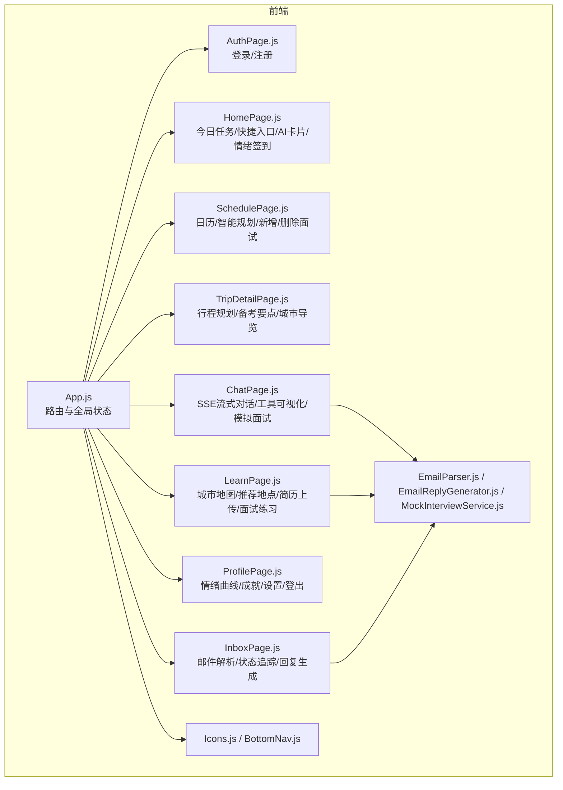
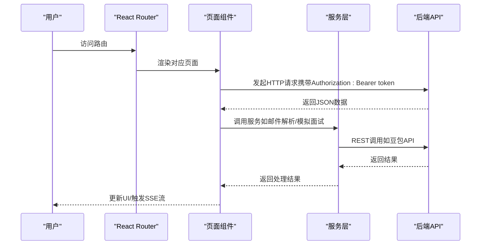
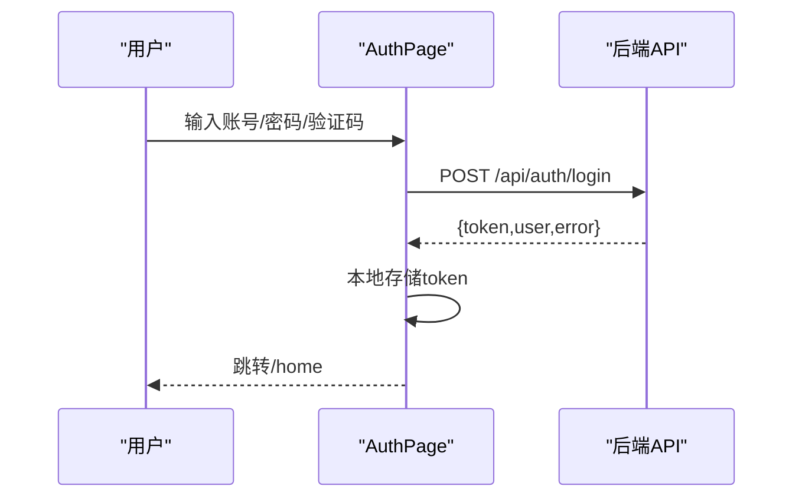
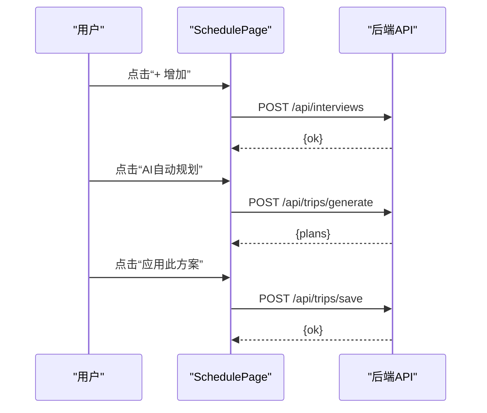
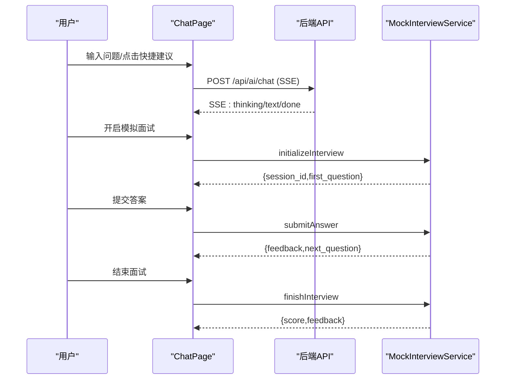
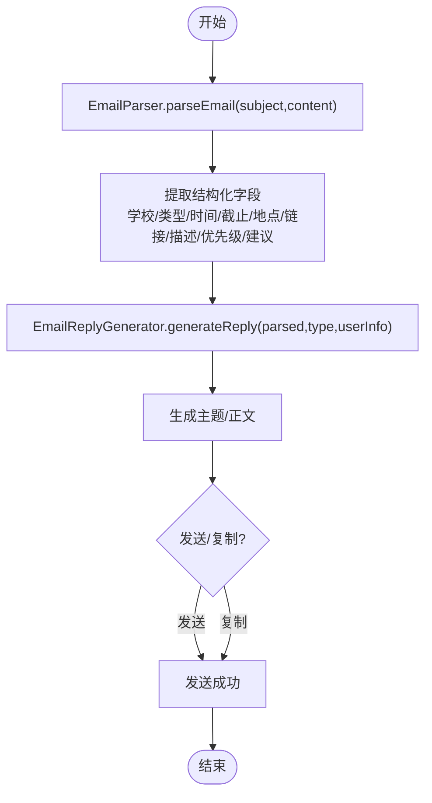
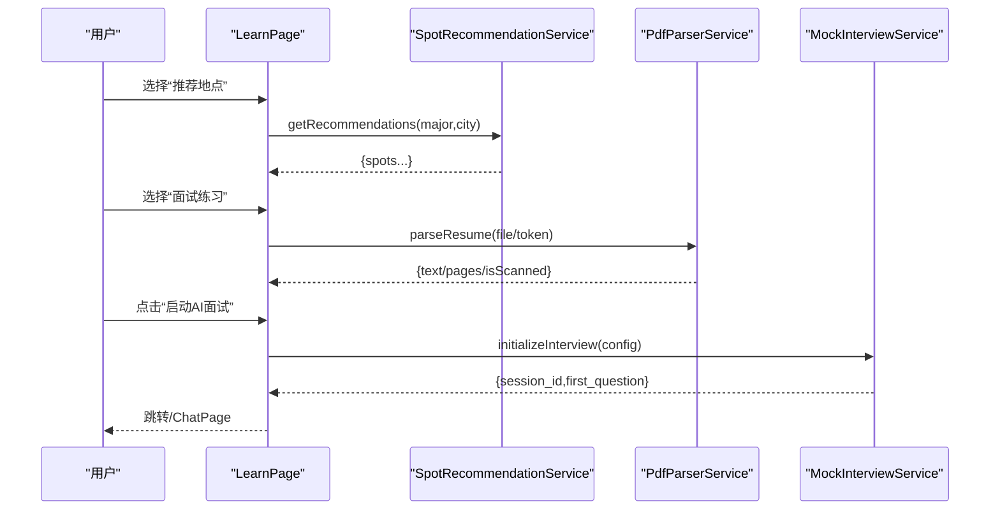
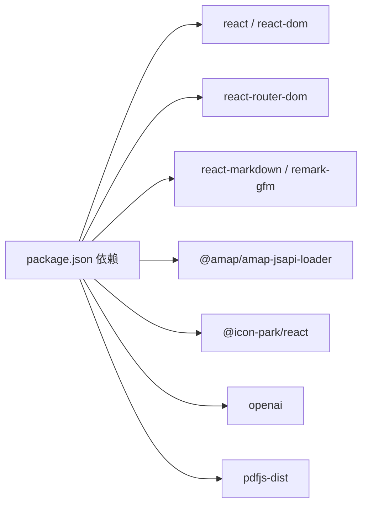

# 核心功能模块

<cite>
**本文引用的文件**
- [README.md](file://README.md)
- [package.json](file://package.json)
- [src/App.js](file://src/App.js)
- [src/pages/AuthPage.js](file://src/pages/AuthPage.js)
- [src/pages/HomePage.js](file://src/pages/HomePage.js)
- [src/pages/SchedulePage.js](file://src/pages/SchedulePage.js)
- [src/pages/ChatPage.js](file://src/pages/ChatPage.js)
- [src/pages/InboxPage.js](file://src/pages/InboxPage.js)
- [src/pages/LearnPage.js](file://src/pages/LearnPage.js)
- [src/pages/ProfilePage.js](file://src/pages/ProfilePage.js)
- [src/pages/TripDetailPage.js](file://src/pages/TripDetailPage.js)
- [src/services/EmailParser.js](file://src/services/EmailParser.js)
- [src/services/EmailReplyGenerator.js](file://src/services/EmailReplyGenerator.js)
- [src/services/MockInterviewService.js](file://src/services/MockInterviewService.js)
- [src/components/BottomNav.js](file://src/components/BottomNav.js)
- [src/components/Icons.js](file://src/components/Icons.js)
</cite>

## 目录
1. [引言](#引言)
2. [项目结构](#项目结构)
3. [核心组件](#核心组件)
4. [架构总览](#架构总览)
5. [详细组件分析](#详细组件分析)
6. [依赖分析](#依赖分析)
7. [性能考虑](#性能考虑)
8. [故障排查指南](#故障排查指南)
9. [结论](#结论)
10. [附录](#附录)

## 引言
漫旅 ManLv 是一款面向保研生的 AI 驱动一站式行程伴旅助手，覆盖“多城市面试调度 × 专业备考 × 情绪支持”。产品通过真实 AI 对话、行程冲突分析、邮件智能解析、情景学习引擎与模拟面试系统，帮助用户在旅途中建立掌控感与意义感。

## 项目结构
前端采用 React 18 + React Router DOM 6，页面组件位于 src/pages，公共组件与图标位于 src/components，服务层位于 src/services。核心页面路由与功能职责见下表：

- 路由与页面
  - / → 登录/注册(AuthPage)
  - /home → 首页 HomePage（今日任务、快捷入口、AI卡片、情绪签到）
  - /trip → 行程管理 SchedulePage（日历/智能规划、新增/删除面试、AI生成最优方案）
  - /trip/:school → 行程详情 TripDetailPage（行程规划/备考要点/城市导览）
  - /learn → 情景学习 LearnPage（城市地图/推荐地点/AI面试练习）
  - /inbox → 邮件收件箱 InboxPage（邮件解析/状态追踪/回复生成）
  - /profile → 个人中心 ProfilePage（情绪曲线/成就/设置/登出）
  - /chat → AI 智能助手 ChatPage（SSE流式对话/工具调用可视化/模拟面试）

- 服务层
  - EmailParser：邮件结构化解析
  - EmailReplyGenerator：邮件回复模板生成
  - MockInterviewService：豆包大模型驱动的模拟面试（REST API）

图表来源
- [src/App.js:1-177](file://src/App.js#L1-L177)
- [src/pages/AuthPage.js:1-732](file://src/pages/AuthPage.js#L1-L732)
- [src/pages/HomePage.js:1-263](file://src/pages/HomePage.js#L1-L263)
- [src/pages/SchedulePage.js:1-423](file://src/pages/SchedulePage.js#L1-L423)
- [src/pages/TripDetailPage.js:1-157](file://src/pages/TripDetailPage.js#L1-L157)
- [src/pages/LearnPage.js:1-651](file://src/pages/LearnPage.js#L1-L651)
- [src/pages/InboxPage.js:1-479](file://src/pages/InboxPage.js#L1-L479)
- [src/pages/ProfilePage.js:1-343](file://src/pages/ProfilePage.js#L1-L343)
- [src/pages/ChatPage.js:1-482](file://src/pages/ChatPage.js#L1-L482)
- [src/services/EmailParser.js:1-227](file://src/services/EmailParser.js#L1-L227)
- [src/services/EmailReplyGenerator.js:1-212](file://src/services/EmailReplyGenerator.js#L1-L212)
- [src/services/MockInterviewService.js:1-519](file://src/services/MockInterviewService.js#L1-L519)
- [src/components/Icons.js:1-259](file://src/components/Icons.js#L1-L259)
- [src/components/BottomNav.js:1-43](file://src/components/BottomNav.js#L1-L43)

章节来源
- [README.md:146-220](file://README.md#L146-L220)
- [src/App.js:1-177](file://src/App.js#L1-L177)

## 核心组件
- 用户认证系统：负责登录/注册/忘记密码/第三方社交登录，使用本地 token 管理登录态，调用后端 /api/auth/* 接口。
- 行程管理系统：支持新增/删除面试、日历视图、智能规划（AI生成最优方案）、冲突检测与分析。
- AI 智能助手：SSE 流式对话，工具调用可视化（思考过程/工具列表），Markdown 渲染，支持模拟面试模式。
- 邮件智能解析：自动识别入营/预推免等关键邮件，结构化提取院校、时间、截止日等，支持一键生成回复。
- 情景学习引擎：城市地图展示面试城市分布，AI 推荐地点（结合专业与城市），简历上传与解析，启动模拟面试。
- 模拟面试系统：基于豆包大模型的 REST API，初始化会话、提交回答、结束并生成评分报告。
- 个人中心：情绪曲线、成就体系、资料编辑（姓名/邮箱/密码/专业方向）、登出。
- 邮件收件箱：邮件解析状态追踪、解析详情、原邮件查看、回复生成与发送。

章节来源
- [src/pages/AuthPage.js:1-732](file://src/pages/AuthPage.js#L1-L732)
- [src/pages/SchedulePage.js:1-423](file://src/pages/SchedulePage.js#L1-L423)
- [src/pages/ChatPage.js:1-482](file://src/pages/ChatPage.js#L1-L482)
- [src/pages/InboxPage.js:1-479](file://src/pages/InboxPage.js#L1-L479)
- [src/pages/LearnPage.js:1-651](file://src/pages/LearnPage.js#L1-L651)
- [src/pages/ProfilePage.js:1-343](file://src/pages/ProfilePage.js#L1-L343)
- [src/services/EmailParser.js:1-227](file://src/services/EmailParser.js#L1-L227)
- [src/services/EmailReplyGenerator.js:1-212](file://src/services/EmailReplyGenerator.js#L1-L212)
- [src/services/MockInterviewService.js:1-519](file://src/services/MockInterviewService.js#L1-L519)

## 架构总览
前端通过 fetch 调用后端 API（/api/*），使用 JWT Bearer Token 进行鉴权。AI 对话采用 SSE 流式响应，工具调用通过事件类型区分“思考中/文本/完成/错误”。服务层封装了邮件解析与回复生成、模拟面试 REST 调用。

图表来源
- [src/pages/ChatPage.js:199-285](file://src/pages/ChatPage.js#L199-L285)
- [src/pages/SchedulePage.js:29-139](file://src/pages/SchedulePage.js#L29-L139)
- [src/pages/InboxPage.js:81-140](file://src/pages/InboxPage.js#L81-L140)
- [src/services/MockInterviewService.js:118-175](file://src/services/MockInterviewService.js#L118-L175)

## 详细组件分析

### 用户认证系统
- 功能职责
  - 支持手机号/邮箱登录、注册、忘记密码（验证码）、第三方社交登录（微信/QQ/支付宝）。
  - 表单校验：手机号格式、密码强度、确认密码一致性、用户协议勾选。
  - 登录成功后写入本地 token，跳转首页。
- 技术实现
  - 登录/注册/重置密码分别调用 /api/auth/login、/api/auth/register、/api/auth/reset-password。
  - 使用 fetch 发送 JSON，错误统一 toast 提示。
- 用户交互流程
  - 登录页切换到注册/忘记密码，填写表单，点击提交，成功后 onLogin 并跳转首页。

图表来源
- [src/pages/AuthPage.js:86-121](file://src/pages/AuthPage.js#L86-L121)
- [README.md:174-186](file://README.md#L174-L186)

章节来源
- [src/pages/AuthPage.js:1-732](file://src/pages/AuthPage.js#L1-L732)
- [README.md:174-186](file://README.md#L174-L186)

### 行程管理系统
- 功能职责
  - 新增/删除面试安排，日历视图展示当日行程，智能规划（AI生成最优方案），冲突检测与分析。
- 技术实现
  - 新增面试：POST /api/interviews；删除：DELETE /api/interviews/:id。
  - 智能规划：POST /api/trips/generate；应用方案：POST /api/trips/save。
  - 日历视图：将后端数据与静态数据合并，动态渲染。
- 用户交互流程
  - 在“行程”页录入面试，点击“AI自动规划”，查看推荐方案并应用。

图表来源
- [src/pages/SchedulePage.js:46-139](file://src/pages/SchedulePage.js#L46-L139)
- [README.md:174-186](file://README.md#L174-L186)

章节来源
- [src/pages/SchedulePage.js:1-423](file://src/pages/SchedulePage.js#L1-L423)

### AI 智能助手
- 功能职责
  - SSE 流式对话，工具调用可视化（思考中/工具列表/完成），Markdown 渲染，快捷问题建议。
  - 支持模拟面试模式，结束时生成评分报告。
- 技术实现
  - SSE：POST /api/ai/chat 返回 text/event-stream，事件类型包括 thinking/text/done/error。
  - Markdown：react-markdown + remark-gfm。
  - 模拟面试：ChatPage 切换 interviewMode，MockInterviewService 初始化会话、提交回答、结束并评分。
- 用户交互流程
  - 在首页/行程详情/学习页唤起 AI 助手，输入问题或点击快捷建议，查看流式回复与工具调用。

图表来源
- [src/pages/ChatPage.js:133-329](file://src/pages/ChatPage.js#L133-L329)
- [src/services/MockInterviewService.js:24-182](file://src/services/MockInterviewService.js#L24-L182)
- [README.md:174-196](file://README.md#L174-L196)

章节来源
- [src/pages/ChatPage.js:1-482](file://src/pages/ChatPage.js#L1-L482)
- [src/services/MockInterviewService.js:1-519](file://src/services/MockInterviewService.js#L1-L519)

### 邮件智能解析
- 功能职责
  - 自动识别入营/预推免等关键邮件，结构化提取院校、时间、截止日、地点、链接、描述、优先级与建议操作。
  - 一键生成“确认参加/委婉拒绝/时间协商/咨询”等模板回复，并支持发送与复制。
- 技术实现
  - EmailParser：关键词匹配、正则抽取、优先级计算、建议操作。
  - EmailReplyGenerator：模板生成、建议回复类型、冲突检查、验证。
  - InboxPage：邮件列表/解析详情/原邮件查看/回复生成/发送。
- 用户交互流程
  - 点击“更新”触发解析，点击邮件进入详情，选择回复类型，复制/发送。

图表来源
- [src/pages/InboxPage.js:81-140](file://src/pages/InboxPage.js#L81-L140)
- [src/services/EmailParser.js:12-25](file://src/services/EmailParser.js#L12-L25)
- [src/services/EmailReplyGenerator.js:13-23](file://src/services/EmailReplyGenerator.js#L13-L23)

章节来源
- [src/pages/InboxPage.js:1-479](file://src/pages/InboxPage.js#L1-L479)
- [src/services/EmailParser.js:1-227](file://src/services/EmailParser.js#L1-L227)
- [src/services/EmailReplyGenerator.js:1-212](file://src/services/EmailReplyGenerator.js#L1-L212)

### 情景学习引擎
- 功能职责
  - 城市地图展示面试城市分布，AI 推荐地点（结合专业与城市），简历上传与解析，启动模拟面试。
- 技术实现
  - 高德地图 JS API 加载与渲染标记点，监听点击事件。
  - SpotRecommendationService：按专业+城市生成推荐（示例使用静态数据）。
  - PdfParserService：支持 PDF/图片简历解析（示例使用静态数据）。
  - MockInterviewService：REST API 初始化面试、提交回答、结束评分。
- 用户交互流程
  - 在“漫学”页切换标签：城市地图/推荐地点/知识收藏/面试练习；上传简历或输入文本，选择面试日程启动 AI 面试。

图表来源
- [src/pages/LearnPage.js:116-139](file://src/pages/LearnPage.js#L116-L139)
- [src/pages/LearnPage.js:225-275](file://src/pages/LearnPage.js#L225-L275)
- [src/pages/LearnPage.js:277-336](file://src/pages/LearnPage.js#L277-L336)
- [src/services/MockInterviewService.js:24-182](file://src/services/MockInterviewService.js#L24-L182)

章节来源
- [src/pages/LearnPage.js:1-651](file://src/pages/LearnPage.js#L1-L651)

### 模拟面试系统
- 功能职责
  - 选择目标院校/专业/城市/类型，初始化会话，AI 逐步提问，结束时输出结构化评分与建议。
- 技术实现
  - 使用豆包 REST API（火山方舟），构建系统提示词，维护会话历史，支持降级到模拟数据。
  - 结束时要求生成结构化评分 JSON，解析失败则回退为自由文本。
- 用户交互流程
  - 在“漫学”页上传简历或输入文本，选择面试日程，启动模拟面试，提交回答，结束查看评分。

章节来源
- [src/services/MockInterviewService.js:1-519](file://src/services/MockInterviewService.js#L1-L519)

### 个人中心
- 功能职责
  - 情绪曲线（近7天）/成就体系/设置（修改姓名/邮箱/密码/专业方向）/登出。
- 技术实现
  - 获取用户信息：GET /api/user；更新资料：PUT /api/user。
  - 专业方向选择器，majorList 预设。
- 用户交互流程
  - 在“我的”页切换标签，点击设置项进入编辑页，确认修改后 toast 提示。

章节来源
- [src/pages/ProfilePage.js:1-343](file://src/pages/ProfilePage.js#L1-L343)

### 邮件收件箱
- 功能职责
  - 邮件解析状态追踪、解析详情、原邮件查看、回复生成与发送。
- 技术实现
  - 静态样例数据演示解析流程，支持“解析中/完成/更新”状态。
  - 一键生成“确认/拒绝/协商/咨询”模板，支持发送与复制。
- 用户交互流程
  - 点击“更新”触发解析，点击邮件查看详情，选择回复类型，复制/发送。

章节来源
- [src/pages/InboxPage.js:1-479](file://src/pages/InboxPage.js#L1-L479)

## 依赖分析
- 前端依赖
  - React 18、React Router DOM 6、react-markdown、remark-gfm、@amap/amap-jsapi-loader、@icon-park/react、openai（用于兼容性）、pdfjs-dist。
- 运行时环境
  - Node.js ≥ 18、PostgreSQL、DashScope API Key（用于 README 中的后端说明，前端通过 /api/* 代理访问）。
- 组件耦合
  - App.js 作为壳层，集中管理登录态与浮动 AI 助手；各页面通过 fetch 与服务层交互；服务层与后端 API 解耦。

图表来源
- [package.json:1-41](file://package.json#L1-L41)

章节来源
- [package.json:1-41](file://package.json#L1-L41)
- [README.md:65-76](file://README.md#L65-L76)

## 性能考虑
- 前端性能
  - 路由懒加载与按需渲染，减少初始包体；SSE 流式渲染避免长阻塞；ResizeObserver 动态适配输入框高度。
- 服务层性能
  - 邮件解析与回复生成为纯前端逻辑，复杂度取决于正则与模板数量；模拟面试依赖外部 API，注意降级策略与超时处理。
- 网络与安全
  - 使用 Bearer Token 鉴权，避免明文传输；敏感信息（如 API Key）应通过环境变量注入。

## 故障排查指南
- 登录失败
  - 检查网络与后端可达性；确认 /api/auth/login 返回的错误信息；查看 toast 提示。
- SSE 对话无响应
  - 确认 /api/ai/chat 返回 text/event-stream；检查浏览器控制台与网络面板；确认 Authorization 头正确。
- 邮件解析异常
  - 确认邮件内容与主题包含关键信息；查看解析进度与提示；必要时切换“查看原邮件”核对格式。
- 模拟面试不可用
  - 检查豆包 API Key 与模型 ID；查看控制台错误；确认降级到模拟数据时的提示。
- 地图加载失败
  - 检查高德 Key 与安全密钥配置；确认平台限制（Web 端 JS API）；重试加载。

章节来源
- [src/pages/ChatPage.js:199-285](file://src/pages/ChatPage.js#L199-L285)
- [src/pages/InboxPage.js:127-140](file://src/pages/InboxPage.js#L127-L140)
- [src/pages/LearnPage.js:162-223](file://src/pages/LearnPage.js#L162-L223)
- [src/services/MockInterviewService.js:118-182](file://src/services/MockInterviewService.js#L118-L182)

## 结论
漫旅 ManLv 通过“认证 + 行程 + AI 助手 + 邮件解析 + 情景学习 + 模拟面试 + 个人中心 + 邮件收件箱”的完整闭环，为保研生提供从信息获取、行程管理到心理支持的一站式智能伴旅体验。前端以 React 为核心，配合服务层与后端 API，形成清晰的职责边界与可扩展架构。

## 附录
- API 接口概览（来自 README）
  - POST /api/auth/register：用户注册
  - POST /api/auth/login：用户登录
  - GET /api/user：获取用户信息
  - PUT /api/user：更新用户资料
  - GET /api/interviews：获取面试列表
  - POST /api/interviews：新增面试安排
  - POST /api/ai/chat：AI 对话（SSE 流式输出）
- 页面路由（来自 README）
  - / → AuthPage
  - /home → HomePage
  - /trip → SchedulePage
  - /trip/:school → TripDetailPage
  - /learn → LearnPage
  - /inbox → InboxPage
  - /profile → ProfilePage
  - /chat → ChatPage

章节来源
- [README.md:174-220](file://README.md#L174-L220)