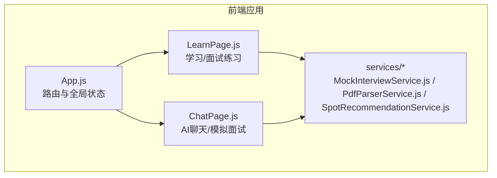
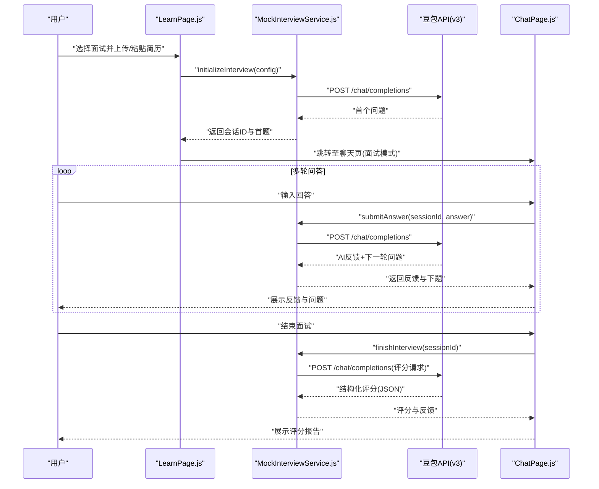
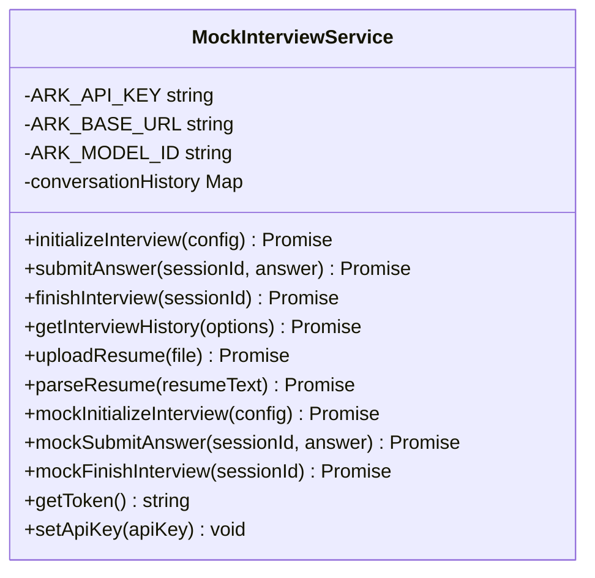
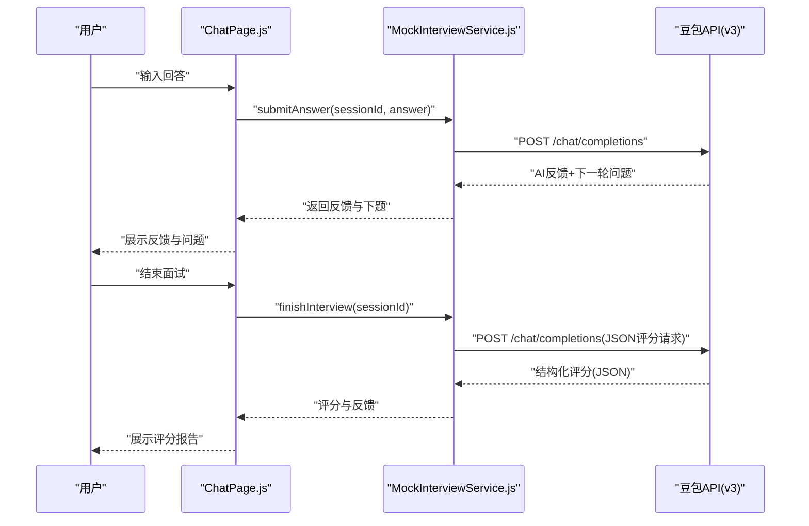
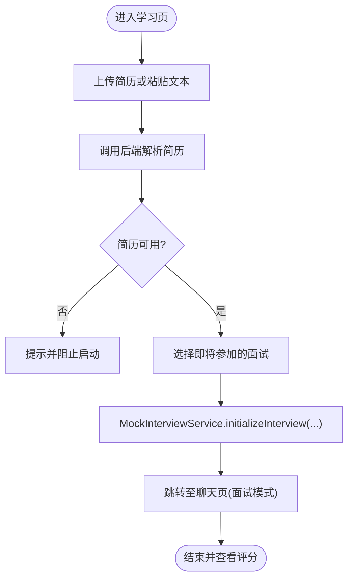
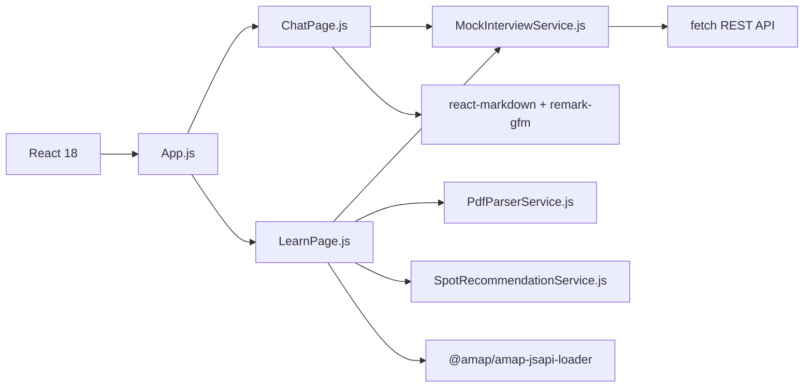

# 模拟面试系统

<cite>
**本文引用的文件**
- [README.md](file://README.md)
- [MockInterviewService.js](file://src/services/MockInterviewService.js)
- [ChatPage.js](file://src/pages/ChatPage.js)
- [LearnPage.js](file://src/pages/LearnPage.js)
- [PdfParserService.js](file://src/services/PdfParserService.js)
- [SpotRecommendationService.js](file://src/services/SpotRecommendationService.js)
- [App.js](file://src/App.js)
- [package.json](file://package.json)
- [QUICK_START.md](file://QUICK_START.md)
- [SYSTEM_PROMPT_UPDATE.md](file://SYSTEM_PROMPT_UPDATE.md)
</cite>

## 目录
1. [引言](#引言)
2. [项目结构](#项目结构)
3. [核心组件](#核心组件)
4. [架构总览](#架构总览)
5. [详细组件分析](#详细组件分析)
6. [依赖关系分析](#依赖关系分析)
7. [性能考虑](#性能考虑)
8. [故障排查指南](#故障排查指南)
9. [结论](#结论)
10. [附录](#附录)

## 引言
本文件为漫旅 ManLv 的模拟面试系统提供专业级技术文档，覆盖 AI 面试服务的实现架构、面试初始化流程、实时问答交互、评分算法设计、豆包大模型集成方案、面试场景构建、智能问答机制、面试记录管理、历史数据分析与个性化反馈生成，以及完整的 API 接口规范、数据传输格式、错误处理策略。同时提供面试体验优化、技术实现细节与性能监控方案，帮助开发者快速理解并部署模拟面试系统。

## 项目结构
前端采用 React 18 + React Router DOM 6 构建，核心功能集中在 pages 与 services 目录：
- pages：路由页面组件，包含聊天界面、学习页面、行程管理等
- services：业务服务封装，包含模拟面试、简历解析、地点推荐等
- 根目录文档：README、快速开始、系统提示词更新说明等

**图表来源**
- [App.js:14-177](file://src/App.js#L14-L177)
- [ChatPage.js:1-482](file://src/pages/ChatPage.js#L1-L482)
- [LearnPage.js:1-651](file://src/pages/LearnPage.js#L1-L651)
- [MockInterviewService.js:1-519](file://src/services/MockInterviewService.js#L1-L519)
- [PdfParserService.js:1-97](file://src/services/PdfParserService.js#L1-L97)
- [SpotRecommendationService.js:1-86](file://src/services/SpotRecommendationService.js#L1-L86)

**章节来源**
- [README.md:146-171](file://README.md#L146-L171)
- [package.json:1-41](file://package.json#L1-L41)

## 核心组件
- MockInterviewService：集成豆包大模型的模拟面试服务，负责面试初始化、回答提交、结束评分、简历解析与历史记录管理（本地）
- ChatPage：模拟面试的前端交互页面，支持实时问答、SSE 流式输出、结束面试并查看评分
- LearnPage：学习页面，提供简历上传/解析、面试日程管理、AI 推荐地点、启动模拟面试
- PdfParserService：简历解析服务，调用后端解析接口
- SpotRecommendationService：基于专业与城市的 AI 地点推荐服务

**章节来源**
- [MockInterviewService.js:7-519](file://src/services/MockInterviewService.js#L7-L519)
- [ChatPage.js:9-482](file://src/pages/ChatPage.js#L9-L482)
- [LearnPage.js:46-651](file://src/pages/LearnPage.js#L46-L651)
- [PdfParserService.js:8-97](file://src/services/PdfParserService.js#L8-L97)
- [SpotRecommendationService.js:6-86](file://src/services/SpotRecommendationService.js#L6-L86)

## 架构总览
系统采用前端直连豆包 API 的直连模式，通过 MockInterviewService 封装 REST 调用，实现面试初始化、回答提交与评分生成。ChatPage 负责 UI 交互与流式事件处理，LearnPage 负责简历上传与面试启动。

**图表来源**
- [LearnPage.js:307-336](file://src/pages/LearnPage.js#L307-L336)
- [MockInterviewService.js:24-182](file://src/services/MockInterviewService.js#L24-L182)
- [MockInterviewService.js:190-247](file://src/services/MockInterviewService.js#L190-L247)
- [MockInterviewService.js:254-358](file://src/services/MockInterviewService.js#L254-L358)
- [ChatPage.js:141-329](file://src/pages/ChatPage.js#L141-L329)

## 详细组件分析

### MockInterviewService 组件分析
- 面试初始化：构造系统提示词（含目标院校、专业、面试类型、城市、简历内容），调用豆包 REST API 获取首个问题，保存会话历史
- 回答提交：追加用户回答至历史，调用 API 获取 AI 反馈与下一轮问题，更新会话历史
- 结束评分：构造评分请求消息，要求返回结构化 JSON，解析评分并清理会话
- 简历解析：调用 API 提取简历关键信息（教育背景、项目、技能等）
- 降级机制：API 失败时返回模拟数据，保障 UI 可用性
- 会话存储：使用 Map 在浏览器内存中维护对话历史

**图表来源**
- [MockInterviewService.js:7-519](file://src/services/MockInterviewService.js#L7-L519)

**章节来源**
- [MockInterviewService.js:24-182](file://src/services/MockInterviewService.js#L24-L182)
- [MockInterviewService.js:190-247](file://src/services/MockInterviewService.js#L190-L247)
- [MockInterviewService.js:254-358](file://src/services/MockInterviewService.js#L254-L358)
- [MockInterviewService.js:379-440](file://src/services/MockInterviewService.js#L379-L440)
- [MockInterviewService.js:446-500](file://src/services/MockInterviewService.js#L446-L500)

### ChatPage 组件分析
- 面试模式：接收来自 LearnPage 的会话信息，进入模拟面试模式，调用 MockInterviewService 提交回答
- SSE 流式输出：监听后端 /api/ai/chat 的 SSE 事件（thinking/text/done/error），用于展示工具调用与流式文本
- 结束面试：调用 MockInterviewService.finishInterview，生成结构化评分报告并展示
- Markdown 渲染：使用 react-markdown + remark-gfm 渲染 AI 输出

**图表来源**
- [ChatPage.js:141-329](file://src/pages/ChatPage.js#L141-L329)
- [MockInterviewService.js:190-247](file://src/services/MockInterviewService.js#L190-L247)
- [MockInterviewService.js:254-358](file://src/services/MockInterviewService.js#L254-L358)

**章节来源**
- [ChatPage.js:133-285](file://src/pages/ChatPage.js#L133-L285)
- [ChatPage.js:287-329](file://src/pages/ChatPage.js#L287-L329)

### LearnPage 组件分析
- 简历上传/解析：支持 PDF/图片上传与文本粘贴，调用 PdfParserService 解析简历
- 面试启动：调用 MockInterviewService.initializeInterview，传入简历文本、学校、专业、城市、面试类型等
- AI 推荐地点：调用 SpotRecommendationService，基于专业与城市生成地点推荐
- 地图集成：使用高德地图 JS API 展示面试城市分布

**图表来源**
- [LearnPage.js:225-336](file://src/pages/LearnPage.js#L225-L336)
- [PdfParserService.js:15-39](file://src/services/PdfParserService.js#L15-L39)
- [MockInterviewService.js:24-182](file://src/services/MockInterviewService.js#L24-L182)

**章节来源**
- [LearnPage.js:225-336](file://src/pages/LearnPage.js#L225-L336)
- [PdfParserService.js:15-39](file://src/services/PdfParserService.js#L15-L39)
- [SpotRecommendationService.js:18-66](file://src/services/SpotRecommendationService.js#L18-L66)

### SpotRecommendationService 组件分析
- 基于用户专业与城市，调用豆包 API 生成个性化地点推荐
- 输出格式严格限定为 JSON 数组，便于前端渲染
- 降级兜底：API 失败时返回模拟数据

**章节来源**
- [SpotRecommendationService.js:18-82](file://src/services/SpotRecommendationService.js#L18-L82)

### PdfParserService 组件分析
- 上传简历文件（PDF/图片），调用后端解析接口
- 校验文件类型与大小，提供友好的错误提示
- 返回解析结果（文本、结构化信息、扫描版提示）

**章节来源**
- [PdfParserService.js:15-97](file://src/services/PdfParserService.js#L15-L97)

## 依赖关系分析
- 前端依赖：React、react-router-dom、react-markdown、remark-gfm、@amap/amap-jsapi-loader、@icon-park/react、pdfjs-dist
- MockInterviewService 依赖：fetch REST API（豆包 v3）
- ChatPage 依赖：MockInterviewService、react-markdown、remark-gfm
- LearnPage 依赖：MockInterviewService、PdfParserService、SpotRecommendationService、高德地图

**图表来源**
- [package.json:5-16](file://package.json#L5-L16)
- [MockInterviewService.js:10-11](file://src/services/MockInterviewService.js#L10-L11)
- [ChatPage.js:4-7](file://src/pages/ChatPage.js#L4-L7)
- [LearnPage.js:6-8](file://src/pages/LearnPage.js#L6-L8)

**章节来源**
- [package.json:5-16](file://package.json#L5-L16)

## 性能考虑
- API 调用延迟：首次调用约 1-2 秒，后续约 2-3 秒；单次完整面试约 11-13 秒
- Token 消耗：初始化问题 ~100，回答 ×3 约 ~200-300，评分 ~200，总计约 1200
- 成本估算：约 ¥0.002/次（月度 100 次 ≈ ¥0.2）
- 优化建议：
  - 预热：在应用启动时预热 API 连接
  - 缓存：对推荐地点与会话历史进行本地缓存
  - 降级：网络异常时自动降级为模拟数据，保证体验连续性
  - 文本长度：控制简历文本长度，避免过长导致响应变慢

**章节来源**
- [QUICK_START.md:162-174](file://QUICK_START.md#L162-L174)

## 故障排查指南
- 面试无法启动
  - 检查是否上传简历或输入简历内容
  - 查看浏览器 Console 是否报错
  - 检查网络连接是否正常
- API 响应缓慢
  - 首次调用 1-2 秒属正常；若超过 5 秒，检查网络、豆包官网可用性与简历长度
- 回答为空或错误
  - 打开 DevTools 查看 Console 错误
  - 检查是否禁用跨域请求
- 自动降级到模拟数据
  - 原因：豆包 API 不可用、配额限制、网络错误
  - 结果：UI 继续可用，使用预定义模拟回答
- 环境变量
  - 确认 .env.local 中 REACT_APP_ARK_API_KEY 已正确配置

**章节来源**
- [QUICK_START.md:125-160](file://QUICK_START.md#L125-L160)
- [SYSTEM_PROMPT_UPDATE.md:282-292](file://SYSTEM_PROMPT_UPDATE.md#L282-L292)

## 结论
模拟面试系统通过 MockInterviewService 将豆包大模型 API 无缝集成到前端，实现了从简历解析、面试初始化、实时问答到结构化评分的完整闭环。系统具备良好的降级机制与性能表现，配合 ChatPage 与 LearnPage 的直观交互，能够为用户提供高质量的保研面试训练体验。建议在生产环境中进一步完善后端代理、面试历史持久化与多模型对比评测体系。

## 附录

### API 接口规范（前端直连豆包）
- 基础 URL：https://ark.cn-beijing.volces.com/api/v3
- 模型 ID：ep-20260328093917-kzmnx
- 认证头：Authorization: Bearer {ARK_API_KEY}
- 请求体字段：
  - model: 模型 ID
  - messages: 数组，包含 system/user/assistant 消息
  - max_tokens: 控制输出长度
  - temperature: 控制创造性
- 响应字段：
  - choices[0].message.content: 返回内容

**章节来源**
- [MockInterviewService.js:10-11](file://src/services/MockInterviewService.js#L10-L11)
- [MockInterviewService.js:118-139](file://src/services/MockInterviewService.js#L118-L139)
- [MockInterviewService.js:202-217](file://src/services/MockInterviewService.js#L202-L217)
- [MockInterviewService.js:288-303](file://src/services/MockInterviewService.js#L288-L303)

### 数据传输格式与评分结构
- 结构化评分 JSON 字段：
  - total_score: 0-100
  - breakdown: { knowledge, communication, passion, preparation }
  - strengths: 字符串数组
  - weaknesses: 字符串数组
  - suggestions: 字符串数组
  - feedback: 详细反馈
  - equivalent_level: 等级描述

**章节来源**
- [SYSTEM_PROMPT_UPDATE.md:32-47](file://SYSTEM_PROMPT_UPDATE.md#L32-L47)
- [MockInterviewService.js:264-285](file://src/services/MockInterviewService.js#L264-L285)
- [MockInterviewService.js:314-351](file://src/services/MockInterviewService.js#L314-L351)

### 面试场景构建与智能问答机制
- 系统提示词六大模块：身份与规则、标准流程、提问深度、复盘报告、对话格式、行为底线
- 城市信息注入：结合面试城市的文化/产业背景出题
- 多轮追问：围绕简历项目、专业知识、城市特色与场景题逐步深入

**章节来源**
- [SYSTEM_PROMPT_UPDATE.md:18-28](file://SYSTEM_PROMPT_UPDATE.md#L18-L28)
- [SYSTEM_PROMPT_UPDATE.md:83-96](file://SYSTEM_PROMPT_UPDATE.md#L83-L96)
- [SYSTEM_PROMPT_UPDATE.md:104-129](file://SYSTEM_PROMPT_UPDATE.md#L104-L129)

### 面试记录管理与历史数据分析
- 会话历史：MockInterviewService 使用 Map 在浏览器内存中维护
- 历史记录：getInterviewHistory 从 localStorage 读取（当前为本地）
- 建议扩展：后端持久化、历史统计与个性化反馈

**章节来源**
- [MockInterviewService.js:14](file://src/services/MockInterviewService.js#L14)
- [MockInterviewService.js:363-373](file://src/services/MockInterviewService.js#L363-L373)

### 部署与开发环境
- 环境变量：REACT_APP_ARK_API_KEY（.env.local）
- 快速启动：npm start，访问 http://localhost:3000
- 生产建议：搭建后端代理以保护 API Key，完善错误监控与日志采集

**章节来源**
- [QUICK_START.md:109-122](file://QUICK_START.md#L109-L122)
- [README.md:79-142](file://README.md#L79-L142)