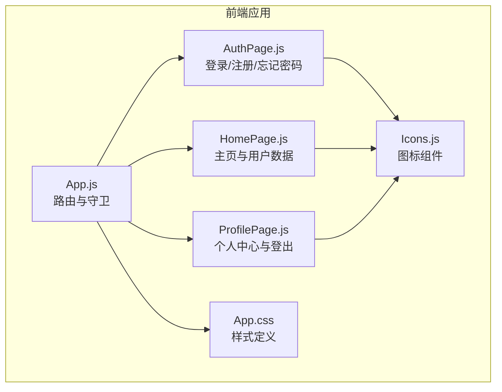
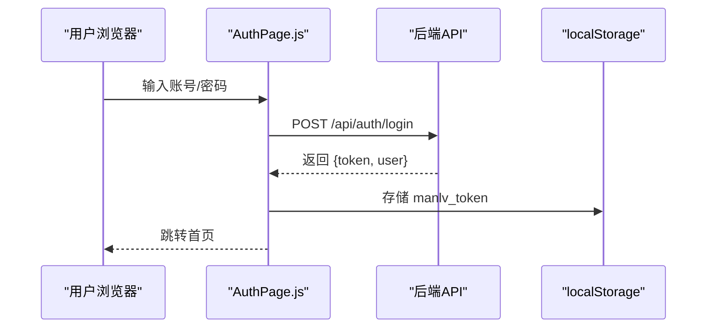
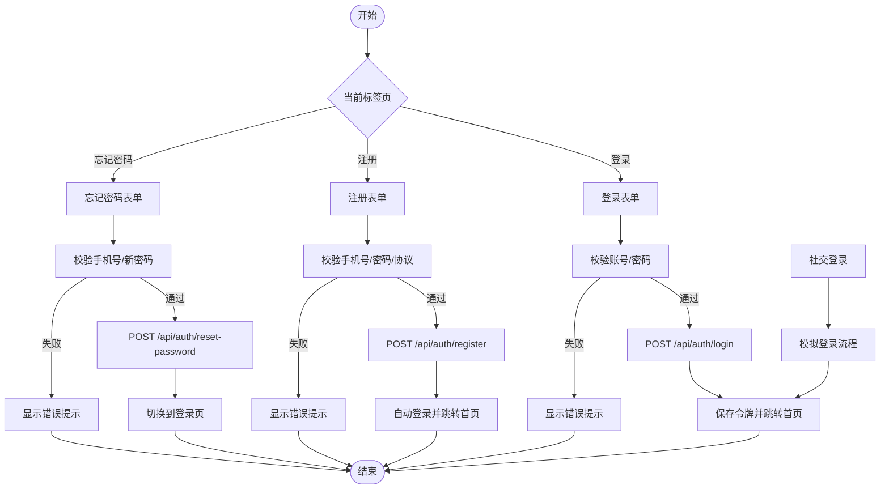
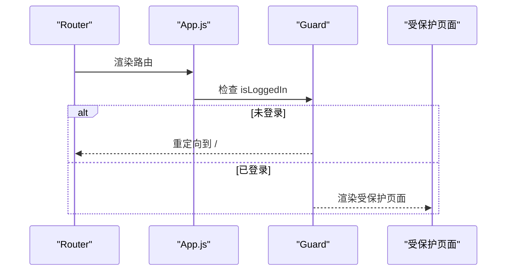
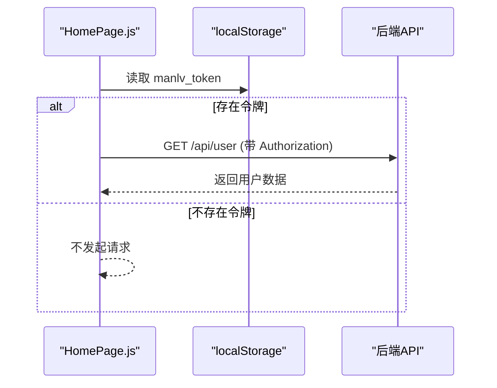
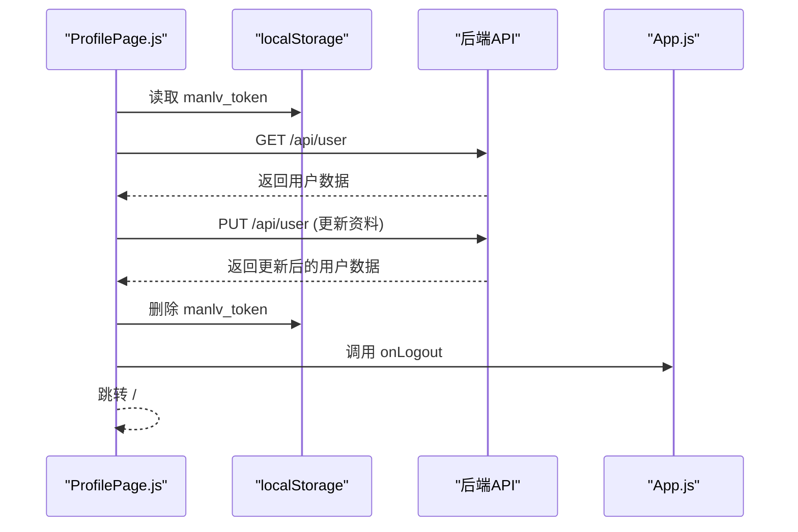
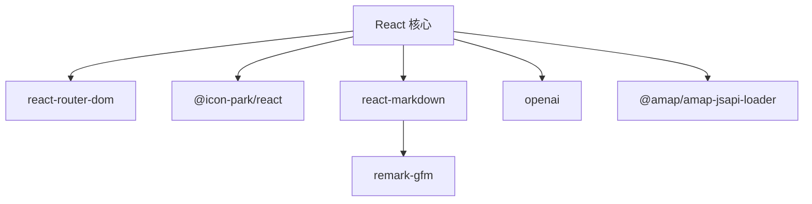

# 用户认证系统

<cite>
**本文档引用的文件**
- [README.md](file://README.md)
- [package.json](file://package.json)
- [src/App.js](file://src/App.js)
- [src/pages/AuthPage.js](file://src/pages/AuthPage.js)
- [src/pages/HomePage.js](file://src/pages/HomePage.js)
- [src/pages/ProfilePage.js](file://src/pages/ProfilePage.js)
- [src/components/Icons.js](file://src/components/Icons.js)
- [src/App.css](file://src/App.css)
</cite>

## 目录
1. [项目概述](#项目概述)
2. [项目结构](#项目结构)
3. [核心组件](#核心组件)
4. [架构总览](#架构总览)
5. [详细组件分析](#详细组件分析)
6. [依赖关系分析](#依赖关系分析)
7. [性能考虑](#性能考虑)
8. [故障排除指南](#故障排除指南)
9. [结论](#结论)

## 项目概述
本项目为漫旅 ManLv 的前端认证系统，基于 React 构建，提供登录、注册、忘记密码、社交登录等功能。系统采用本地存储保存 JWT 令牌，实现无刷新的状态持久化与路由守卫。

## 项目结构
前端采用单页应用架构，认证相关的核心文件如下：
- 认证页面：src/pages/AuthPage.js
- 应用入口与路由守卫：src/App.js
- 首页与用户信息获取：src/pages/HomePage.js
- 个人中心与登出：src/pages/ProfilePage.js
- 图标组件：src/components/Icons.js
- 样式文件：src/App.css

**图表来源**
- [src/App.js:14-91](file://src/App.js#L14-L91)
- [src/pages/AuthPage.js:1-732](file://src/pages/AuthPage.js#L1-L732)
- [src/pages/HomePage.js:1-263](file://src/pages/HomePage.js#L1-L263)
- [src/pages/ProfilePage.js:1-343](file://src/pages/ProfilePage.js#L1-L343)
- [src/components/Icons.js:1-259](file://src/components/Icons.js#L1-L259)
- [src/App.css:1-800](file://src/App.css#L1-L800)

**章节来源**
- [README.md:146-220](file://README.md#L146-L220)
- [package.json:1-41](file://package.json#L1-L41)

## 核心组件
- 认证页面（AuthPage）：实现登录、注册、忘记密码、社交登录，包含手机号格式校验、验证码倒计时、密码强度检测与规则提示。
- 应用入口（App）：提供路由守卫，根据登录状态控制页面访问。
- 首页（HomePage）：从本地存储读取 JWT 令牌，调用用户信息接口获取用户数据。
- 个人中心（ProfilePage）：提供用户资料更新与登出功能，登出时清除本地令牌。

**章节来源**
- [src/pages/AuthPage.js:1-732](file://src/pages/AuthPage.js#L1-L732)
- [src/App.js:14-91](file://src/App.js#L14-L91)
- [src/pages/HomePage.js:21-36](file://src/pages/HomePage.js#L21-L36)
- [src/pages/ProfilePage.js:104-108](file://src/pages/ProfilePage.js#L104-L108)

## 架构总览
认证系统采用前后端分离架构，前端负责用户界面与交互，后端提供 RESTful API。认证流程通过本地存储的 JWT 令牌实现状态持久化。

**图表来源**
- [src/pages/AuthPage.js:86-121](file://src/pages/AuthPage.js#L86-L121)
- [src/App.js:15-11](file://src/App.js#L15-L11)

## 详细组件分析

### 认证页面（AuthPage）
- 登录流程：表单提交 → 校验必填项 → 发送登录请求 → 处理响应（成功保存令牌、跳转首页；失败显示错误提示）。
- 注册流程：表单提交 → 校验手机号格式与密码一致性 → 发送注册请求 → 成功后自动登录并跳转首页。
- 忘记密码：表单提交 → 校验手机号格式与密码一致性 → 发送重置请求 → 切换回登录页。
- 社交登录：模拟第三方登录流程，成功后自动登录并跳转首页。
- 表单验证：手机号格式正则校验、密码强度评分、确认密码一致性校验。
- 用户体验：加载状态、Toast 提示、密码可见性切换、验证码倒计时。

**图表来源**
- [src/pages/AuthPage.js:86-226](file://src/pages/AuthPage.js#L86-L226)

**章节来源**
- [src/pages/AuthPage.js:25-27](file://src/pages/AuthPage.js#L25-L27)
- [src/pages/AuthPage.js:38-62](file://src/pages/AuthPage.js#L38-L62)
- [src/pages/AuthPage.js:64-84](file://src/pages/AuthPage.js#L64-L84)
- [src/pages/AuthPage.js:86-170](file://src/pages/AuthPage.js#L86-L170)
- [src/pages/AuthPage.js:172-211](file://src/pages/AuthPage.js#L172-L211)
- [src/pages/AuthPage.js:213-226](file://src/pages/AuthPage.js#L213-L226)

### 应用入口与路由守卫（App）
- 登录状态：通过 useState 管理 isLoggedIn 状态。
- 路由守卫：使用 Navigate 组件在未登录时重定向到认证页。
- 登录回调：onLogin 回调设置 isLoggedIn 为 true，触发页面渲染更新。

**图表来源**
- [src/App.js:75-81](file://src/App.js#L75-L81)

**章节来源**
- [src/App.js:14-177](file://src/App.js#L14-L177)

### 首页与用户信息获取（HomePage）
- 令牌读取：从 localStorage 获取 manlv_token。
- 用户信息：携带 Authorization 头调用 /api/user 获取用户数据。
- 错误处理：网络异常时记录错误并保持页面可用。

**图表来源**
- [src/pages/HomePage.js:21-36](file://src/pages/HomePage.js#L21-L36)

**章节来源**
- [src/pages/HomePage.js:21-36](file://src/pages/HomePage.js#L21-L36)

### 个人中心与登出（ProfilePage）
- 用户信息：同样通过 /api/user 接口获取用户数据。
- 资料更新：PUT /api/user 支持更新姓名、邮箱、密码、专业方向。
- 登出流程：删除 localStorage 中的 manlv_token，调用 App 的 onLogout 回调并跳转认证页。

**图表来源**
- [src/pages/ProfilePage.js:42-64](file://src/pages/ProfilePage.js#L42-L64)
- [src/pages/ProfilePage.js:71-102](file://src/pages/ProfilePage.js#L71-L102)
- [src/pages/ProfilePage.js:104-108](file://src/pages/ProfilePage.js#L104-L108)

**章节来源**
- [src/pages/ProfilePage.js:42-108](file://src/pages/ProfilePage.js#L42-L108)

### 图标组件（Icons）
- 提供统一的 SVG 图标组件，认证页面使用电话、锁、眼睛、密码等图标增强用户体验。

**章节来源**
- [src/components/Icons.js:1-259](file://src/components/Icons.js#L1-L259)

### 样式与用户体验
- 统一的设计语言与动画效果，提升用户交互体验。
- 表单反馈：输入框状态高亮、密码强度条、确认提示等。

**章节来源**
- [src/App.css:1-800](file://src/App.css#L1-L800)

## 依赖关系分析
- React 生态：react、react-dom、react-router-dom。
- 图标库：@icon-park/react。
- Markdown 渲染：react-markdown、remark-gfm。
- AI 通信：openai（用于演示）。
- 地图服务：@amap/amap-jsapi-loader。

**图表来源**
- [package.json:5-16](file://package.json#L5-L16)

**章节来源**
- [package.json:1-41](file://package.json#L1-L41)

## 性能考虑
- 本地存储令牌：减少每次请求携带令牌的开销。
- 表单即时校验：降低无效请求频率。
- 轻量级状态管理：使用 React hooks 管理登录状态与表单状态。

## 故障排除指南
- 登录失败：检查网络连接与后端服务状态，确认错误消息提示。
- 令牌失效：清除 localStorage 中的 manlv_token 并重新登录。
- 表单校验错误：确保手机号格式正确、密码满足强度要求、确认密码一致。

**章节来源**
- [src/pages/AuthPage.js:96-120](file://src/pages/AuthPage.js#L96-L120)
- [src/pages/HomePage.js:33-35](file://src/pages/HomePage.js#L33-L35)
- [src/pages/ProfilePage.js:104-108](file://src/pages/ProfilePage.js#L104-L108)

## 结论
本认证系统通过简洁的前端实现提供了完整的登录、注册、忘记密码与社交登录体验，结合本地存储令牌实现状态持久化。建议后续完善后端接口与安全策略，以满足生产环境的安全与性能需求。