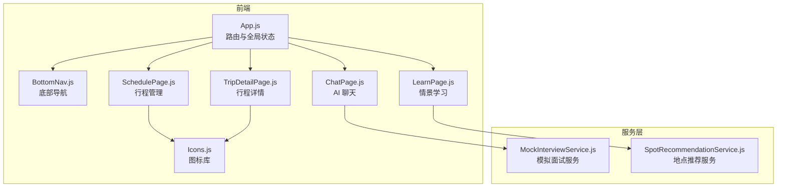
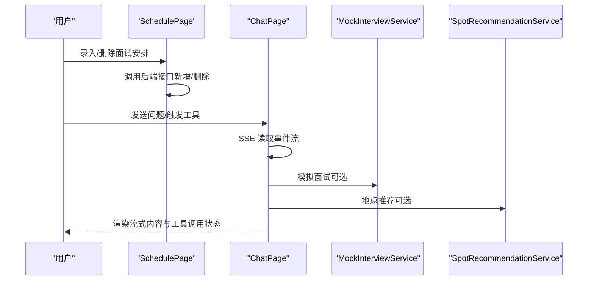
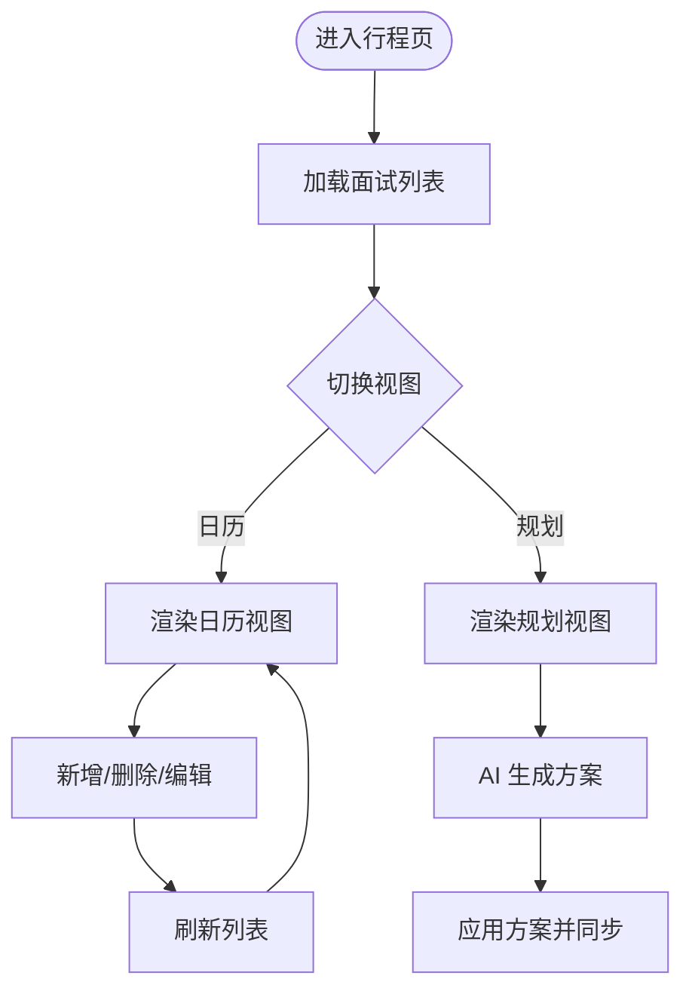
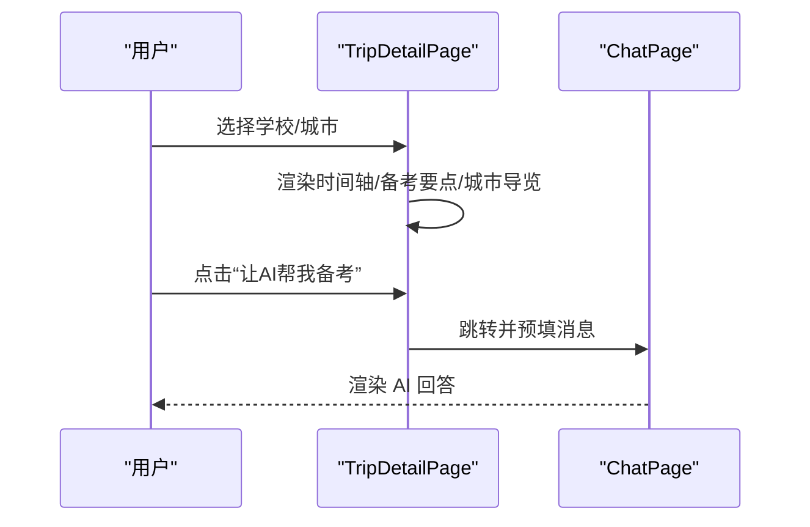
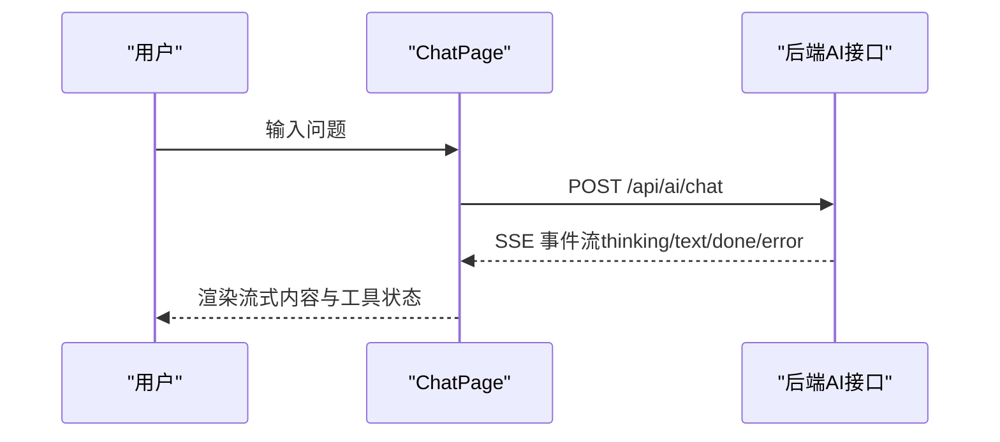
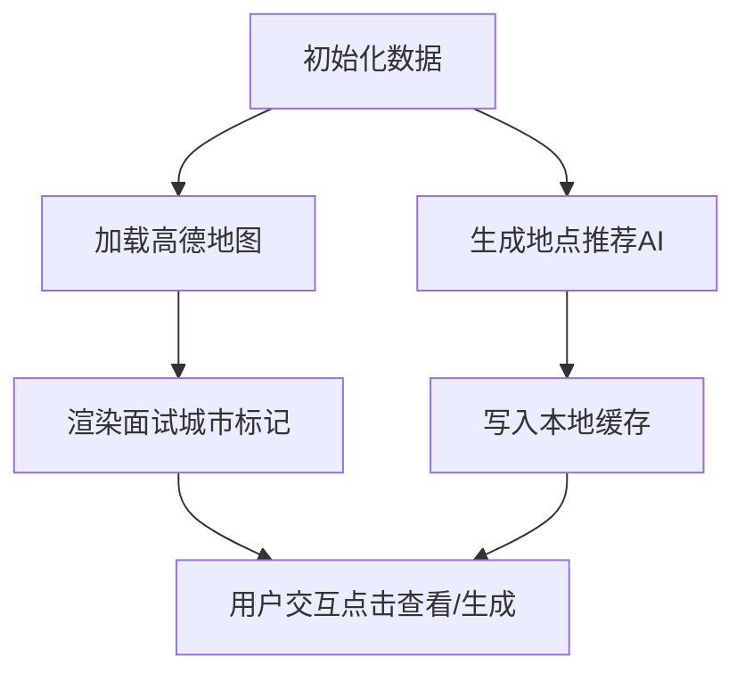
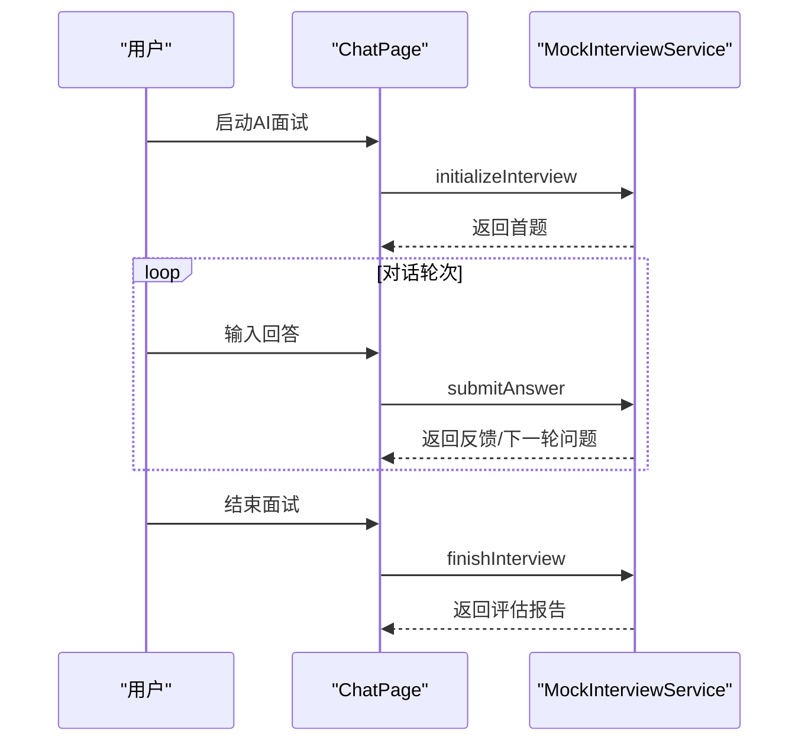
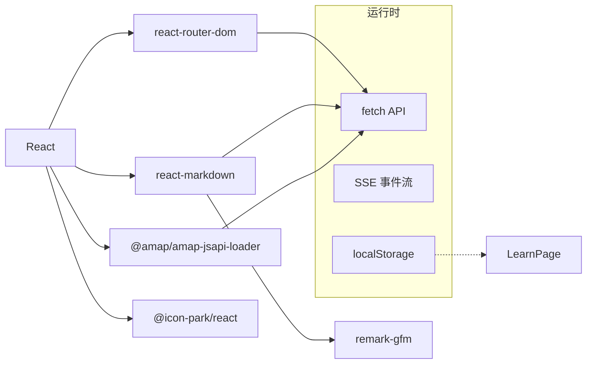
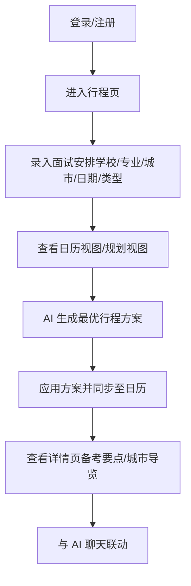

# 行程管理系统

<cite>
**本文档引用的文件**
- [README.md](file://README.md)
- [package.json](file://package.json)
- [src/App.js](file://src/App.js)
- [src/pages/SchedulePage.js](file://src/pages/SchedulePage.js)
- [src/pages/TripDetailPage.js](file://src/pages/TripDetailPage.js)
- [src/pages/ChatPage.js](file://src/pages/ChatPage.js)
- [src/pages/LearnPage.js](file://src/pages/LearnPage.js)
- [src/components/BottomNav.js](file://src/components/BottomNav.js)
- [src/components/Icons.js](file://src/components/Icons.js)
- [src/services/MockInterviewService.js](file://src/services/MockInterviewService.js)
- [src/services/SpotRecommendationService.js](file://src/services/SpotRecommendationService.js)
- [QUICK_START.md](file://QUICK_START.md)
</cite>

## 目录
1. [引言](#引言)
2. [项目结构](#项目结构)
3. [核心组件](#核心组件)
4. [架构总览](#架构总览)
5. [详细组件分析](#详细组件分析)
6. [依赖关系分析](#依赖关系分析)
7. [性能考虑](#性能考虑)
8. [故障排查指南](#故障排查指南)
9. [结论](#结论)
10. [附录](#附录)

## 引言
本文件为漫旅 ManLv 的行程管理系统提供完整技术文档，聚焦多城市面试安排功能，涵盖行程录入、冲突检测算法思路、时间优化策略、可视化展示、详细信息管理、提醒通知机制、状态管理、历史记录追踪与数据同步方案，并给出用户交互流程、数据模型设计与 API 接口规范。文档同时提供性能优化建议、用户体验设计原则与故障处理方案，旨在为产品经理与开发者提供可执行的解决方案。

## 项目结构
前端采用 React 18 + React Router DOM 6 构建，页面路由覆盖登录认证、主页、行程管理、行程详情、AI 聊天、情景学习、邮件解析与个人中心。行程管理模块位于 SchedulePage，配套 TripDetailPage 提供行程详情与备考要点、城市导览联动。AI 聊天页面 ChatPage 支持流式事件通信，集成 MockInterviewService 与 SpotRecommendationService 提供模拟面试与地点推荐。

**图表来源**
- [src/App.js:14-91](file://src/App.js#L14-L91)
- [src/components/BottomNav.js:1-43](file://src/components/BottomNav.js#L1-L43)
- [src/pages/SchedulePage.js:1-423](file://src/pages/SchedulePage.js#L1-L423)
- [src/pages/TripDetailPage.js:1-157](file://src/pages/TripDetailPage.js#L1-L157)
- [src/pages/ChatPage.js:1-482](file://src/pages/ChatPage.js#L1-L482)
- [src/pages/LearnPage.js:1-200](file://src/pages/LearnPage.js#L1-L200)
- [src/components/Icons.js:1-259](file://src/components/Icons.js#L1-L259)
- [src/services/MockInterviewService.js:128-494](file://src/services/MockInterviewService.js#L128-L494)
- [src/services/SpotRecommendationService.js:1-86](file://src/services/SpotRecommendationService.js#L1-L86)

**章节来源**
- [README.md:146-231](file://README.md#L146-L231)
- [package.json:1-41](file://package.json#L1-L41)

## 核心组件
- 行程管理（SchedulePage）
  - 支持日历视图与智能规划视图切换
  - 录入/删除面试安排，触发后端接口
  - 调用 AI 生成行程规划方案并应用
- 行程详情（TripDetailPage）
  - 展示行程时间轴、备考要点与城市导览
  - 与 AI 聊天联动，一键唤起相关问题
- AI 聊天（ChatPage）
  - SSE 流式接收 AI 思考过程与文本
  - 支持工具调用可视化与错误处理
- 情景学习（LearnPage）
  - 基于面试城市与专业生成地点推荐
  - 集成高德地图渲染面试城市标记
- 服务层
  - MockInterviewService：模拟面试生命周期管理
  - SpotRecommendationService：基于专业与城市的地点推荐

**章节来源**
- [src/pages/SchedulePage.js:1-423](file://src/pages/SchedulePage.js#L1-L423)
- [src/pages/TripDetailPage.js:1-157](file://src/pages/TripDetailPage.js#L1-L157)
- [src/pages/ChatPage.js:1-482](file://src/pages/ChatPage.js#L1-L482)
- [src/pages/LearnPage.js:1-200](file://src/pages/LearnPage.js#L1-L200)
- [src/services/MockInterviewService.js:128-494](file://src/services/MockInterviewService.js#L128-L494)
- [src/services/SpotRecommendationService.js:1-86](file://src/services/SpotRecommendationService.js#L1-L86)

## 架构总览
系统采用前后端分离架构，前端通过 fetch 调用后端 API，AI 能力以 SSE 流式事件形式在前端渲染。MockInterviewService 与 SpotRecommendationService 在前端侧提供模拟与兜底能力，保证体验连续性。

**图表来源**
- [src/pages/SchedulePage.js:29-94](file://src/pages/SchedulePage.js#L29-L94)
- [src/pages/ChatPage.js:133-285](file://src/pages/ChatPage.js#L133-L285)
- [src/services/MockInterviewService.js:128-494](file://src/services/MockInterviewService.js#L128-L494)
- [src/services/SpotRecommendationService.js:18-66](file://src/services/SpotRecommendationService.js#L18-L66)

## 详细组件分析

### 行程管理（SchedulePage）
- 数据流
  - 加载：从后端获取面试列表，合并本地演示数据
  - 录入：校验必填字段，发送新增请求，刷新列表
  - 删除：二次确认后调用删除接口
  - 规划：触发 AI 生成方案，支持应用方案并同步至日历
- 视图
  - 日历视图：按日聚合行程，区分交通、活动、住宿与自由时间
  - 智能规划视图：展示面试卡片与 AI 推荐方案卡片
- 交互
  - Toast 提示与加载态控制
  - 弹窗录入与表单联动

**图表来源**
- [src/pages/SchedulePage.js:20-139](file://src/pages/SchedulePage.js#L20-L139)
- [src/pages/SchedulePage.js:144-182](file://src/pages/SchedulePage.js#L144-L182)

**章节来源**
- [src/pages/SchedulePage.js:1-423](file://src/pages/SchedulePage.js#L1-L423)

### 行程详情（TripDetailPage）
- 时间轴：展示邮件解析、资料准备、交通、入住、面试等关键节点
- 备考要点：按专业与优先级组织核心考点
- 城市导览：结合专业推荐可游学地点
- 与 AI 聊天联动：一键唤起相关问题，提升备考效率

**图表来源**
- [src/pages/TripDetailPage.js:46-98](file://src/pages/TripDetailPage.js#L46-L98)
- [src/pages/ChatPage.js:133-285](file://src/pages/ChatPage.js#L133-L285)

**章节来源**
- [src/pages/TripDetailPage.js:1-157](file://src/pages/TripDetailPage.js#L1-L157)

### AI 聊天（ChatPage）
- SSE 事件流
  - thinking：显示工具调用阶段
  - text：增量渲染文本
  - done：展示已使用工具列表
  - error：错误提示
- 上下文面板与快捷问题
  - 支持冲突检查、7天计划、城市天气、1分钟自介等快捷入口
- 模拟面试集成
  - 通过 MockInterviewService 管理会话生命周期

**图表来源**
- [src/pages/ChatPage.js:133-285](file://src/pages/ChatPage.js#L133-L285)

**章节来源**
- [src/pages/ChatPage.js:1-482](file://src/pages/ChatPage.js#L1-L482)

### 情景学习（LearnPage）
- 地图集成
  - 高德地图加载与标记渲染，基于面试城市坐标
- 地点推荐
  - 基于专业与城市生成推荐，支持缓存与兜底
- 面试卡片
  - 展示即将面试的学校与专业，一键启动 AI 面试

**图表来源**
- [src/pages/LearnPage.js:82-139](file://src/pages/LearnPage.js#L82-L139)
- [src/services/SpotRecommendationService.js:18-66](file://src/services/SpotRecommendationService.js#L18-L66)

**章节来源**
- [src/pages/LearnPage.js:1-200](file://src/pages/LearnPage.js#L1-L200)
- [src/services/SpotRecommendationService.js:1-86](file://src/services/SpotRecommendationService.js#L1-L86)

### 服务层组件

#### MockInterviewService（模拟面试）
- 生命周期
  - initializeInterview：初始化会话并生成首题
  - submitAnswer：提交回答并返回反馈与下一轮问题
  - finishInterview：结束面试并生成评估报告
- 兜底机制
  - 模拟 API 响应，保证体验连续性

**图表来源**
- [src/pages/ChatPage.js:141-329](file://src/pages/ChatPage.js#L141-L329)
- [src/services/MockInterviewService.js:128-494](file://src/services/MockInterviewService.js#L128-L494)

**章节来源**
- [src/services/MockInterviewService.js:128-494](file://src/services/MockInterviewService.js#L128-L494)

#### SpotRecommendationService（地点推荐）
- AI 推荐
  - 基于专业与城市生成地点推荐，严格约束输出格式
- 兜底策略
  - API 失败时返回本地模拟数据，保证可用性

**章节来源**
- [src/services/SpotRecommendationService.js:1-86](file://src/services/SpotRecommendationService.js#L1-L86)

## 依赖关系分析
- 前端依赖
  - React、react-router-dom、react-markdown、remark-gfm、@amap/amap-jsapi-loader、@icon-park/react
- 运行时
  - 通过 fetch 调用后端 API，SSE 事件流渲染
  - 本地存储用于缓存地点推荐结果

**图表来源**
- [package.json:5-16](file://package.json#L5-L16)
- [src/pages/LearnPage.js:1-200](file://src/pages/LearnPage.js#L1-L200)

**章节来源**
- [package.json:1-41](file://package.json#L1-L41)
- [src/pages/LearnPage.js:1-200](file://src/pages/LearnPage.js#L1-L200)

## 性能考虑
- 前端渲染优化
  - 日历视图按天聚合数据，避免全量重渲染
  - 智能规划视图懒加载与骨架屏占位
- 网络请求优化
  - 本地缓存地点推荐，减少重复请求
  - SSE 流式渲染，降低首屏等待
- 地图性能
  - 高德地图按需初始化，超时降级提示
- 模拟面试
  - 前端模拟响应，缩短交互延迟

[本节为通用性能建议，无需特定文件引用]

## 故障排查指南
- AI 聊天无响应
  - 检查网络与后端服务连通性
  - 查看 Console 中 SSE 事件流是否正常
- 模拟面试异常
  - 确认 MockInterviewService 的会话状态与错误提示
- 地点推荐失败
  - 检查 SpotRecommendationService 的兜底逻辑与本地缓存
- 地图加载失败
  - 确认高德 Key 与安全密钥配置，检查初始化超时

**章节来源**
- [src/pages/ChatPage.js:133-285](file://src/pages/ChatPage.js#L133-L285)
- [src/services/MockInterviewService.js:128-494](file://src/services/MockInterviewService.js#L128-L494)
- [src/services/SpotRecommendationService.js:62-82](file://src/services/SpotRecommendationService.js#L62-L82)
- [src/pages/LearnPage.js:162-200](file://src/pages/LearnPage.js#L162-L200)

## 结论
本方案围绕“行程录入—冲突检测—时间优化—可视化展示—提醒通知—状态管理—历史记录—数据同步”的闭环，结合 AI 工具链与前端流式渲染，提供可扩展的多城市面试行程管理能力。通过 MockInterviewService 与 SpotRecommendationService 的服务层抽象，系统具备良好的容错与体验保障。建议后续在后端完善冲突检测算法与数据模型，增强提醒与同步能力，并持续优化地图与 AI 服务的稳定性与性能。

[本节为总结性内容，无需特定文件引用]

## 附录

### 用户交互流程（行程管理）

[本图为概念流程图，无需图表来源]

### 数据模型设计（建议）
- 面试记录（Interview）
  - 字段：id、userId、school、major、city、date、type、createdAt、updatedAt
  - 约束：必填字段校验、日期范围校验
- 行程规划（TripPlan）
  - 字段：id、userId、route、score、cost、duration、fatigue、desc、createdAt
  - 约束：评分与统计字段一致性
- 用户（User）
  - 字段：id、name、major、city、preferences、createdAt、updatedAt

[本节为概念性设计，无需特定文件引用]

### API 接口规范（建议）
- 获取面试列表
  - 方法：GET
  - 路径：/api/interviews
  - 认证：Bearer Token
- 新增面试
  - 方法：POST
  - 路径：/api/interviews
  - 请求体：school、major、city、date、type
- 删除面试
  - 方法：DELETE
  - 路径：/api/interviews/{id}
- 生成行程规划
  - 方法：POST
  - 路径：/api/trips/generate
- 应用行程规划
  - 方法：POST
  - 路径：/api/trips/save
  - 请求体：TripPlan 对象
- AI 对话（SSE）
  - 方法：POST
  - 路径：/api/ai/chat
  - 事件类型：thinking、text、done、error

**章节来源**
- [README.md:174-206](file://README.md#L174-L206)
- [src/pages/SchedulePage.js:29-139](file://src/pages/SchedulePage.js#L29-L139)
- [src/pages/ChatPage.js:199-271](file://src/pages/ChatPage.js#L199-L271)

### 冲突检测算法思路（建议）
- 时间冲突
  - 按日期分桶，比较同一日内的面试时间段
- 交通冲突
  - 基于城市与交通时刻表，计算到达/离开时间窗口
- 优化目标
  - 最小化总移动距离/时间，平衡疲劳度与成本
- 输出
  - 冲突列表与修复建议（调整时间/替换交通方式）

[本节为算法设计建议，无需特定文件引用]

### 提醒通知机制（建议）
- 邮件解析触发
  - 入营通知/截止日识别，生成三级提醒（72h/24h/2h）
- 行程变更通知
  - 方案应用后推送日历更新
- 面试前提醒
  - 基于日历事件与城市天气，推送穿搭与交通建议

[本节为机制设计建议，无需特定文件引用]

### 状态管理与历史记录（建议）
- 前端状态
  - 使用 React Hooks 管理视图状态与加载态
- 历史记录
  - 本地存储关键操作记录，便于回溯
- 同步策略
  - 前端缓存 + 后端持久化，离线后恢复

[本节为架构设计建议，无需特定文件引用]

### 用户体验设计原则
- 一致性：统一的图标、颜色与交互反馈
- 可发现性：快捷入口与上下文提示
- 容错性：错误提示与兜底方案
- 性能优先：懒加载、骨架屏与流式渲染

[本节为设计原则，无需特定文件引用]