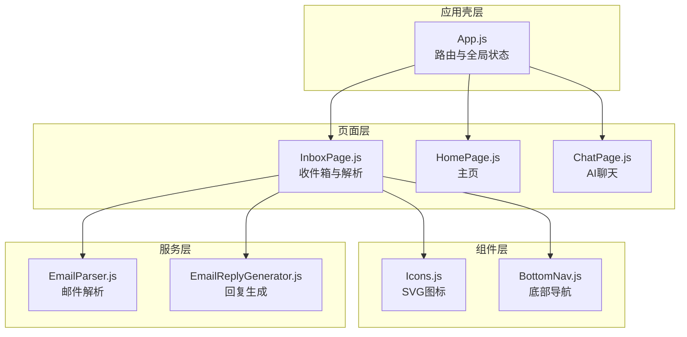
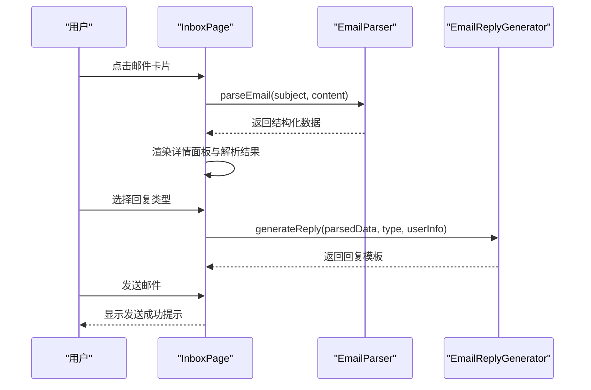
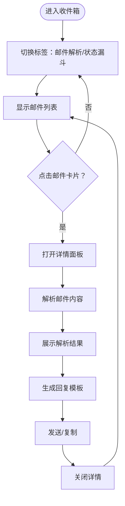
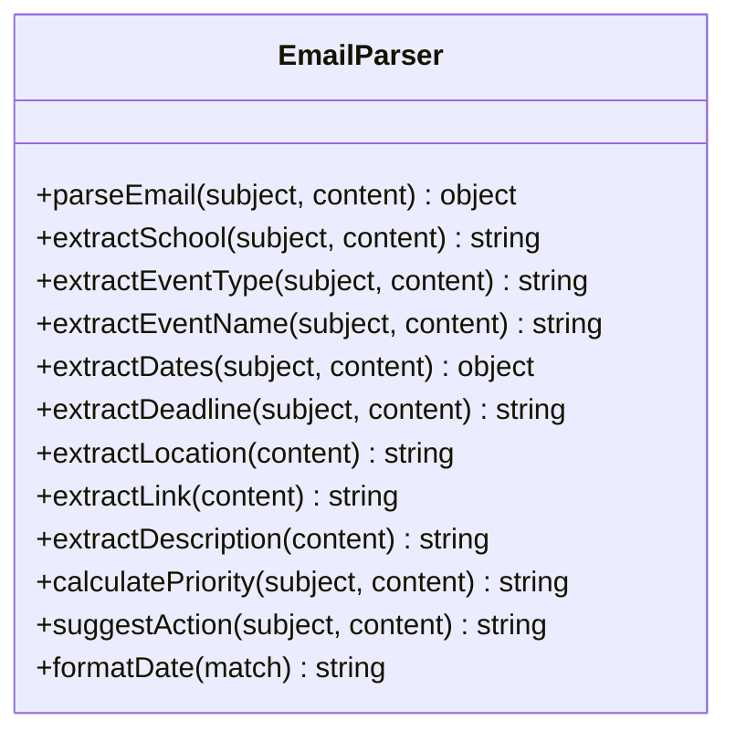
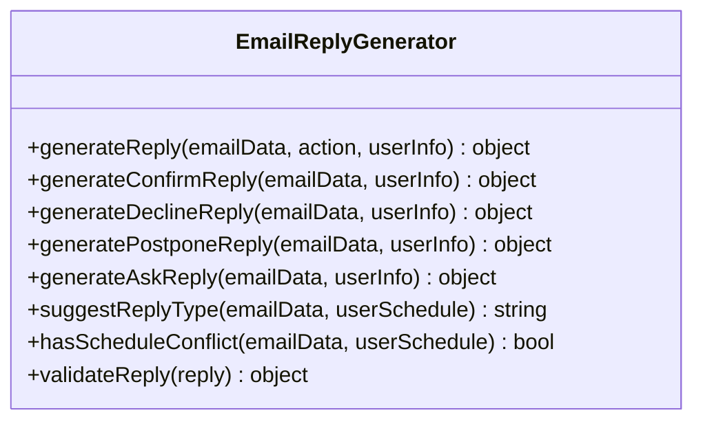
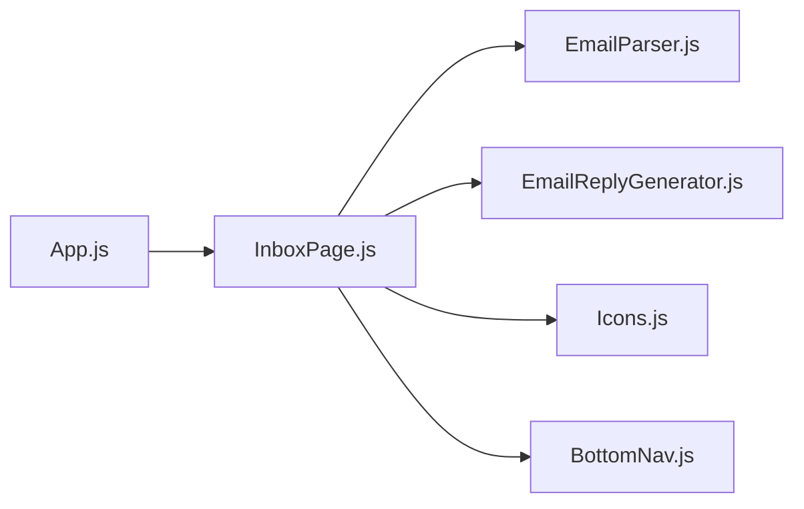

# 邮件收件箱系统

<cite>
**本文档引用的文件**
- [InboxPage.js](file://src/pages/InboxPage.js)
- [EmailParser.js](file://src/services/EmailParser.js)
- [EmailReplyGenerator.js](file://src/services/EmailReplyGenerator.js)
- [Icons.js](file://src/components/Icons.js)
- [BottomNav.js](file://src/components/BottomNav.js)
- [App.js](file://src/App.js)
- [README.md](file://README.md)
- [package.json](file://package.json)
</cite>

## 目录
1. [简介](#简介)
2. [项目结构](#项目结构)
3. [核心组件](#核心组件)
4. [架构总览](#架构总览)
5. [详细组件分析](#详细组件分析)
6. [依赖关系分析](#依赖关系分析)
7. [性能考量](#性能考量)
8. [故障排除指南](#故障排除指南)
9. [结论](#结论)
10. [附录](#附录)

## 简介
本文件为漫旅 ManLv 的邮件收件箱系统提供完整技术文档，涵盖邮件列表展示、排序与筛选、搜索机制、邮件详情查看、自动分类处理、智能提醒、状态管理、未读标记、批量操作支持、用户界面设计与交互流程、数据加载策略、性能优化方案、用户体验设计以及错误处理机制。文档同时为开发者提供实现指南与界面设计参考。

## 项目结构
漫旅 ManLv 采用 React 前端架构，页面通过 React Router 进行路由管理，底部导航提供跨页面跳转。收件箱页面位于 InboxPage，负责邮件解析、状态展示与回复生成；EmailParser 与 EmailReplyGenerator 作为服务层提供邮件解析与回复模板生成能力；Icons 与 BottomNav 提供图标与底部导航组件。

图表来源
- [App.js:77-91](file://src/App.js#L77-L91)
- [InboxPage.js:1-50](file://src/pages/InboxPage.js#L1-L50)
- [Icons.js:1-50](file://src/components/Icons.js#L1-L50)
- [BottomNav.js:1-43](file://src/components/BottomNav.js#L1-L43)
- [EmailParser.js:1-30](file://src/services/EmailParser.js#L1-L30)
- [EmailReplyGenerator.js:1-25](file://src/services/EmailReplyGenerator.js#L1-L25)

章节来源
- [App.js:14-91](file://src/App.js#L14-L91)
- [README.md:146-170](file://README.md#L146-L170)

## 核心组件
- 收件箱页面（InboxPage）：负责邮件列表渲染、解析状态展示、详情面板、回复生成与发送、状态漏斗视图。
- 邮件解析服务（EmailParser）：从邮件主题与内容中提取结构化信息，包括学校、活动类型、时间、截止日期、地点、链接、描述、优先级与建议操作。
- 邮件回复生成服务（EmailReplyGenerator）：基于解析结果生成多种类型的回复模板（确认、拒绝、推迟、咨询），并提供验证与建议回复类型。
- 图标组件（Icons）：提供统一的 SVG 图标库，用于界面元素与状态指示。
- 底部导航（BottomNav）：提供页面间的快速跳转与当前页面高亮。

章节来源
- [InboxPage.js:61-140](file://src/pages/InboxPage.js#L61-L140)
- [EmailParser.js:12-25](file://src/services/EmailParser.js#L12-L25)
- [EmailReplyGenerator.js:13-23](file://src/services/EmailReplyGenerator.js#L13-L23)
- [Icons.js:37-42](file://src/components/Icons.js#L37-L42)
- [BottomNav.js:5-11](file://src/components/BottomNav.js#L5-L11)

## 架构总览
收件箱系统采用“页面 + 服务层”的分层架构。InboxPage 作为页面控制器，协调状态管理与 UI 交互；EmailParser 与 EmailReplyGenerator 作为纯函数式服务，提供可测试的数据处理逻辑；Icons 与 BottomNav 作为通用组件，保证一致的视觉与交互体验。

图表来源
- [InboxPage.js:82-117](file://src/pages/InboxPage.js#L82-L117)
- [EmailParser.js:12-25](file://src/services/EmailParser.js#L12-L25)
- [EmailReplyGenerator.js:13-23](file://src/services/EmailReplyGenerator.js#L13-L23)

## 详细组件分析

### 收件箱页面（InboxPage）
- 邮件列表展示：使用静态示例数据渲染邮件卡片，包含学校、主题、时间、状态与解析状态徽章。
- 解析状态与进度：提供“解析中/完成”状态卡片，支持手动刷新解析进度条与时间戳。
- 详情面板：点击邮件进入详情视图，展示解析字段（活动类型、名称、时间、截止日期、地点、优先级、建议操作），支持查看原始邮件与切换显示。
- 回复生成：提供“确认参加/委婉拒绝”按钮，生成标准化回复模板，支持复制与发送。
- 状态漏斗：展示申请进度的漏斗视图与各校状态标签。
- 交互控制：禁用解析进行中的点击与交互，避免并发状态冲突。

图表来源
- [InboxPage.js:164-265](file://src/pages/InboxPage.js#L164-L265)
- [InboxPage.js:267-433](file://src/pages/InboxPage.js#L267-L433)
- [InboxPage.js:435-465](file://src/pages/InboxPage.js#L435-L465)

章节来源
- [InboxPage.js:61-140](file://src/pages/InboxPage.js#L61-L140)
- [InboxPage.js:142-474](file://src/pages/InboxPage.js#L142-L474)

### 邮件解析服务（EmailParser）
- 提取字段：学校、活动类型、活动名称、日期范围、截止日期、地点、报名链接、摘要、优先级、建议操作。
- 关键算法：
  - 学校识别：基于关键词集合匹配主题与正文。
  - 活动类型：基于关键字映射（夏令营、面试、推免、讲座等）。
  - 日期提取：使用正则表达式匹配多种日期格式并格式化。
  - 截止日期：扫描包含“截止/截至”关键词的行并提取日期。
  - 优先级：综合紧急标签、目标学校与截止日期接近度计算。
  - 建议操作：根据活动类型返回对应建议。

图表来源
- [EmailParser.js:5-227](file://src/services/EmailParser.js#L5-L227)

章节来源
- [EmailParser.js:12-224](file://src/services/EmailParser.js#L12-L224)

### 邮件回复生成服务（EmailReplyGenerator）
- 生成模板：支持“确认参加/委婉拒绝/时间冲突协商/咨询问题”四种类型，返回包含主题与正文的对象。
- 建议回复类型：结合活动类型、优先级与日程冲突，给出建议回复类型。
- 验证规则：校验主题非空、正文长度、占位符完整性等。
- 依赖用户信息：从 InboxPage 注入用户资料（姓名、学校、专业、学号、电话、邮箱）。

图表来源
- [EmailReplyGenerator.js:5-212](file://src/services/EmailReplyGenerator.js#L5-L212)

章节来源
- [EmailReplyGenerator.js:13-208](file://src/services/EmailReplyGenerator.js#L13-L208)

### 图标与导航组件
- Icons：提供统一的 SVG 图标，包括邮件、确认、警告、右侧箭头、收件箱、发送、关闭等，用于状态与交互元素。
- BottomNav：提供底部导航栏，包含首页、行程、漫学、通知、我的五个入口，支持当前页面高亮。

章节来源
- [Icons.js:37-42](file://src/components/Icons.js#L37-L42)
- [Icons.js:161-173](file://src/components/Icons.js#L161-L173)
- [Icons.js:175-179](file://src/components/Icons.js#L175-L179)
- [Icons.js:181-186](file://src/components/Icons.js#L181-L186)
- [Icons.js:144-149](file://src/components/Icons.js#L144-L149)
- [Icons.js:247-252](file://src/components/Icons.js#L247-L252)
- [BottomNav.js:5-11](file://src/components/BottomNav.js#L5-L11)

## 依赖关系分析
- InboxPage 依赖 EmailParser 与 EmailReplyGenerator 进行数据处理与回复生成。
- InboxPage 使用 Icons 与 BottomNav 提供一致的 UI 与导航体验。
- App.js 通过路由管理页面访问，确保登录态与页面守卫。

图表来源
- [InboxPage.js:3-5](file://src/pages/InboxPage.js#L3-L5)
- [App.js:10-11](file://src/App.js#L10-L11)

章节来源
- [App.js:14-91](file://src/App.js#L14-L91)
- [InboxPage.js:1-10](file://src/pages/InboxPage.js#L1-L10)

## 性能考量
- 列表渲染优化：使用稳定的 key（索引）渲染邮件卡片，避免不必要的重排；在解析进行中降低透明度与禁用点击，减少无效交互。
- 异步解析：模拟解析过程采用分步 Promise，逐步更新进度，避免阻塞主线程。
- 状态管理：集中管理解析状态、进度、回复生成与发送状态，减少重复渲染。
- UI 响应：详情面板与解析结果按需渲染，避免一次性渲染大量 DOM。
- 建议优化：
  - 将静态示例数据替换为异步加载的真实邮件数据源。
  - 对解析结果进行缓存，避免重复解析同一邮件。
  - 在移动端启用虚拟滚动以提升长列表性能。
  - 对日期与链接提取增加更健壮的正则与边界检查。

[本节为通用性能指导，不直接分析具体文件，故无章节来源]

## 故障排除指南
- 解析失败或字段为空：检查 EmailParser 的关键词匹配与正则表达式，确保输入文本包含预期格式。
- 回复模板缺失或占位符未填充：使用 EmailReplyGenerator.validateReply 校验回复对象，确保主题与正文完整且无占位符残留。
- 发送按钮异常：确认 isSending 状态与禁用逻辑正确，避免重复提交。
- UI 卡顿：检查解析循环与进度更新频率，必要时增加节流或分片处理。

章节来源
- [EmailReplyGenerator.js:188-208](file://src/services/EmailReplyGenerator.js#L188-L208)
- [InboxPage.js:107-117](file://src/pages/InboxPage.js#L107-L117)

## 结论
漫旅 ManLv 的邮件收件箱系统通过清晰的页面与服务层分离，实现了邮件解析、状态展示与智能回复生成的完整闭环。系统具备良好的扩展性与可维护性，适合进一步接入真实邮件数据源与后端服务，以实现真正的自动化邮件感知与提醒功能。

[本节为总结性内容，不直接分析具体文件，故无章节来源]

## 附录

### 用户界面设计与交互流程
- 邮件列表：卡片式布局，包含学校、主题、时间、状态徽章与解析状态指示。
- 详情面板：解析结果分组展示，支持查看原始邮件与切换显示。
- 回复生成：提供一键生成与发送，支持复制到剪贴板。
- 状态漏斗：以可视化方式展示申请进度与各校状态。

章节来源
- [InboxPage.js:238-263](file://src/pages/InboxPage.js#L238-L263)
- [InboxPage.js:267-433](file://src/pages/InboxPage.js#L267-L433)
- [InboxPage.js:435-465](file://src/pages/InboxPage.js#L435-L465)

### 开发者实现指南
- 集成步骤：
  - 替换静态邮件数据为真实数据源（API 或本地存储）。
  - 在 InboxPage 中添加加载状态与错误处理。
  - 将 EmailParser 与 EmailReplyGenerator 的调用封装为可复用 Hook。
  - 添加批量操作（全选、删除、标记已读）与搜索/筛选功能。
  - 实现未读标记与状态持久化。
- 接口与数据：
  - 邮件数据结构：id、school、subject、from、time、content、parsed、status、statusType。
  - 解析结果结构：school、eventType、eventName、dates(startDate,endDate)、deadline、location、applyLink、description、priority、suggestedAction。
  - 回复模板结构：subject、body、type、needsReview。

章节来源
- [InboxPage.js:7-52](file://src/pages/InboxPage.js#L7-L52)
- [EmailParser.js:12-25](file://src/services/EmailParser.js#L12-L25)
- [EmailReplyGenerator.js:13-23](file://src/services/EmailReplyGenerator.js#L13-L23)