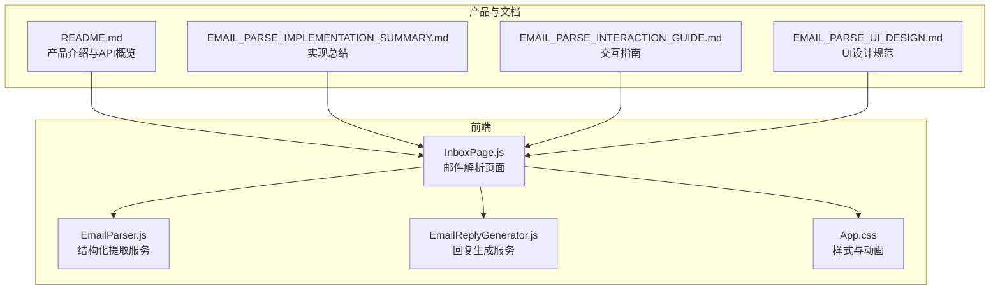
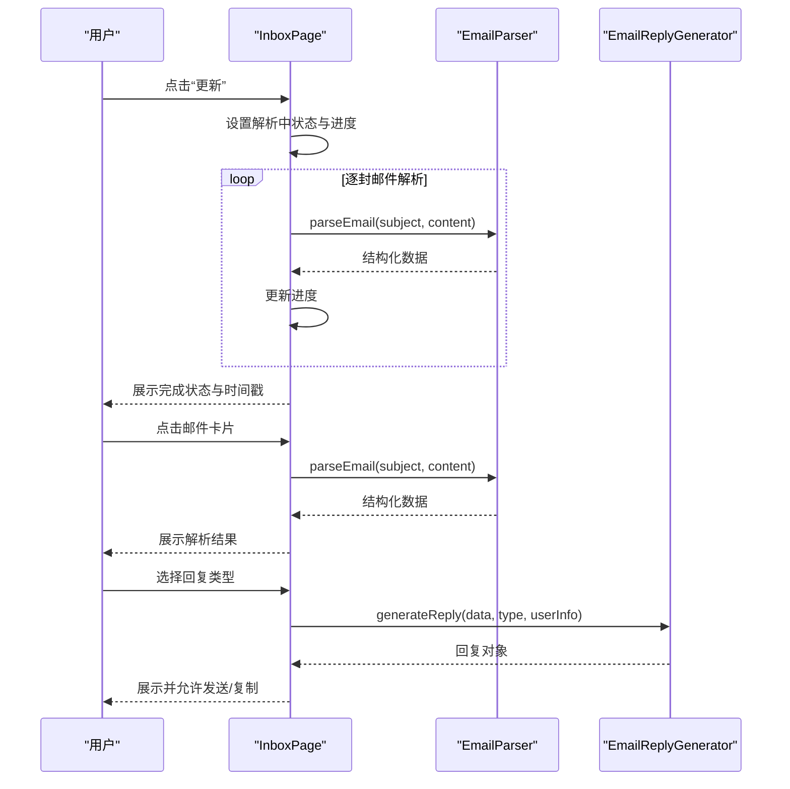
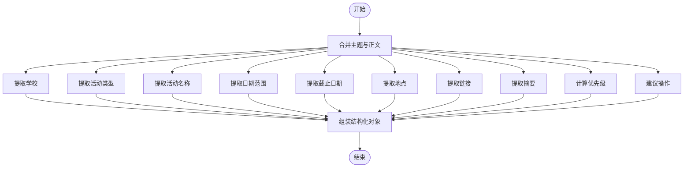
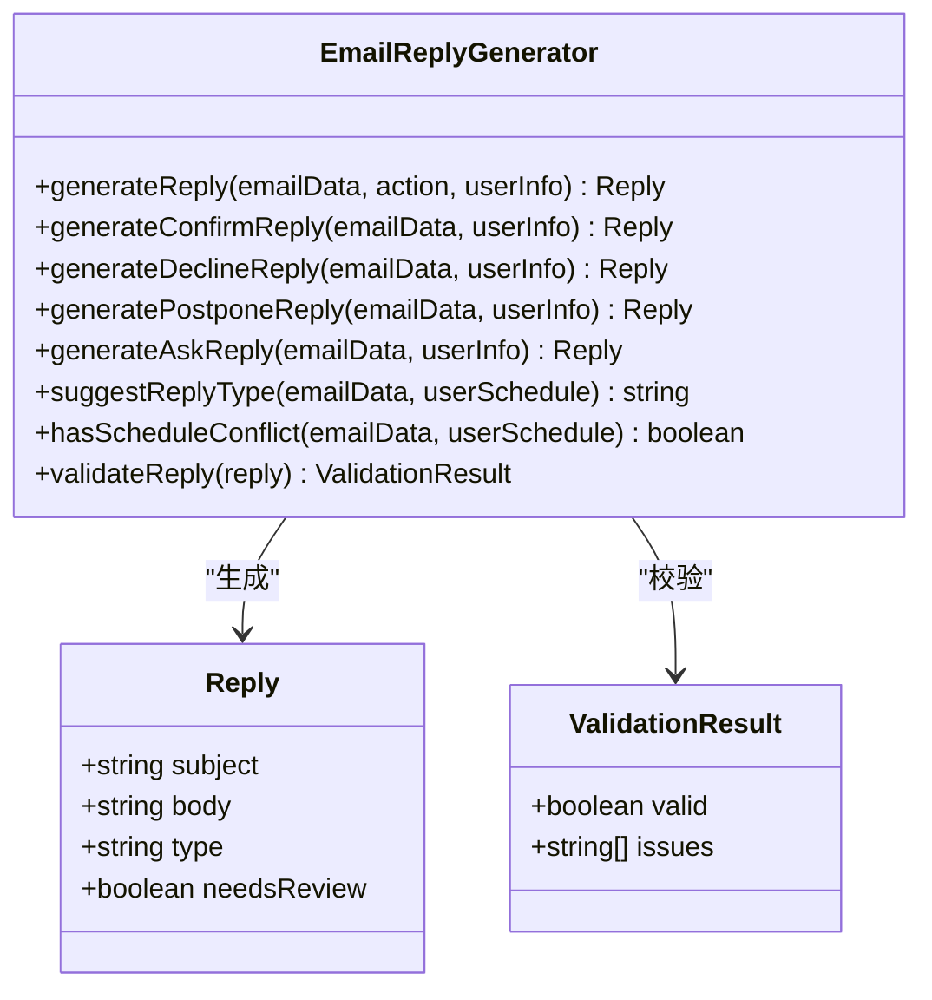
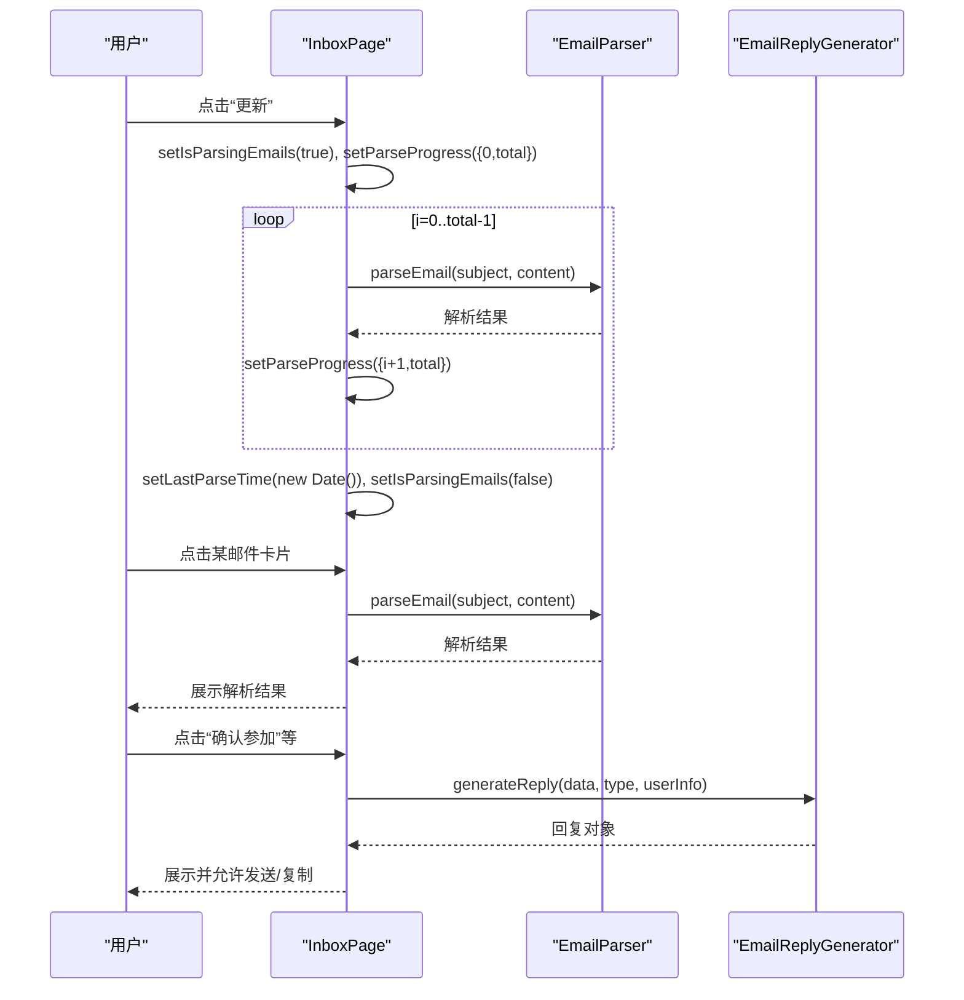
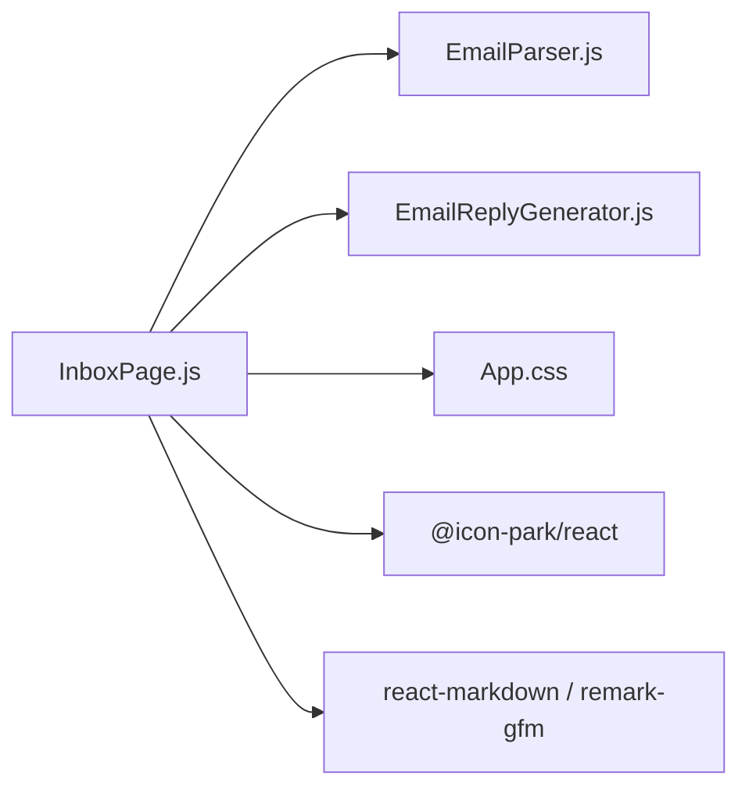

# 邮件智能解析系统

<cite>
**本文引用的文件**
- [README.md](file://README.md)
- [EMAIL_PARSE_IMPLEMENTATION_SUMMARY.md](file://EMAIL_PARSE_IMPLEMENTATION_SUMMARY.md)
- [EMAIL_PARSE_INTERACTION_GUIDE.md](file://EMAIL_PARSE_INTERACTION_GUIDE.md)
- [EMAIL_PARSE_UI_DESIGN.md](file://EMAIL_PARSE_UI_DESIGN.md)
- [InboxPage.js](file://src/pages/InboxPage.js)
- [EmailParser.js](file://src/services/EmailParser.js)
- [EmailReplyGenerator.js](file://src/services/EmailReplyGenerator.js)
- [App.css](file://src/App.css)
- [package.json](file://package.json)
</cite>

## 目录
1. [简介](#简介)
2. [项目结构](#项目结构)
3. [核心组件](#核心组件)
4. [架构总览](#架构总览)
5. [详细组件分析](#详细组件分析)
6. [依赖关系分析](#依赖关系分析)
7. [性能考量](#性能考量)
8. [故障排查指南](#故障排查指南)
9. [结论](#结论)
10. [附录](#附录)

## 简介
本文件面向“漫旅 ManLv”的邮件智能解析系统，提供从算法到UI、从前端到服务层的完整技术文档。系统围绕“邮件结构化提取”“优先级计算”“自动分类处理”“回复生成与模板匹配”“个性化定制”“UI状态追踪与动画反馈”等核心能力展开，既满足当前前端演示需求，也为后续对接真实后端与AI解析提供清晰的扩展路径。

## 项目结构
- 前端采用 React 18 + React Router，页面位于 src/pages，通用服务位于 src/services。
- 邮件解析UI卡片与交互逻辑集中在 InboxPage.js，配套样式位于 App.css。
- 服务层包含 EmailParser（结构化提取）与 EmailReplyGenerator（模板生成与建议）两大模块。
- README 提供整体产品定位、功能与技术栈概览。

图表来源
- [InboxPage.js:1-479](file://src/pages/InboxPage.js#L1-L479)
- [EmailParser.js:1-227](file://src/services/EmailParser.js#L1-L227)
- [EmailReplyGenerator.js:1-212](file://src/services/EmailReplyGenerator.js#L1-L212)
- [App.css:1-800](file://src/App.css#L1-L800)
- [README.md:1-243](file://README.md#L1-L243)
- [EMAIL_PARSE_IMPLEMENTATION_SUMMARY.md:1-395](file://EMAIL_PARSE_IMPLEMENTATION_SUMMARY.md#L1-L395)
- [EMAIL_PARSE_INTERACTION_GUIDE.md:1-419](file://EMAIL_PARSE_INTERACTION_GUIDE.md#L1-L419)
- [EMAIL_PARSE_UI_DESIGN.md:1-234](file://EMAIL_PARSE_UI_DESIGN.md#L1-L234)

章节来源
- [README.md:1-243](file://README.md#L1-L243)
- [InboxPage.js:1-479](file://src/pages/InboxPage.js#L1-L479)
- [EmailParser.js:1-227](file://src/services/EmailParser.js#L1-L227)
- [EmailReplyGenerator.js:1-212](file://src/services/EmailReplyGenerator.js#L1-L212)
- [App.css:1-800](file://src/App.css#L1-L800)

## 核心组件
- 邮件解析服务（EmailParser）
  - 职责：从主题与正文提取结构化信息（学校、活动类型、活动名称、日期、截止日期、地点、链接、摘要、优先级、建议操作）。
  - 关键算法：关键词匹配、正则抽取、优先级规则、日期格式化。
- 邮件回复生成服务（EmailReplyGenerator）
  - 职责：根据解析结果与用户日程，生成四种模板（确认、拒绝、协商、咨询），并提供回复建议与校验。
  - 关键策略：基于优先级与活动类型的模板选择、日程冲突检测、回复有效性校验。
- 邮件解析UI（InboxPage）
  - 职责：展示解析状态卡片、进度条与点阵动画、解析结果、原始邮件查看、回复生成与发送、状态切换与禁用交互。
  - 关键特性：条件渲染、异步模拟、禁用态管理、Toast提示、无障碍支持。

章节来源
- [EmailParser.js:12-227](file://src/services/EmailParser.js#L12-L227)
- [EmailReplyGenerator.js:13-212](file://src/services/EmailReplyGenerator.js#L13-L212)
- [InboxPage.js:61-479](file://src/pages/InboxPage.js#L61-L479)

## 架构总览
系统采用“页面组件 + 服务层”的分层设计：
- 页面层负责状态管理、UI渲染与用户交互；
- 服务层封装业务逻辑（解析、回复生成、校验）；
- 样式层提供统一的视觉与动画规范；
- 文档与产品说明提供设计与交互约束。

图表来源
- [InboxPage.js:127-140](file://src/pages/InboxPage.js#L127-L140)
- [EmailParser.js:12-25](file://src/services/EmailParser.js#L12-L25)
- [EmailReplyGenerator.js:13-23](file://src/services/EmailReplyGenerator.js#L13-L23)

## 详细组件分析

### 邮件解析服务（EmailParser）
- 输入：邮件主题、正文
- 输出：结构化对象（学校、活动类型、活动名称、日期范围、截止日期、地点、链接、摘要、优先级、建议操作）
- 关键方法与策略
  - extractSchool：基于高校词库匹配主题或正文
  - extractEventType：基于关键词映射到 camp/interview/promotion/seminar/other
  - extractEventName：从主题中提取活动名称（支持多种引号包裹）
  - extractDates：使用正则匹配日期范围，格式化为起止日期
  - extractDeadline：在含截止关键词的行中抽取截止日期
  - extractLocation：在含地点关键词的行中抽取地点
  - extractLink：抽取URL，优先表单/调查/登录链接
  - extractDescription：取前三行或最多200字符摘要
  - calculatePriority：综合紧急标签、目标学校、截止日期接近度确定 urgent/high/normal
  - suggestAction：根据活动类型返回建议操作文案
  - formatDate：统一日期格式化

图表来源
- [EmailParser.js:12-227](file://src/services/EmailParser.js#L12-L227)

章节来源
- [EmailParser.js:12-227](file://src/services/EmailParser.js#L12-L227)

### 邮件回复生成服务（EmailReplyGenerator）
- 输入：解析后的邮件数据、操作类型（confirm/decline/postpone/ask）、用户信息
- 输出：回复对象（主题、正文、类型、是否需要人工审阅）
- 关键方法与策略
  - generateReply：根据类型路由到对应模板
  - generateConfirmReply/generateDeclineReply/generatePostponeReply/generateAskReply：四种模板
  - suggestReplyType：基于优先级、活动类型与日程冲突给出建议类型
  - hasScheduleConflict：简单日期冲突检测
  - validateReply：校验主题非空、正文长度、占位符完整性

图表来源
- [EmailReplyGenerator.js:13-212](file://src/services/EmailReplyGenerator.js#L13-L212)

章节来源
- [EmailReplyGenerator.js:13-212](file://src/services/EmailReplyGenerator.js#L13-L212)

### 邮件解析UI（InboxPage）
- 状态管理
  - isParsingEmails：解析中/完成状态
  - parseProgress：current/total 进度
  - lastParseTime：最后解析时间
  - selectedEmail/parsedData/generatedReply：详情面板状态
  - isSending：发送中状态
- 交互流程
  - 点击“更新”触发 handleRefreshEmails，逐封邮件模拟解析，更新进度
  - 点击邮件卡片触发 handleParseEmail，调用 EmailParser 生成解析结果
  - 选择回复类型触发 handleGenerateReply，调用 EmailReplyGenerator 生成回复
  - 发送邮件模拟 handleSendEmail，显示 Toast 并关闭详情
- 禁用与禁用态
  - 解析中禁用按钮与邮件卡片，降低透明度，阻止点击
- 无障碍与响应式
  - ARIA 标签、键盘导航、WCAG 颜色对比度

图表来源
- [InboxPage.js:61-479](file://src/pages/InboxPage.js#L61-L479)
- [EmailParser.js:12-25](file://src/services/EmailParser.js#L12-L25)
- [EmailReplyGenerator.js:13-23](file://src/services/EmailReplyGenerator.js#L13-L23)

章节来源
- [InboxPage.js:61-479](file://src/pages/InboxPage.js#L61-L479)

### 样式与动画（App.css）
- 邮件解析状态卡片样式：标题、副标题、进度条、进度点、完成图标、时间戳
- 动画关键帧：旋转（刷新按钮）、进度条微光、点阵脉动、完成图标弹跳
- 响应式：移动端优先，最大宽度420px，按钮最小点击区域≥44px
- 无障碍：颜色对比度满足WCAG AA/AAA，ARIA标签与屏幕阅读器友好

章节来源
- [App.css:1-800](file://src/App.css#L1-L800)
- [EMAIL_PARSE_UI_DESIGN.md:71-234](file://EMAIL_PARSE_UI_DESIGN.md#L71-L234)

## 依赖关系分析
- 组件耦合
  - InboxPage 依赖 EmailParser 与 EmailReplyGenerator，耦合点清晰，职责单一。
  - UI与业务逻辑分离，便于替换真实解析与回复生成逻辑。
- 外部依赖
  - React 18、React Router、@icon-park/react、react-markdown、remark-gfm 等。
- 潜在风险
  - 当前解析与回复生成均为前端模拟，需在后端接入真实API与AI服务时进行解耦与接口对齐。

图表来源
- [InboxPage.js:1-6](file://src/pages/InboxPage.js#L1-L6)
- [package.json:5-16](file://package.json#L5-L16)

章节来源
- [InboxPage.js:1-6](file://src/pages/InboxPage.js#L1-L6)
- [package.json:1-41](file://package.json#L1-L41)

## 性能考量
- 前端动画
  - 使用 CSS 动画与 will-change 优化，避免频繁 DOM 更新，保证60fps流畅度。
- 状态切换
  - 状态切换延迟<100ms，交互响应时间<200ms，邮件卡片禁用采用 opacity 过渡。
- 包体积
  - 新增约1.3kB，JavaScript/CSS分别+753B/+584B，对生产影响极小。
- 后续优化建议
  - 将解析与回复生成迁移到后端，前端仅负责展示与交互。
  - 使用 Web Workers 或 Service Worker 处理解析任务，避免阻塞主线程。
  - 对正则与关键词匹配进行缓存与去重，减少重复计算。

章节来源
- [EMAIL_PARSE_IMPLEMENTATION_SUMMARY.md:130-137](file://EMAIL_PARSE_IMPLEMENTATION_SUMMARY.md#L130-L137)
- [EMAIL_PARSE_IMPLEMENTATION_SUMMARY.md:123-129](file://EMAIL_PARSE_IMPLEMENTATION_SUMMARY.md#L123-L129)

## 故障排查指南
- 进度条不显示
  - 检查浏览器控制台 parseProgress 状态，确认 isParsingEmails 与进度更新逻辑。
- 动画卡顿
  - 降低其他页面动画，确保浏览器支持 CSS 动画；升级浏览器版本。
- 按钮无响应
  - 清除浏览器缓存，重新加载页面；确认 isParsingEmails 状态正确。
- 时间戳显示异常
  - 检查系统时间设置与本地化格式。
- 邮件卡片不禁用
  - 确认 isParsingEmails 为 true 时，卡片 opacity 为0.6，cursor 为 not-allowed。
- 回复生成失败
  - 检查 parsedData 是否存在；确认 userInfo 填写完整；使用 validateReply 检查占位符与长度。

章节来源
- [EMAIL_PARSE_IMPLEMENTATION_SUMMARY.md:356-365](file://EMAIL_PARSE_IMPLEMENTATION_SUMMARY.md#L356-L365)
- [EmailReplyGenerator.js:188-208](file://src/services/EmailReplyGenerator.js#L188-L208)

## 结论
漫旅 ManLv 的邮件智能解析系统通过清晰的分层设计与完善的UI反馈，实现了从“邮件解析状态追踪”到“结构化信息提取”再到“模板化回复生成”的闭环。当前实现以前端模拟为主，具备良好的可扩展性与可维护性，为后续接入真实后端与AI解析提供了坚实基础。

## 附录

### API 接口规范（当前前端模拟）
- 邮件解析（模拟）
  - 请求：无（前端使用内置样例数据）
  - 响应：结构化对象（见 EmailParser 输出）
- 回复生成（模拟）
  - 请求：解析结果 + 操作类型 + 用户信息
  - 响应：回复对象（主题、正文、类型、是否需要审阅）

章节来源
- [EmailParser.js:12-25](file://src/services/EmailParser.js#L12-L25)
- [EmailReplyGenerator.js:13-23](file://src/services/EmailReplyGenerator.js#L13-L23)

### 最佳实践
- 解析算法
  - 使用关键词词库与正则结合，提高鲁棒性；对日期格式进行统一化处理。
- 优先级与分类
  - 优先级规则应可配置；分类标签应支持多语言与扩展。
- 回复模板
  - 模板应支持占位符与个性化字段；提供校验与审阅开关。
- UI/UX
  - 保持状态切换的即时反馈；提供禁用态与提示语；确保无障碍与响应式。

### 扩展性设计
- 后端集成
  - 将 EmailParser 与 EmailReplyGenerator 改造为对外 API 调用，前端通过 fetch/axios 调用。
- AI 解析
  - 使用 DashScope/Qwen 等模型进行结构化抽取与意图识别，前端通过 SSE 接收流式结果。
- 数据持久化
  - 将解析结果与回复历史持久化，支持离线查看与二次编辑。
- 错误处理
  - 增加网络超时、解析失败、模板缺失等兜底策略与重试机制。