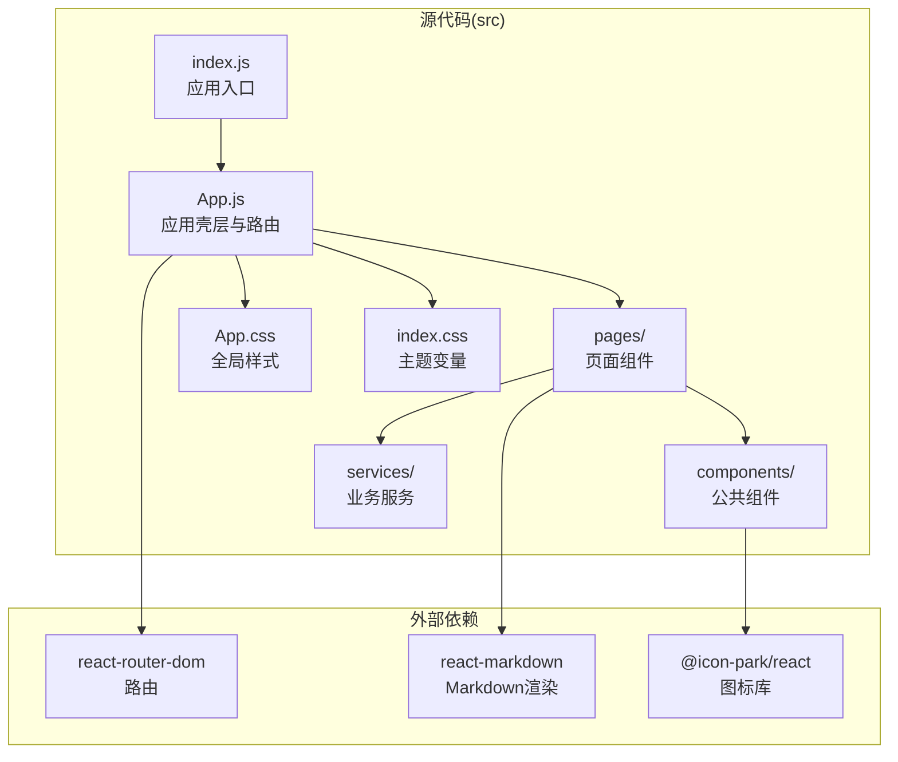
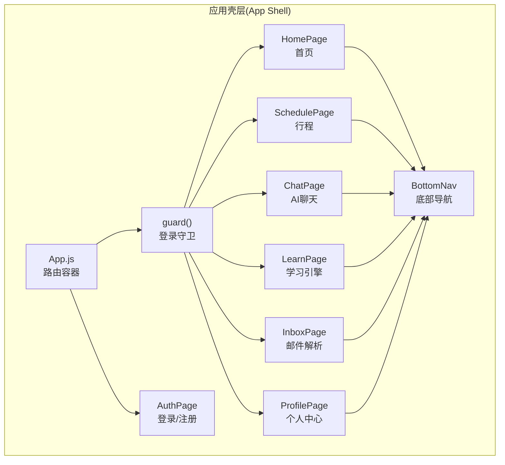
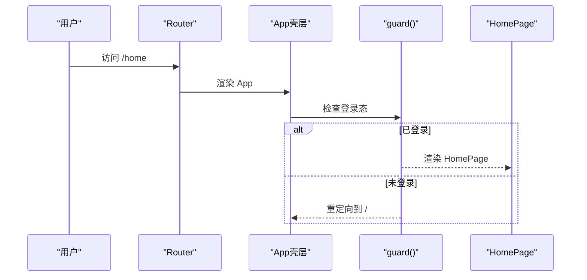
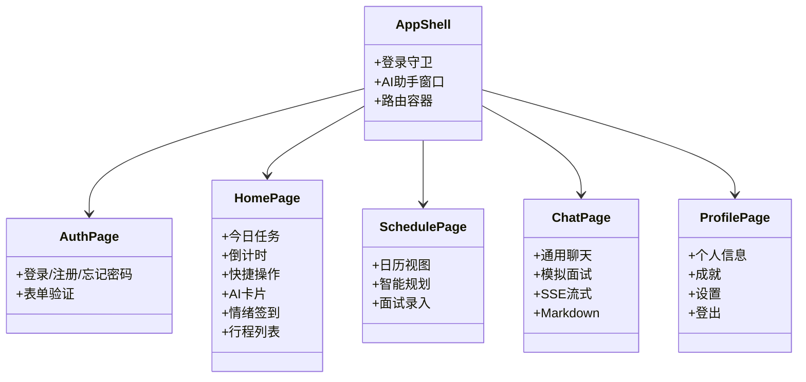
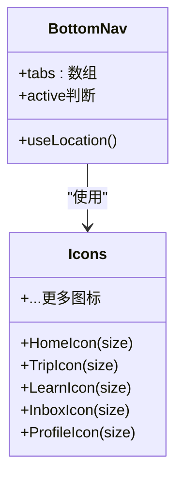
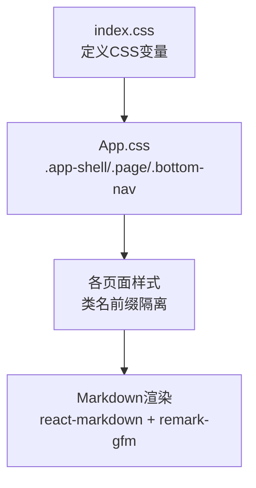
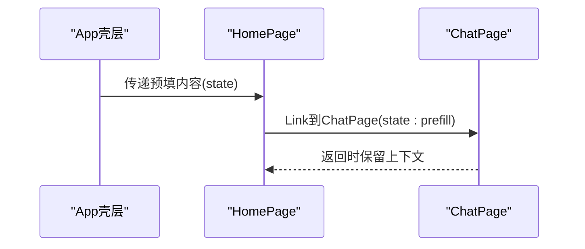
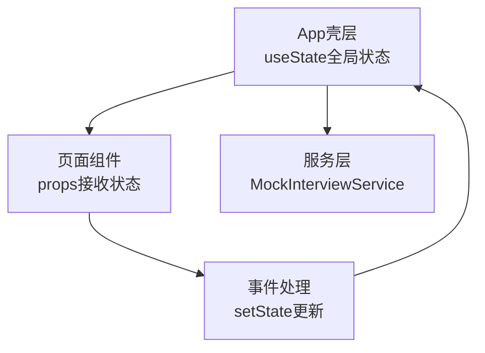
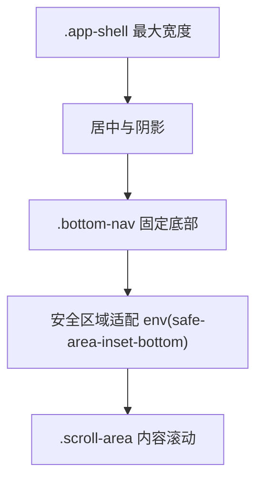
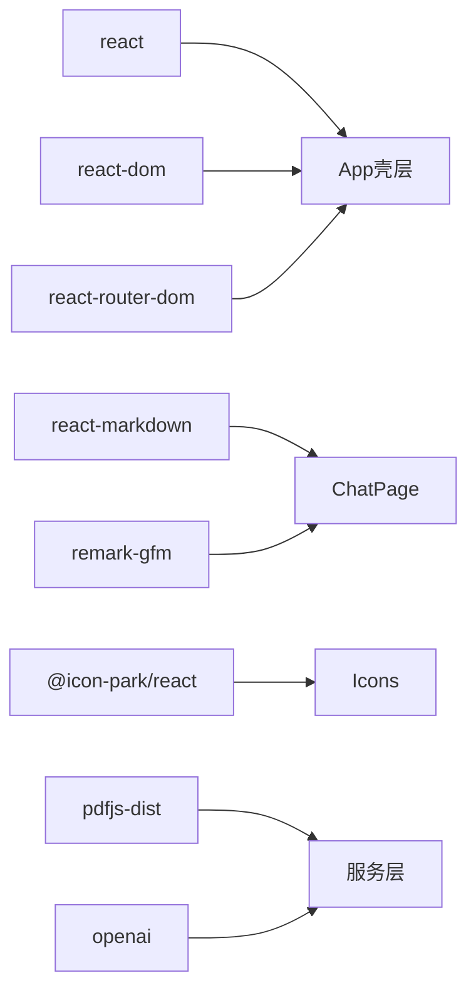

# 前端架构设计

<cite>
**本文档引用的文件**
- [src/App.js](file://src/App.js)
- [src/index.js](file://src/index.js)
- [src/pages/HomePage.js](file://src/pages/HomePage.js)
- [src/pages/AuthPage.js](file://src/pages/AuthPage.js)
- [src/pages/ChatPage.js](file://src/pages/ChatPage.js)
- [src/pages/SchedulePage.js](file://src/pages/SchedulePage.js)
- [src/pages/ProfilePage.js](file://src/pages/ProfilePage.js)
- [src/components/BottomNav.js](file://src/components/BottomNav.js)
- [src/components/Icons.js](file://src/components/Icons.js)
- [src/services/MockInterviewService.js](file://src/services/MockInterviewService.js)
- [src/App.css](file://src/App.css)
- [src/index.css](file://src/index.css)
- [package.json](file://package.json)
- [README.md](file://README.md)
</cite>

## 目录
1. [引言](#引言)
2. [项目结构](#项目结构)
3. [核心组件](#核心组件)
4. [架构总览](#架构总览)
5. [详细组件分析](#详细组件分析)
6. [依赖关系分析](#依赖关系分析)
7. [性能考虑](#性能考虑)
8. [故障排除指南](#故障排除指南)
9. [结论](#结论)
10. [附录](#附录)

## 引言
本文件为漫旅 ManLv 前端架构设计文档，基于 React 18 与 React Router DOM 6，构建单页应用（SPA）。文档涵盖组件化设计、路由系统、状态管理策略、应用壳层（App Shell）模式、页面组件层次结构、公共组件设计原则、样式系统组织、响应式设计与移动端适配、用户体验优化、组件间通信与事件处理策略等。目标是为前端开发者提供清晰的架构理解与最佳实践指导。

## 项目结构
项目采用按功能域划分的目录组织方式，核心目录如下：
- src/components：公共组件（底部导航、图标等）
- src/pages：页面组件（登录/注册、首页、行程、聊天、学习、收件箱、个人中心等）
- src/services：业务服务（模拟面试服务等）
- src/App.js、src/index.js：应用入口与根组件
- src/App.css、src/index.css：全局样式与主题变量

图表来源
- [src/App.js:1-177](file://src/App.js#L1-L177)
- [src/index.js:1-12](file://src/index.js#L1-L12)
- [src/App.css:1-800](file://src/App.css#L1-L800)
- [src/index.css:1-46](file://src/index.css#L1-L46)
- [package.json:1-41](file://package.json#L1-L41)

章节来源
- [src/App.js:1-177](file://src/App.js#L1-L177)
- [src/index.js:1-12](file://src/index.js#L1-L12)
- [package.json:1-41](file://package.json#L1-L41)

## 核心组件
- 应用壳层（App Shell）：集中管理路由、全局状态（登录态、AI 助手）、底部导航与页面切换骨架。
- 页面组件：按功能域拆分，职责单一，通过 props 与事件处理与父组件通信。
- 公共组件：图标、底部导航等复用组件，统一设计语言与交互行为。
- 服务层：封装业务逻辑（如模拟面试服务），屏蔽第三方 API 细节。

章节来源
- [src/App.js:14-177](file://src/App.js#L14-L177)
- [src/components/BottomNav.js:1-43](file://src/components/BottomNav.js#L1-L43)
- [src/components/Icons.js:1-259](file://src/components/Icons.js#L1-L259)
- [src/services/MockInterviewService.js:1-519](file://src/services/MockInterviewService.js#L1-L519)

## 架构总览
应用采用 SPA 架构，基于 React Router DOM 6 的声明式路由与嵌套路由，配合 React 18 的并发特性与严格模式，提供流畅的用户体验。应用壳层负责：
- 路由守卫与登录态控制
- 全局状态管理（登录态、AI 助手）
- 应用壳层布局与底部导航
- 全局样式与主题变量

图表来源
- [src/App.js:77-91](file://src/App.js#L77-L91)
- [src/App.js:14-26](file://src/App.js#L14-L26)
- [src/components/BottomNav.js:13-42](file://src/components/BottomNav.js#L13-L42)

章节来源
- [src/App.js:77-91](file://src/App.js#L77-L91)
- [src/App.js:14-26](file://src/App.js#L14-L26)

## 详细组件分析

### 应用壳层（App Shell）与路由系统
- 路由定义：BrowserRouter 包裹 Routes，定义多条路由与重定向规则，支持路径参数与嵌套路由。
- 登录守卫：通过 guard() 高阶函数实现受保护路由，未登录跳转至 AuthPage。
- 全局状态：管理登录态、AI 助手窗口状态、消息列表与输入值。
- 应用壳层布局：.app-shell 限定最大宽度与阴影，保证移动端体验一致性。

图表来源
- [src/App.js:77-91](file://src/App.js#L77-L91)
- [src/App.js:75](file://src/App.js#L75)

章节来源
- [src/App.js:77-91](file://src/App.js#L77-L91)
- [src/App.js:14-26](file://src/App.js#L14-L26)

### 页面组件层次结构
- AuthPage：登录/注册/忘记密码三态切换，表单验证与社交登录占位。
- HomePage：今日任务、倒计时、快捷操作、AI 助手卡片、情绪签到、行程列表。
- SchedulePage：日历视图与智能规划视图，面试录入与 AI 规划。
- ChatPage：通用聊天与模拟面试模式，SSE 流式渲染与 Markdown 渲染。
- ProfilePage：个人信息、成就、设置与登出。
- LearnPage、InboxPage：预留页面，遵循相同页面组件设计原则。

图表来源
- [src/App.js:77-91](file://src/App.js#L77-L91)
- [src/pages/AuthPage.js:6-732](file://src/pages/AuthPage.js#L6-L732)
- [src/pages/HomePage.js:8-263](file://src/pages/HomePage.js#L8-L263)
- [src/pages/SchedulePage.js:6-423](file://src/pages/SchedulePage.js#L6-L423)
- [src/pages/ChatPage.js:9-482](file://src/pages/ChatPage.js#L9-L482)
- [src/pages/ProfilePage.js:28-343](file://src/pages/ProfilePage.js#L28-L343)

章节来源
- [src/pages/AuthPage.js:6-732](file://src/pages/AuthPage.js#L6-L732)
- [src/pages/HomePage.js:8-263](file://src/pages/HomePage.js#L8-L263)
- [src/pages/SchedulePage.js:6-423](file://src/pages/SchedulePage.js#L6-L423)
- [src/pages/ChatPage.js:9-482](file://src/pages/ChatPage.js#L9-L482)
- [src/pages/ProfilePage.js:28-343](file://src/pages/ProfilePage.js#L28-L343)

### 公共组件设计原则
- Icons：统一 SVG 图标体系，通过 size 参数控制尺寸，便于主题与一致性。
- BottomNav：统一底部导航栏，基于 useLocation 判断激活状态，支持扩展新 Tab。

图表来源
- [src/components/Icons.js:13-259](file://src/components/Icons.js#L13-L259)
- [src/components/BottomNav.js:5-42](file://src/components/BottomNav.js#L5-L42)

章节来源
- [src/components/Icons.js:13-259](file://src/components/Icons.js#L13-L259)
- [src/components/BottomNav.js:5-42](file://src/components/BottomNav.js#L5-L42)

### 样式系统组织
- 主题变量：通过 CSS 变量定义颜色、阴影、过渡等，集中管理视觉风格。
- 移动壳层：.app-shell 限制最大宽度与阴影，适配移动端。
- 页面样式：每个页面独立类名前缀，避免样式冲突；底部导航使用安全区域适配。
- Markdown 渲染：ChatPage 使用 react-markdown 与 remark-gfm，保证内容渲染一致性。

图表来源
- [src/index.css:1-46](file://src/index.css#L1-L46)
- [src/App.css:1-800](file://src/App.css#L1-L800)
- [src/pages/ChatPage.js:6](file://src/pages/ChatPage.js#L6)

章节来源
- [src/index.css:1-46](file://src/index.css#L1-L46)
- [src/App.css:1-800](file://src/App.css#L1-L800)
- [src/pages/ChatPage.js:6](file://src/pages/ChatPage.js#L6)

### 组件间通信与事件处理
- Props 传递：父组件通过 props 向子组件注入回调（如 onLogin、onLogout）与数据（如预填内容）。
- 事件处理：表单提交、键盘事件（Enter 发送）、点击事件（导航、操作按钮）。
- 状态提升：登录态、AI 助手状态在 App 壳层集中管理，通过 props 下发给子组件。
- 路由参数：通过 useNavigate/useLocation 传递 state 或 params，实现页面间数据传递。

图表来源
- [src/pages/HomePage.js:88-91](file://src/pages/HomePage.js#L88-L91)
- [src/pages/ChatPage.js:10-18](file://src/pages/ChatPage.js#L10-L18)

章节来源
- [src/pages/HomePage.js:88-91](file://src/pages/HomePage.js#L88-L91)
- [src/pages/ChatPage.js:10-18](file://src/pages/ChatPage.js#L10-L18)

### 状态管理策略
- React Hooks：useState/useEffect 管理组件内部状态与副作用。
- 全局状态：App 壳层集中管理登录态与 AI 助手状态，避免跨层级 props。
- 服务层状态：MockInterviewService 维护会话历史与 API 调用，封装复杂流程。

图表来源
- [src/App.js:14-26](file://src/App.js#L14-L26)
- [src/services/MockInterviewService.js:13-14](file://src/services/MockInterviewService.js#L13-L14)

章节来源
- [src/App.js:14-26](file://src/App.js#L14-L26)
- [src/services/MockInterviewService.js:13-14](file://src/services/MockInterviewService.js#L13-L14)

### 响应式设计与移动端适配
- 移动壳层：.app-shell 限制最大宽度，居中显示，提供阴影与圆角，提升可读性。
- 底部导航：固定底部，使用安全区域适配 iPhone Notch，提供高亮与动画反馈。
- 文档流与滚动：.scroll-area 与 .pb-safe 保证内容区域与底部控件不被遮挡。
- 字体与交互：全局字体与触摸高亮色，减少不必要的点击反馈。

图表来源
- [src/App.css:2-11](file://src/App.css#L2-L11)
- [src/App.css:737-778](file://src/App.css#L737-L778)
- [src/App.css:741](file://src/App.css#L741)

章节来源
- [src/App.css:2-11](file://src/App.css#L2-L11)
- [src/App.css:737-778](file://src/App.css#L737-L778)
- [src/App.css:741](file://src/App.css#L741)

### 用户体验优化
- 加载与提示：登录/注册/操作均提供 loading 与 toast 提示，避免用户困惑。
- 即时反馈：AI 助手输入框自动滚动到底部，Markdown 渲染即时呈现。
- 情绪签到：快速情绪反馈，联动 AI 建议。
- 无障碍：图标具备 title 与可访问标签，键盘事件支持 Enter 发送。

章节来源
- [src/pages/AuthPage.js:29-32](file://src/pages/AuthPage.js#L29-L32)
- [src/pages/HomePage.js:71-91](file://src/pages/HomePage.js#L71-L91)
- [src/pages/ChatPage.js:52-54](file://src/pages/ChatPage.js#L52-L54)

## 依赖关系分析
- React 18：提供并发特性与严格模式，提升渲染性能与开发体验。
- React Router DOM 6：声明式路由，支持嵌套路由与路径参数。
- react-markdown + remark-gfm：Markdown 渲染与表格等扩展。
- @icon-park/react：图标库，统一视觉与交互。
- pdfjs-dist/openai：PDF 解析与 AI 能力（在 README 中定义）。

图表来源
- [package.json:5-16](file://package.json#L5-L16)
- [src/pages/ChatPage.js:6](file://src/pages/ChatPage.js#L6)

章节来源
- [package.json:5-16](file://package.json#L5-L16)
- [src/pages/ChatPage.js:6](file://src/pages/ChatPage.js#L6)

## 性能考虑
- 路由懒加载：可结合 React.lazy 与 Suspense 实现页面级懒加载，减少首屏体积。
- 样式隔离：页面样式前缀化，避免全局污染；CSS 变量集中管理，减少重排。
- 事件节流：输入框与滚动监听使用 ResizeObserver 与防抖，降低重绘频率。
- 图标优化：SVG 内联，按需引入，避免额外网络请求。
- 缓存策略：localStorage 缓存登录态与用户信息，减少重复请求。

## 故障排除指南
- 登录失败：检查 AuthPage 表单校验与后端返回错误信息，确认 toast 提示。
- 聊天无响应：检查 ChatPage 中 fetch 与 SSE 流式读取逻辑，确认 token 有效性。
- 行程规划失败：确认 SchedulePage 中后端接口调用与 toast 提示。
- 底部导航遮挡：检查 .pb-safe 与安全区域变量，确保在刘海屏设备正常显示。

章节来源
- [src/pages/AuthPage.js:96-121](file://src/pages/AuthPage.js#L96-L121)
- [src/pages/ChatPage.js:199-285](file://src/pages/ChatPage.js#L199-L285)
- [src/pages/SchedulePage.js:104-119](file://src/pages/SchedulePage.js#L104-L119)
- [src/App.css:741](file://src/App.css#L741)

## 结论
本架构以 React 18 与 React Router DOM 6 为基础，采用 App Shell 模式与单页应用（SPA）结构，通过组件化设计与公共组件复用，实现清晰的页面层次与一致的交互体验。全局状态集中在 App 壳层，服务层封装复杂业务流程，样式系统通过 CSS 变量与前缀化类名实现可维护性与可扩展性。建议后续引入路由懒加载与状态管理库以进一步提升性能与可维护性。

## 附录
- 技术栈与版本：React 18、React Router DOM 6、react-markdown、remark-gfm、@icon-park/react、pdfjs-dist、openai。
- 项目结构参考：README.md 中的目录结构与页面路由说明。

章节来源
- [README.md:146-221](file://README.md#L146-L221)
- [package.json:5-16](file://package.json#L5-L16)