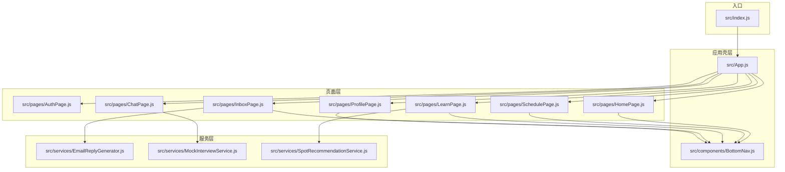
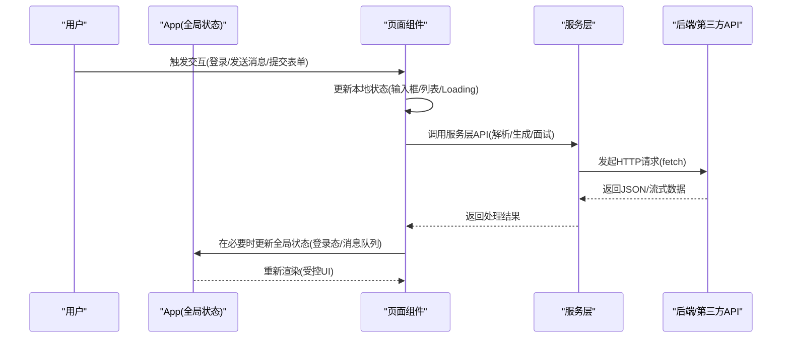
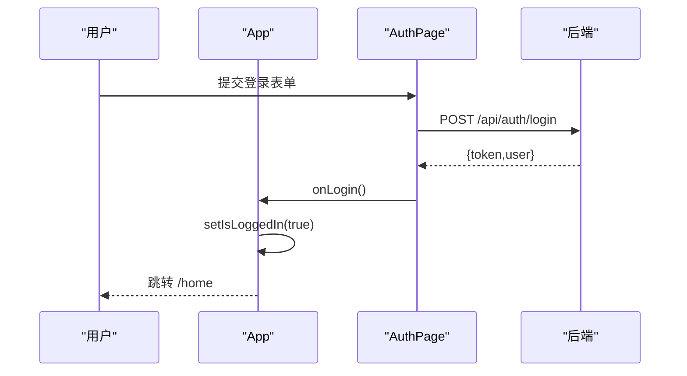
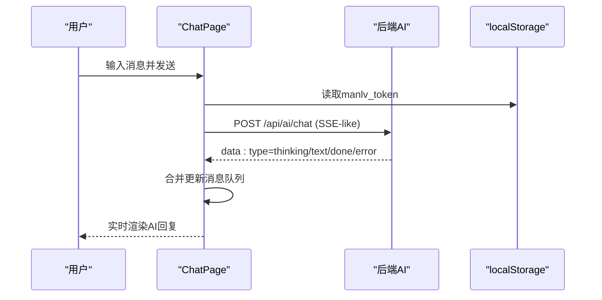
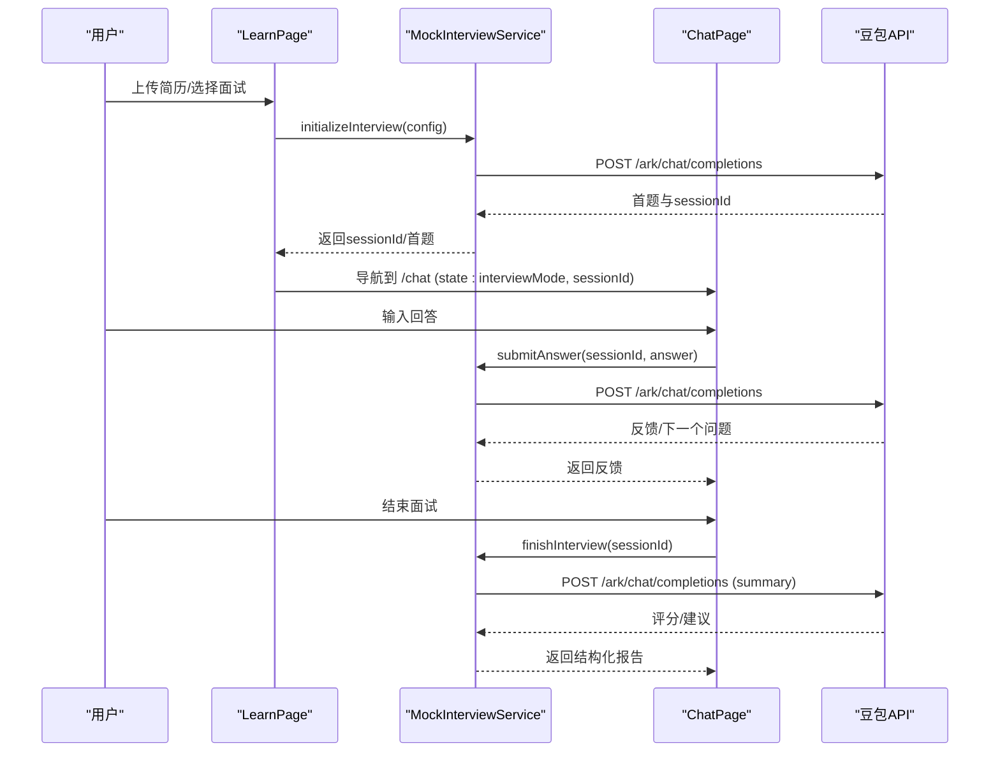
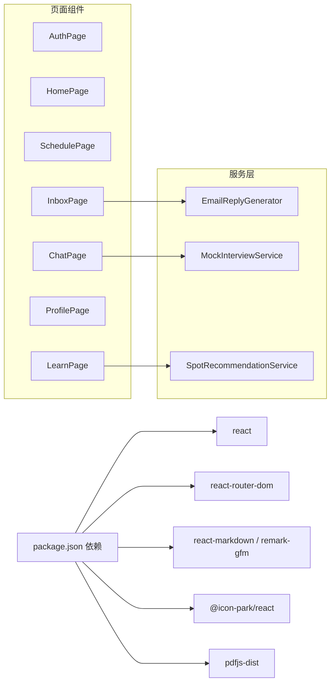

# 数据流设计

<cite>
**本文引用的文件**
- [src/App.js](file://src/App.js)
- [src/index.js](file://src/index.js)
- [src/pages/AuthPage.js](file://src/pages/AuthPage.js)
- [src/pages/HomePage.js](file://src/pages/HomePage.js)
- [src/pages/ProfilePage.js](file://src/pages/ProfilePage.js)
- [src/pages/SchedulePage.js](file://src/pages/SchedulePage.js)
- [src/pages/InboxPage.js](file://src/pages/InboxPage.js)
- [src/pages/LearnPage.js](file://src/pages/LearnPage.js)
- [src/pages/ChatPage.js](file://src/pages/ChatPage.js)
- [src/components/BottomNav.js](file://src/components/BottomNav.js)
- [src/services/EmailReplyGenerator.js](file://src/services/EmailReplyGenerator.js)
- [src/services/MockInterviewService.js](file://src/services/MockInterviewService.js)
- [src/services/SpotRecommendationService.js](file://src/services/SpotRecommendationService.js)
- [package.json](file://package.json)
</cite>

## 目录
1. [简介](#简介)
2. [项目结构](#项目结构)
3. [核心组件](#核心组件)
4. [架构总览](#架构总览)
5. [详细组件分析](#详细组件分析)
6. [依赖关系分析](#依赖关系分析)
7. [性能考量](#性能考量)
8. [故障排查指南](#故障排查指南)
9. [结论](#结论)
10. [附录](#附录)

## 简介
本文件为漫旅 ManLv 的数据流设计文档，聚焦应用内的数据流向与状态管理策略，覆盖以下方面：
- 用户认证状态管理与路由守卫
- AI 助手消息流（通用聊天与模拟面试）
- 页面间数据传递与上下文共享
- React Hooks 使用模式、状态提升策略、Context API 应用场景
- 数据单向流动、状态更新机制、副作用处理
- 异步数据处理、Loading 状态管理、错误边界设计
- 数据持久化策略、本地存储机制、数据同步方案
- 开发者调试方法与最佳实践

## 项目结构
应用采用前端单页应用（SPA）架构，基于 React + react-router-dom 实现页面路由与导航；页面组件通过本地状态与副作用处理异步数据；服务层封装第三方 API 调用与业务逻辑。

图表来源
- [src/index.js:1-12](file://src/index.js#L1-L12)
- [src/App.js:14-91](file://src/App.js#L14-L91)
- [src/components/BottomNav.js:1-43](file://src/components/BottomNav.js#L1-L43)
- [src/pages/AuthPage.js:1-732](file://src/pages/AuthPage.js#L1-L732)
- [src/pages/HomePage.js:1-263](file://src/pages/HomePage.js#L1-L263)
- [src/pages/SchedulePage.js:1-423](file://src/pages/SchedulePage.js#L1-L423)
- [src/pages/LearnPage.js:1-651](file://src/pages/LearnPage.js#L1-L651)
- [src/pages/InboxPage.js:1-479](file://src/pages/InboxPage.js#L1-L479)
- [src/pages/ProfilePage.js:1-343](file://src/pages/ProfilePage.js#L1-L343)
- [src/pages/ChatPage.js:1-482](file://src/pages/ChatPage.js#L1-L482)
- [src/services/EmailReplyGenerator.js:1-212](file://src/services/EmailReplyGenerator.js#L1-L212)
- [src/services/MockInterviewService.js:1-519](file://src/services/MockInterviewService.js#L1-L519)
- [src/services/SpotRecommendationService.js:1-86](file://src/services/SpotRecommendationService.js#L1-L86)

章节来源
- [src/index.js:1-12](file://src/index.js#L1-L12)
- [src/App.js:14-91](file://src/App.js#L14-L91)
- [src/components/BottomNav.js:1-43](file://src/components/BottomNav.js#L1-L43)

## 核心组件
- 应用壳层（App）：集中管理全局状态（登录态、AI 助手窗口、消息队列、输入框值），提供路由守卫与页面挂载逻辑。
- 认证页（AuthPage）：负责登录/注册/重置密码流程，使用本地 toast 与倒计时，调用后端认证接口并写入本地 token。
- 主页（HomePage）：展示用户问候、任务与行程概览，支持情绪签到与跳转到聊天页。
- 行程页（SchedulePage）：拉取面试安排，支持 AI 生成行程规划与应用方案。
- 学习页（LearnPage）：整合地图、地点推荐、简历解析与模拟面试启动。
- 收件箱（InboxPage）：邮件解析与回复生成，展示申请进度漏斗。
- 个人中心（ProfilePage）：用户信息展示与编辑，登出清理本地 token。
- 聊天页（ChatPage）：通用聊天与模拟面试对话，支持服务端流式响应与工具链反馈。
- 服务层：EmailReplyGenerator、MockInterviewService、SpotRecommendationService。

章节来源
- [src/App.js:14-177](file://src/App.js#L14-L177)
- [src/pages/AuthPage.js:6-732](file://src/pages/AuthPage.js#L6-L732)
- [src/pages/HomePage.js:1-263](file://src/pages/HomePage.js#L1-L263)
- [src/pages/SchedulePage.js:1-423](file://src/pages/SchedulePage.js#L1-L423)
- [src/pages/LearnPage.js:1-651](file://src/pages/LearnPage.js#L1-L651)
- [src/pages/InboxPage.js:1-479](file://src/pages/InboxPage.js#L1-L479)
- [src/pages/ProfilePage.js:1-343](file://src/pages/ProfilePage.js#L1-L343)
- [src/pages/ChatPage.js:1-482](file://src/pages/ChatPage.js#L1-L482)
- [src/services/EmailReplyGenerator.js:1-212](file://src/services/EmailReplyGenerator.js#L1-L212)
- [src/services/MockInterviewService.js:1-519](file://src/services/MockInterviewService.js#L1-L519)
- [src/services/SpotRecommendationService.js:1-86](file://src/services/SpotRecommendationService.js#L1-L86)

## 架构总览
应用采用“页面组件 + 服务层”的分层设计，数据流遵循单向流动：
- 用户交互触发页面组件状态更新
- 页面组件通过副作用（useEffect/useRef）发起异步请求
- 服务层封装第三方 API（如 MockInterviewService、SpotRecommendationService）
- 本地存储（localStorage）持久化认证 token 与推荐缓存
- 路由守卫基于全局登录状态控制页面访问

图表来源
- [src/App.js:14-177](file://src/App.js#L14-L177)
- [src/pages/AuthPage.js:86-211](file://src/pages/AuthPage.js#L86-L211)
- [src/pages/ChatPage.js:133-285](file://src/pages/ChatPage.js#L133-L285)
- [src/services/MockInterviewService.js:24-182](file://src/services/MockInterviewService.js#L24-L182)
- [src/services/SpotRecommendationService.js:18-66](file://src/services/SpotRecommendationService.js#L18-L66)

## 详细组件分析

### 认证与路由守卫
- 登录态：App 维护 isLoggedIn，AuthPage 完成登录后通过 onLogin 回调更新。
- 路由守卫：App 使用 guard 函数包装受保护路由，未登录则重定向至 AuthPage。
- 本地存储：AuthPage 登录成功后写入 manlv_token，ProfilePage 登出时移除。
- 加载与提示：AuthPage 使用 loading 与 toast 管理异步状态与用户反馈。

图表来源
- [src/App.js:75-88](file://src/App.js#L75-L88)
- [src/pages/AuthPage.js:86-121](file://src/pages/AuthPage.js#L86-L121)

章节来源
- [src/App.js:14-91](file://src/App.js#L14-L91)
- [src/pages/AuthPage.js:64-211](file://src/pages/AuthPage.js#L64-L211)
- [src/pages/ProfilePage.js:104-108](file://src/pages/ProfilePage.js#L104-L108)

### AI 助手消息流（通用聊天）
- 状态管理：App 维护 assistantMessages、inputValue、isMinimized 等，支持最小化与滚动到底部。
- 输入与发送：回车键触发 handleSendMessage，构建用户消息并延时模拟 AI 回复。
- 流式响应：ChatPage 使用 fetch + ReadableStream 逐步更新消息内容，支持 thinking 状态与工具链反馈。

图表来源
- [src/pages/ChatPage.js:133-285](file://src/pages/ChatPage.js#L133-L285)
- [src/App.js:36-66](file://src/App.js#L36-L66)

章节来源
- [src/App.js:14-66](file://src/App.js#L14-L66)
- [src/pages/ChatPage.js:133-285](file://src/pages/ChatPage.js#L133-L285)

### 模拟面试数据流
- 会话初始化：LearnPage 调用 MockInterviewService.initializeInterview，携带简历与学校信息，返回 sessionId 与首题。
- 回答提交：ChatPage 在面试模式下调用 MockInterviewService.submitAnswer，更新反馈与下一个问题。
- 结束评估：ChatPage 调用 finishInterview，解析评分与建议，生成结构化报告。
- 本地会话：MockInterviewService 使用内存 Map 维护会话历史，便于前后端解耦。

图表来源
- [src/pages/LearnPage.js:277-336](file://src/pages/LearnPage.js#L277-L336)
- [src/services/MockInterviewService.js:24-182](file://src/services/MockInterviewService.js#L24-L182)
- [src/pages/ChatPage.js:141-329](file://src/pages/ChatPage.js#L141-L329)

章节来源
- [src/pages/LearnPage.js:116-139](file://src/pages/LearnPage.js#L116-L139)
- [src/services/MockInterviewService.js:184-358](file://src/services/MockInterviewService.js#L184-L358)
- [src/pages/ChatPage.js:141-329](file://src/pages/ChatPage.js#L141-L329)

### 页面间数据传递
- 路由 state：Home/Profile/Inbox 等通过 useNavigate(state) 传递上下文（如 prefill、面试参数）。
- 本地存储：localStorage 作为轻量持久化介质，承载 token 与推荐缓存。
- 服务层：各服务通过统一的 fetch 接口与第三方 API 交互，隐藏实现细节。

章节来源
- [src/pages/HomePage.js:86-91](file://src/pages/HomePage.js#L86-L91)
- [src/pages/ProfilePage.js:104-108](file://src/pages/ProfilePage.js#L104-L108)
- [src/pages/LearnPage.js:318-327](file://src/pages/LearnPage.js#L318-L327)

### React Hooks 使用模式与状态提升
- 本地状态：useState 管理输入框、列表、Loading、提示等。
- 副作用：useEffect 管理数据拉取、滚动、尺寸监听、定时器清理。
- 引用：useRef 管理 DOM 引用与滚动锚点。
- 状态提升：App 统一管理登录态与全局助手，子组件通过回调更新。

章节来源
- [src/pages/AuthPage.js:6-32](file://src/pages/AuthPage.js#L6-L32)
- [src/pages/ChatPage.js:52-102](file://src/pages/ChatPage.js#L52-L102)
- [src/App.js:14-35](file://src/App.js#L14-L35)

### Context API 应用场景
- 当前实现未显式使用 Context API；可在 App 层引入 Context 以减少 props drilling（例如登录态、主题、语言），提升可维护性与可测试性。

[本节为概念性说明，不直接分析具体文件]

### 数据单向流动与副作用处理
- 单向数据流：UI -> 状态 -> 渲染 -> 异步副作用 -> 新状态 -> 渲染。
- 副作用：useEffect 中发起 fetch，使用 try/catch/finally 控制 loading 状态；useRef 管理 DOM 与滚动。
- 错误处理：捕获异常并显示 toast，保证 UI 不崩溃。

章节来源
- [src/pages/ChatPage.js:104-121](file://src/pages/ChatPage.js#L104-L121)
- [src/pages/AuthPage.js:115-120](file://src/pages/AuthPage.js#L115-L120)

### 异步数据处理、Loading 与错误边界
- Loading 管理：AuthPage、ChatPage、SchedulePage、LearnPage 在请求期间设置 loading，完成后清理。
- 错误边界：通过 toast 与条件渲染展示错误信息；ChatPage 使用 SSE 流式数据时进行 try/catch 与容错。
- 超时与兜底：LearnPage 地图加载超时降级提示；SpotRecommendationService 与 MockInterviewService 提供兜底数据。

章节来源
- [src/pages/AuthPage.js:96-120](file://src/pages/AuthPage.js#L96-L120)
- [src/pages/ChatPage.js:272-284](file://src/pages/ChatPage.js#L272-L284)
- [src/pages/LearnPage.js:142-160](file://src/pages/LearnPage.js#L142-L160)
- [src/services/SpotRecommendationService.js:68-82](file://src/services/SpotRecommendationService.js#L68-L82)

### 数据持久化与同步
- 本地存储：localStorage 存储 manlv_token 与 ai_spot_recommendations；ProfilePage 登出时清理。
- 同步策略：页面首次进入时从后端拉取数据，成功后写入本地缓存；后续读取本地缓存以提升性能。
- Token 管理：AuthPage 登录成功写入 token，后续请求统一携带 Authorization 头。

章节来源
- [src/pages/AuthPage.js:111-114](file://src/pages/AuthPage.js#L111-L114)
- [src/pages/ProfilePage.js:104-108](file://src/pages/ProfilePage.js#L104-L108)
- [src/pages/LearnPage.js:75-80](file://src/pages/LearnPage.js#L75-L80)
- [src/pages/ChatPage.js:106-121](file://src/pages/ChatPage.js#L106-L121)

## 依赖关系分析

图表来源
- [package.json:5-16](file://package.json#L5-L16)
- [src/pages/ChatPage.js:5-8](file://src/pages/ChatPage.js#L5-L8)
- [src/pages/LearnPage.js:5-8](file://src/pages/LearnPage.js#L5-L8)
- [src/pages/InboxPage.js:4-5](file://src/pages/InboxPage.js#L4-L5)

章节来源
- [package.json:1-41](file://package.json#L1-L41)

## 性能考量
- 避免不必要的重渲染：合理拆分组件，使用 React.memo（可在后续优化中引入）。
- 列表渲染：为长列表提供稳定 key，减少节点重建。
- 图片与地图：LearnPage 地图按需初始化，避免重复实例化；高德 Key 配置错误时及时降级。
- 缓存策略：本地缓存推荐结果，减少重复请求；注意缓存失效与更新时机。
- 流式渲染：ChatPage 的流式响应按块更新，避免大字符串拼接导致卡顿。

[本节为通用指导，不直接分析具体文件]

## 故障排查指南
- 登录失败：检查后端返回字段与错误提示；确认网络与 CORS；查看 AuthPage 的 toast 与 loading。
- 聊天无响应：检查 token 是否存在；确认后端 SSE 流是否正常；观察 ChatPage 的 thinking 与错误分支。
- 地图加载失败：检查高德 Key 与安全密钥配置；关注 LearnPage 的 mapStatus 与错误提示。
- 面试初始化失败：MockInterviewService 提供降级数据；检查网络与 API Key。
- 本地缓存异常：清理 localStorage 中的 ai_spot_recommendations，重新触发生成。

章节来源
- [src/pages/AuthPage.js:104-120](file://src/pages/AuthPage.js#L104-L120)
- [src/pages/ChatPage.js:272-284](file://src/pages/ChatPage.js#L272-L284)
- [src/pages/LearnPage.js:162-223](file://src/pages/LearnPage.js#L162-L223)
- [src/services/MockInterviewService.js:176-182](file://src/services/MockInterviewService.js#L176-L182)

## 结论
本项目通过清晰的页面分层与服务层封装，实现了从认证、行程、学习到聊天的完整数据流闭环。全局状态集中在 App，路由守卫保障安全访问；本地存储与缓存策略提升了用户体验。后续可在 Context 与状态管理库层面进一步抽象，以降低组件间耦合并增强可维护性。

[本节为总结性内容，不直接分析具体文件]

## 附录
- 调试建议
  - 使用浏览器 Network 面板观察请求与响应，重点关注 Authorization 头与 SSE 流。
  - 在 Console 输出关键状态（如 sessionId、token、parseProgress），辅助定位问题。
  - 临时禁用 localStorage 以验证后端数据一致性。
- 最佳实践
  - 将重复的 loading、error、success 状态抽取为自定义 Hook。
  - 对长列表与复杂计算使用 useMemo/useCallback。
  - 为关键路径增加单元测试与集成测试。

[本节为通用指导，不直接分析具体文件]