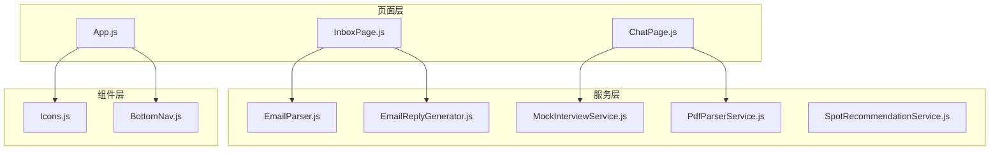
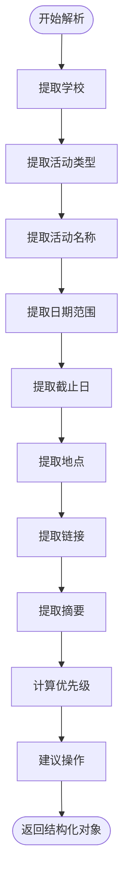
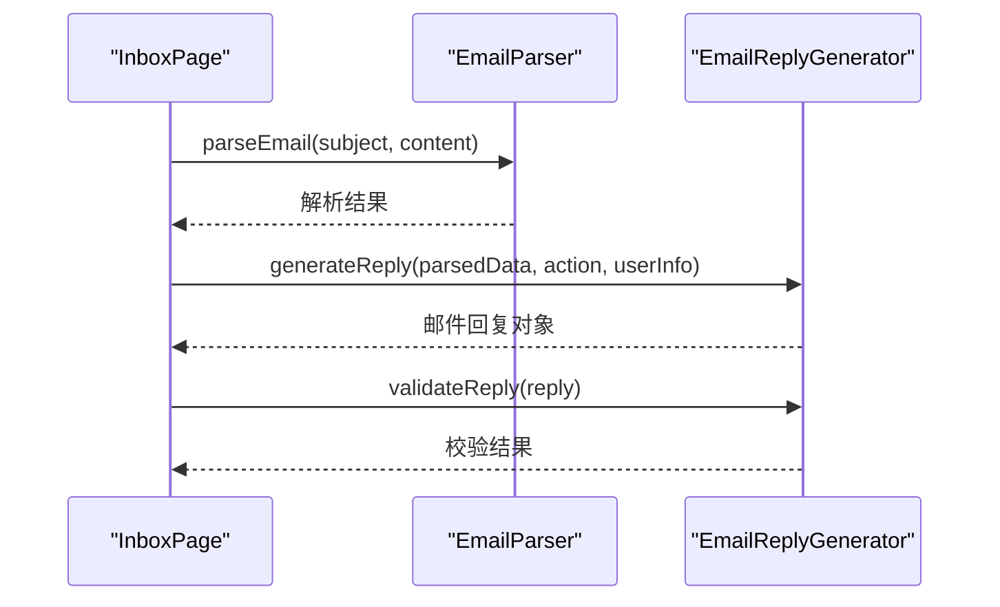
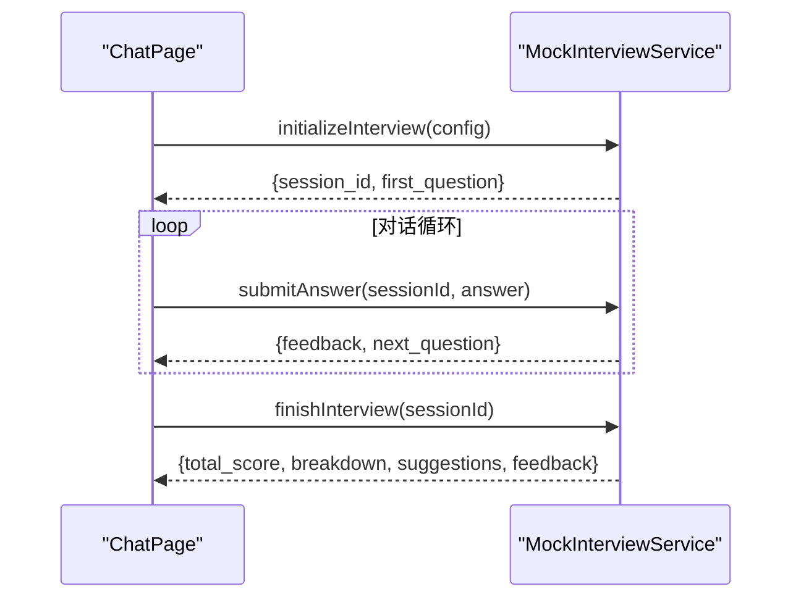
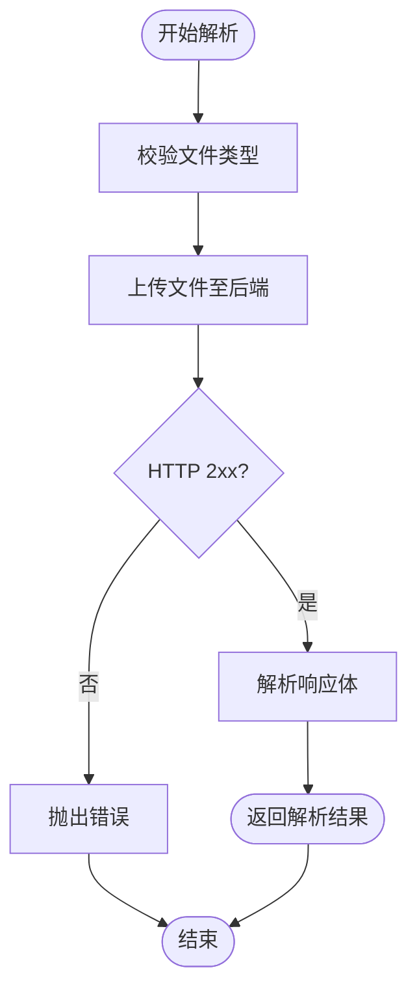
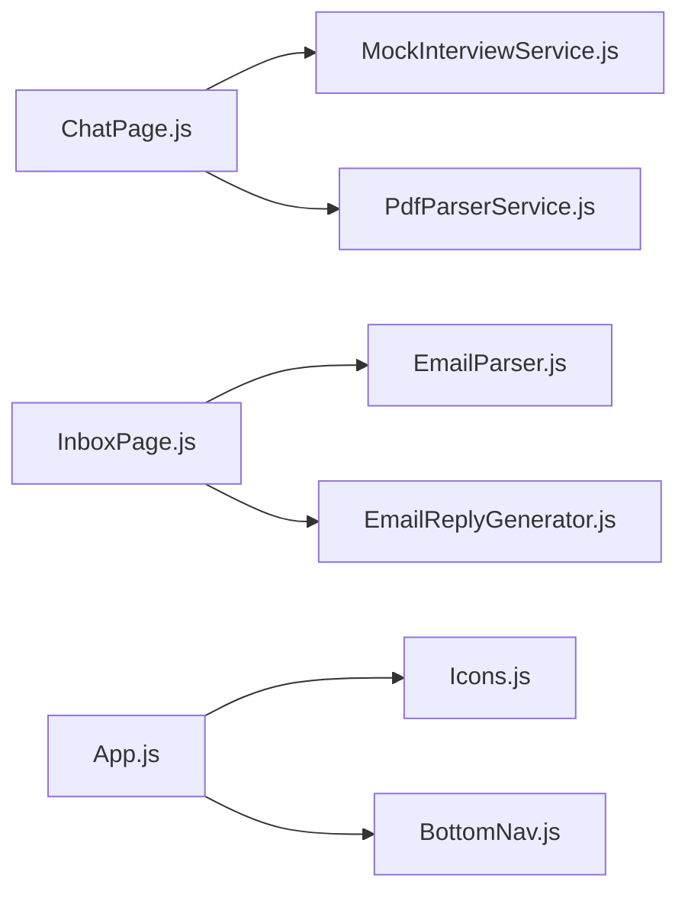

# 服务层架构

<cite>
**本文引用的文件**
- [README.md](file://README.md)
- [package.json](file://package.json)
- [src/services/EmailParser.js](file://src/services/EmailParser.js)
- [src/services/EmailReplyGenerator.js](file://src/services/EmailReplyGenerator.js)
- [src/services/MockInterviewService.js](file://src/services/MockInterviewService.js)
- [src/services/PdfParserService.js](file://src/services/PdfParserService.js)
- [src/services/SpotRecommendationService.js](file://src/services/SpotRecommendationService.js)
- [src/pages/ChatPage.js](file://src/pages/ChatPage.js)
- [src/pages/InboxPage.js](file://src/pages/InboxPage.js)
- [src/App.js](file://src/App.js)
- [src/components/Icons.js](file://src/components/Icons.js)
- [src/components/BottomNav.js](file://src/components/BottomNav.js)
</cite>

## 目录
1. [引言](#引言)
2. [项目结构](#项目结构)
3. [核心组件](#核心组件)
4. [架构总览](#架构总览)
5. [详细组件分析](#详细组件分析)
6. [依赖关系分析](#依赖关系分析)
7. [性能考量](#性能考量)
8. [故障排查指南](#故障排查指南)
9. [结论](#结论)
10. [附录](#附录)

## 引言
本文件面向服务层架构设计与实现，聚焦漫旅 ManLv 的前端服务层（services）与组件层（pages/components）之间的协作关系。文档覆盖以下主题：
- 服务层设计模式与实现策略：AI 服务封装、第三方 API 集成、数据处理服务
- 服务层与组件层的解耦设计、依赖注入机制、错误处理策略
- 服务的生命周期管理、缓存策略、异步处理模式
- 服务层的可扩展性设计、插件机制、配置管理
- 服务监控、日志记录、性能指标收集
- 服务开发者架构设计原则与实现最佳实践

## 项目结构
前端采用 React 单页应用结构，服务层位于 src/services，页面组件位于 src/pages，公共组件位于 src/components。服务层通过静态类封装对外暴露统一接口，页面组件通过导入服务类进行调用，形成清晰的职责边界与解耦。

图表来源
- [src/pages/ChatPage.js:1-482](file://src/pages/ChatPage.js#L1-L482)
- [src/pages/InboxPage.js:1-479](file://src/pages/InboxPage.js#L1-L479)
- [src/App.js:1-177](file://src/App.js#L1-L177)
- [src/services/EmailParser.js:1-227](file://src/services/EmailParser.js#L1-L227)
- [src/services/EmailReplyGenerator.js:1-212](file://src/services/EmailReplyGenerator.js#L1-L212)
- [src/services/MockInterviewService.js:1-519](file://src/services/MockInterviewService.js#L1-L519)
- [src/services/PdfParserService.js:1-97](file://src/services/PdfParserService.js#L1-L97)
- [src/services/SpotRecommendationService.js:1-86](file://src/services/SpotRecommendationService.js#L1-L86)
- [src/components/Icons.js:1-259](file://src/components/Icons.js#L1-L259)
- [src/components/BottomNav.js:1-43](file://src/components/BottomNav.js#L1-L43)

章节来源
- [README.md: 146-170:146-170](file://README.md#L146-L170)
- [package.json: 1-41:1-41](file://package.json#L1-L41)

## 核心组件
- 邮件解析服务：从邮件主题与正文提取结构化信息，计算优先级与建议操作，支持日期、截止日、地点、链接等字段抽取。
- 邮件回复生成服务：根据解析结果与用户日程，生成确认、拒绝、延后、咨询等类型的标准化邮件回复，并提供校验与建议类型。
- 模拟面试服务：封装豆包大模型 API，提供初始化面试、提交回答、结束面试、历史记录、简历解析等功能，内置降级策略。
- PDF/简历解析服务：封装后端解析接口，支持文件类型判断、上传与结果解析。
- 地点推荐服务：基于专业与城市，调用大模型生成个性化学习/备考地点推荐，具备兜底模拟数据。

章节来源
- [src/services/EmailParser.js: 12-224:12-224](file://src/services/EmailParser.js#L12-L224)
- [src/services/EmailReplyGenerator.js: 13-208:13-208](file://src/services/EmailReplyGenerator.js#L13-L208)
- [src/services/MockInterviewService.js: 24-358:24-358](file://src/services/MockInterviewService.js#L24-L358)
- [src/services/PdfParserService.js: 15-94:15-94](file://src/services/PdfParserService.js#L15-L94)
- [src/services/SpotRecommendationService.js: 18-82:18-82](file://src/services/SpotRecommendationService.js#L18-L82)

## 架构总览
服务层采用“静态类 + 命名空间”的组织方式，每个服务类集中封装一组业务能力，页面组件通过 import 直接调用，实现松耦合与高内聚。服务层与组件层之间通过函数调用与参数传递解耦，避免直接依赖具体实现细节。

```mermaid
classDiagram
class EmailParser {
+parseEmail(subject, content) object
+extractSchool(subject, content) string
+extractEventType(subject, content) string
+extractEventName(subject, content) string
+extractDates(subject, content) object
+extractDeadline(subject, content) string
+extractLocation(content) string
+extractLink(content) string
+extractDescription(content) string
+calculatePriority(subject, content) string
+suggestAction(subject, content) string
}
class EmailReplyGenerator {
+generateReply(emailData, action, userInfo) object
+generateConfirmReply(emailData, userInfo) object
+generateDeclineReply(emailData, userInfo) object
+generatePostponeReply(emailData, userInfo) object
+generateAskReply(emailData, userInfo) object
+suggestReplyType(emailData, userSchedule) string
+hasScheduleConflict(emailData, userSchedule) boolean
+validateReply(reply) object
}
class MockInterviewService {
+initializeInterview(config) Promise~object~
+submitAnswer(sessionId, answer) Promise~object~
+finishInterview(sessionId) Promise~object~
+getInterviewHistory(options) Promise~Array~
+uploadResume(file) Promise~object~
+parseResume(resumeText) Promise~object~
+mockInitializeInterview(config) Promise~object~
+mockSubmitAnswer(sessionId, answer) Promise~object~
+mockFinishInterview(sessionId) Promise~object~
+getToken() string
+setApiKey(apiKey) void
}
class PdfParserService {
+parseResume(file, token) Promise~object~
+isSupportedFile(file) boolean
+isPdfFile(file) boolean
+isImageFile(file) boolean
+getFileInfo(file) object
+formatFileSize(bytes) string
}
class SpotRecommendationService {
+getRecommendations(major, city) Promise~Array~
+getMockRecommendations(major, city) Array
}
```

图表来源
- [src/services/EmailParser.js: 5-224:5-224](file://src/services/EmailParser.js#L5-L224)
- [src/services/EmailReplyGenerator.js: 5-208:5-208](file://src/services/EmailReplyGenerator.js#L5-L208)
- [src/services/MockInterviewService.js: 7-516:7-516](file://src/services/MockInterviewService.js#L7-L516)
- [src/services/PdfParserService.js: 8-94:8-94](file://src/services/PdfParserService.js#L8-L94)
- [src/services/SpotRecommendationService.js: 6-82:6-82](file://src/services/SpotRecommendationService.js#L6-L82)

## 详细组件分析

### 邮件解析服务（EmailParser）
- 设计要点
  - 静态方法聚合：将解析逻辑集中在单一类中，便于测试与复用
  - 关键字段抽取：学校、活动类型、活动名称、日期范围、截止日、地点、链接、摘要、优先级、建议操作
  - 优先级计算：综合紧急标签、目标学校、截止日接近度
- 数据流
  - 输入：主题与正文
  - 输出：结构化对象（含日期范围、优先级、建议操作等）
- 错误处理
  - 未命中关键词时返回默认值，保证健壮性
- 性能与复杂度
  - 字符串匹配与正则扫描，整体复杂度近似 O(n)（n 为内容长度）

图表来源
- [src/services/EmailParser.js: 12-224:12-224](file://src/services/EmailParser.js#L12-L224)

章节来源
- [src/services/EmailParser.js: 12-224:12-224](file://src/services/EmailParser.js#L12-L224)

### 邮件回复生成服务（EmailReplyGenerator）
- 设计要点
  - 多模板生成：确认、拒绝、延后、咨询四种模板
  - 建议类型：基于优先级与日程冲突自动建议回复类型
  - 校验机制：校验主题、内容长度、占位符完整性
- 数据流
  - 输入：解析后的邮件数据、操作类型、用户信息、日程
  - 输出：标准化邮件对象（主题、正文、类型、是否需要审阅）
- 错误处理
  - 校验失败返回问题清单，便于前端提示修复

图表来源
- [src/pages/InboxPage.js: 82-104:82-104](file://src/pages/InboxPage.js#L82-L104)
- [src/services/EmailParser.js: 12-224:12-224](file://src/services/EmailParser.js#L12-L224)
- [src/services/EmailReplyGenerator.js: 13-208:13-208](file://src/services/EmailReplyGenerator.js#L13-L208)

章节来源
- [src/pages/InboxPage.js: 82-104:82-104](file://src/pages/InboxPage.js#L82-L104)
- [src/services/EmailReplyGenerator.js: 13-208:13-208](file://src/services/EmailReplyGenerator.js#L13-L208)

### 模拟面试服务（MockInterviewService）
- 设计要点
  - 大模型集成：封装豆包 API，支持 REST 调用与降级回退
  - 会话管理：基于 Map 维护会话历史，支持初始化、回答、结束与评分
  - 简历解析：将简历文本传入模型解析并提取结构化信息
  - 配置管理：通过环境变量控制 API 基础地址与密钥
- 生命周期
  - 初始化：生成系统提示词与首个问题，保存会话
  - 回答：追加用户回答，调用模型生成反馈与下一轮问题
  - 结束：生成结构化评分报告，清理会话
- 异步处理
  - fetch 调用与 SSE 流式响应（页面侧处理）
- 错误处理
  - API 失败时降级为模拟数据，保证可用性

图表来源
- [src/pages/ChatPage.js: 133-285:133-285](file://src/pages/ChatPage.js#L133-L285)
- [src/services/MockInterviewService.js: 24-358:24-358](file://src/services/MockInterviewService.js#L24-L358)

章节来源
- [src/pages/ChatPage.js: 133-285:133-285](file://src/pages/ChatPage.js#L133-L285)
- [src/services/MockInterviewService.js: 24-358:24-358](file://src/services/MockInterviewService.js#L24-L358)

### PDF/简历解析服务（PdfParserService）
- 设计要点
  - 文件类型校验：支持 PDF 与常见图片格式
  - 上传与解析：通过表单数据上传文件，携带认证头访问后端接口
  - 结果解析：返回文本、结构化信息、扫描件标识等
- 错误处理
  - 对非 2xx 响应抛出错误，由调用方捕获并提示

图表来源
- [src/services/PdfParserService.js: 15-39:15-39](file://src/services/PdfParserService.js#L15-L39)

章节来源
- [src/services/PdfParserService.js: 15-39:15-39](file://src/services/PdfParserService.js#L15-L39)

### 地点推荐服务（SpotRecommendationService）
- 设计要点
  - 个性化推荐：基于专业与城市生成地点列表
  - 输出约束：要求返回 JSON 数组，确保解析一致性
  - 兜底策略：解析失败时返回模拟数据
- 错误处理
  - API 失败时降级为模拟数据，保证用户体验

章节来源
- [src/services/SpotRecommendationService.js: 18-82:18-82](file://src/services/SpotRecommendationService.js#L18-L82)

## 依赖关系分析
- 页面组件与服务层
  - ChatPage 依赖 MockInterviewService 与 PdfParserService
  - InboxPage 依赖 EmailParser 与 EmailReplyGenerator
- 组件层与页面层
  - App 引入公共图标与底部导航组件，用于 UI 呈现
- 外部依赖
  - 项目依赖 react、react-router-dom、react-markdown、remark-gfm、@icon-park/react、pdfjs-dist 等

图表来源
- [src/pages/ChatPage.js:1-482](file://src/pages/ChatPage.js#L1-L482)
- [src/pages/InboxPage.js:1-479](file://src/pages/InboxPage.js#L1-L479)
- [src/App.js:1-177](file://src/App.js#L1-L177)
- [src/components/Icons.js:1-259](file://src/components/Icons.js#L1-L259)
- [src/components/BottomNav.js:1-43](file://src/components/BottomNav.js#L1-L43)

章节来源
- [package.json: 5-16:5-16](file://package.json#L5-L16)

## 性能考量
- 静态类封装减少实例化开销，适合纯函数式数据处理
- 大模型调用采用 REST API，避免 SDK 兼容性问题，便于替换与降级
- 会话历史存储在内存 Map 中，适合前端会话场景；若需持久化，可在页面层引入本地存储或后端会话服务
- PDF 解析与邮件解析为 CPU 密集型任务，建议在后台线程或服务端执行，前端仅负责 UI 与交互
- 建议引入超时与重试策略，增强网络异常下的稳定性

## 故障排查指南
- 模拟面试服务
  - API 失败：检查环境变量中的 API 基础地址与密钥，确认网络连通性
  - 会话异常：确认 sessionId 有效性，必要时重新初始化
- 邮件解析与回复
  - 解析失败：检查邮件内容格式，确保包含关键字段
  - 回复校验失败：根据校验结果清单修正主题、正文与必填信息
- PDF 解析
  - 文件类型不支持：确认文件 MIME 类型或扩展名
  - 上传失败：检查认证头与后端接口状态码

章节来源
- [src/services/MockInterviewService.js: 176-181:176-181](file://src/services/MockInterviewService.js#L176-L181)
- [src/services/EmailReplyGenerator.js: 188-208:188-208](file://src/services/EmailReplyGenerator.js#L188-L208)
- [src/services/PdfParserService.js: 28-38:28-38](file://src/services/PdfParserService.js#L28-L38)

## 结论
服务层通过静态类封装实现了清晰的职责划分与良好的可测试性，页面组件通过导入服务类实现解耦。建议在现有基础上进一步完善：
- 引入统一的错误边界与全局错误处理
- 增加服务层的生命周期钩子与配置中心
- 在会话与缓存层面引入持久化策略
- 加强日志与监控埋点，收集关键指标

## 附录
- 环境变量与配置
  - REACT_APP_API_URL：后端 API 基础地址
  - REACT_APP_ARK_API_KEY：豆包 API 密钥
  - REACT_APP_ARK_BASE_URL：豆包 API 基础 URL
- 技术栈
  - React 18、React Router DOM 6、react-markdown、remark-gfm、@icon-park/react、pdfjs-dist

章节来源
- [README.md: 117-134:117-134](file://README.md#L117-L134)
- [package.json: 17-21:17-21](file://package.json#L17-L21)