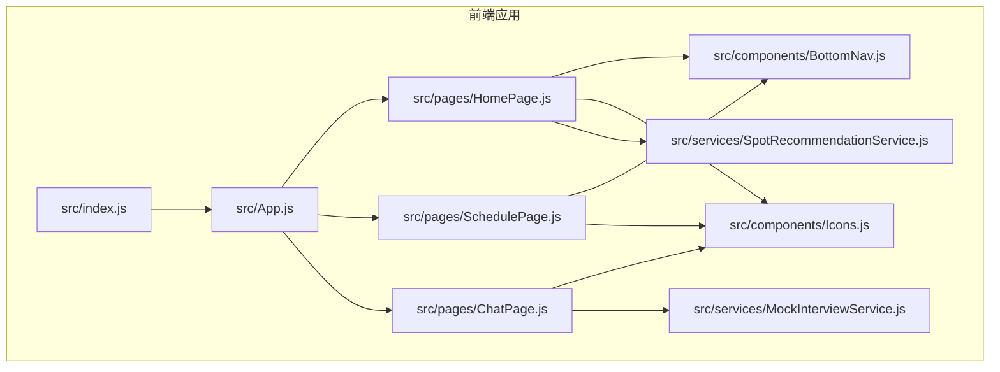
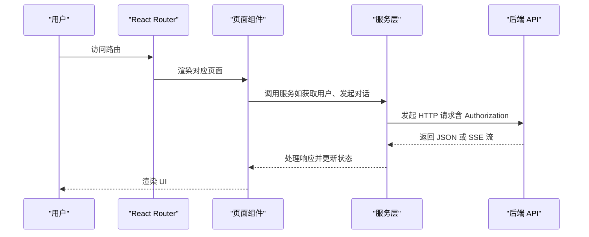
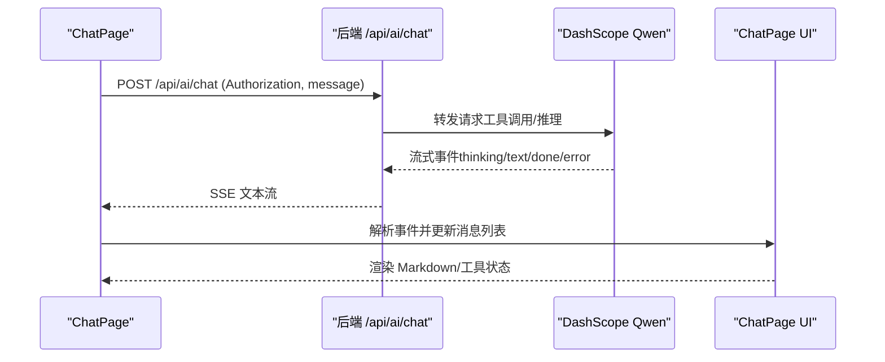
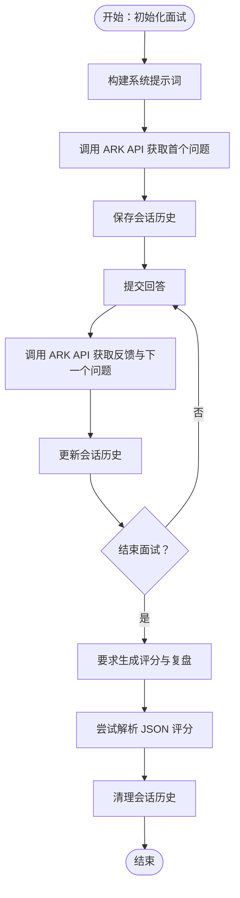
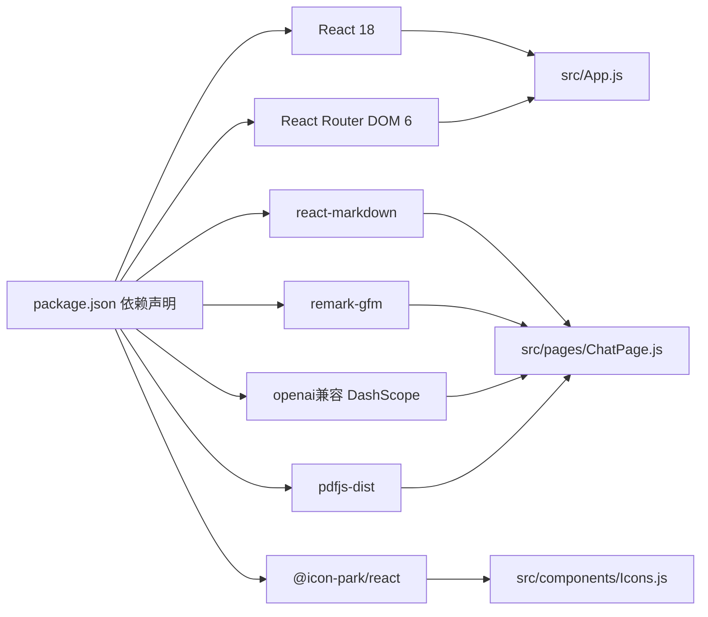

# 系统架构

<cite>
**本文引用的文件**
- [README.md](file://README.md)
- [package.json](file://package.json)
- [src/index.js](file://src/index.js)
- [src/App.js](file://src/App.js)
- [src/pages/ChatPage.js](file://src/pages/ChatPage.js)
- [src/pages/HomePage.js](file://src/pages/HomePage.js)
- [src/pages/SchedulePage.js](file://src/pages/SchedulePage.js)
- [src/services/MockInterviewService.js](file://src/services/MockInterviewService.js)
- [src/services/SpotRecommendationService.js](file://src/services/SpotRecommendationService.js)
- [src/components/BottomNav.js](file://src/components/BottomNav.js)
- [src/components/Icons.js](file://src/components/Icons.js)
</cite>

## 目录
1. [引言](#引言)
2. [项目结构](#项目结构)
3. [核心组件](#核心组件)
4. [架构总览](#架构总览)
5. [详细组件分析](#详细组件分析)
6. [依赖分析](#依赖分析)
7. [性能考虑](#性能考虑)
8. [故障排查指南](#故障排查指南)
9. [结论](#结论)
10. [附录](#附录)

## 引言
本系统为面向保研生的 AI 驱动一站式行程伴旅助手，采用前后端分离架构：前端使用 React 18 + React Router DOM 6 构建移动端优先的单页应用；后端使用 Node.js + Express 提供 REST API；数据库采用 PostgreSQL，ORM 使用 Prisma；AI 服务通过 DashScope Qwen 与第三方火山方舟（豆包）集成，实现流式对话、工具调用与模拟面试等功能。

## 项目结构
前端项目采用按页面与功能模块划分的目录组织方式：
- src/pages：页面级组件（登录、首页、行程、聊天、学习、邮箱、个人中心等）
- src/components：通用 UI 组件（底部导航、图标集合）
- src/services：业务服务层（模拟面试、地点推荐、邮件解析等）
- src/index.js：入口渲染
- src/App.js：路由与全局状态控制（浮动 AI 助手）



图表来源
- [src/index.js:1-12](file://src/index.js#L1-L12)
- [src/App.js:1-177](file://src/App.js#L1-L177)
- [src/pages/HomePage.js:1-263](file://src/pages/HomePage.js#L1-L263)
- [src/pages/SchedulePage.js:1-423](file://src/pages/SchedulePage.js#L1-L423)
- [src/pages/ChatPage.js:1-482](file://src/pages/ChatPage.js#L1-L482)
- [src/components/BottomNav.js:1-43](file://src/components/BottomNav.js#L1-L43)
- [src/components/Icons.js:1-259](file://src/components/Icons.js#L1-L259)
- [src/services/MockInterviewService.js:1-519](file://src/services/MockInterviewService.js#L1-L519)
- [src/services/SpotRecommendationService.js:1-86](file://src/services/SpotRecommendationService.js#L1-L86)

章节来源
- [package.json:1-41](file://package.json#L1-L41)
- [README.md:65-145](file://README.md#L65-L145)

## 核心组件
- 路由与壳层：BrowserRouter + Routes + 路由守卫，统一管理页面跳转与登录态
- 页面组件：按功能拆分，职责单一，通过 props/state 与服务层交互
- 服务层：封装对外 API 调用与业务逻辑（如 MockInterviewService、SpotRecommendationService）
- UI 组件：可复用图标与底部导航，降低页面耦合
- 全局状态：App.js 中维护浮动 AI 助手的状态与消息队列

章节来源
- [src/App.js:14-177](file://src/App.js#L14-L177)
- [src/pages/ChatPage.js:9-482](file://src/pages/ChatPage.js#L9-L482)
- [src/pages/HomePage.js:1-263](file://src/pages/HomePage.js#L1-L263)
- [src/pages/SchedulePage.js:1-423](file://src/pages/SchedulePage.js#L1-L423)
- [src/services/MockInterviewService.js:1-519](file://src/services/MockInterviewService.js#L1-L519)
- [src/services/SpotRecommendationService.js:1-86](file://src/services/SpotRecommendationService.js#L1-L86)
- [src/components/BottomNav.js:1-43](file://src/components/BottomNav.js#L1-L43)
- [src/components/Icons.js:1-259](file://src/components/Icons.js#L1-L259)

## 架构总览
系统采用三层架构：前端 SPA（React）、后端 API（Express）、数据库（PostgreSQL）。AI 服务通过 DashScope Qwen 与火山方舟（豆包）提供对话与工具调用能力。前端通过 REST API 与 SSE 流式接收 AI 输出，同时在部分场景直接调用第三方模型 API。

```mermaid
graph TB
subgraph "客户端"
FE["React 前端"]
ROUTER["React Router DOM"]
SERVICES["服务层MockInterviewService / SpotRecommendationService"]
end
subgraph "后端"
EX["Express 服务"]
PRISMA["Prisma ORM"]
PG["PostgreSQL"]
end
subgraph "AI 服务"
DS["DashScope Qwen"]
ARK["火山方舟豆包"]
end
FE --> ROUTER
FE --> SERVICES
SERVICES --> EX
EX --> PRISMA --> PG
EX <- --> DS
SERVICES <- --> ARK
```

图表来源
- [README.md:65-145](file://README.md#L65-L145)
- [src/pages/ChatPage.js:12-285](file://src/pages/ChatPage.js#L12-L285)
- [src/services/MockInterviewService.js:8-17](file://src/services/MockInterviewService.js#L8-L17)

## 详细组件分析

### 前端路由与页面交互
- App.js 负责路由与登录态管理，提供浮动 AI 助手的最小实现，演示消息发送与滚动
- 各页面组件通过 useNavigate/useLocation 与后端 API 交互，使用 fetch 发送请求并处理响应
- 底部导航组件 BottomNav 提供移动端一致的导航体验



图表来源
- [src/App.js:77-173](file://src/App.js#L77-L173)
- [src/pages/ChatPage.js:104-121](file://src/pages/ChatPage.js#L104-L121)
- [src/pages/ChatPage.js:199-285](file://src/pages/ChatPage.js#L199-L285)
- [src/pages/HomePage.js:21-36](file://src/pages/HomePage.js#L21-L36)
- [src/pages/SchedulePage.js:29-44](file://src/pages/SchedulePage.js#L29-L44)

章节来源
- [src/App.js:14-177](file://src/App.js#L14-L177)
- [src/pages/ChatPage.js:1-482](file://src/pages/ChatPage.js#L1-L482)
- [src/pages/HomePage.js:1-263](file://src/pages/HomePage.js#L1-L263)
- [src/pages/SchedulePage.js:1-423](file://src/pages/SchedulePage.js#L1-L423)
- [src/components/BottomNav.js:1-43](file://src/components/BottomNav.js#L1-L43)

### AI 对话与流式输出（SSE）
- ChatPage 通过 fetch 发送 POST 到 /api/ai/chat，使用 ReadableStream 逐行解析 data: 行
- 支持事件类型：thinking（工具调用中）、text（增量文本）、done（完成）、error（错误）
- Markdown 渲染与 GFM 插件用于富文本展示



图表来源
- [src/pages/ChatPage.js:199-285](file://src/pages/ChatPage.js#L199-L285)
- [README.md:174-206](file://README.md#L174-L206)

章节来源
- [src/pages/ChatPage.js:199-285](file://src/pages/ChatPage.js#L199-L285)
- [README.md:174-206](file://README.md#L174-L206)

### 模拟面试服务（豆包集成）
- MockInterviewService 直接调用火山方舟 REST API，构建系统提示词与会话历史
- 支持初始化会话、提交回答、结束面试并生成结构化评分
- 提供本地降级（mock）以保证开发与离线可用性



图表来源
- [src/services/MockInterviewService.js:24-182](file://src/services/MockInterviewService.js#L24-L182)
- [src/services/MockInterviewService.js:190-247](file://src/services/MockInterviewService.js#L190-L247)
- [src/services/MockInterviewService.js:254-358](file://src/services/MockInterviewService.js#L254-L358)

章节来源
- [src/services/MockInterviewService.js:1-519](file://src/services/MockInterviewService.js#L1-L519)

### 地点推荐服务（豆包集成）
- SpotRecommendationService 基于用户专业与城市生成个性化学习/备考地点推荐
- 通过火山方舟 REST API 生成 JSON 结果，失败时回退到模拟数据

章节来源
- [src/services/SpotRecommendationService.js:1-86](file://src/services/SpotRecommendationService.js#L1-L86)

### 行程管理与 AI 规划
- SchedulePage 负责面试录入、删除与日历视图展示
- 支持触发后端 /api/trips/generate 与 /api/trips/save，实现 AI 规划与应用
- 与后端交互时携带 Authorization 头

章节来源
- [src/pages/SchedulePage.js:29-139](file://src/pages/SchedulePage.js#L29-L139)
- [README.md:174-206](file://README.md#L174-L206)

### 首页与快捷入口
- HomePage 提供问候语、倒计时、今日任务、快捷操作、AI 问答卡片与情绪签到
- 通过链接跳转到 ChatPage 并传入预填充内容，提升用户体验

章节来源
- [src/pages/HomePage.js:1-263](file://src/pages/HomePage.js#L1-L263)

## 依赖分析
- 前端依赖：React 18、React Router DOM 6、react-markdown + remark-gfm、@icon-park/react、openai（兼容 DashScope）、pdfjs-dist 等
- 运行时：前端通过 REACT_APP_API_BASE_URL 指向后端 API；AI 服务通过 DashScope 与火山方舟配置访问



图表来源
- [package.json:5-16](file://package.json#L5-L16)
- [src/pages/ChatPage.js:4-7](file://src/pages/ChatPage.js#L4-L7)
- [src/components/Icons.js:1-11](file://src/components/Icons.js#L1-L11)

章节来源
- [package.json:1-41](file://package.json#L1-L41)
- [src/pages/ChatPage.js:1-482](file://src/pages/ChatPage.js#L1-L482)
- [src/components/Icons.js:1-259](file://src/components/Icons.js#L1-L259)

## 性能考虑
- 前端渲染与状态管理：使用 React Hooks 控制消息列表与输入框高度，减少不必要的重渲染
- SSE 流式渲染：逐行解析 data: 行，避免一次性拼接大量字符串
- 服务层降级：MockInterviewService 与 SpotRecommendationService 在网络异常时提供本地兜底
- 资源加载：图标组件按需引入，避免打包冗余

## 故障排查指南
- 登录态失效：ChatPage 在未携带有效 Token 时提示重新登录
- AI 服务不可用：捕获网络错误并提示“AI 服务调用失败”，建议稍后重试
- 模拟面试异常：MockInterviewService 在 API 失败时降级为模拟数据，确保功能可用
- 行程规划失败：SchedulePage 对后端请求失败进行 toast 提示，并保持界面稳定

章节来源
- [src/pages/ChatPage.js:170-183](file://src/pages/ChatPage.js#L170-L183)
- [src/pages/ChatPage.js:272-284](file://src/pages/ChatPage.js#L272-L284)
- [src/services/MockInterviewService.js:176-182](file://src/services/MockInterviewService.js#L176-L182)
- [src/pages/SchedulePage.js:96-119](file://src/pages/SchedulePage.js#L96-L119)

## 结论
本系统以 React 18 + Express 为核心，结合 DashScope Qwen 与火山方舟，构建了覆盖行程管理、AI 对话、模拟面试与情景学习的完整闭环。前端采用组件化与服务层封装策略，后端通过 Prisma ORM 管理数据，整体架构清晰、扩展性强，适合在保研场景下持续演进。

## 附录
- 环境变量与端口：后端 PORT、数据库 DATABASE_URL、JWT_SECRET、AI_BASE_URL/AI_API_KEY/AI_MODEL/AI_MAX_STEPS
- API 接口概览：认证、用户、面试、AI 对话（SSE）、行程规划等
- 页面路由：/、/home、/trip、/trip/:school、/learn、/inbox、/profile、/chat

章节来源
- [README.md:117-142](file://README.md#L117-L142)
- [README.md:174-220](file://README.md#L174-L220)