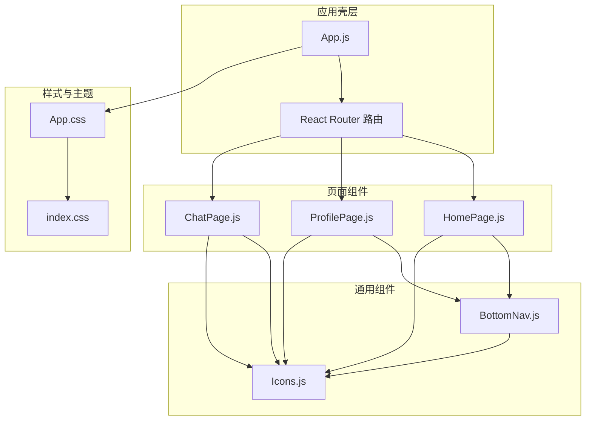
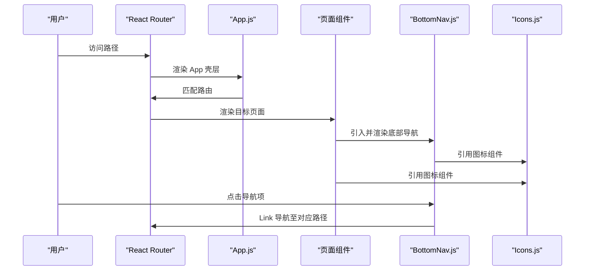
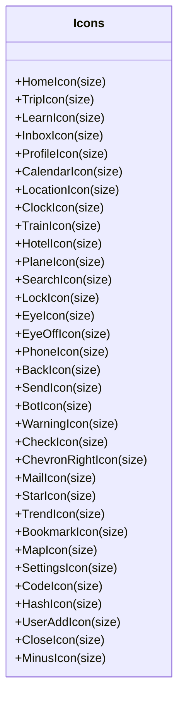
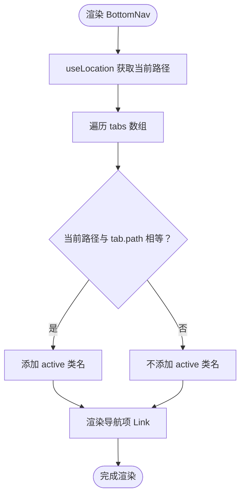
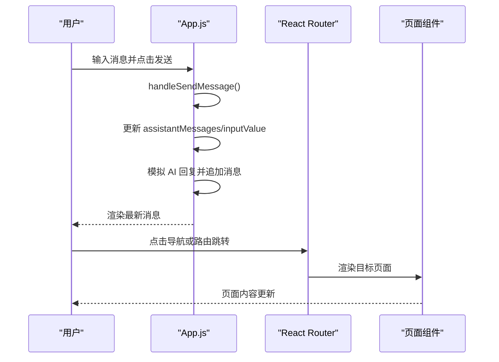
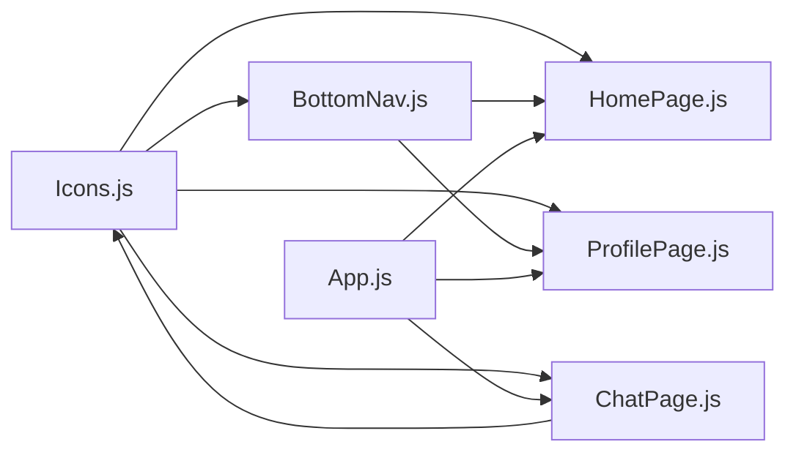

# 组件系统设计

<cite>
**本文引用的文件**
- [Icons.js](file://src/components/Icons.js)
- [BottomNav.js](file://src/components/BottomNav.js)
- [App.js](file://src/App.js)
- [App.css](file://src/App.css)
- [index.css](file://src/index.css)
- [HomePage.js](file://src/pages/HomePage.js)
- [ProfilePage.js](file://src/pages/ProfilePage.js)
- [ChatPage.js](file://src/pages/ChatPage.js)
- [package.json](file://package.json)
</cite>

## 目录
1. [简介](#简介)
2. [项目结构](#项目结构)
3. [核心组件](#核心组件)
4. [架构总览](#架构总览)
5. [详细组件分析](#详细组件分析)
6. [依赖关系分析](#依赖关系分析)
7. [性能考量](#性能考量)
8. [故障排查指南](#故障排查指南)
9. [结论](#结论)
10. [附录](#附录)

## 简介
本设计文档面向漫旅 ManLv 的组件系统，聚焦可复用组件的设计原则与实现策略，围绕图标组件库（Icons.js）的统一管理与底部导航组件（BottomNav.js）的状态管理进行深入剖析。文档解释 Props 接口设计、事件处理机制、样式封装策略；阐述组件间的组合模式、条件渲染、动态组件加载；并给出可测试性设计、性能优化策略、无障碍访问支持建议，以及组件库扩展机制、主题定制方案与版本管理策略，为组件开发者提供标准化的设计规范与实现指南。

## 项目结构
项目采用以功能域划分的目录组织方式，核心组件位于 src/components，页面组件位于 src/pages，全局样式位于 src/App.css 与 src/index.css，应用入口位于 src/index.js 与 src/App.js。

图表来源
- [App.js:77-91](file://src/App.js#L77-L91)
- [BottomNav.js:1-43](file://src/components/BottomNav.js#L1-L43)
- [Icons.js:1-259](file://src/components/Icons.js#L1-L259)
- [App.css:1-800](file://src/App.css#L1-L800)
- [index.css:1-45](file://src/index.css#L1-L45)

章节来源
- [App.js:14-91](file://src/App.js#L14-L91)
- [package.json:1-41](file://package.json#L1-L41)

## 核心组件
- 图标组件库（Icons.js）
  - 设计原则：统一的 SVG 属性基线（xmlns、viewBox、stroke 等），通过 size 参数控制尺寸，保证跨页面一致的视觉与交互体验。
  - 实现策略：导出多个纯函数式图标组件，每个图标接收 size 默认参数，内部组合 SVG 路径元素，便于按需引入与 Tree Shaking。
  - 使用场景：首页、个人页、聊天页等广泛复用，贯穿导航与卡片、按钮、列表等 UI 元素。

- 底部导航（BottomNav.js）
  - 设计原则：基于 react-router 的 useLocation 判断当前激活路径，动态高亮当前标签；通过配置数组集中维护导航项，降低耦合度。
  - 实现策略：定义 tabs 数组，遍历渲染导航项；使用 Link 组件跳转，结合 className 控制激活态；底部版权信息与导航容器分离，利于扩展。
  - 使用场景：所有受保护页面（除登录页外）均挂载该导航，形成一致的移动端导航体验。

章节来源
- [Icons.js:3-18](file://src/components/Icons.js#L3-L18)
- [Icons.js:13-259](file://src/components/Icons.js#L13-L259)
- [BottomNav.js:5-11](file://src/components/BottomNav.js#L5-L11)
- [BottomNav.js:13-40](file://src/components/BottomNav.js#L13-L40)

## 架构总览
应用采用单页路由（React Router）驱动，App.js 作为壳层负责路由匹配与全局状态管理（登录态、AI 助手窗口）。页面组件通过导入 Icons.js 中的图标组件实现一致的视觉风格；BottomNav.js 作为通用导航组件被各页面复用。

图表来源
- [App.js:77-91](file://src/App.js#L77-L91)
- [BottomNav.js:13-39](file://src/components/BottomNav.js#L13-L39)
- [Icons.js:13-259](file://src/components/Icons.js#L13-L259)

## 详细组件分析

### 图标组件库（Icons.js）
- Props 接口设计
  - size: number，默认值为 22 或 18/16/20 等，用于控制 SVG 宽高，保证图标在不同容器中的比例一致。
  - 其他属性：通过 iconProps 统一注入 stroke、strokeWidth、viewBox 等，确保风格一致性。
- 事件处理机制
  - 图标组件为纯展示型，不直接绑定交互事件；事件通常由上层容器（如按钮、链接）处理，图标仅承担视觉表达。
- 样式封装策略
  - 采用内联 SVG 方式，无需额外 CSS 文件；通过 className 与 CSS 变量（如 --ink、--gold）实现主题化。
- 组合模式
  - 页面组件通过 import { HomeIcon, ProfileIcon, ... } from './components/Icons' 按需引入，减少打包体积。
- 条件渲染
  - 图标本身无条件渲染逻辑；条件渲染发生在上层页面组件（如任务状态、行程类型徽章）。
- 动态组件加载
  - 本项目未实现动态加载；若后续扩展，可在上层组件按需 import 对应图标，或通过字符串映射到图标组件。

图表来源
- [Icons.js:13-259](file://src/components/Icons.js#L13-L259)

章节来源
- [Icons.js:3-11](file://src/components/Icons.js#L3-L11)
- [Icons.js:13-259](file://src/components/Icons.js#L13-L259)

### 底部导航（BottomNav.js）
- Props 接口设计
  - 无外部 Props；内部通过 useLocation 获取当前路径，通过 tabs 数组配置导航项。
- 状态管理
  - 通过 useLocation 判断当前路径与 tabs.path 是否相等，决定 active 类名；无需本地状态存储。
- 事件处理机制
  - 使用 Link 组件进行导航，点击即触发路由切换；图标与文本通过容器样式控制 hover/active 效果。
- 样式封装策略
  - 使用 .bottom-nav、.nav-item、.nav-icon、.nav-label 等类名，配合 App.css 中的变量与动画实现统一风格。
- 组合模式
  - 各页面组件直接引入并渲染 BottomNav，形成一致的导航体验。
- 条件渲染
  - 无条件渲染逻辑；若需在特定页面隐藏，可在上层页面组件条件包裹。
- 动态组件加载
  - 本项目未实现动态加载；若扩展，可将 tabs 映射到异步组件工厂。

图表来源
- [BottomNav.js:13-39](file://src/components/BottomNav.js#L13-L39)

章节来源
- [BottomNav.js:1-43](file://src/components/BottomNav.js#L1-L43)
- [App.css:736-778](file://src/App.css#L736-L778)

### 应用壳层与全局状态（App.js）
- 全局状态
  - 登录态：isLoggedIn 控制受保护路由与 AI 助手显示。
  - AI 助手：showAssistant/isMinimized 控制浮动窗口显示与最小化；assistantMessages/inputValue 管理消息流。
- 事件处理机制
  - handleSendMessage：收集用户输入，发送消息并等待 AI 回复；handleKeyPress：回车键提交。
  - guard：高阶函数包装受保护页面，未登录则重定向。
- 条件渲染
  - 仅在登录后渲染 AI 助手；根据 isMinimized 决定是否渲染输入区。
- 动态组件加载
  - 通过 React.lazy 与 Suspense 可实现页面级懒加载（建议在大型页面中引入）。

图表来源
- [App.js:36-66](file://src/App.js#L36-L66)
- [App.js:75-91](file://src/App.js#L75-L91)

章节来源
- [App.js:14-177](file://src/App.js#L14-L177)

### 页面组件中的图标使用（示例：HomePage.js、ProfilePage.js）
- 组合模式
  - 页面组件通过 import { IconName } from '../components/Icons' 按需引入图标，组合到卡片、按钮、列表等 UI 中。
- 条件渲染
  - 任务紧急状态、行程类型、设置项等通过条件渲染决定图标与文案。
- 动态组件加载
  - 本项目未实现动态加载；若扩展，可在需要时延迟引入图标组件。

章节来源
- [HomePage.js:4-6](file://src/pages/HomePage.js#L4-L6)
- [HomePage.js:137-153](file://src/pages/HomePage.js#L137-L153)
- [ProfilePage.js:3-4](file://src/pages/ProfilePage.js#L3-L4)
- [ProfilePage.js:213-218](file://src/pages/ProfilePage.js#L213-L218)

## 依赖关系分析
- 组件间依赖
  - BottomNav 依赖 Icons（图标）、react-router-dom（Link/useLocation）。
  - 页面组件依赖 Icons 与 BottomNav。
  - App.js 依赖页面组件与 Icons。
- 外部依赖
  - React、react-router-dom、@icon-park/react（部分页面使用）、react-markdown、remark-gfm 等。

图表来源
- [BottomNav.js:1-43](file://src/components/BottomNav.js#L1-L43)
- [Icons.js:1-259](file://src/components/Icons.js#L1-L259)
- [HomePage.js:1-263](file://src/pages/HomePage.js#L1-L263)
- [ProfilePage.js:1-343](file://src/pages/ProfilePage.js#L1-L343)
- [ChatPage.js:1-200](file://src/pages/ChatPage.js#L1-L200)
- [App.js:14-177](file://src/App.js#L14-L177)

章节来源
- [package.json:5-16](file://package.json#L5-L16)

## 性能考量
- 图标渲染
  - Icons.js 采用内联 SVG，避免额外请求；通过 size 参数控制尺寸，减少重复计算。
- 懒加载与代码分割
  - 建议对大型页面（如 LearnPage）使用 React.lazy 与 Suspense 实现按需加载，减少首屏体积。
- 虚拟滚动与长列表
  - 若未来行程/消息列表增长，建议引入虚拟滚动（如 react-window）提升渲染性能。
- 样式与主题
  - 使用 CSS 变量（index.css）集中管理主题色，避免重复定义；App.css 中的动画与阴影应适度使用，避免过度重排。
- 事件节流与防抖
  - 输入框与滚动事件可考虑节流/防抖，减少高频重渲染。

## 故障排查指南
- 图标不显示或尺寸异常
  - 检查 size 参数是否传入；确认父容器未覆盖 SVG 尺寸；核对 stroke、strokeWidth 等属性是否被覆盖。
- 底部导航高亮不生效
  - 确认 useLocation 返回的 pathname 与 tabs.path 是否完全一致；检查 Link 的 to 是否正确。
- AI 助手无法打开
  - 检查 isLoggedIn 状态；确认 App.js 中的 guard 逻辑与路由配置；查看控制台是否存在网络错误。
- 页面样式错乱
  - 检查 App.css 中的类名拼写与作用域；确认 CSS 变量（如 --ink、--gold）未被覆盖。

章节来源
- [BottomNav.js:13-39](file://src/components/BottomNav.js#L13-L39)
- [App.js:75-91](file://src/App.js#L75-L91)
- [App.css:736-778](file://src/App.css#L736-L778)

## 结论
本组件系统通过 Icons.js 提供统一的图标资产与接口，通过 BottomNav.js 提供一致的导航体验，并在 App.js 中集中管理全局状态与路由守卫。整体设计遵循单一职责、可组合、可测试与可扩展的原则。建议后续引入动态组件加载、虚拟滚动与更完善的无障碍支持，持续提升用户体验与可维护性。

## 附录

### 设计规范与实现指南
- Props 设计
  - 保持最小必要 Props；默认值清晰且语义明确；避免在组件内部做复杂的数据转换。
- 事件处理
  - 将事件处理逻辑上提至父组件或通过自定义 Hook 抽离，组件只负责渲染与透传。
- 样式封装
  - 使用 CSS 变量与类名命名规范（BEM 风格）；避免内联样式污染全局。
- 组合与复用
  - 通过配置数组（如 tabs）集中管理可变数据；按需引入图标，避免全量导入。
- 测试性设计
  - 为组件提供稳定 Props 接口与可预测输出；为交互行为提供可注入的回调函数。
- 性能优化
  - 图标与导航组件尽量无状态；对长列表与大图使用懒加载与虚拟化；合理使用 CSS 动画。
- 无障碍访问
  - 为可点击元素提供 title/aria-* 属性；确保键盘可访问；为图片提供替代文本（图标为装饰时可省略 alt）。
- 主题定制
  - 通过 CSS 变量集中管理颜色与字体；提供明暗主题切换方案；为关键组件提供主题覆盖入口。
- 版本管理
  - 为组件库建立变更日志；对破坏性改动进行版本号升级；为图标组件提供命名空间与版本标记。