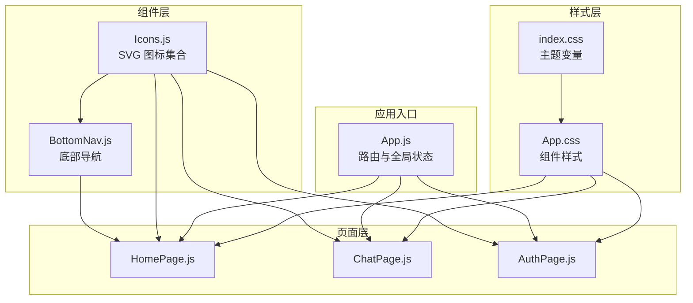
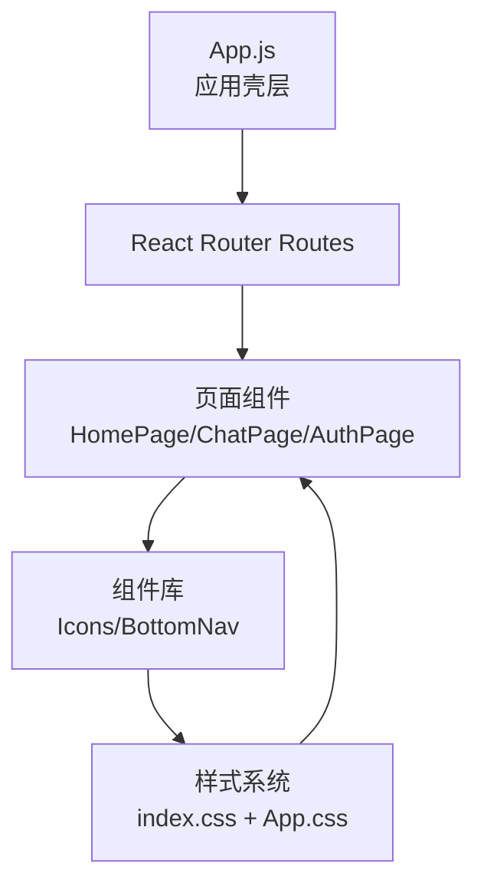
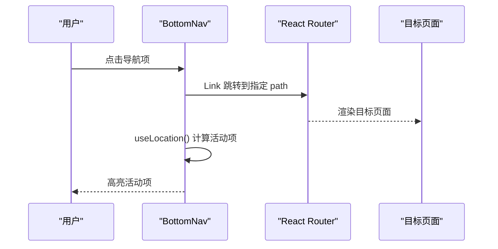
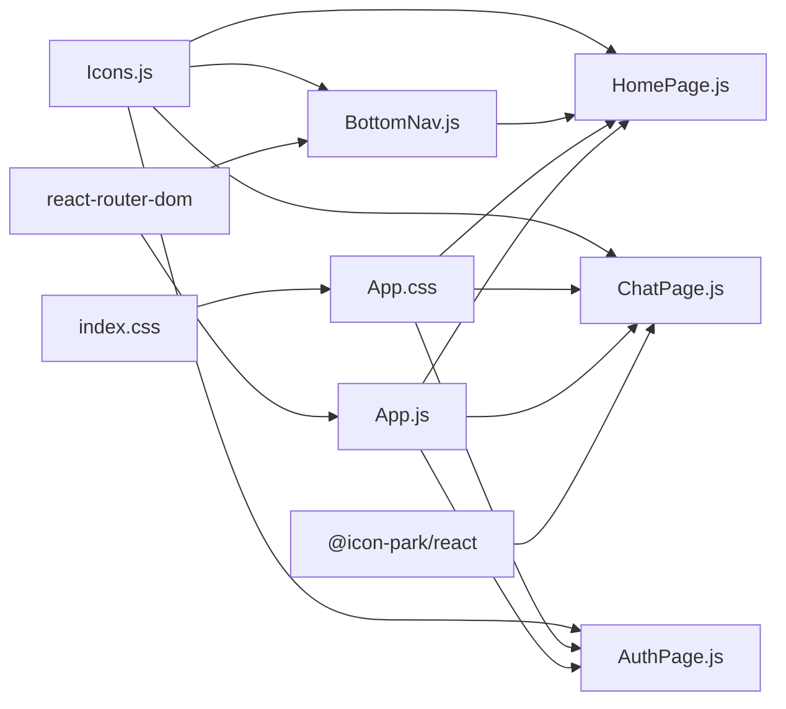

# 组件库系统

<cite>
**本文档引用的文件**
- [Icons.js](file://src/components/Icons.js)
- [BottomNav.js](file://src/components/BottomNav.js)
- [App.js](file://src/App.js)
- [App.css](file://src/App.css)
- [index.css](file://src/index.css)
- [HomePage.js](file://src/pages/HomePage.js)
- [ChatPage.js](file://src/pages/ChatPage.js)
- [AuthPage.js](file://src/pages/AuthPage.js)
- [package.json](file://package.json)
- [README.md](file://README.md)
</cite>

## 目录
1. [简介](#简介)
2. [项目结构](#项目结构)
3. [核心组件](#核心组件)
4. [架构总览](#架构总览)
5. [详细组件分析](#详细组件分析)
6. [依赖关系分析](#依赖关系分析)
7. [性能考量](#性能考量)
8. [故障排查指南](#故障排查指南)
9. [结论](#结论)
10. [附录](#附录)

## 简介
本项目为“漫旅 ManLv”前端组件库系统，围绕移动端优先的设计理念，提供统一的图标组件、底部导航组件以及公共样式系统。组件库以原子化的 SVG 图标为核心，结合基于 CSS 变量的主题系统与响应式布局，确保在不同设备上的一致体验。组件广泛应用于首页、聊天页、认证页等页面，形成可复用、可扩展的 UI 基础设施。

## 项目结构
组件库位于 src/components 目录，核心文件包括：
- Icons.js：统一的图标组件集合，采用 SVG 实现，支持 size 参数控制尺寸
- BottomNav.js：底部导航栏，集成路由跳转与活动态样式
- App.js：应用入口，负责路由、全局状态与浮动助手（AI 助手）
- App.css 与 index.css：公共样式与主题变量定义
- 页面组件：如 HomePage、ChatPage、AuthPage 等，演示组件的使用方式

图表来源
- [Icons.js:1-259](file://src/components/Icons.js#L1-L259)
- [BottomNav.js:1-43](file://src/components/BottomNav.js#L1-L43)
- [App.js:1-177](file://src/App.js#L1-L177)
- [App.css:1-800](file://src/App.css#L1-L800)
- [index.css:1-46](file://src/index.css#L1-L46)
- [HomePage.js:1-263](file://src/pages/HomePage.js#L1-L263)
- [ChatPage.js:1-482](file://src/pages/ChatPage.js#L1-L482)
- [AuthPage.js:1-732](file://src/pages/AuthPage.js#L1-L732)

章节来源
- [README.md:146-170](file://README.md#L146-L170)
- [package.json:1-41](file://package.json#L1-L41)

## 核心组件
- 图标组件（@icon-park/react 集成与自绘 SVG）
  - @icon-park/react：用于部分页面组件（如 ChatPage 中的机器人头像），提供高质量矢量图标
  - 自绘 SVG 图标：Icons.js 提供大量业务相关图标，统一通过 size 参数控制尺寸，便于在不同页面复用
- 底部导航组件
  - 集成路由跳转，基于当前路径高亮活动项
  - 支持品牌 Footer 与导航项布局
- 公共样式系统
  - 使用 CSS 变量定义主题色板与阴影层级
  - 基于移动端优先策略，配合媒体查询与安全区域适配

章节来源
- [Icons.js:1-259](file://src/components/Icons.js#L1-L259)
- [BottomNav.js:1-43](file://src/components/BottomNav.js#L1-L43)
- [App.js:1-177](file://src/App.js#L1-L177)
- [App.css:1-800](file://src/App.css#L1-L800)
- [index.css:1-46](file://src/index.css#L1-L46)
- [ChatPage.js:1-482](file://src/pages/ChatPage.js#L1-L482)

## 架构总览
组件库采用“组件 + 样式 + 页面”的分层架构：
- 组件层：Icons.js 与 BottomNav.js 提供可复用 UI 基元
- 样式层：index.css 定义主题变量，App.css 定义组件样式与页面布局
- 页面层：各页面组件组合使用组件与样式，形成完整功能界面
- 应用层：App.js 管理路由、全局状态与浮动助手

图表来源
- [App.js:77-91](file://src/App.js#L77-L91)
- [HomePage.js:93-260](file://src/pages/HomePage.js#L93-L260)
- [ChatPage.js:331-478](file://src/pages/ChatPage.js#L331-L478)
- [AuthPage.js:228-729](file://src/pages/AuthPage.js#L228-L729)
- [App.css:1-800](file://src/App.css#L1-L800)
- [index.css:1-46](file://src/index.css#L1-L46)

## 详细组件分析

### 图标组件（Icons.js）
- 设计理念
  - 采用统一的 SVG 属性集（视窗、描边、线帽等），保证视觉一致性
  - 通过 size 参数控制图标尺寸，满足不同容器需求
  - 将图标封装为纯函数组件，便于在任意页面导入使用
- 关键接口
  - props：size（默认值见各图标定义）
  - 返回：SVG 元素，内部包含路径与形状描述
- 使用示例（路径）
  - 在首页卡片中使用：[HomePage.js:159-176](file://src/pages/HomePage.js#L159-L176)
  - 在底部导航中使用：[BottomNav.js:30-34](file://src/components/BottomNav.js#L30-L34)
  - 在认证页输入框前使用：[AuthPage.js:268-277](file://src/pages/AuthPage.js#L268-L277)
- 性能与可维护性
  - SVG 内联减少外部依赖，体积可控
  - 统一的属性基线降低样式耦合
  - 建议：为常用图标提供别名或组合组件，提升语义化

```mermaid
classDiagram
class IconBase {
+props : size
+render() : JSX.Element
}
class HomeIcon {
+size : number
}
class TripIcon
class LearnIcon
class InboxIcon
class ProfileIcon
class CalendarIcon
class LocationIcon
class ClockIcon
class TrainIcon
class HotelIcon
class PlaneIcon
class SearchIcon
class LockIcon
class EyeIcon
class EyeOffIcon
class PhoneIcon
class BackIcon
class SendIcon
class BotIcon
class WarningIcon
class CheckIcon
class ChevronRightIcon
class MailIcon
class StarIcon
class TrendIcon
class BookmarkIcon
class MapIcon
class SettingsIcon
class CodeIcon
class HashIcon
class UserAddIcon
class CloseIcon
class MinusIcon
IconBase <|-- HomeIcon
IconBase <|-- TripIcon
IconBase <|-- LearnIcon
IconBase <|-- InboxIcon
IconBase <|-- ProfileIcon
IconBase <|-- CalendarIcon
IconBase <|-- LocationIcon
IconBase <|-- ClockIcon
IconBase <|-- TrainIcon
IconBase <|-- HotelIcon
IconBase <|-- PlaneIcon
IconBase <|-- SearchIcon
IconBase <|-- LockIcon
IconBase <|-- EyeIcon
IconBase <|-- EyeOffIcon
IconBase <|-- PhoneIcon
IconBase <|-- BackIcon
IconBase <|-- SendIcon
IconBase <|-- BotIcon
IconBase <|-- WarningIcon
IconBase <|-- CheckIcon
IconBase <|-- ChevronRightIcon
IconBase <|-- MailIcon
IconBase <|-- StarIcon
IconBase <|-- TrendIcon
IconBase <|-- BookmarkIcon
IconBase <|-- MapIcon
IconBase <|-- SettingsIcon
IconBase <|-- CodeIcon
IconBase <|-- HashIcon
IconBase <|-- UserAddIcon
IconBase <|-- CloseIcon
IconBase <|-- MinusIcon
```

图表来源
- [Icons.js:13-259](file://src/components/Icons.js#L13-L259)

章节来源
- [Icons.js:1-259](file://src/components/Icons.js#L1-L259)
- [HomePage.js:159-176](file://src/pages/HomePage.js#L159-L176)
- [BottomNav.js:30-34](file://src/components/BottomNav.js#L30-L34)
- [AuthPage.js:268-277](file://src/pages/AuthPage.js#L268-L277)

### 底部导航组件（BottomNav.js）
- 设计理念
  - 固定在页面底部，提供五个核心页面入口
  - 基于当前路径高亮活动项，增强导航反馈
  - 与页面内容区分离，避免滚动干扰
- 关键接口
  - 依赖：react-router-dom 的 Link 与 useLocation
  - tabs 列表：包含 path、label、Icon
  - 样式：.bottom-nav、.nav-item、.nav-icon、.nav-label
- 使用示例（路径）
  - 在首页底部引入：[HomePage.js:255-255](file://src/pages/HomePage.js#L255-L255)
- 交互流程（序列图）

图表来源
- [BottomNav.js:13-39](file://src/components/BottomNav.js#L13-L39)
- [HomePage.js:255-255](file://src/pages/HomePage.js#L255-L255)

章节来源
- [BottomNav.js:1-43](file://src/components/BottomNav.js#L1-L43)
- [HomePage.js:255-255](file://src/pages/HomePage.js#L255-L255)

### 公共样式系统（index.css + App.css）
- 主题系统
  - 使用 CSS 变量定义主色、纸张色、金色系、阴影等
  - 通过变量统一颜色与阴影，便于主题切换与一致性维护
- 响应式设计
  - 移动端优先，针对不同页面采用合适的布局与间距
  - 使用安全区域变量适配刘海屏与底部胶囊栏
- 样式组织
  - App.css 按页面与组件划分区域（如底部导航、AI 助手、任务卡片等）
  - 通过类名命名规范（如 .nav-item、.task-item）提升可读性

章节来源
- [index.css:1-46](file://src/index.css#L1-L46)
- [App.css:1-800](file://src/App.css#L1-L800)

### AI 助手浮动窗口（App.js）
- 设计理念
  - 采用悬浮按钮触发，支持最小化与关闭
  - 对话区域支持 Markdown 渲染与工具调用状态展示
- 关键接口
  - 状态：showAssistant、isMinimized、assistantMessages、inputValue
  - 事件：handleSendMessage、handleKeyPress、scrollToBottom
  - 依赖：@icon-park/react 的 BotIcon、CloseIcon、SendIcon、MinusIcon
- 使用示例（路径）
  - 在 App.js 中渲染与控制：[App.js:94-170](file://src/App.js#L94-L170)

章节来源
- [App.js:14-177](file://src/App.js#L14-L177)
- [Icons.js:1-259](file://src/components/Icons.js#L1-L259)

### 页面组件中的组件使用
- 首页（HomePage.js）
  - 使用图标组件构建快捷操作、行程卡片与状态选择
  - 集成底部导航与浮动提示
- 聊天页（ChatPage.js）
  - 使用 @icon-park/react 的 RobotOne 作为头像
  - 使用 Icons.js 的 BackIcon、SendIcon 构建交互
- 认证页（AuthPage.js）
  - 使用 Icons.js 的 PhoneIcon、LockIcon、EyeIcon、EyeOffIcon、ProfileIcon、HashIcon
  - 通过图标增强表单语义与可读性

章节来源
- [HomePage.js:1-263](file://src/pages/HomePage.js#L1-L263)
- [ChatPage.js:1-482](file://src/pages/ChatPage.js#L1-L482)
- [AuthPage.js:1-732](file://src/pages/AuthPage.js#L1-L732)

## 依赖关系分析
- 组件依赖
  - Icons.js 被多个页面组件导入，形成跨页面的统一图标体系
  - BottomNav.js 依赖 Icons.js 与 react-router-dom
- 样式依赖
  - index.css 为全局主题变量源，App.css 依赖其变量进行样式定义
- 第三方依赖
  - @icon-park/react：提供高质量矢量图标（用于 ChatPage）
  - react-router-dom：提供路由与导航能力
  - react-markdown + remark-gfm：用于聊天页的富文本渲染

图表来源
- [Icons.js:1-259](file://src/components/Icons.js#L1-L259)
- [BottomNav.js:1-43](file://src/components/BottomNav.js#L1-L43)
- [App.js:1-177](file://src/App.js#L1-L177)
- [App.css:1-800](file://src/App.css#L1-L800)
- [index.css:1-46](file://src/index.css#L1-L46)
- [HomePage.js:1-263](file://src/pages/HomePage.js#L1-L263)
- [ChatPage.js:1-482](file://src/pages/ChatPage.js#L1-L482)
- [AuthPage.js:1-732](file://src/pages/AuthPage.js#L1-L732)

章节来源
- [package.json:5-16](file://package.json#L5-L16)

## 性能考量
- 图标渲染
  - SVG 内联减少网络请求，适合移动端首屏加载
  - 建议：对不常用的图标采用懒加载或按需导入，减少初始包体
- 样式体积
  - CSS 变量集中管理，避免重复定义颜色与阴影
  - 建议：合并重复样式，清理未使用类名，减少 CSS 体积
- 路由与页面
  - 使用 React Router 的按需加载与代码分割，提升首屏性能
  - 建议：对大型页面组件进行拆分，延迟加载非关键内容
- 无障碍与可访问性
  - 建议：为图标添加 aria-label 或 title，提升屏幕阅读器可访问性
  - 建议：为交互元素提供键盘导航支持与焦点可见性

## 故障排查指南
- 图标不显示或样式异常
  - 检查 size 参数是否传入有效数值
  - 确认 SVG 属性（stroke、fill、strokeWidth）是否被覆盖
- 底部导航高亮不生效
  - 确认 tabs.path 与当前路由一致
  - 检查 useLocation 是否正确获取当前路径
- 样式变量未生效
  - 确认 :root 变量已在 index.css 中定义
  - 检查 App.css 中是否正确引用变量
- 浮动助手无法打开或关闭
  - 检查 App.js 中的状态管理逻辑与按钮事件绑定
  - 确认 @icon-park/react 图标组件是否正常渲染

章节来源
- [Icons.js:13-259](file://src/components/Icons.js#L13-L259)
- [BottomNav.js:13-39](file://src/components/BottomNav.js#L13-L39)
- [App.js:94-170](file://src/App.js#L94-L170)
- [index.css:1-46](file://src/index.css#L1-L46)
- [App.css:736-778](file://src/App.css#L736-L778)

## 结论
本组件库以简洁、统一、可扩展为目标，通过 SVG 图标与底部导航组件形成稳定的 UI 基础设施，配合基于 CSS 变量的主题系统与移动端优先的样式策略，满足漫旅 ManLv 的设计与交互需求。建议在后续迭代中进一步完善无障碍支持、性能优化与组件文档，持续提升开发效率与用户体验。

## 附录
- 组件使用最佳实践
  - 图标：统一通过 size 控制尺寸，避免硬编码像素
  - 导航：保持 tabs 列表与路由 path 一致，确保高亮准确
  - 样式：优先使用 CSS 变量，避免内联样式的重复定义
- 扩展指南
  - 新增图标：在 Icons.js 中新增 SVG 组件，并在需要的页面导入使用
  - 新增页面：在 App.js 中添加路由，页面中引入底部导航与公共样式
  - 主题扩展：在 index.css 中新增变量，在 App.css 中引用并适配各组件