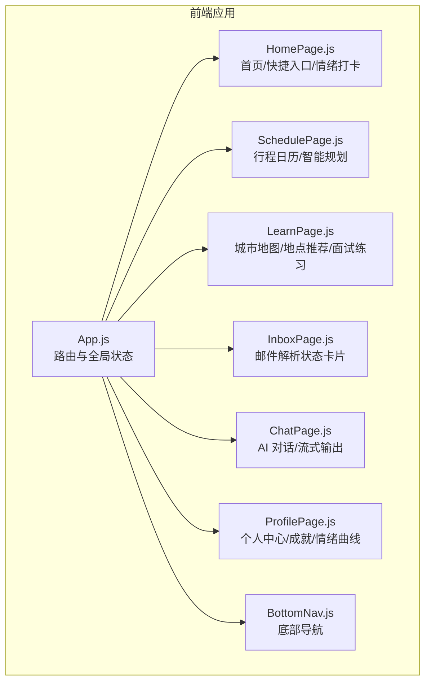
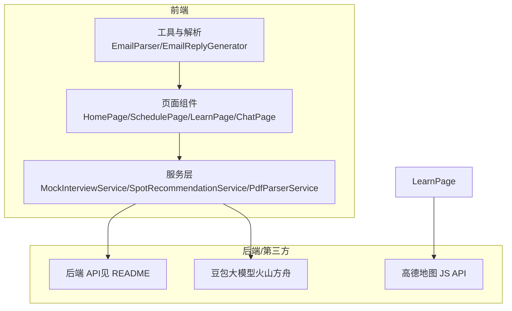
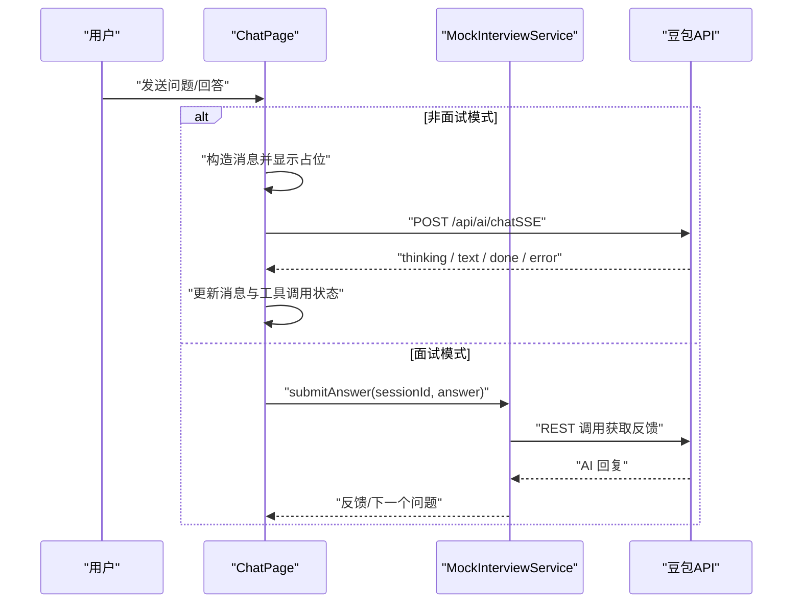
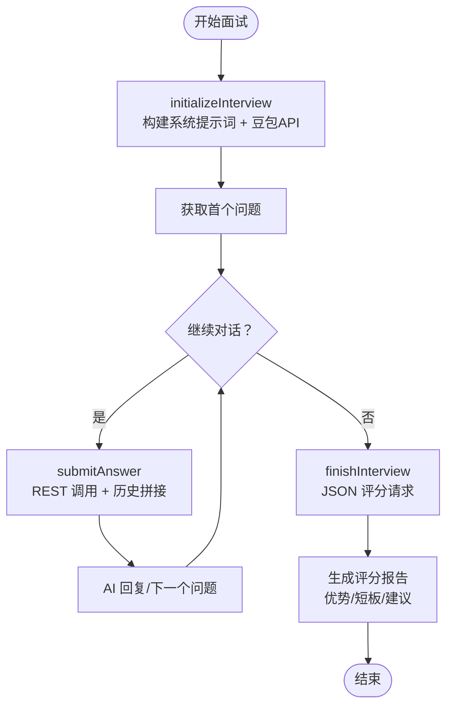
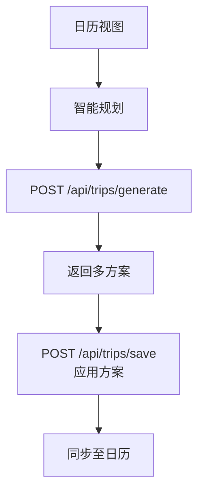
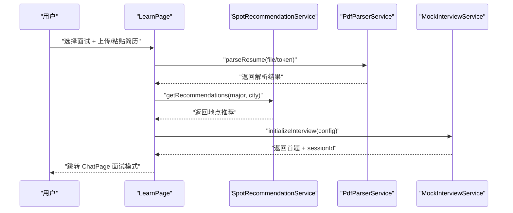
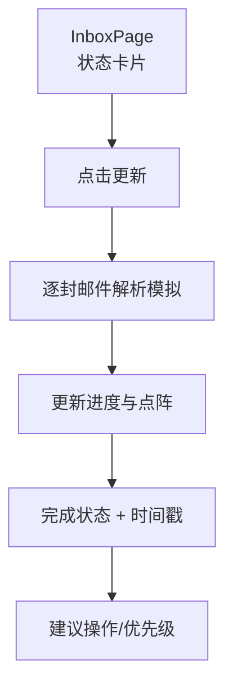
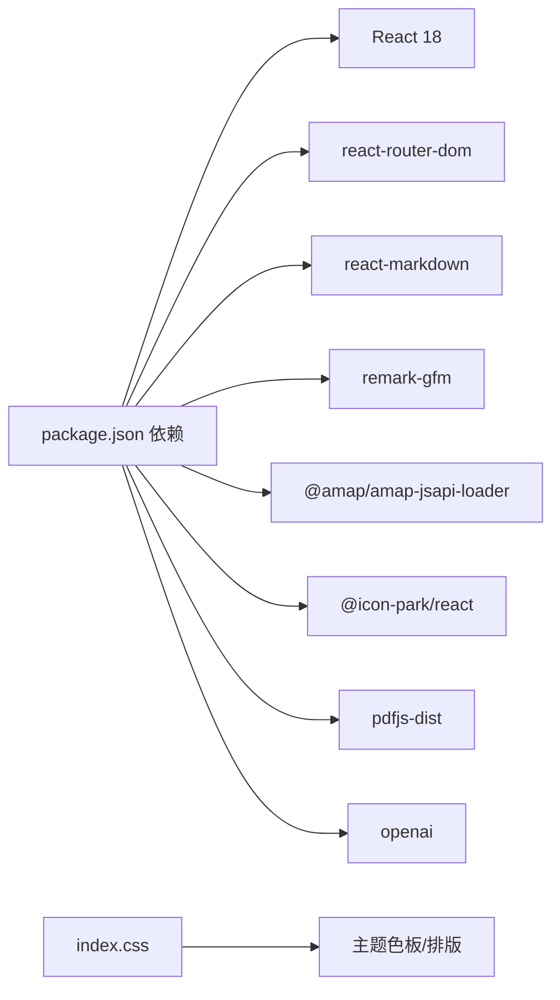

# 项目概述

<cite>
**本文引用的文件**
- [README.md](file://README.md)
- [package.json](file://package.json)
- [QUICK_START.md](file://QUICK_START.md)
- [SYSTEM_PROMPT_UPDATE.md](file://SYSTEM_PROMPT_UPDATE.md)
- [EMAIL_PARSE_IMPLEMENTATION_SUMMARY.md](file://EMAIL_PARSE_IMPLEMENTATION_SUMMARY.md)
- [src\App.js](file://src\App.js)
- [src\pages\HomePage.js](file://src\pages\HomePage.js)
- [src\pages\ChatPage.js](file://src\pages\ChatPage.js)
- [src\pages\SchedulePage.js](file://src\pages\SchedulePage.js)
- [src\pages\LearnPage.js](file://src\pages\LearnPage.js)
- [src\services\MockInterviewService.js](file://src\services\MockInterviewService.js)
- [src\services\SpotRecommendationService.js](file://src\services\SpotRecommendationService.js)
- [src\services\EmailParser.js](file://src\services\EmailParser.js)
- [src\services\EmailReplyGenerator.js](file://src\services\EmailReplyGenerator.js)
- [src\services\PdfParserService.js](file://src\services\PdfParserService.js)
- [src\components\BottomNav.js](file://src\components\BottomNav.js)
- [src\index.css](file://src\index.css)
</cite>

## 目录
1. [引言](#引言)
2. [项目结构](#项目结构)
3. [核心组件](#核心组件)
4. [架构总览](#架构总览)
5. [详细组件分析](#详细组件分析)
6. [依赖分析](#依赖分析)
7. [性能考虑](#性能考虑)
8. [故障排查指南](#故障排查指南)
9. [结论](#结论)
10. [附录](#附录)

## 引言
漫旅 ManLv 是一款面向保研生的 AI 驱动一站式行程伴旅助手，旨在将「多城市面试调度 × 专业备考 × 情绪支持」整合为一套主动式 AI 助手，帮助用户在频繁跨城市差旅的保研季建立掌控感与意义感。产品理念「有意义的慢行」，既呼应漫游与慢节奏，也强调在紧张备考中保持从容与深度学习。

- 目标用户：保研生（尤其是计划参加夏令营/预推免的跨城市考生）
- 使用场景：面试前的行程规划、邮件通知处理、专业学习与城市导览、AI 模拟面试、情绪支持与成就反馈
- 核心价值：以 AI 为支点，串联「行程管理」「邮件解析」「情景学习」「模拟面试」「情绪支持」，形成闭环体验

章节来源
- [README.md:21-62](file://README.md#L21-L62)

## 项目结构
前端采用 React 18 + React Router DOM 6，页面组织围绕「主页/行程/漫学/通知/我的」五大板块展开，配合浮动 AI 助手与底部导航，形成移动端友好的信息架构。

图表来源
- [src\App.js:14-91](file://src\App.js#L14-L91)
- [src\components\BottomNav.js:5-37](file://src\components\BottomNav.js#L5-L37)

章节来源
- [README.md:146-171](file://README.md#L146-L171)
- [src\App.js:14-174](file://src\App.js#L14-L174)
- [src\components\BottomNav.js:1-43](file://src\components\BottomNav.js#L1-L43)

## 核心组件
- 全局路由与浮动 AI 助手：统一承载对话入口与全局状态，提供「AI 助手」悬浮按钮与聊天窗口
- 首页：今日问候、倒计时、任务清单、快捷操作、AI 助手卡片、情绪打卡、行程概览
- 行程管理：日历视图、智能规划（AI 生成方案）、添加/删除面试、冲突检测与建议
- 漫学：城市地图（高德 JS API）、AI 推荐地点、知识收藏、简历上传与 AI 面试练习
- 通知：邮件解析状态卡片（解析中/完成），展示进度与时间戳
- AI 对话：SSE 流式输出，支持工具调用可视化、Markdown 渲染、上下文建议
- 服务层：MockInterviewService（豆包 API 集成）、SpotRecommendationService（地点推荐）、EmailParser/EmailReplyGenerator（邮件解析与回复）、PdfParserService（简历解析）

章节来源
- [src\App.js:36-66](file://src\App.js#L36-L66)
- [src\pages\HomePage.js:38-91](file://src\pages\HomePage.js#L38-L91)
- [src\pages\SchedulePage.js:96-139](file://src\pages\SchedulePage.js#L96-L139)
- [src\pages\LearnPage.js:116-139](file://src\pages\LearnPage.js#L116-L139)
- [src\pages\ChatPage.js:133-285](file://src\pages\ChatPage.js#L133-L285)
- [src\services\MockInterviewService.js:24-182](file://src\services\MockInterviewService.js#L24-L182)
- [src\services\SpotRecommendationService.js:18-66](file://src\services\SpotRecommendationService.js#L18-L66)
- [src\services\EmailParser.js:12-25](file://src\services\EmailParser.js#L12-L25)
- [src\services\EmailReplyGenerator.js:13-23](file://src\services\EmailReplyGenerator.js#L13-L23)
- [src\services\PdfParserService.js:15-39](file://src\services\PdfParserService.js#L15-L39)

## 架构总览
前端通过 React 组件与服务层协作，调用后端 API（由 README 提供接口清单）与第三方 AI/地图能力，形成「用户交互 → 服务层 → 后端/第三方 → 响应反馈」的闭环。

图表来源
- [README.md:174-206](file://README.md#L174-L206)
- [src\services\MockInterviewService.js:10-11](file://src\services\MockInterviewService.js#L10-L11)
- [src\pages\LearnPage.js:10-12](file://src\pages\LearnPage.js#L10-L12)

章节来源
- [README.md:65-76](file://README.md#L65-L76)
- [README.md:174-206](file://README.md#L174-L206)

## 详细组件分析

### AI 对话与流式输出（ChatPage）
- SSE 流式接收：解析 data: 行，分别处理 thinking/text/done/error 事件，实时更新消息与工具调用状态
- Markdown 渲染：使用 react-markdown + remark-gfm，支持标题、加粗、列表、表格等
- 通用对话与面试模式：通过 state 控制是否进入面试模式，切换输入占位与按钮文案

图表来源
- [src\pages\ChatPage.js:133-285](file://src\pages\ChatPage.js#L133-L285)
- [src\services\MockInterviewService.js:190-247](file://src\services\MockInterviewService.js#L190-L247)

章节来源
- [src\pages\ChatPage.js:133-285](file://src\pages\ChatPage.js#L133-L285)
- [src\services\MockInterviewService.js:190-247](file://src\services\MockInterviewService.js#L190-L247)

### 模拟面试（MockInterviewService + LearnPage）
- 系统提示词：结构化六大模块（身份规则、面试流程、提问深度、复盘报告、对话格式、底线），并注入院校、专业、城市、简历等上下文
- 生命周期：initialize → 多轮回答 → finish（JSON 结构化评分）
- 降级机制：API 失败自动回退到模拟数据，保障体验连续性

图表来源
- [src\services\MockInterviewService.js:24-182](file://src\services\MockInterviewService.js#L24-L182)
- [src\services\MockInterviewService.js:254-358](file://src\services\MockInterviewService.js#L254-L358)
- [src\pages\LearnPage.js:277-336](file://src\pages\LearnPage.js#L277-L336)

章节来源
- [SYSTEM_PROMPT_UPDATE.md:18-81](file://SYSTEM_PROMPT_UPDATE.md#L18-L81)
- [SYSTEM_PROMPT_UPDATE.md:139-180](file://SYSTEM_PROMPT_UPDATE.md#L139-L180)
- [QUICK_START.md:68-89](file://QUICK_START.md#L68-L89)

### 行程管理（SchedulePage）
- 日历视图：按日展示当日行程，支持筛选与高亮
- 智能规划：调用后端生成多套方案，比较成本/周期/疲劳度，一键应用
- 录入与删除：弹窗录入面试信息，支持删除与刷新

图表来源
- [src\pages\SchedulePage.js:96-139](file://src\pages\SchedulePage.js#L96-L139)

章节来源
- [src\pages\SchedulePage.js:96-139](file://src\pages\SchedulePage.js#L96-L139)

### 情景学习引擎（LearnPage）
- 城市地图：高德 JS API 加载 3D 地图，标注面试城市，点击提示
- AI 推荐地点：按专业与城市生成个性化地点卡片，支持刷新
- 简历解析：支持 PDF/图片上传，调用后端解析；支持手动粘贴
- 面试练习：结合简历与城市信息，启动 AI 面试

图表来源
- [src\pages\LearnPage.js:116-139](file://src\pages\LearnPage.js#L116-L139)
- [src\services\SpotRecommendationService.js:18-66](file://src\services\SpotRecommendationService.js#L18-L66)
- [src\services\PdfParserService.js:15-39](file://src\services\PdfParserService.js#L15-L39)
- [src\services\MockInterviewService.js:24-182](file://src\services\MockInterviewService.js#L24-L182)

章节来源
- [src\pages\LearnPage.js:116-139](file://src\pages\LearnPage.js#L116-L139)
- [src\services\SpotRecommendationService.js:18-66](file://src\services\SpotRecommendationService.js#L18-L66)
- [src\services\PdfParserService.js:15-39](file://src\services\PdfParserService.js#L15-L39)

### 邮件智能解析（InboxPage + EmailParser/EmailReplyGenerator）
- UI 状态：解析中（进度条/点阵动画）与完成（时间戳）两种状态，支持手动刷新
- 解析逻辑：EmailParser 提取学校/类型/日期/截止/地点/链接/描述/优先级/建议操作；EmailReplyGenerator 基于解析结果与日程建议回复类型（确认/拒绝/协商/咨询）

图表来源
- [EMAIL_PARSE_IMPLEMENTATION_SUMMARY.md:21-36](file://EMAIL_PARSE_IMPLEMENTATION_SUMMARY.md#L21-L36)
- [src\services\EmailParser.js:12-25](file://src\services\EmailParser.js#L12-L25)
- [src\services\EmailReplyGenerator.js:13-23](file://src\services\EmailReplyGenerator.js#L13-L23)

章节来源
- [EMAIL_PARSE_IMPLEMENTATION_SUMMARY.md:21-36](file://EMAIL_PARSE_IMPLEMENTATION_SUMMARY.md#L21-L36)
- [src\services\EmailParser.js:12-25](file://src\services\EmailParser.js#L12-L25)
- [src\services\EmailReplyGenerator.js:13-23](file://src\services\EmailReplyGenerator.js#L13-L23)

### 首页与情绪支持（HomePage）
- 今日问候与倒计时：根据时间段与用户信息生成问候语，展示最近行程倒计时
- 任务与快捷入口：任务清单、AI 助手卡片、快速入口（行程/订票/订酒店）
- 情绪打卡：支持焦虑/平静/充实/疲惫/期待五态，异常状态自动跳转 AI 助手寻求减压建议

章节来源
- [src\pages\HomePage.js:38-91](file://src\pages\HomePage.js#L38-L91)

## 依赖分析
- 前端依赖：React 18、react-router-dom、react-markdown、remark-gfm、@amap/amap-jsapi-loader、@icon-park/react、pdfjs-dist、openai
- 样式：通过 src/index.css 定义主题色板与全局排版
- 路由：App.js 统一路由与守卫，BottomNav 提供底部导航

图表来源
- [package.json:5-16](file://package.json#L5-L16)
- [src\index.css:1-46](file://src\index.css#L1-L46)

章节来源
- [package.json:1-41](file://package.json#L1-L41)
- [src\index.css:1-46](file://src\index.css#L1-L46)

## 性能考虑
- 流式输出：SSE 逐字渲染，避免一次性大段文本阻塞 UI
- 本地降级：MockInterviewService 在 API 不可用时自动回退，保障功能可用
- 资源懒加载：地图仅在需要时初始化，超时自动失败提示并允许重试
- 动画与交互：CSS 动画为主，减少 JS 频繁操作 DOM 的开销

章节来源
- [src\pages\ChatPage.js:210-271](file://src\pages\ChatPage.js#L210-L271)
- [src\services\MockInterviewService.js:176-519](file://src\services\MockInterviewService.js#L176-L519)
- [src\pages\LearnPage.js:141-223](file://src\pages\LearnPage.js#L141-L223)

## 故障排查指南
- 面试无法启动
  - 检查是否上传简历或输入简历内容
  - 查看浏览器 Console 是否报错
  - 确认网络连接与豆包官网可访问
- API 响应缓慢
  - 首次调用约 1-2 秒，后续约 2-3 秒属正常
  - 超过 5 秒检查网络、API 配额与简历长度
- 回答为空或错误
  - 打开 F12 检查 Console 错误
  - 检查是否禁用跨域请求
- 自动降级到模拟数据
  - 原因：API 不可用/配额限制/网络错误
  - 结果：UI 正常，使用模拟回答，刷新页面重试

章节来源
- [QUICK_START.md:125-159](file://QUICK_START.md#L125-L159)

## 结论
漫旅 ManLv 以「有意义的慢行」为核心理念，通过 AI 驱动的对话、行程、邮件、学习与面试模块，为保研生提供从「信息感知」到「行动执行」再到「反馈成长」的完整闭环。前端以 React 为基础，配合服务层与第三方能力，形成高可用、可扩展且体验友好的移动端应用。

## 附录
- 快速开始与环境要求：详见 README 的「快速开始」与「环境变量配置」
- 技术栈概览：前端 React 18、后端 Node.js/Express、数据库 PostgreSQL、AI 通义千问/DashScope、地图高德 JS API、认证 JWT/bcryptjs
- 产品路线图：V1.0（MVP）→ V1.x（优化）→ V2.0（成长）→ V3.0（扩展）

章节来源
- [README.md:79-143](file://README.md#L79-L143)
- [README.md:65-76](file://README.md#L65-L76)
- [README.md:223-231](file://README.md#L223-L231)